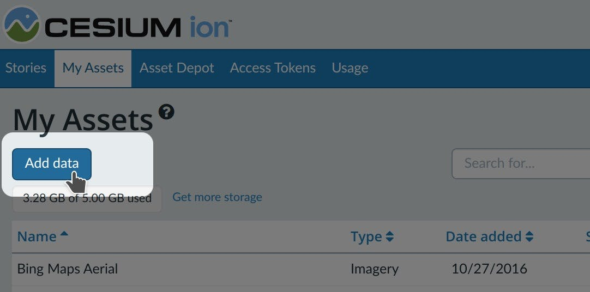
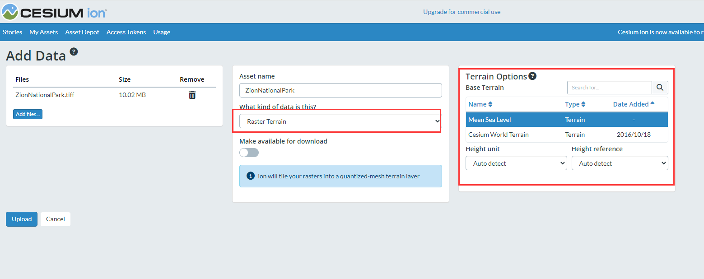

# 3D Tiling

> 支持的所有3D模型格式

- [Photogrammetry or LiDAR-derived mesh](https://cesium.com/learn/3d-tiling/ion-tile-photogrammetry/)
- [BIM, CAD, or other 3D model](https://cesium.com/learn/3d-tiling/ion-tile-3d-models/)
- [Point Clouds](https://cesium.com/learn/3d-tiling/ion-tile-point-clouds/)
- [3D Buildings](https://cesium.com/learn/3d-tiling/ion-tile-3d-buildings/)
- [Terrain](https://cesium.com/learn/3d-tiling/ion-tile-terrain/)
- [Satellite or Drone Imagery](https://cesium.com/learn/3d-tiling/ion-tile-imagery/)


## 一、3D building

#### Importing

支持的格式如下，可下载测试使用

- [KML/COLLADA](https://cesium.com/public/learn/AGI_HQ.kmz)
- [CityGML](https://cesium.com/public/learn/Reichstag.zip)

:bulb: Select **KML/COLLADA (tile as 3D Tiles)** or **CityGML**.



#### visualizing

通过sandcastle 或者 cesium story 均可实时查看


## 二、3D models

> BIM、CAD 或 其他3D 模型 

#### importing

:bulb: Select 3D Model (tile as 3D Tiles).

| Format                 | File extensions |
| :--------------------- | :-------------- |
| Wavefront OBJ          | .obj            |
| Filmbox                | .fbx            |
| Digital Asset Exchange | .dae            |
| glTF                   | .gltf           |
| Binary glTF            | .glb            |


## 三、imagery

> 无人机 或 卫星影像

#### importing

:bulb: Select **Raster Imagery**.

|                             |                 |
| :-------------------------- | :-------------- |
| Format                      | File extensions |
| GeoTIFF                     | .tiff, .tif     |
| Floating Point Raster       | .flt            |
| Arc/Info ASCII Grid         | .asc            |
| Source Map                  | .src            |
| Erdas Imagine               | .img            |
| USGS ASCII DEM and CDED     | .dem            |
| JPEG                        | .jpg, .jpeg     |
| PNG                         | .png            |
| Other common raster formats |                 |


## 四、photogrammetry

> 摄影测量模型、激光扫描模型

#### importing

:bulb: Select **3D Capture**.

| Format                 | File extensions |
| :--------------------- | --------------- |
| Wavefront OBJ          | .obj            |
| Filmbox                | .fbx            |
| Digital Asset Exchange | .dae            |
| glTF                   | .gltf           |
| Binary glTF            | .glb            |

#### optinos

:bulb: 有压缩算法 和 3d tiles 1.0 或 1.1 版本，根据需要（一般没咋用过）


## 五、point clouds

| Format                     | File extensions |
| :------------------------- | :-------------- |
| LASer LAS                  | .las            |
| LASer LAZ (compressed LAS) | .laz            |

#### importing

:bulb: Select **Point Cloud**


#### styling

有几种方法可以在CesiumJS中设计点云的样式。如果点云未着色，打开点衰减和照明可以更容易地看到：

```typescript
tileset.pointCloudShading.attenuation = true;
tileset.pointCloudShading.eyeDomeLighting = true;
```

使用 [3D Tiles Styling Language](https://cesium.com/learn/cesiumjs-learn/cesiumjs-3d-tiles-styling/) 可以根据每个点的特性或位置为各个点着色或隐藏这些点。以下是如何基于“强度”将样式应用于色点的示例。

```typescript
tileset.style = new Cesium.Cesium3DTileStyle({
  color: "rgb(${Intensity}, ${Intensity}, ${Intensity})",
});
```


## 六、Terrain

|                             |                 |
| :-------------------------- | :-------------- |
| Format                      | File extensions |
| GeoTIFF                     | .tiff, .tif     |
| Floating Point Raster       | .flt            |
| Arc/Info ASCII Grid         | .asc            |
| Source Map                  | .src            |
| Erdas Imagine               | .img            |
| USGS ASCII DEM and CDED     | .dem            |
| Cesium Terrain Database     | .terraindb      |
| Other common raster formats |                 |

- 在平铺之前，上传的地形会自动重新投影到EPSG:4326。
- 地形文件在加载到铯离子之前必须进行地理参考。 GeoTIFF输入必须是浮点高程或整数高程的单个带。

#### importing

:bulb: Select **Raster Terrain**.



