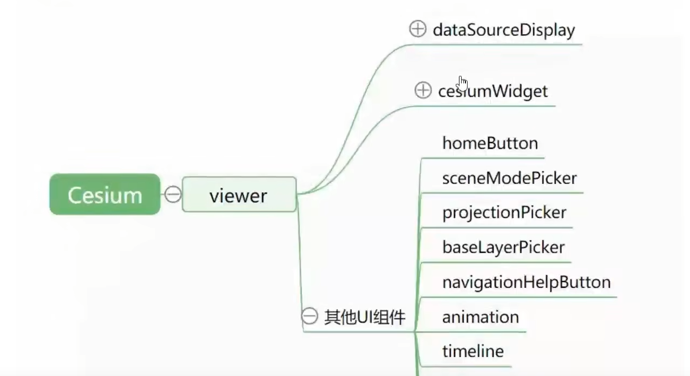
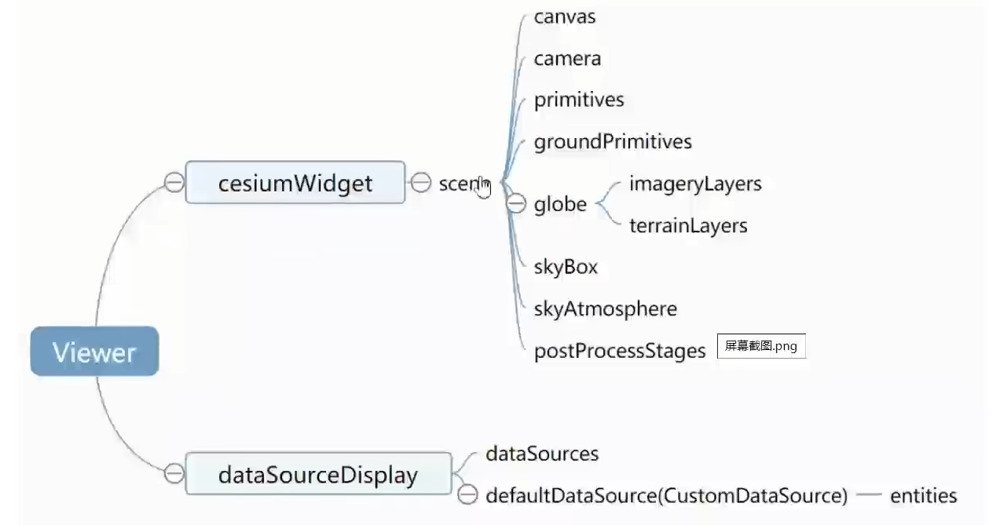
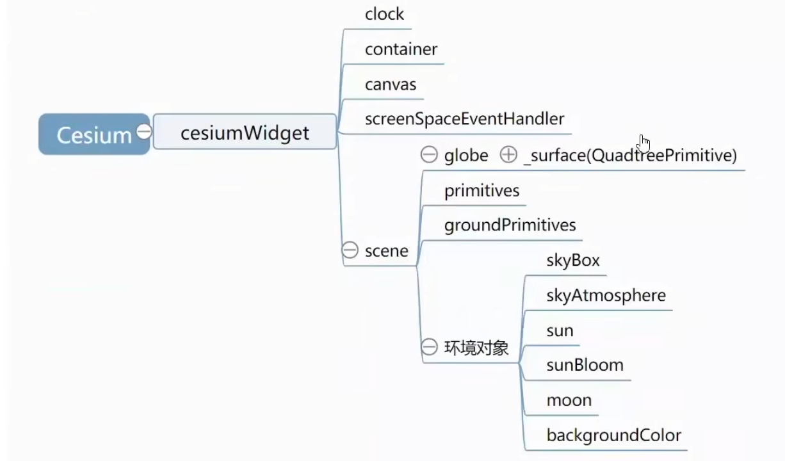
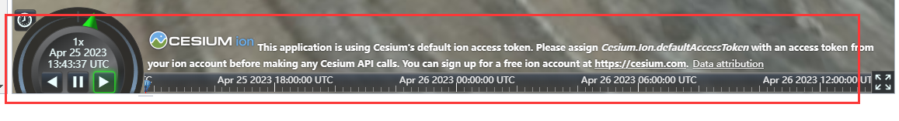
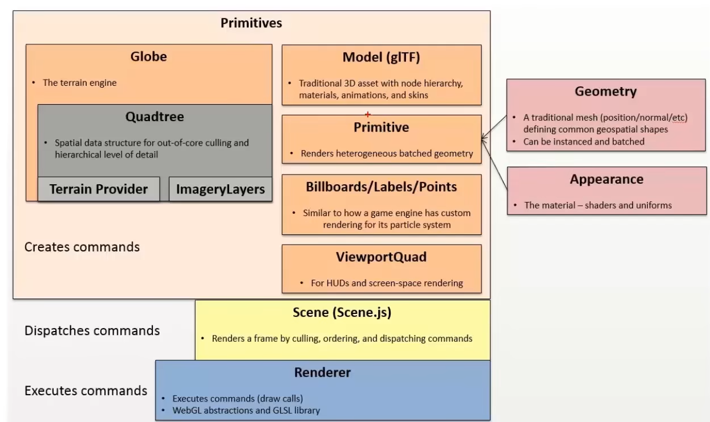
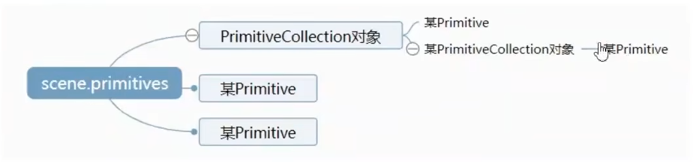

# CesiumJS

## 一、Viewer类





1. **Primitives（基元）**：
   - `Primitives` 是 Cesium 中的原始几何图元，例如点、线、多边形等，它们可以直接添加到场景中。
   - 每个 `Primitive` 对象代表一个单独的几何体，通常是静态的，不能动态更新。因此，对于频繁更新的数据，不适合使用 `Primitives`。
   - `Primitives` 适合于加载相对简单的几何体，例如地图标记、简单的边界等。
2. **Datasources（数据源）**：
   - `Datasources` 允许加载更复杂的地理空间数据，例如 GeoJSON、KML、GPX 等格式的数据，甚至支持加载 3D Tiles 等大规模、复杂的数据集。
   - `Datasources` 允许动态添加、移除和更新数据，因此非常适合用于实时或动态更新的数据展示。
   - Cesium 提供了丰富的数据源类（如 `GeoJsonDataSource`、`KmlDataSource` 等），方便开发者加载不同格式的数据。


## 二、dataSourceDispaly类

> https://sandcastle.cesium.com/index.html?src=CZML.html&label=DataSources

可视化DataSource实例的集合。并可通过viewer直接访问dataSources并添加模型，如下示例

```typescript
viewer.dataSources.add(
    Cesium.CzmlDataSource.load("../SampleData/simple.czml")
);
```

:bulb: `其中dataSources可加载默认的CzmlDataSource、GeoJsonDataSource、GpxDataSource 和 KmlDataSource`

:bulb: `defaultDataSource可加载默认的entities（entityCollection），并通过entityCollection.add() 加载具体entity`

:bulb: viewer/Entities作用

- 方便创建直观的对象，同时做到性能优化（billboard，point等）
- 提供一些方便使用的函数：flyTo/zoomTo
- 赋予Entity对象时间这个属性，对象具备动态特性/Primitive不具备
- 提供一些UI（homeButton/sceneModePicker/projectionPicker/baseLayerPicker）
- 大量的快捷方式，如viewer.camera
- dataSource可加载大规模数据，如Geojson


## 三、CesiumWidget  &  Viewer类

:bulb: 两个类同样可以通过div实例化一个场景，Viewer类实例后会自动创建带有UI等工具的场景，以及会带有dataSource，而CesiumWidget只会有一个三维地图的场景，没有任何UI工具

:book: Cesium中所有涉及场景的都在scene中处理，再有就是最外层的skybox天空盒（图片围成）




## 四、小部件工具

Timeline



可以控制时间前进倒退，倍速，比如可以看到星辰的变化


## 五、Scene

Scene内置了图元，如globe、skybox、sun 和 moon等，还有两个用户自行控制存放对象的数组，primitives（非贴地图元） 和 groundPrimitives贴地图元。

:bulb: 图元是Cesium用来绘制三维对象的独立结构。具体的图元类如下:star2:

:bulb: 图元没有基类，所有的图元都有update函数。

:bulb: 图元是一类对象绘制的集合，可包含多个WebGL的drawcall



:bulb: 补充 Cesium3DTileset 也是图元的一种




其中Globe是全球地形，需要两个东西，地形高程信息 和 影像图层（可叠加多层）。两者都是渐进式加载，即视线能看到的地方才会调度加载。


## 六、具体模型

### 3Dmodel（如gltf、3dTiles）

colorBlendMode 可设置颜色的混合模式。alpha 和 mix 可设置 透明度 和 混合度。


## 七、固定视角viewer.scene.camera

### camera

camera.lookAt固定观察对象，其他类似。

viewer.camera 其实是viewer.scene.camera


## 八、坐标系相关

#### Cesium.Transforms.eastNorthUpToFixedFrame(origin, ellipsoid, result) → [Matrix4](https://cesium.com/learn/cesiumjs/ref-doc/Matrix4.html)

```typescript
// Get the transform from local east-north-up at cartographic (0.0, 0.0) to Earth's fixed frame.
const center = Cesium.Cartesian3.fromDegrees(0.0, 0.0);
const transform = Cesium.Transforms.eastNorthUpToFixedFrame(center);
```

- 这段代码是创建一个将本地坐标系（东北天坐标系）转换为固定坐标系（固定在地球上）的转换矩阵
- 具体而言，这里创建了一个固定坐标系，使其原点位于经度 0 度、纬度 0 度的位置（Cartesian3.fromDegrees(0.0, 0.0)）。这个固定坐标系是一个东北天坐标系，与地球表面垂直。`eastNorthUpToFixedFrame` 方法返回一个变换矩阵，可以用它来将相对于该原点的本地坐标系的点或向量转换为地球上的固定坐标系
- 因此可用这个矩阵将在相对于给定经纬度原点的本地坐标系中定义的点或向量转换为固定坐标系中的位置


## 九、Polylines相关

:bulb: PolylineCollection可以同时渲染多条折线，性能较高；其他类型都是单独渲染某个折线，线条过多会导致渲染性能受影响；


## 十、Property相关

> https://sandcastle.cesium.com/index.html?src=Callback%20Property.html&label=All


## 十一、PostProcess


## 十二、调试用的函数

:bulb: debugShowFramesPerSecond

显示每秒帧数和帧之间的时间


:bulb: tileset.debugShowBoundingVolume = true

指定3Dtiles模型是否显示外围包络线


