# Cesium Api 1.104版本

## 一、Viewer

> 包括以下子类

#### Scene场景

#### Camera相机

#### Event事件

#### terrainProvider地形

#### dataScources：DataSourceCollection

#### entities：EntityCollection实体

#### widgets样式组件

#### imgeryLayers：ImageryLayerCollection


## 二、Scene场景

#### 1、primitives:PrimitiveCollection

> 具体的primitive可以是以下类型

- GeometryInstance 几何图形实例
  - BoxGeometry / BoxOutlineGeometry（立方体）
  - CircleGeometry / CircleOutlineGeometry（圆形或者拉伸的圆形）
  - CoplanarPolygonGeometry / CoplanarPolygonOutlineGeometry（任意面组成的多边形）
  - CorridorGeometry / CorridorOutlineGeometry（走廊）
  - CylinderGeometry / CylinderOutlineGeometry（圆柱 / 圆锥 或者 截断的圆锥）
  - EllipseGeometry / EllipseOutlineGeometry（椭圆或者拉伸的椭圆）
  - EllipsoidGeometry / EllipsoidOutlineGeometry（椭球）
  - FrustumGeometry / FrustumOutlineGeometry（视椎体）
  - PlaneGeometry/PlaneOutlineGeometry（以原点为中心的平面几何形状）
  - PolygonGeometry / PolygonOutlineGeometry（多边形，可以具有空洞或者拉伸一定的高度）
  - PolyLineGeometry / SimplePolylineGeometry（多段线，可以具有一定的宽度）
  - PolylineVolumeGeometry / PolylineVolumeOutlineGeometry（多段线柱体）
  - RectangleGeometry / RectangleOutlineGeometry（矩形或者拉伸的矩形）
  - SphereGeometry / SphereOutlineGeometry （球体）
  - WallGeometry / WallOutGeometry（墙）
- Appearance
  - EllipsoidSurfaceAppearance 椭球表面的几何图形外观
  - MaterialAppearance 支持材质着色的任意几何图形的外观
  - PerInstanceColorAppearance 带有颜色属性的[`GeometryInstance`](https://www.vvpstk.com/public/Cesium/Documentation/GeometryInstance.html)实例的外观。 
  - PolylineColorAppearance 带有颜色属性和[`PolylineGeometry`](https://www.vvpstk.com/public/Cesium/Documentation/PolylineGeometry.html)或[`GroundPolylineGeometry`](https://www.vvpstk.com/public/Cesium/Documentation/GroundPolylineGeometry.html)的[`GeometryInstance`](https://www.vvpstk.com/public/Cesium/Documentation/GeometryInstance.html)实例的外观。
  - PolylineMaterialAppearance 支持材质着色的[`PolylineGeometry`](https://www.vvpstk.com/public/Cesium/Documentation/PolylineGeometry.html)的外观。
- modelMatrix

#### 2、groundPrimitives：PrimitiveCollection

> 只读：获取贴地图元的集合。

#### 3、postProcessStages：PostProcessStageCollection后期处理


#### 4、screenSpaceCameraController（视维控制）


#### 5、globe

> 获取或设置深度测试椭球体。

#### 6、Camera相机

> 获取或者设置相机。

#### 7、环境对象

- shadowMap （场景中的阴影图，模型，图元和地球可能会投射并接收阴影。默认情况下，阴影图的光源是太阳）
- skyAtmosphere（地球周围的大气层）
- skyBox（天空盒）
- sun（太阳）
- moon（月亮）

#### 8、Event事件（Scene场景）

- drillpick 返回拾取到的图元对象集合，图元列表按其在场景中的视觉顺序（从前到后）排序。
- pick  返回一个带有“primitive”属性的对象，该属性包含场景中位于特定窗口坐标处的第一个图元（顶部），如果该位置没有任何内容，则返回undefined。 其他属性可能根据图元的类型进行设置，并可能用于进一步标识选中的对象。拾取3D Tiles tileset的要素后， `pick`返回 [`Cesium3DTileFeature`](https://www.vvpstk.com/public/Cesium/Documentation/Cesium3DTileFeature.html) 对象。
- pickPosition 返回从深度缓冲区和窗口位置重建的笛卡尔坐标位置，从2D中的深度缓冲区重建的位置可能与3D和Columbus view中返回的位置有差异
- preUpdate  渲染前更新事件
- postUpdate 获取将在场景更新或渲染之后引发的事件。事件的订阅者接收场景实例作为第一个参数，当前时间作为第二个参数。
- preRender 获取在场景更新之后以及场景渲染之前立即引发的事件。事件的订���者将Scene实例作为第一个参数，将当前时间作为第二个参数参数。
- postRender 获取将在渲染场景后立即引发的事件。事件订阅者接收Scene实例作为第一个参数，并接收当前时间作为第二个参数。

> 执行顺序：preUpdate、postUpdate、preRender和postRender

## 三、Camera相机

> 由位置、方向和视锥体定义的相机。
>
> 视锥体(viewing frustum)由6个(上、下、左、右、近、远)平面限定， 每个平面都由 [`Cartesian4`](https://www.vvpstk.com/public/Cesium/Documentation/Cartesian4.html) 对象表示，其中x，y和z分量定义垂直于平面的单位向量，w分量是平面到原点/相机位置的距离。

- position位置
- heading 方位角，绕z旋转
- pitch 俯仰角，绕y旋转
- roll 翻滚角，绕x旋转

## 四、Event事件

> 用于管理特定事件的订阅者的通用实用类。 此类通常在容器类中实例化，并作为供其它对象订阅的属性公开。

- screenSpaceEventHandler 处理用户输入事件。可以添加自定义函数，以便在用户输入时执行。
- clock.onTick

## 五、terrainProvider地形

> 地形提供器接口。其实现类以瓦片金字塔的形式（对应于[`TilingScheme`](https://www.vvpstk.com/public/Cesium/Documentation/TilingScheme.html)的实现类）提供DEM。

- ArcGIStiledElevationTerrainProvider
- CesiumTerrainProvider
- EllipsoidTerrainProvider
- GoogleEarthEnterpriseTerrainProvider
- VRTheWorldTerrainProvider

## 六、dataScources：DataSourceCollection

> 定义数据源的接口，它将任意数据转换为[`EntityCollection`](https://www.vvpstk.com/public/Cesium/Documentation/EntityCollection.html)供通用使用。 此对象是用于文档目的的接口，不打算直接实例化。

- CustomDataSource  可用于手动管理一组实体
- CzmlDataSource  
- GeoJsonDataSource
- KmlDataSource

## 七、entities：EntityCollection实体

> [`Entity`](https://www.vvpstk.com/public/Cesium/Documentation/Entity.html)实例的可观察集合，其中每个实体都有唯一的id。

- availability: TimeIntervalCollection
- BillboardGraphics（广告牌）
- BoxGraphics（盒子）
- CorridorGraphics（走廊）
- CylinderGraphics（圆柱、圆锥或者拉伸的椭圆）
- EllipsoidGraphics（椭圆）
- LabelGraphics（标签）
- ModelGraphics（模型）
- Cesium3DTilesetGraphics（三维瓦片）
- PathGraphics（路径）
- PlaneGraphics（平面）
- PointGraphics（点）
- PolygonGraphics（多边形）
- PolylineGraphics（多线段）
- PolylineVolumeGraphics（多线段柱体）
- Rectangle（矩形）
- WallGraphics（墙）

## 八、widgets样式组件

> 包含Cesium场景（Scene）的窗口部件

- Animation 动画部件

  

- BaseLayerPicker

  

- Cesium3DtilesInspector

  用于帮助调试3D平铺的检查器小部件

  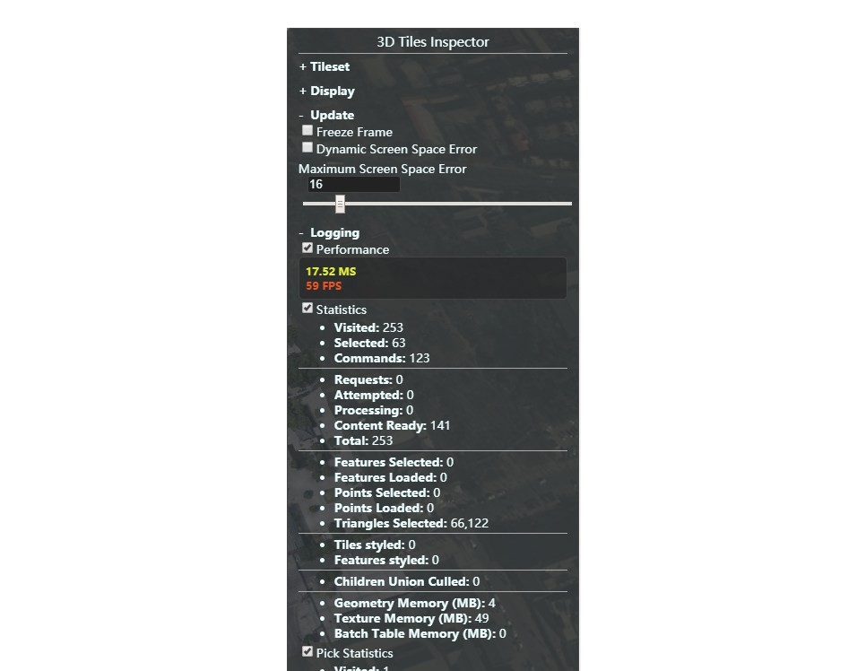

- CesiumInspector

  帮助调试的检查器小部件

  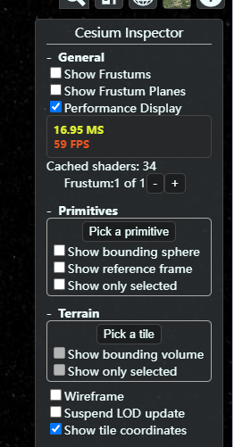

- CesiumWidget

  包含Cesium场景（Scene）的窗口部件，就是包含Cesium窗口的div

- FullscreenButton

  全屏

  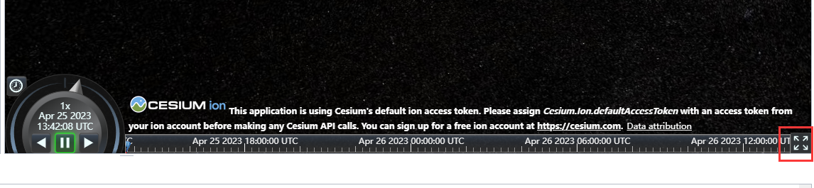

- Geocoder

  寻找地址和地标，并让相机飞向它们的部件。 地理编码使用[Bing Maps Locations API](http://msdn.microsoft.com/en-us/library/ff701715.aspx)执行。

  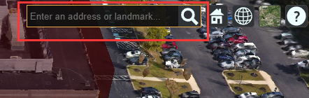

- HomeButton

  返回当前场景的默认相机视图的按钮部件。

  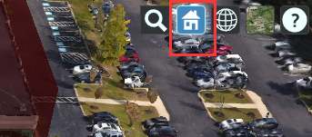

- InfoBox

  用于显示信息或描述的部件。

- NavigationHelpButton

  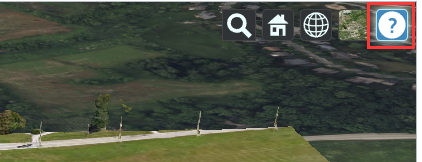

- ProjectionPicker

  ProjectionPicker是一个单按钮部件，可用于切换地图投影方式，`包括WebMercator、柱面等面积投影方式，以及立体投影方式（3D）`

- SceneModePicker

  用于在场景模式之间切换的单按钮部件,支持的场景显示模式包括三维（3D）、二维（2D）和哥伦布视图（Columbus View）三种.

  例如，如果用户需要查看一个地区的地形数据，可能会选择3D场景模式，以便更直观地观察地形的高低起伏；而如果用户需要查看一个平面地图，可能会选择2D场景模式，以便更好地展示地图的平面特征。

  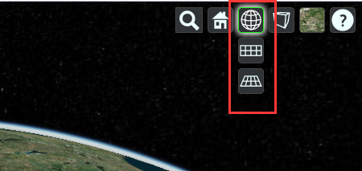

- SelectionIndicator

  用于在选定对象上显示指示符的部件

  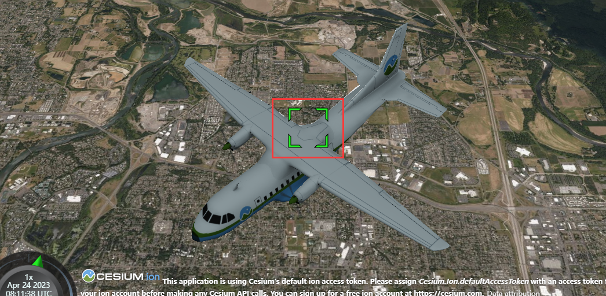

- Timeline

  时间轴是用于显示和控制当前场景时间的部件，可拖动

  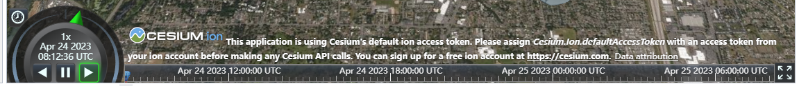

- VRButton

  用于切换VR模式的按钮部件

  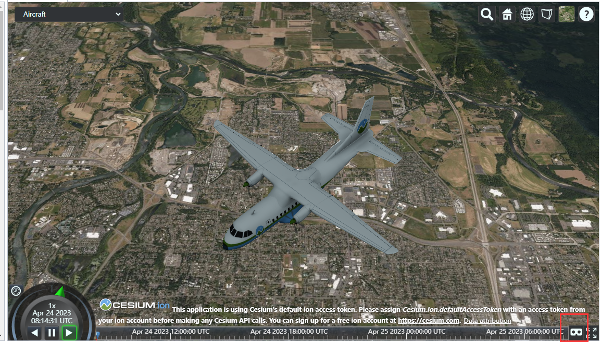

  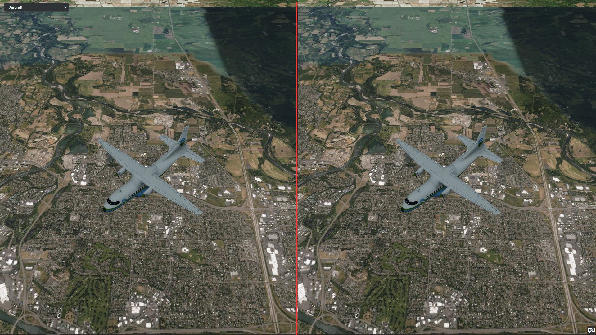

## 九、imageryLayers：ImageryLayerCollection

> 包括以下影像Provider

- Cesium.ArcGisMapImageryProvider

  提供由ArcGIS MapServer托管的瓦片图像。默认情况下，使用服务器的预缓存切片（如果有）

  ```typescript
  const esri = new Cesium.ArcGisMapServerImageryProvider({
      url : 'https://services.arcgisonline.com/ArcGIS/rest/services/World_Imagery/MapServer'
  });
  ```

- Cesium.BingMapsImageryProvider

  使用Bing Maps图像REST API提供瓦片图像

  ```typescript
  const bing = new Cesium.BingMapsImageryProvider({
      url : 'https://dev.virtualearth.net',
      key : 'get-yours-at-https://www.bingmapsportal.com/',
      mapStyle : Cesium.BingMapsStyle.AERIAL
  });
  ```

- createWorldImagery

  为ion默认的全局基础图像图层创建一个[`IonImageryProvider`](https://www.vvpstk.com/public/Cesium/Documentation/IonImageryProvider.html)实例，当前为Bing Maps。

  ```typescript
  //Examples1
  const viewer = new Cesium.Viewer('cesiumContainer', {
      imageryProvider : Cesium.createWorldImagery();
  });
  
  //Examples2
  const viewer = new Cesium.Viewer('cesiumContainer', {
    //Cesium.IonWorldImageryStyle.AERIAL_WITH_LABELS样式，表示显示带标签的卫星图像。
    //createWorldImagery函数需要通过Cesium Ion服务进行访问。，需要先在Cesium Ion上注册账户，并获取相应的访问令牌（access token）
      imageryProvider : Cesium.createWorldImagery({
          style: Cesium.IonWorldImageryStyle.AERIAL_WITH_LABELS
      })
  });
  ```

- Cesium.GoogleEarthEnterpriseImageryProvider

  使用Google Earth Enterprise REST API提供瓦片图像。 注意：该提供器用于Google Earth Enterprise的3D Earth API，[`GoogleEarthEnterpriseMapsProvider`](https://www.vvpstk.com/public/Cesium/Documentation/GoogleEarthEnterpriseMapsProvider.html)应该与2D Maps API一起使用。

  ```typescript
  const gee = new Cesium.GoogleEarthEnterpriseImageryProvider({
      metadata : new GoogleEarthEnterpriseMetadata('http://www.earthenterprise.org/3d');
  });
  ```

- Cesium.GridImageryProvider（可显示经纬网格）

  在每个瓦片上绘制一个具有可控背景和辉光的线框网格。 对于自定义渲染效果或调试地形可能很有用。该ImageryProvider会根据当前地图的显示范围和缩放级别，动态生成对应的经纬网格图像，并将其显示在地图上。 Cesium.GridImageryProvider的一些属性和方法如下：

  - show：一个布尔值，表示是否显示经纬网格，默认为true。
  - color：一个Color对象，表示经纬网格的颜色，默认为白色。
  - glowWidth：一个数字，表示经纬网格边缘的宽度（像素），默认为1。
  - cellAlpha：一个数字，表示经纬网格单元格的透明度，取值范围为0到1，默认为0.2。

  ```typescript
  const viewer = new Cesium.Viewer('cesiumContainer');
  const gridProvider = new Cesium.GridImageryProvider({
      show: true,
      color: Cesium.Color.WHITE,
      glowWidth: 1,
      cellAlpha: 0.2
  });
  viewer.imageryLayers.addImageryProvider(gridProvider);
  ```

- Cesium.IonImageryProvider

  使用Cesium ion REST API提供瓦片图像。

  ```typescript
  viewer.imageryLayers.addImageryProvider(new Cesium.IonImageryProvider({ assetId : 23489024 }));
  ```

- Cesium.MapboxImageryProvider

  提供由Mapbox托管的瓦片图像。

  ```typescript
  const mapbox = new Cesium.MapboxImageryProvider({
      mapId: 'mapbox.streets',
      accessToken: 'thisIsMyAccessToken'
  });
  ```

- Cesium.OpenStreetMapImageryProvider

  提供由OpenStreetMap或其他Slippy瓦片提供器托管的瓦片图像

  ```typescript
  const osm = new Cesium.OpenStreetMapImageryProvider({
      url : 'https://a.tile.openstreetmap.org/'
  });
  ```

- Cesium.SingleTileImageryProvider

  用于在Cesium中显示单张图片。其构造函数需要传入一个options对象，该对象可以包含以下属性：

  - url：一个字符串，表示要显示的图片的URL。
  - rectangle：一个Rectangle对象，表示要显示的图片的地理范围。
  - credit：一个Credit对象，表示图片的来源信息。
  - ellipsoid：一个Ellipsoid对象，表示地球的形状。

  ```typescript
  const viewer = new Cesium.Viewer('cesiumContainer');
  const provider = new Cesium.SingleTileImageryProvider({
      url : 'path/to/image.png',
      rectangle : Cesium.Rectangle.fromDegrees(-110.0, 20.0, -80.0, 50.0),
      credit : 'Image Credit',
      ellipsoid : Cesium.Ellipsoid.WGS84
  });
  viewer.imageryLayers.addImageryProvider(provider);
  ```

- Cesium.TileMapServiceImageryProvider

  提供[MapTiler](http://www.maptiler.org/)、[GDAL2Tiles](http://www.klokan.cz/projects/gdal2tiles/)等生成的切片图像的图像提供器

  ```typescript
  const tms = new Cesium.TileMapServiceImageryProvider({
     url : '../images/cesium_maptiler/Cesium_Logo_Color',
     fileExtension: 'png',
     maximumLevel: 4,
     rectangle: new Cesium.Rectangle(
         Cesium.Math.toRadians(-120.0),
         Cesium.Math.toRadians(20.0),
         Cesium.Math.toRadians(-60.0),
         Cesium.Math.toRadians(40.0))
  });
  ```

- Cesium.UrlTemplateImageryProvider

  通过使用指定的URL模板请求瓦片来提供图像。

  ```typescript
  // 获取使用TMS切片方案和地理（EPSG：4326）项目的Natural Earth II影像
  const tms = new Cesium.UrlTemplateImageryProvider({
      url : Cesium.buildModuleUrl('Assets/Textures/NaturalEarthII') + '/{z}/{x}/{reverseY}.jpg',
      credit : '© Analytical Graphics, Inc.',
      tilingScheme : new Cesium.GeographicTilingScheme(),
      maximumLevel : 5
  });
  
  // 访问Web地图服务（WMS）服务器。
  var wms = new Cesium.UrlTemplateImageryProvider({
     url : 'https://programs.communications.gov.au/geoserver/ows?tiled=true&' +
           'transparent=true&format=image%2Fpng&exceptions=application%2Fvnd.ogc.se_xml&' +
           'styles=&service=WMS&version=1.1.1&request=GetMap&' +
           'layers=public%3AMyBroadband_Availability&srs=EPSG%3A3857&' +
           'bbox={westProjected}%2C{southProjected}%2C{eastProjected}%2C{northProjected}&' +
           'width=256&height=256',
     rectangle : Cesium.Rectangle.fromDegrees(96.799393, -43.598214999057824, 153.63925700000001, -9.2159219997013)
  });
  ```

- Cesium.WebMapServiceImageryProvider

  (WMS)服务器托管的瓦片图像

  ```typescript
  const provider = new Cesium.WebMapServiceImageryProvider({
      url : 'https://sampleserver1.arcgisonline.com/ArcGIS/services/Specialty/ESRI_StatesCitiesRivers_USA/MapServer/WMSServer',
      layers : '0',
      proxy: new Cesium.DefaultProxy('/proxy/')
  });
  
  viewer.imageryLayers.addImageryProvider(provider);
  ```

- Cesium.WebMapTileServiceImageryProvider

  提供由[WMTS 1.0.0](http://www.opengeospatial.org/standards/wmts)兼容服务器提供的瓦片图像

OGC几个服务标准使用案例：https://zhuanlan.zhihu.com/p/543257223


## 十、其他

#### EllipsoidGeodesic

> 初始化椭球面上连接两个提供的planetodetic点的测地线。

- 需要两个弧度点（Cartographic）
- Cesium.EllipsoidGeodesic().setEndPoints(point1cartographic, point2cartographic)
  - 设置地线的起点 和 终点

- Cesium.EllipsoidGeodesic().surfaceDistance
  - 获取起点和终点之间的表面距离。


> 总之，`Cesium3DTileset`用于显示大规模3D数据集，`Cesium3DTileFeature`用于获取每个3D模型的属性和状态，而`Model`则用于加载和渲染单个3D模型。

#### Cesium3DTileset

用于加载和渲染3D Tiles数据集，通常包含了大量的3D模型数据。它支持数据分层、剖分、流式传输和动态裁剪等特性，可以高效地显示大规模的3D数据，适用于展示城市、地形等复杂场景。`Cesium3DTileset`可以通过 `viewer.scene.primitives.add(new Cesium.Cesium3DTileset())` 方法来添加到场景中。

#### Cesium3DTileFeature

`Cesium3DTileFeature`是`Cesium3DTileset`中每个3D模型的单独特征，可以获取每个特征的属性、几何信息、转换矩阵、显示状态等信息，也可以进行交互、修改颜色、添加标签等操作。`Cesium3DTileFeature`可以通过 `Cesium3DTileset.getFeature()` 方法获取。

#### Model

`Model`类则是用于加载和渲染gltf和glb格式的3D模型，支持骨骼动画、透明度、光照、纹理等特性，可以用于展示个体建筑、汽车、人物等3D模型。`Model`可以通过 


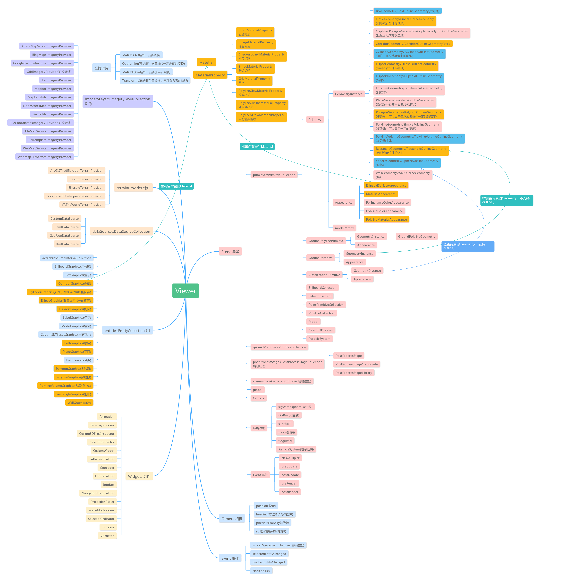


//可以找到官网对应的沙箱显示文件

https://sandcastle.cesium.com/templates/bucket.css!
