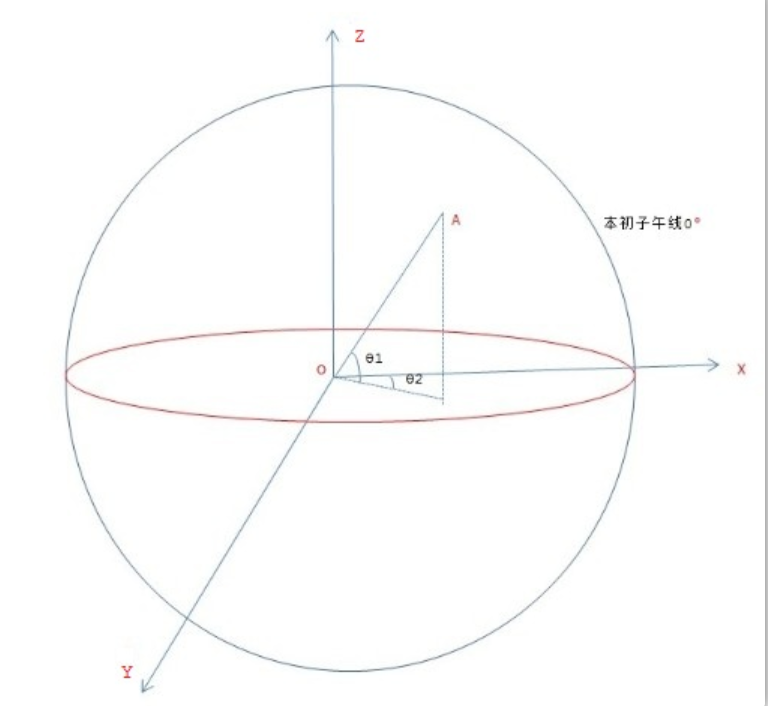
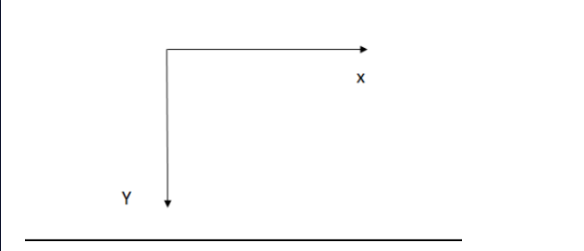
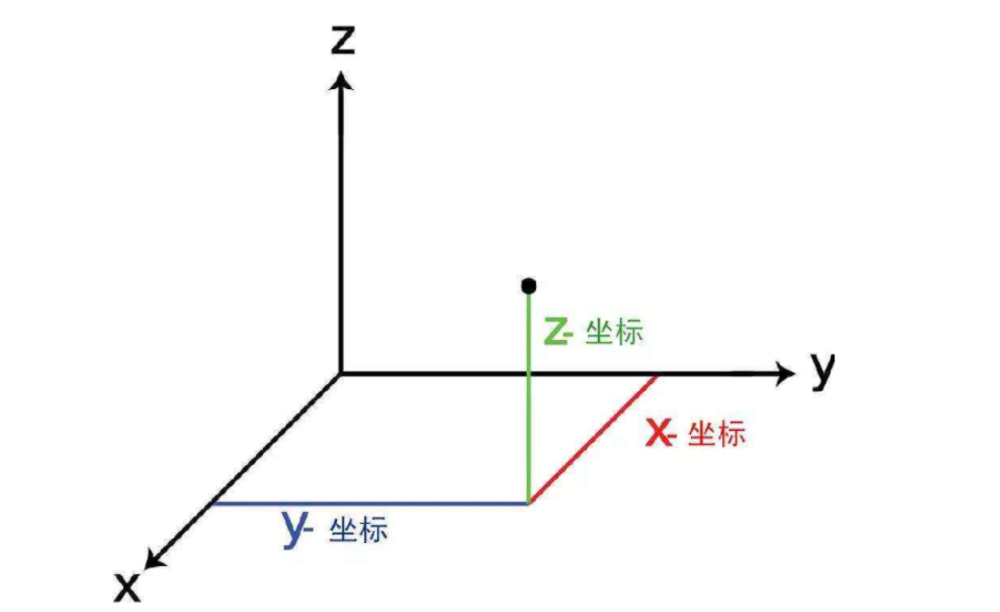

# Cesium1.98 坐标系

## 一、前提知识（角度经纬度、度分秒经纬度、弧度经纬度）

### 1、角度经纬度

- **Cesuim中没有具体的经纬度对象，要得到经纬度首先需要计算为弧度，再进行转换**

- 下图中以本初子午线作为x和z的面，建立了一个空间坐标系。可知在纬度方向上，角1的范围为-90~90，即南纬90°~北纬90°，角2的范围是-180~180，即东经180°~西经180° ， `如 39.905556 116.424722`



### 2、弧度经纬度

- **Cesium中的地理坐标单位默认是弧度制，用Cartographic变量表示**
- 弧度：`弧的长度除以弧的半径得出的比值。如π对应180°`，如`0.6964833420389782 2.0319947296190777`
  - **角度转弧度 π/180×角度**
  - **弧度变角度 180/π×弧度**

### 3、度分秒经纬度

- ArcMap地理配准常见的度分秒经纬度：北纬39°54′20″，东经116°25′29″
- 如有需要，可通过以下方式**角度经纬度 《=》 度分秒经纬度**得到`度分秒经纬度`

```typescript
//度分秒 => 角度经纬度
function changeDu(du,fen,miao){
	var mFen = 0;
	if(miao != null && miao != ''){
		mFen = Number(miao / 60);
	}
	var fDu = 0;
	if(fen != null && fen != '' ){
		fDu = (Number(fen) + mFen) / 60;
	}else{
		fDu = mFen;
	}
	var lDu = 0;
	if(du != null && du != ''){
		lDu = (Number(du)+fDu).toFixed(6);
	}else{
		lDu = fDu.toFixed(6);
	}
	
	return lDu;
}

//角度经纬度 => 度分秒
//将度转换成为度分秒
function formatDegree(value) {  
	if(value != null && value != ''){
	    ///<summary>将度转换成为度分秒</summary>  
	    value = Math.abs(value);  //返回数的绝对值
	    var v1 = Math.floor(value);//度   //对数进行下舍入
	    var v2 = Math.floor((value - v1) * 60);//分  
	    var v3 = Math.round((value - v1) * 3600 % 60);//秒  //把数四舍五入为最接近的整数
	    return v1 + ';' + v2 + ';' + v3 + ';';  
	}else{
		return '' + ';' + '' + ';' + '' + ';';  
	}
}; 
```


## 二、Cartesian2 [kɑːˈtiːziən]屏幕坐标

- **Cesium使用Cartesian2描述屏幕坐标系**

- 构造函数

  ```typescript
  new Cesium.Cartesian2（x, y）
  ```

- 说明

  鼠标点击位置距离canvas左上角的像素值。屏幕左上角为原点（0.0），屏幕水平方向为X轴，向右为正，垂直方向为Y轴，向下为正，如图所示。




## 三、Cartesian3世界笛卡尔空间直角坐标系

- **Cesium使用Cartesian3描述世界坐标系**

- 构造函数

  ```typescript
  //通过角度经纬度
  let cartesian3 = Cesium.Cartesian3.fromDegrees( 121.80348,29.8171504923588,2500)
  
  //通过弧度经纬度
  Cesium.Cartesian3.fromRadians(longitude,latitude,height,ellipsoid,result)
  
  //通过其他方式
  Cesium.Cartographic.toCartesian(cartographic, ellipsoid, result)
  ```

- 说明

  - 以空间中O点为原点，建立三条两两垂直的数轴；X轴(横坐标)、Y轴(纵坐标)、Z轴(竖坐标)，建立了空间直角坐标系0—XYZ
  - 笛卡儿空间直角坐标的原点就是椭球的中心，在计算机上进行绘图时，不方便使用经纬度直接进行绘图，一般会将坐标系转换为`笛卡儿坐标系，使用计算机图形学中的知识进行绘图`。
    -  `Cesium.Matrix3`（3x3矩阵，用于描述旋转变换）
    - `Cesium.Matrix4`（4x4矩阵，用于描述旋转加平移变换）
    - `Cesium.Quaternion`（四元数，用于描述围绕某个向量旋转一定角度的变换）
    - `Cesium.Transforms` (包含将位置转换为各种参考系的功能)




## 四、坐标转换

### 1.Cartesian2 《=》 Cartesian3

> 注意这里屏幕坐标一定要在球上，否则生成出的cartesian对象是`undefined`

#### 屏幕坐标 => 世界坐标

```typescript
let pick1= new Cesium.Cartesian2(0,0);
let cartesian = viewer.scene.globe.pick(viewer.camera.getPickRay(pick1),viewer.scene);
```

#### 世界坐标 => 屏幕坐标

```typescript
let cartesian3=new Cesium.cartesian3(x,y,z);
let pick = Cesium.SceneTransforms.wgs84ToWindowCoordinates(scene, Cartesian3);
```


### 2.Cartesian3《=》 角度经纬度 《=》 弧度经纬度

#### 角度经纬度 => 世界坐标系（直接）

```typescript
//方法一，直接转换
let cartesian3 = Cesium.Cartesian3.fromDegrees(longitude, latitude, height) 

//方法二，先转为地理弧度，再转为世界坐标系
let cartographic = Cesium.Cartographic.fromDegrees(lon, lat, height); //单位：度，度，米
let cartesian3 = ellipsoid.cartographicToCartesian(cartographic);
```

#### 世界坐标系 => 角度经纬度

```typescript
const ellipsoid=viewer.scene.globe.ellipsoid;  //首先获取场景中参考椭球体，因此表明可以更换椭球体
const cartesian3=new Cesium.cartesian3(x,y,z);   //创建一个初始的世界坐标系位置
const cartographic=ellipsoid.cartesianToCartographic(cartesian3);  //世界坐标系转为弧度经纬度
let lat=Cesium.Math.toDegrees(cartograhphic.latitude);  //弧度转为纬度
let lon=Cesium.Math.toDegrees(cartograhpinc.longitude);  //弧度转为经度
let height=cartographic.height;  //弧度转为高度
```

#### 弧度经纬度 => 世界坐标系（直接）

```typescript
let cartesian3 = Cesium.Cartesian3.fromRadians(cartographic)
```

#### 世界坐标系 => 弧度经纬度（直接）

```typescript
//方法一
let cartographic = Cesium.Cartographic.fromCartesian(cartesian3)
//方法二: 首先需要获取到当下场景中的ellipsoid对象
let cartographic = ellipsoid.cartesianToCartographic(cartesian3)
```

#### 角度经纬度 => 弧度经纬度（直接）

```typescript
let radians = Cesium.Math.toRadians（degrees）
```

#### 弧度经纬度 => 角度经纬度（直接）

```typescript
let degrees = Cesium.Math.toDegrees（radians）
```


## 五、拾取Cartesian3坐标 Demo

### 1、`camera.globe.pick(ray, scene, result)`

```typescript
// 首先需要注册cesium鼠标事件，通过cesium的ScreenSpaceEventHandler函数处理用户输入事件
  let handler = new Cesium.ScreenSpaceEventHandler(viewer.scene.canvas)
  // 设置要在输入事件上执行的功能，官方文档查询ScreenSpaceEventType可以看到所有的cesium鼠标事件
  handler.setInputAction((movement) => {
    const ray = viewer.camera.getPickRay(movement.position);
    if (!ray) return null;
    const cartesian3 = globe.pick(ray, viewer.scene);
    // 防止点击到地球之外报错，加个判断
    if (cartesian3 && Cesium.defined(cartesian3)) {
      let cartographic = Cartographic.fromCartesian(cartesian3!)
      let lng = Math.toDegrees(cartographic.longitude)
      let lat = Math.toDegrees(cartographic.latitude)
      let height = cartographic.height;
      console.log(lng, lat, height);
    }
  }, Cesium.ScreenSpaceEventType.LEFT_CLICK)
```

### 2、 `camera.pickEllipsoid（windowCoordinates,ellipsoid）`

```typescript
// 首先需要注册cesium鼠标事件，通过cesium的ScreenSpaceEventHandler函数处理用户输入事件
  let handler = new Cesium.ScreenSpaceEventHandler(viewer.scene.canvas)
  // 设置要在输入事件上执行的功能，官方文档查询ScreenSpaceEventType可以看到所有的cesium鼠标事件
  handler.setInputAction((movement) => {
    let cartesian3 = viewer.scene.camera.pickEllipsoid(movement.position, viewer.scene.globe.ellipsoid)
    // 防止点击到地球之外报错，加个判断
    if (cartesian3 && Cesium.defined(cartesian3)) {
      let cartographic = Cartographic.fromCartesian(cartesian3!)
      let lng = Math.toDegrees(cartographic.longitude)
      let lat = Math.toDegrees(cartographic.latitude)
      let height = cartographic.height;
      console.log(lng, lat, height);
    }
  }, Cesium.ScreenSpaceEventType.LEFT_CLICK)
```

### 3、`scene.pickPosition(windowCoordinates)`

```typescript
viewer.screenSpaceEventHandler.setInputAction(function onLeftClick(movement) {
     const pickedFeature = viewer.scene.pick(movement.position);
     if (!Cesium.defined(pickedFeature)) {
         // nothing picked
         return;
     }
     const worldPosition = viewer.scene.pickPosition(movement.position);
}, Cesium.ScreenSpaceEventType.LEFT_CLICK);
```


## 六、矩阵转换

> 1、Cesium中物体的移动、缩放、平移都可以用变换矩阵来计算。
>
> 2、变换（tansformation）可是理解为一个函数，实现将一个空间坐标映射为另一个空间坐标，矩阵（matrix）是这种计算的一种方式，在三维开发中用途广泛。


https://blog.csdn.net/u011575168/article/details/83097894