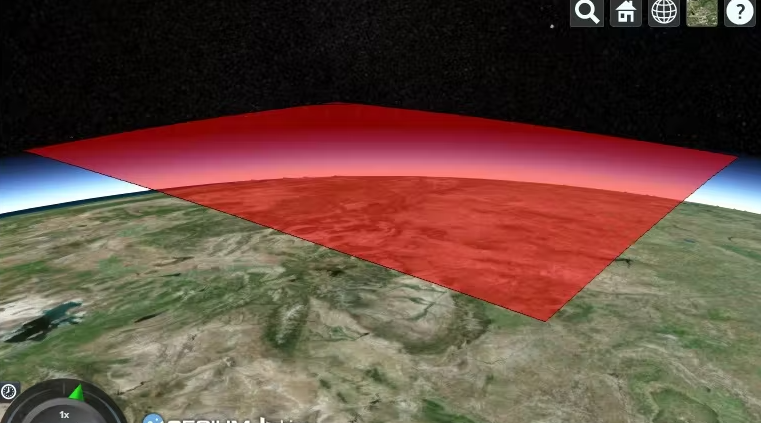
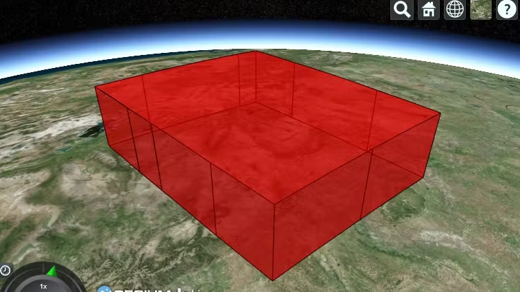
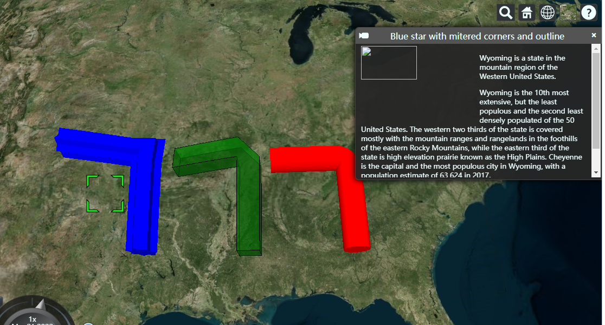
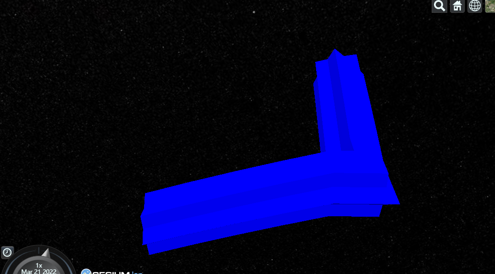
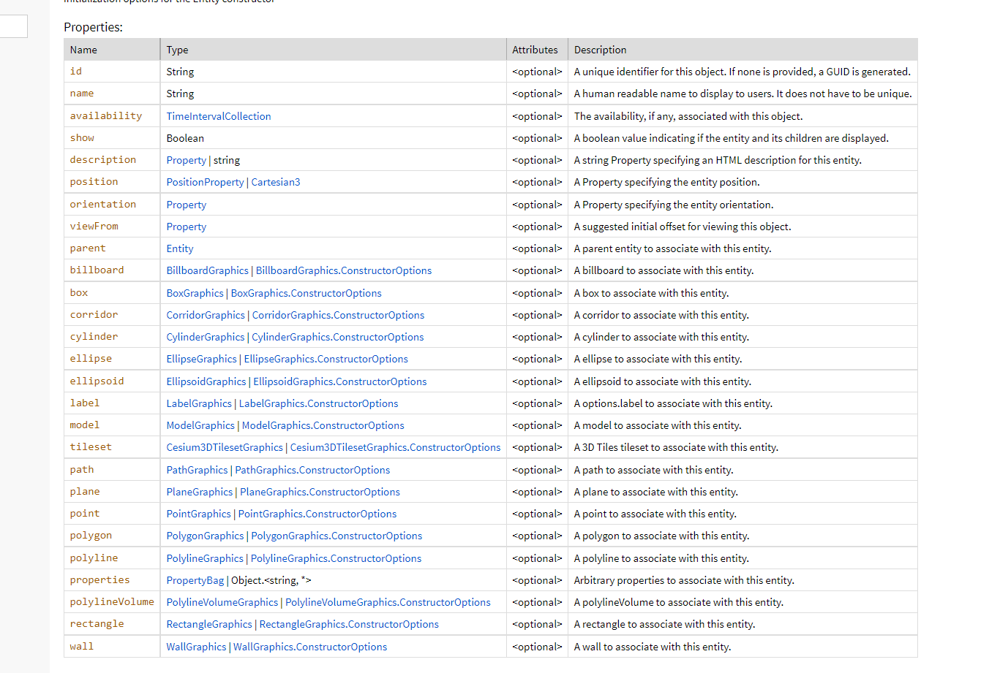
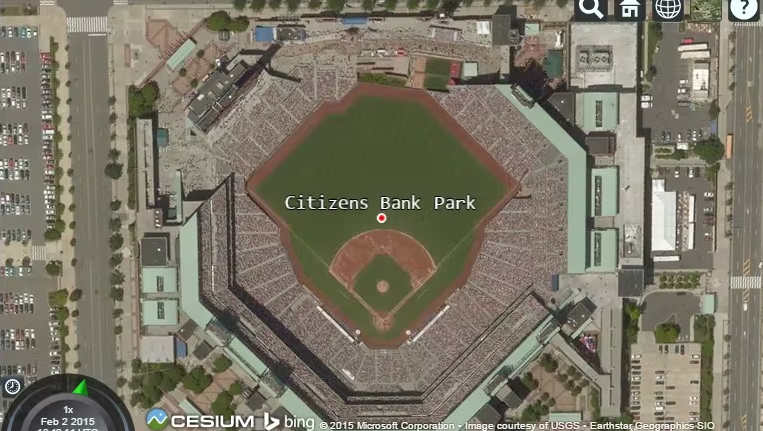
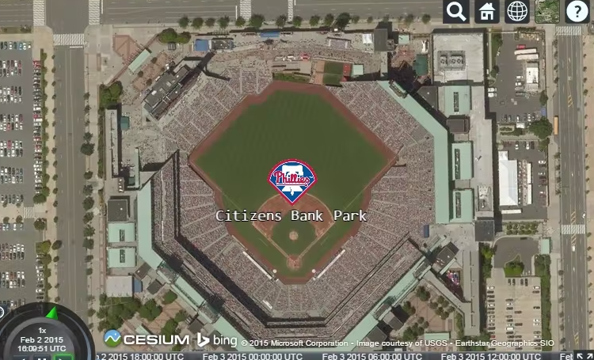

# CesiumEntities

## 一、Entity

### 1、实例对象Demo

- 可创建的对象类型

```javascript
const viewer = new Cesium.Viewer("cesiumContainer");

function computeCircle(radius) {
  const positions = [];
  for (let i = 0; i < 360; i++) {
    const radians = Cesium.Math.toRadians(i);
    positions.push(
      new Cesium.Cartesian2(
        radius * Math.cos(radians),
        radius * Math.sin(radians)
      )
    );
  }
  return positions;
}

function computeStar(arms, rOuter, rInner) {
  const angle = Math.PI / arms;
  const length = 2 * arms;
  const positions = new Array(length);
  for (let i = 0; i < length; i++) {
    const r = i % 2 === 0 ? rOuter : rInner;
    positions[i] = new Cesium.Cartesian2(
      Math.cos(i * angle) * r,
      Math.sin(i * angle) * r
    );
  }
  return positions;
}

const redTube = viewer.entities.add({
  name: "Red tube with rounded corners",
  polylineVolume: {
    positions: Cesium.Cartesian3.fromDegreesArray([
      -85.0,
      32.0,
      -85.0,
      36.0,
      -89.0,
      36.0,
    ]),
    shape: computeCircle(60000.0),
    material: Cesium.Color.RED,
  },
});

const greenBox = viewer.entities.add({
  name: "Green box with beveled corners and outline",
  polylineVolume: {
    positions: Cesium.Cartesian3.fromDegreesArrayHeights([
      -90.0,
      32.0,
      0.0,
      -90.0,
      36.0,
      100000.0,
      -94.0,
      36.0,
      0.0,
    ]),
    shape: [
      new Cesium.Cartesian2(-50000, -50000),
      new Cesium.Cartesian2(50000, -50000),
      new Cesium.Cartesian2(50000, 50000),
      new Cesium.Cartesian2(-50000, 50000),
    ],
    cornerType: Cesium.CornerType.BEVELED,
    material: Cesium.Color.GREEN.withAlpha(0.5),
    outline: true,
    outlineColor: Cesium.Color.BLACK,
  },
});

const blueStar = viewer.entities.add({
  name: "Blue star with mitered corners and outline",
  polylineVolume: {
    positions: Cesium.Cartesian3.fromDegreesArrayHeights([
      -95.0,
      32.0,
      0.0,
      -95.0,
      36.0,
      100000.0,
      -99.0,
      36.0,
      200000.0,
    ]),
    shape: computeStar(7, 70000, 50000),
    cornerType: Cesium.CornerType.MITERED,
    material: Cesium.Color.BLUE,
  },
});

viewer.zoomTo(viewer.entities);

```

### 2、Members

```javascript
//可以控制材质
ellipse.material = '/docs/tutorials/creating-entities/images/cats.jpg';

//如果不需要单纯颜色 或者 图片方式填充，可以自行创建MaterialProperty实例，支持颜色、图像、棋盘、条纹和网格材质  详见链接  https://cesium.com/learn/cesiumjs-learn/cesiumjs-creating-entities/
```

```javascript
//glowPower 可以控制光效
polyline.material = new Cesium.PolylineGlowMaterialProperty({
    glowPower : 0.2,
    color : Cesium.Color.BLUE
});
```



```javascript
// corridor, ellipse, polygon, and rectangles  这四种类型可以被挤压，
wyoming.polygon.height = 250000;  //可以将wyomin设置到离地250000的高空
//要将形状挤出到体积中，请设置 extrudedHeight 属性。体积将在 height 和 extrudedHeight 之间创建。如果未定义高度，则体积从 0 开始。创建一个从 200,000 米开始并延伸到 250,000 米的体积。
wyoming.polygon.height = 200000;
wyoming.polygon.extrudedHeight = 250000;
```



### 3、Methods

```javascript
// name 和 description 可以帮助显示标题和 段落文字、图片等，支持dom操作
viewer.entities.add({
  name: "Blue star with mitered corners and outline",
  description:'\
\
<p>\
  Wyoming is a state in the mountain region of the Western \
  United States.\
</p>\
<p>\
  Wyoming is the 10th most extensive, but the least populous \
  and the second least densely populated of the 50 United \
  States. The western two thirds of the state is covered mostly \
  with the mountain ranges and rangelands in the foothills of \
  the eastern Rocky Mountains, while the eastern third of the \
  state is high elevation prairie known as the High Plains. \
  Cheyenne is the capital and the most populous city in Wyoming, \
  with a population estimate of 63,624 in 2017.\
</p>\
<p>\
  Source: \
  <a style="color: WHITE"\
    target="_blank"\
    href="http://en.wikipedia.org/wiki/Wyoming">Wikpedia</a>\
</p>',
  polylineVolume: {
    positions: Cesium.Cartesian3.fromDegreesArrayHeights([
      -95.0,
      32.0,
      0.0,
      -95.0,
      36.0,
      100000.0,
      -99.0,
      36.0,
      200000.0,
    ]),
    shape: computeStar(7, 70000, 50000),
    cornerType: Cesium.CornerType.MITERED,
    material: Cesium.Color.BLUE,
  },
});
```



```javascript
//使用 viewer.zoomTo 命令查看特定实体。还有一个viewer.flyTo 方法执行动画相机飞行到实体。这两种方法都可以传递给实体、EntityCollection、DataSource 或实体数组。任何一种方法都会计算所有提供的实体的视图。默认情况下，相机朝北，并从 45 度角向下看。通过传入一个 HeadingPitchRange 来自定义它。

var heading = Cesium.Math.toRadians(90);
var pitch = Cesium.Math.toRadians(-30);
viewer.zoomTo(wyoming, new Cesium.HeadingPitchRange(heading, pitch));
```



```javascript
//then  保持方法的执行顺序
viewer.flyTo(wyoming).then(function(result){
    if (result) {
        viewer.selectedEntity = wyoming;   //飞完后，最终选中当前wyoming物体
    }
});
//跟踪实体，而不是跟踪地球
wyoming.position = Cesium.Cartesian3.fromDegrees(-107.724, 42.68);
viewer.trackedEntity = wyoming;
//通过将 viewer.trackedEntity 设置为 undefined 或双击远离实体来停止跟踪。调用 zoomTo 或 flyTo 也会取消跟踪。
```

```javascript
//EntityCollection 是用于管理和监控一组实体的关联数组。EntityCollection 包括用于管理实体的 add、remove 和 removeAll 等方法。有时我们需要更新我们之前创建的实体。所有实体实例都有一个唯一的 ID，可用于从集合中检索实体。我们可以指定一个 ID，或者会自动生成一个。

//可以给之前创建的每个实体都增加一个ID
viewer.entities.add({
    id : 'uniqueId'
});

//查 In the event that no entity with the provided ID exists, undefined is returned.
var entity = viewer.entities.getById('uniqueId');

//查或者创建
var entity = viewer.entities.getOrCreateEntity('uniqueId');

//增加
var entity = new Entity({
    id : 'uniqueId'
});
viewer.entities.add(entity);

//当一次更新大量实体时，将更改排队并在最后发送一个大事件会更高效。这样，Cesium 可以一次处理所需的更改。当我们再次运行演示时，我们现在得到一个包含所有 65 个实体的事件。这些调用是引用计数的，因此可以嵌套多个挂起和恢复调用。
function onChanged(collection, added, removed, changed){
  var msg = 'Added ids';
  for(var i = 0; i < added.length; i++) {
    msg += '\n' + added[i].id;
  }
  console.log(msg);
}
viewer.entities.collectionChanged.addEventListener(onChanged);
```



## 二、Pick

```javascript
/**
 * Returns the top-most entity at the provided window coordinates
 * or undefined if no entity is at that location.
 *  四虎 -----  返回单个对象
 * @param {Cartesian2} windowPosition The window coordinates.
 * @returns {Entity} The picked entity or undefined.
 */
function pickEntity(viewer, windowPosition) {
  var picked = viewer.scene.pick(windowPosition);
  if (defined(picked)) {
    var id = Cesium.defaultValue(picked.id, picked.primitive.id);
    if (id instanceof Cesium.Entity) {
      return id;
    }
  }
  return undefined;
};

/**
 * Returns the list of entities at the provided window coordinates.
 * The entities are sorted front to back by their visual order.
 *  四虎----返回一组对象，穿透效果，点击射穿的对象集合
 * @param {Cartesian2} windowPosition The window coordinates.
 * @returns {Entity[]} The picked entities or undefined.
 */
function drillPickEntities(viewer, windowPosition) {
  var i;
  var entity;
  var picked;
  var pickedPrimitives = viewer.scene.drillPick(windowPosition);
  var length = pickedPrimitives.length;
  var result = [];
  var hash = {};

  for (i = 0; i < length; i++) {
    picked = pickedPrimitives[i];
    entity = Cesium.defaultValue(picked.id, picked.primitive.id);
    if (entity instanceof Cesium.Entity &&
        !Cesium.defined(hash[entity.id])) {
      result.push(entity);
      hash[entity.id] = true;    //使得hash对象增加键entity.id  同时值为true，结果就是hash{entity.id = true}
    }
  }
  return result;
};
```

## 三、Points、billboards and labels

```javascript
var viewer = new Cesium.Viewer('cesiumContainer');

var citizensBankPark = viewer.entities.add({
    name : 'Citizens Bank Park',
    position : Cesium.Cartesian3.fromDegrees(-75.166493, 39.9060534),
    point : {
        pixelSize : 5,
        color : Cesium.Color.RED,
        outlineColor : Cesium.Color.WHITE,
        outlineWidth : 2
    },
    label : {
        text : 'Citizens Bank Park',
        font : '14pt monospace',
        style: Cesium.LabelStyle.FILL_AND_OUTLINE,
        outlineWidth : 2,
        verticalOrigin : Cesium.VerticalOrigin.BOTTOM,
        pixelOffset : new Cesium.Cartesian2(0, -9)   //将标签向上偏移9个像素，防止重叠
    }
});

viewer.zoomTo(viewer.entities);
```



```javascript
var citizensBankPark = viewer.entities.add({
  position : Cesium.Cartesian3.fromDegrees(-75.166493, 39.9060534),
  billboard : {
    image : '/docs/images/tutorials/creating-entities/Philadelphia_Phillies.png',
    width : 64,
    height : 64
  },   //这次是设置广告牌，用图片的方式填充
  label : {
    text : 'Citizens Bank Park',
    font : '14pt monospace',
    style: Cesium.LabelStyle.FILL_AND_OUTLINE,
    outlineWidth : 2,
    verticalOrigin : Cesium.VerticalOrigin.TOP,
    pixelOffset : new Cesium.Cartesian2(0, 32)
  }
});
```



## 四、3Dmodels

```javascript
var viewer = new Cesium.Viewer('cesiumContainer');
var entity = viewer.entities.add({
    position : Cesium.Cartesian3.fromDegrees(-123.0744619, 44.0503706),
    model : {
        uri : '../../../../Apps/SampleData/models/GroundVehicle/GroundVehicle.glb'
    }
});
viewer.trackedEntity = entity;

//控制模型的朝向角度
var viewer = new Cesium.Viewer('cesiumContainer');
var position = Cesium.Cartesian3.fromDegrees(-123.0744619, 44.0503706);
var heading = Cesium.Math.toRadians(45.0);
var pitch = Cesium.Math.toRadians(15.0);
var roll = Cesium.Math.toRadians(0.0);
var orientation = Cesium.Transforms.headingPitchRollQuaternion(position, new Cesium.HeadingPitchRoll(heading, pitch, roll));

var entity = viewer.entities.add({
    position : position,
    orientation : orientation,
    model : {
        uri : '../../../../Apps/SampleData/models/GroundVehicle/GroundVehicle.glb'
    }
});
viewer.trackedEntity = entity;
```

```javascript
const viewer = new Cesium.Viewer("cesiumContainer", {
  infoBox: false, //Disable InfoBox widget
  selectionIndicator: false, //Disable selection indicator
  shouldAnimate: true, // Enable animations
  terrainProvider: Cesium.createWorldTerrain(),
});

//光照效果
viewer.scene.globe.enableLighting = true;

//Enable depth testing so things behind the terrain disappear.
viewer.scene.globe.depthTestAgainstTerrain = true;

//Set the random number seed for consistent results.
Cesium.Math.setRandomNumberSeed(3);

//Set bounds of our simulation time
const start = Cesium.JulianDate.fromDate(new Date(2015, 2, 25, 16));  //国外月份从-1开始，所以3.25
const stop = Cesium.JulianDate.addSeconds(
  start,
  360,
  new Cesium.JulianDate()
);

//Make sure viewer is at the desired time.
viewer.clock.startTime = start.clone();
viewer.clock.stopTime = stop.clone();
viewer.clock.currentTime = start.clone();
viewer.clock.clockRange = Cesium.ClockRange.LOOP_STOP; //Loop at the end
viewer.clock.multiplier = 10;

//Set timeline to simulation bounds
viewer.timeline.zoomTo(start, stop);

//Generate a random circular pattern with varying heights.
function computeCirclularFlight(lon, lat, radius) {
  const property = new Cesium.SampledPositionProperty();
  for (let i = 0; i <= 360; i += 45) {
    //角度到弧度公式  弧度 = 角度 * π / 180 
    const radians = Cesium.Math.toRadians(i);
    const time = Cesium.JulianDate.addSeconds(
      start,
      i,
      new Cesium.JulianDate()
    );
    const position = Cesium.Cartesian3.fromDegrees(
      lon + radius * 1.5 * Math.cos(radians),
      lat + radius * Math.sin(radians),
      Cesium.Math.nextRandomNumber() * 500 + 1750
    );
    property.addSample(time, position);

    //Also create a point for each sample we generate.
    viewer.entities.add({
      position: position,
      point: {
        pixelSize: 8,
        color: Cesium.Color.TRANSPARENT,
        outlineColor: Cesium.Color.YELLOW,
        outlineWidth: 3,
      },
    });
  }
  return property;
}

//Compute the entity position property.
const position = computeCirclularFlight(-112.110693, 36.0994841, 0.03);

//Actually create the entity
const entity = viewer.entities.add({
  //Set the entity availability to the same interval as the simulation time.
  availability: new Cesium.TimeIntervalCollection([
    new Cesium.TimeInterval({
      start: start,
      stop: stop,
    }),
  ]),

  //Use our computed positions
  position: position,

  //Automatically compute orientation based on position movement.
  orientation: new Cesium.VelocityOrientationProperty(position),

  //Load the Cesium plane model to represent the entity
  model: {
    uri: "../SampleData/models/CesiumAir/Cesium_Air.glb",
    minimumPixelSize: 64,
  },

  //Show the path as a pink line sampled in 1 second increments.
  path: {
    resolution: 1,
    material: new Cesium.PolylineGlowMaterialProperty({
      glowPower: 0.1,
      color: Cesium.Color.YELLOW,
    }),
    width: 10,
  },
});

//Add button to view the path from the top down
Sandcastle.addDefaultToolbarButton("View Top Down", function () {
  viewer.trackedEntity = undefined;
  viewer.zoomTo(
    viewer.entities,
    new Cesium.HeadingPitchRange(0, Cesium.Math.toRadians(-90))
  );
});

//Add button to view the path from the side
Sandcastle.addToolbarButton("View Side", function () {
  viewer.trackedEntity = undefined;
  viewer.zoomTo(
    viewer.entities,
    new Cesium.HeadingPitchRange(
      Cesium.Math.toRadians(-90),
      Cesium.Math.toRadians(-15),
      7500
    )
  );
});

//Add button to track the entity as it moves
Sandcastle.addToolbarButton("View Aircraft", function () {
  viewer.trackedEntity = entity;
});

//Add a combo box for selecting each interpolation mode.
Sandcastle.addToolbarMenu(
  [
    {
      text: "Interpolation: Linear Approximation",
      onselect: function () {
        entity.position.setInterpolationOptions({
          interpolationDegree: 1,
          interpolationAlgorithm: Cesium.LinearApproximation,
        });
      },
    },
    {
      text: "Interpolation: Lagrange Polynomial Approximation",
      onselect: function () {
        entity.position.setInterpolationOptions({
          interpolationDegree: 5,
          interpolationAlgorithm:
            Cesium.LagrangePolynomialApproximation,
        });
      },
    },
    {
      text: "Interpolation: Hermite Polynomial Approximation",
      onselect: function () {
        entity.position.setInterpolationOptions({
          interpolationDegree: 2,
          interpolationAlgorithm: Cesium.HermitePolynomialApproximation,
        });
      },
    },
  ],
  "interpolationMenu"
);

```

