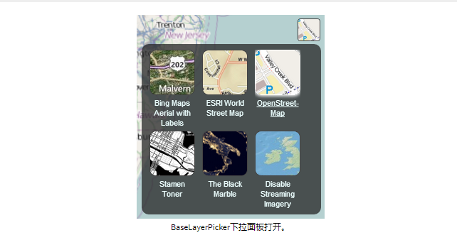
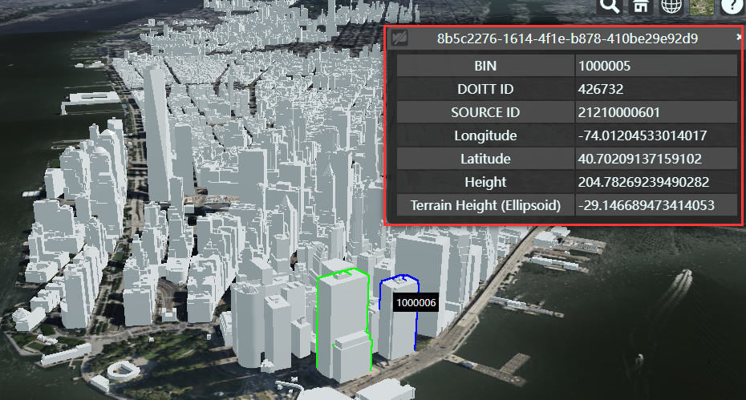
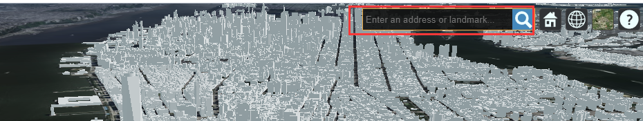
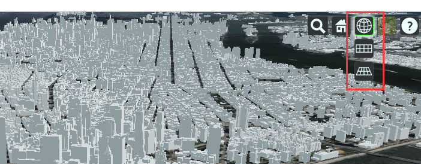
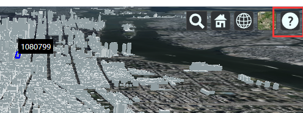
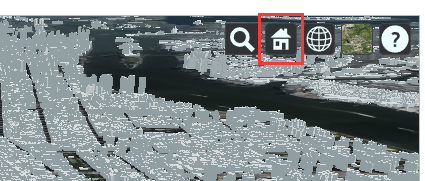
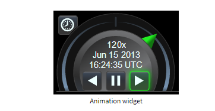

# 初始化

> 初始化场景及所有小部件

```typescript
init (container:any){
    Cesium.Ion.defaultAccessToken = 'your Token';
    this.HkScrViewer = new Cesium.Viewer(container, {
      baseLayerPicker: false,   //Cesium自带底图切换功能
      timeline: false,  //时间条
      infoBox: true,   //信息框
      fullscreenButton: false,  //全屏
      geocoder: false,
      sceneModePicker: false,
      navigationHelpButton: false,  //Cesium自带帮助信息栏
      homeButton:false,
      animation: false, //动画部件
      depthTestAgainstTerrain: true,
      terrainProvider : Cesium.createWorldTerrain({
        url : Cesium.IonResource.fromAssetId(1),
        requestWaterMask : true
      })
    })
    this.HkScrViewer._cesiumWidget._creditContainer.style.display = 'none'  //去掉logo

    this.HkScrViewer.scene.primitives.destroyPrimitives = false  //
    this.HkScrTilesManage = new Cesium.PrimitiveCollection()
    this.HkScrViewer.scene.primitives.add(this.HkScrTilesManage)

    Cesium.ExperimentalFeatures.enableModelExperimental = true   //开启泛光特效
  }
```

## BaseLayerPicker



## Timeline


## InfoBox



## FullscreenButton


## Geocoder



## SceneModePicker



## NavigationHelpButton



## HomeButton



## Animation 动画部件




