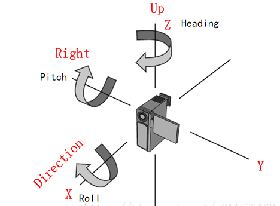

# 模型管理

## 一、模型位置及加载

> 相关类及属性：Cesium3DTileset、

#### Cesium3DTileset

```typescript
HkScrFlyTo(){
    // 通过IonResource方式加载
    // const tileSet = this.HkScrViewer.scene.primitives.add(
    //   new Cesium.Cesium3DTileset({
    //     url: Cesium.IonResource.fromAssetId(1535979)
    //     // url: Cesium.IonResource.fromAssetId(BIM1343534) 村庄1535979  日本1343233  香港1343560
    //   })
    // );
    // this.HkScrViewer.flyTo(tileSet)
    // 通过指定位置 和 加载Cesium默认模型
    this.HkScrViewer.camera.flyTo({
      destination: Cesium.Cartesian3.fromDegrees(114.184499, 22.301503, 2000)
    });
    this.HkScrViewer.scene.primitives.add(Cesium.createOsmBuildings());
  }
```


## 二、模型高度

> 相关类及属性：Globe.depthTestAgainstTerrain、Viewer.zoomto(target, offset)、Matrix4

#### Globe.depthTestAgainstTerrain

> 布尔值属性，用于指定地球表面上的三维对象是否应该进行深度测试。
>
> - true
>   - 渲染三维对象时将考虑求表面的深度，避免对象绘制在地球表面之下，因为通常生活中物体不会穿过地球表面
> - false
>   - 将会忽略地球表面的深度，导致三维对象与地球表面重叠，这在某些情况下是有用的，如地下管道 或者 洞穴系统

```typescript
viewer.scene.globe.depthTestAgainstTerrain = true
```

#### Viewer.zoomto(target, offset)

其中offset ：Cesium.HeadingPitchRange(heading, pitch, range)

| Name      | Type   | Default | Description                                                  |
| :-------- | :----- | :------ | :----------------------------------------------------------- |
| `heading` | Number | `0.0`   | optional以弧度表示的偏航角。                                 |
| `pitch`   | Number | `0.0`   | optional以弧度表示的俯仰角。                                 |
| `range`   | Number | `0.0`   | optional到中心的距离，单位是米。可以使用`tileset.boundingSphere.radius` |

#### Matrix4

模型平移矩阵

#### 实例代码

```typescript
async initViewer() {
            window.viewer = new window.Cesium.Viewer("cesium-container", {
                imageryProvider: new window.Cesium.ArcGisMapServerImageryProvider({
                    url: 'https://services.arcgisonline.com/ArcGIS/rest/services/World_Imagery/MapServer'
                }),
                sceneMode: window.Cesium.SceneMode.SCENE3D,
                vrButton: false,
                animation: false,
                baseLayerPicker: false,
                geocoder: false,
                timeline: false,
                fullscreenButton: false,
                homeButton: false,
                creditContainer: document.createElement('div'),
                infoBox: false,
                navigationHelpButton: false,
                sceneModePicker: false,
                scene3DOnly: true,
                skyBox: new window.Cesium.SkyBox({
                    sources: {
                        positiveX: require('@/assets/images/tycho2t3_80_px.jpg'),
                        negativeX: require('@/assets/images/tycho2t3_80_mx.jpg'),
                        positiveY: require('@/assets/images/tycho2t3_80_py.jpg'),
                        negativeY: require('@/assets/images/tycho2t3_80_my.jpg'),
                        positiveZ: require('@/assets/images/tycho2t3_80_pz.jpg'),
                        negativeZ: require('@/assets/images/tycho2t3_80_mz.jpg'),
                    }
                })
            });
            //开启地形深度检测
            window.viewer.scene.globe.depthTestAgainstTerrain = true;
            //加载3dtiles模型、定位
            let tileset = await new window.Cesium.Cesium3DTileset({
                url: "/model/Tileset/示例建筑/tileset.json",
            }).readyPromise
            window.viewer.scene.primitives.add(tileset);
            window.viewer.zoomTo(
                tileset,
                new window.Cesium.HeadingPitchRange(
                    0.0,
                    -0.5,
                    tileset.boundingSphere.radius * 2.0
                )
            );
            // this.adjustTilesetHeight(tileset,200)
            let height=0
            setInterval(()=>{
                this.adjustTilesetHeight(tileset,height++)
            },1000)
        },
        adjustTilesetHeight(tileset, height = 10) {
            //计算出模型包围球的中心点(弧度制)
            const cartographic = window.Cesium.Cartographic.fromCartesian(
                tileset.boundingSphere.center
            );
            //计算与模型包围球中心点经纬度相同的地表点位
            const surface = window.Cesium.Cartesian3.fromRadians(
                cartographic.longitude,
                cartographic.latitude,
                0.0
            );
            //计算调整高度后的模型包围球的中心点
            const offset = window.Cesium.Cartesian3.fromRadians(
                cartographic.longitude,
                cartographic.latitude,
                height
            );
            //计算差向量
            const translation = window.Cesium.Cartesian3.subtract(
                offset,
                surface,
                new window.Cesium.Cartesian3()
            );
            //修改模型的变换矩阵
            tileset.modelMatrix = window.Cesium.Matrix4.fromTranslation(translation);
        }
    }
```


## 三、模型角度

> 相关类及属性：HeadingPitchRoll

#### HeadingPitchRoll

heading、pitch、roll

- heading 偏航角，绕Z轴，绕-Z轴旋转为正
- pitch 俯仰角，绕Y轴，绕-Y旋转为正
- roll 翻滚角，绕X（视线）轴，绕+X轴旋转为正



#### 实例代码

```vue
<template>
    <div id="cesium-container">
    </div>
</template>
  
<script>
export default {
    name: 'ThreeDModel',
    components: {},
    mounted() {
        this.initViewer()
        this.addModel('/model/glb/XXX.glb', 4000)
    },
    methods: {
        addModel(url, height) {
            window.viewer.entities.removeAll();
            const position = window.Cesium.Cartesian3.fromDegrees(
                120.059,
                36.328,
                height
            );
            const heading = window.Cesium.Math.toRadians(135);
            const pitch = 0;
            const roll = 0;
            const hpr = new window.Cesium.HeadingPitchRoll(heading, pitch, roll);
            const orientation = window.Cesium.Transforms.headingPitchRollQuaternion(
                position,
                hpr
            );
            const entity = window.viewer.entities.add({
                name: url,
                position: position,
                orientation: orientation,
                model: {
                    uri: url,
                    minimumPixelSize: 128,
                    maximumScale: 20000,
                    clippingPlanes: new window.Cesium.ClippingPlaneCollection({
                        planes: [
                            new window.Cesium.ClippingPlane(new window.Cesium.Cartesian3(0, 0, 1), 0)
                        ],
                        edgeWidth: 1,
                        edgeColor: window.Cesium.Color.RED,
                        enabled: true,
                        edgeMaterial: new window.Cesium.PolylineOutlineMaterialProperty({
                            color: window.Cesium.Color.RED,
                            outlineWidth: 1,
                            outlineColor: window.Cesium.Color.BLACK
                        }),
                    })
                },
            });
            window.viewer.trackedEntity = entity;
        }
    }
}
</script>
  
<style>

</style>
```


## 四、模型着色

> 相关类及属性：ModelGraphics

#### ModelGraphics(options)

| `silhouetteColor`          | [Property](https://www.vvpstk.com/public/Cesium/Documentation/Property.html) | `Color.RED`                | optional指定的模型边框颜色 [`Color`](https://www.vvpstk.com/public/Cesium/Documentation/Color.html) |
| -------------------------- | ------------------------------------------------------------ | -------------------------- | ------------------------------------------------------------ |
| `silhouetteSize`           | [Property](https://www.vvpstk.com/public/Cesium/Documentation/Property.html) | `0.0`                      | optional边框大小（像素）。                                   |
| `color`                    | [Property](https://www.vvpstk.com/public/Cesium/Documentation/Property.html) | `Color.WHITE`              | optional指定Color[`Color`](https://www.vvpstk.com/public/Cesium/Documentation/Color.html)与模型的渲染颜色混合的属性 [`Color`](https://www.vvpstk.com/public/Cesium/Documentation/Color.html) |
| `colorBlendMode`           | [Property](https://www.vvpstk.com/public/Cesium/Documentation/Property.html) | `ColorBlendMode.HIGHLIGHT` | optional一个枚举属性，指定颜色混合模式。                     |
| `colorBlendAmount`         | [Property](https://www.vvpstk.com/public/Cesium/Documentation/Property.html) | `0.5`                      | optional混合模式的强度值。当colorBlendMode为Cesium.ColorBlendMode.MIX时有效，范围0-1，0表示不和颜色混合，1则表示替换。 |
| `imageBasedLightingFactor` | [Property](https://www.vvpstk.com/public/Cesium/Documentation/Property.html) | `new Cartesian2(1.0, 1.0)` | optional指定基于漫反射和镜面反射图像的照明的属性.            |
| `lightColor`               | [Property](https://www.vvpstk.com/public/Cesium/Documentation/Property.html) |                            | optional指定光源颜色。默认为 `undefined`。                   |

#### 实例代码

```typescript
const entity = window.viewer.entities.add({
                name: url,
                position: position,
                orientation: orientation,
                model: {
                    uri: url,
                    minimumPixelSize: 128,
                    maximumScale: 20000,
                    color:window.Cesium.Color.fromCssColorString('#FF6C37').withAlpha(1),
                    colorBlendMode:window.Cesium.ColorBlendMode.REPLACE,//HIGHLIGHT、MIX、REPLACE
                    colorBlendAmount:0.8,
                    silhouetteColor:window.Cesium.Color.fromCssColorString('#FF0000').withAlpha(1),
                    silhouetteSize:10
                },
            });
            window.viewer.trackedEntity = entity;
```


## 五、模型获取

> 相关类及属性：ScreenSpaceEventHandler、ScreenSpaceEventType、Cesium3DTileset、Cesium3DTile、Cesium3DTileFeature

#### ScreenSpaceEventHandler

处理用户输入事件。可以添加自定义函数，以便在用户输入时执行。

#### ScreenSpaceEventType	

屏幕点击事件类型

#### Cesium3DTileset

是一个最高级别的类，表示一个3D Tile数据集。Cesium3DTileset实例可以通过Cesium的Tileset类创建，并且可以通过url或json数据加载3D Tile数据。Cesium3DTileset负责管理整个3D Tile数据集，并对其中的每个3D Tile进行加载、解析和渲染

#### Cesium3DTile

Cesium3DTile是Cesium3DTileset中的一个单独的3D Tile对象，它表示一个具有几何体和纹理的3D模型。Cesium3DTile对象可以包含多个几何体，每个几何体又包含多个几何属性（如位置、法线、纹理坐标等）。Cesium3DTile对象负责管理自身的几何体和纹理，并且可以通过Cesium3DTileset的方法进行加载、卸载和渲染。

#### Cesium3DTileFeature

Cesium3DTileFeature是Cesium3DTile中的一个要素对象，表示一个3D Tile中的一个具体对象（如建筑、树木、汽⻋等）。Cesium3DTileFeature对象可以包含多个属性和几何信息，可以通Cesium3DTile的方法进行查询和渲染。

#### 实例代码

```typescript
const handler = new window.Cesium.ScreenSpaceEventHandler(window.viewer.scene.canvas);
            handler.setInputAction(function (movement) {
                //将上次选中的要素的颜色重置
                if (selectedFeature) {
                    selectedFeature.color = window.Cesium.Color.WHITE
                }
                //拾取要素
                selectedFeature = window.viewer.scene.pick(movement.position);
                if (!selectedFeature) return
                let obj = {}
                //获取要素属性信息
                selectedFeature.getPropertyIds().forEach(id => {
                    console.log("打印下id",id)
                    obj[id] = selectedFeature.getProperty(id)
                });
                //设置要素颜色
                selectedFeature.color = window.Cesium.Color.AQUA
                setTimeout(() => {
                    alert(JSON.stringify(obj))
                }, 500)
            }, window.Cesium.ScreenSpaceEventType.LEFT_CLICK);
```


## 六、模型裁剪平面

> 相关类及属性：ClippingPlaneCollection、ClippingPlane、CallbackProperty

#### ClippingPlaneCollection


#### ClippingPlane


#### CallbackProperty


## 七、模型剖切

Cesium.ClippingPlaneCollection  用于模型的剖切，剖切面的颜色、粗细、材质、位置
