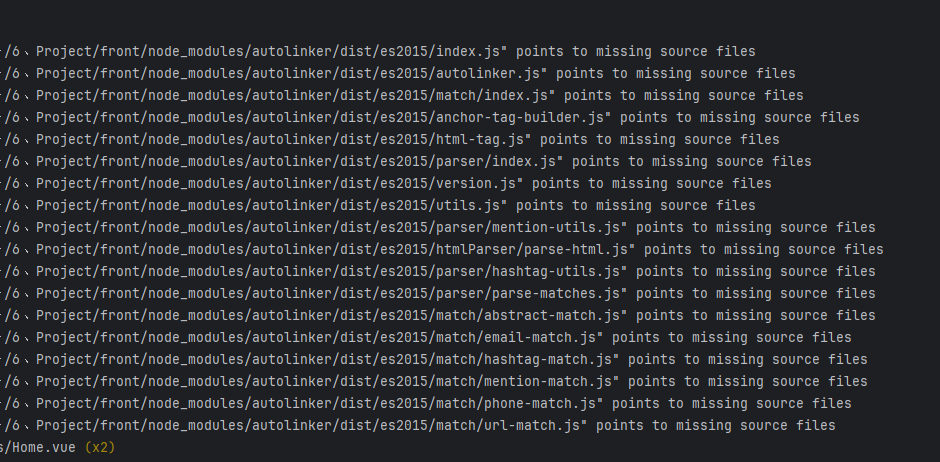

# cesium-navigation-es6 & vite-plugin-cesium

:warning: 问题截图如下，原因是版本导致两个依赖不能共存



> 两个版本的文件可能产生冲突，如下两个版本可以共存

```json
{
  "name": "viteblank",
  "private": true,
  "version": "0.0.0",
  "type": "module",
  "scripts": {
    "dev": "vite",
    "build": "vue-tsc --noEmit && vite build",
    "preview": "vite preview"
  },
  "dependencies": {
    "@element-plus/icons-vue": "^2.3.1",
    "@turf/turf": "6.5.0",
    "vue": "^3.2.37"
  },
  "devDependencies": {
    "@vitejs/plugin-vue": "^3.1.0",
    "autolinker": "^4.0.0",
    "axios": "^1.1.2",
    "cesium": "1.96.0",
    "cesium-navigation-es6": "^3.0.9",
    "default-passive-events": "^2.0.0",
    "echarts": "^5.5.0",
    "element-plus": "^2.7.4",
    "fast-glob": "^3.2.12",
    "path": "^0.12.7",
    "pinia": "^2.0.23",
    "sass": "^1.55.0",
    "typescript": "^4.6.4",
    "vite": "3.1.0",
    "vite-plugin-cesium": "^1.2.22",
    "vite-plugin-svg-icons": "^2.0.1",
    "vue-router": "^4.1.5",
    "vue-tsc": "^0.40.4"
  }
}

```


