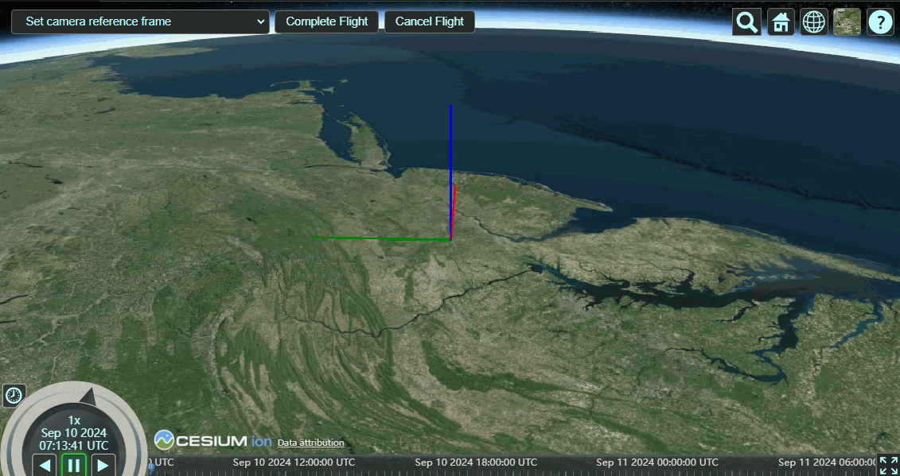
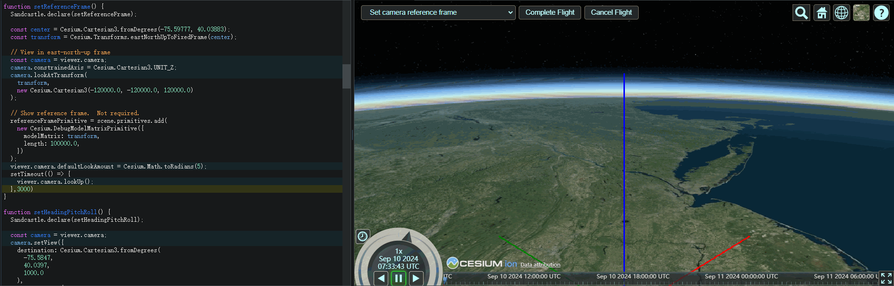
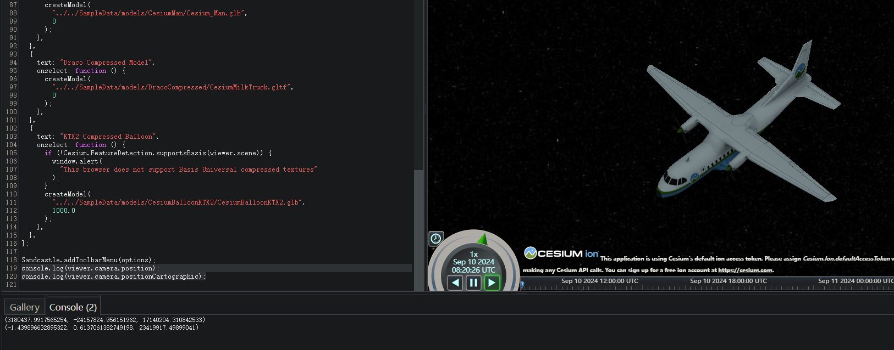

# Camera（全）

## 属性

#### Cesium.Camera.DEFAULT_OFFSET: HeadingPitchRange

> 当相机拉近到物体包围球时，默认的heading/pitch/range值。

```typescript
//保存当下场景角度   --方式一
const currentViewRect=viewer.camera.computeViewRectangle()
Cesium.Camera.DEFAULT_VIEW_RECTANGLE = currentViewRect
Cesium.Camera.DEFAULT_VIEW_FACTOR = 0;

// 保存当下场景角度  --方式二
this.options.position = viewer.camera.positionWC.clone();
this.options.up = viewer.camera.up.clone();
this.options.direction = viewer.camera.direction.clone();

var camera = this.options;
// 恢复场景信息
viewer.camera.setView({
    destination: camera.position,
    orientation: {
        direction: camera.direction,
        up: camera.up
    }
});
```

#### Cesium.Camera.DEFAULT_VIEW_FACTOR：Number

> 该值用来确定相机位置，当值为0时，相机观察范围是整个`Camera#DEFAULT_VIEW_RECTANGLE`，大于0时远离`Camera#DEFAULT_VIEW_RECTANGLE`， 小于0时向`Camera#DEFAULT_VIEW_RECTANGLE`拉近。

#### percentageChanged：number

> `Camera` 对象相关的一个设置，用于定义在触发 `Camera.changed` 事件之前相机必须移动或旋转的最小百分比。这个属性可以防止相机在进行微小移动时频繁触发 `changed` 事件，从而提高应用程序的性能和响应性。

```typescript
var viewer = new Cesium.Viewer('cesiumContainer');
// 设置 percentageChanged 阈值为 0.5%
viewer.camera.percentageChanged = 0.005;
viewer.camera.changed.addEventListener(function() {
    console.log('Camera view has significantly changed.');
});
// 当相机移动或旋转时，只有当变化超过 0.5% 时，才会触发上面的事件处理程序
```

#### changed: Event

> 可通过 addEventListener 和 removeEventListener 给changed添加 和 移除指定回调

#### constrainedAxis : Cartesian3

> 限制只能绕某个轴旋转

```typescript
function setReferenceFrame() {
  Sandcastle.declare(setReferenceFrame);

  const center = Cesium.Cartesian3.fromDegrees(-75.59777, 40.03883);
  const transform = Cesium.Transforms.eastNorthUpToFixedFrame(center);

  // View in east-north-up frame
  const camera = viewer.camera;
  camera.constrainedAxis = Cesium.Cartesian3.UNIT_Z;
  camera.lookAtTransform(
    transform,
    new Cesium.Cartesian3(-120000.0, -120000.0, 120000.0)
  );

  // Show reference frame.  Not required.
  referenceFramePrimitive = scene.primitives.add(
    new Cesium.DebugModelMatrixPrimitive({
      modelMatrix: transform,
      length: 100000.0,
    })
  );
}
```



#### defaultLookAmount: Number

> 针对look方法，相机默认的旋转步长。

```typescript
viewer.camera.defaultLookAmount = Cesium.Math.toRadians(15);
  setTimeout(() => {
    viewer.camera.lookUp();
},3000)
```



#### defaultMoveAmount: Number

> 针对move方法，同上，默认的移动步长

#### defaultRotateAmount：Number

> 针对rotate方法，同上，默认的旋转步长

#### defaultZoomAmount：Number

> 针对Zoom方法，同上，默认的缩放步长

#### direction：Cartesian3

> 相机的观察方向。

#### directionWC：Cartesian3

> 获取世界坐标系中相机的观察方向。

#### frustum：Frustum

> 视锥
>
> :bulb: 在 Cesium 中，`frustum.fov` 中的 `fov` 是 "Field of View" 的缩写，意为视场角。它定义了相机视野的宽度或高度的角度大小，具体取决于相机的纵横比。视场角越大，相机能看到的场景范围就越广，反之则越窄。在 3D 图形和摄影中，这是一个重要的参数，因为它直接影响到用户的视野范围。

#### position：Cartesian3  同 positionWC

> 相机位置

#### heading: Number

> 相机的偏航角，以弧度表示。

#### pitch：number

> 相机俯仰角

#### roll: Number

> 相机的翻滚角，以弧度表示。

#### positionCartographic：Cartographic

> 获取相机的Cartographic位置，经纬度用弧度表示，高度用米表示

```typescript
console.log(viewer.camera.position);
console.log(viewer.camera.positionCartographic);
```



#### transform: Matrix4

> 相机的变换矩阵
>
> :bulb: 

#### viewMatrix: Matrix4

> 视图矩阵

#### inverseTransform: Matrix4

> 相机变换矩阵的逆矩阵

#### moveEnd：Event

> 相机停止移动时触发的事件

#### moveStart：Event

> 相机开始移动触发的事件


## 方法

