# 矩阵到空间变换

## 一、向量点乘 与 ×乘

> 向量默认表示为列向量

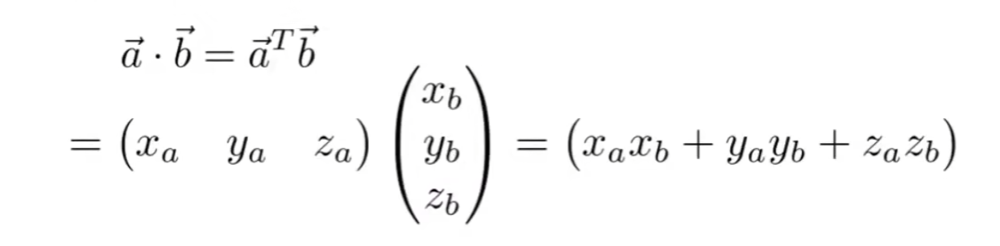

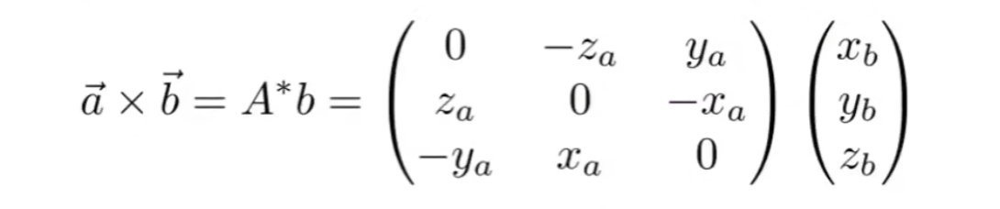

## 二、矩阵到二维空间变换

> 线性变换矩阵：变换能用`矩阵` 乘 输入坐标得到输出坐标，则该种变换时线性变换，如下的 `缩放、反射、剪切和旋转等`都属于线性变换。

#### 缩放矩阵--Scale Matrix

:bulb: 在坐标轴方向缩放

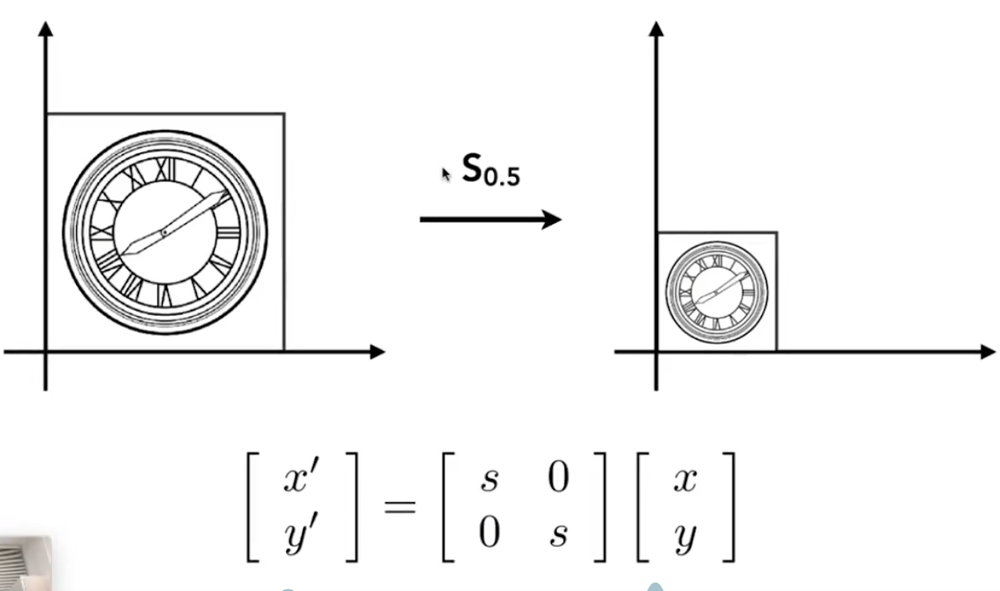

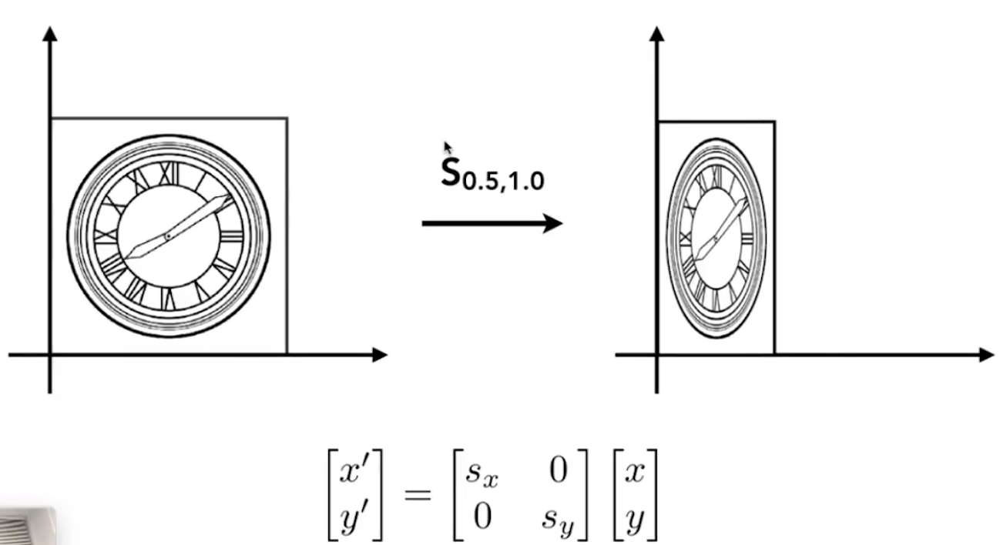

#### 反射矩阵--reflect Matrix

:bulb: 坐标轴对称

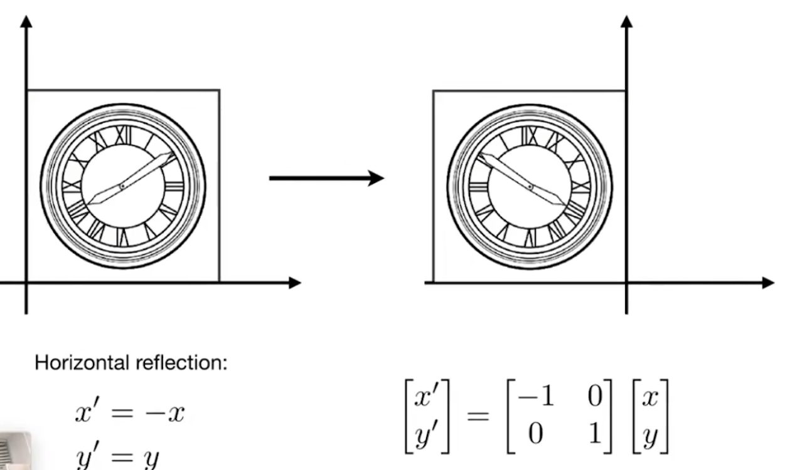

#### 剪切矩阵--Shear Matrix

:bulb: 拉扯原图像

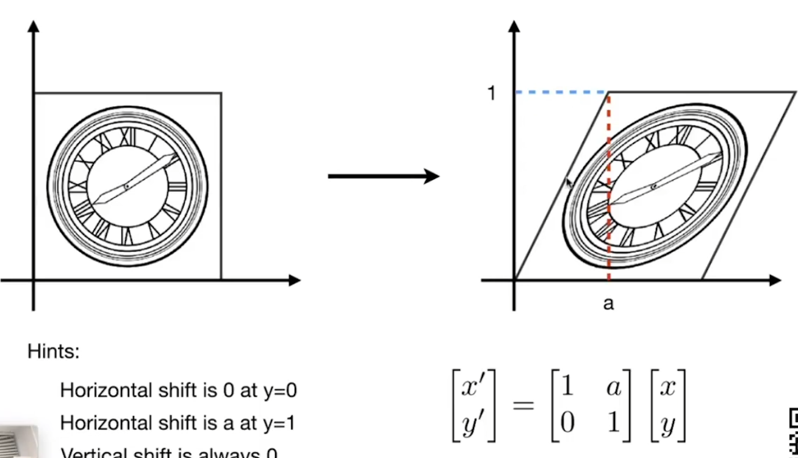

#### 旋转矩阵--Rotation Matrix

:bulb: 角度关系确定变换矩阵

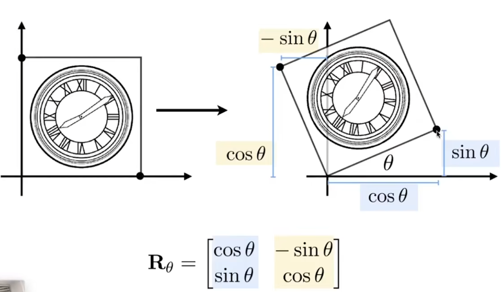

:bulb: 推导过程

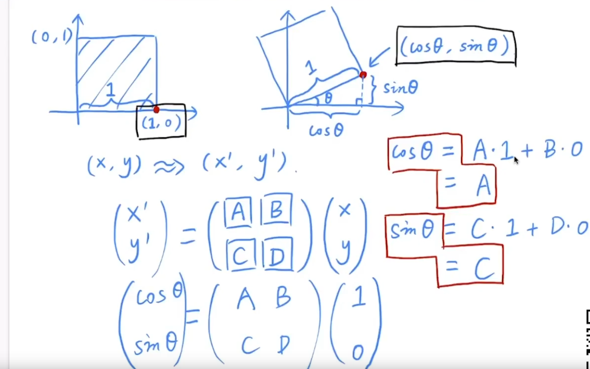

平移，除了矩阵相乘 还需补充 `加法`  ，这种变换是 `仿射变换`

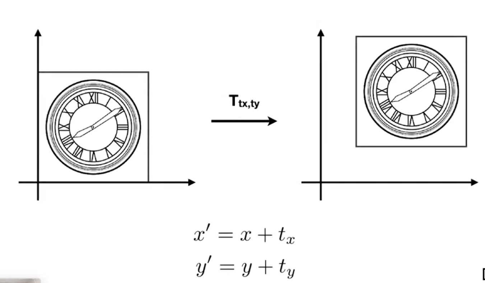

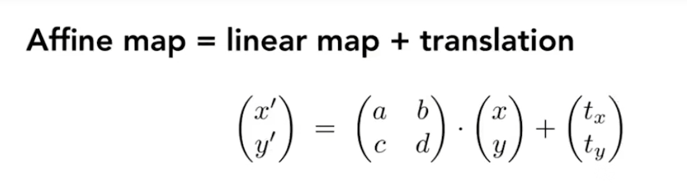

尝试将平移操作 更改 为线性变换--`齐次坐标`

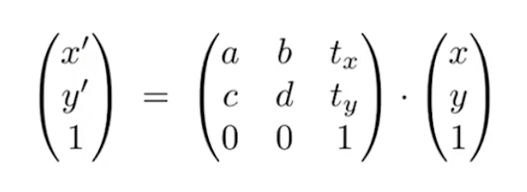

## 三、齐次坐标

> 向量加0
>
> 坐标加1

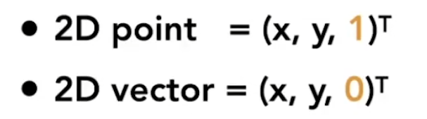

:bulb: 理解齐次坐标

向量的平移不会导致向量改变

坐标点改变，如(x,y,w) 理解为 (x/w, y/w, 1) 

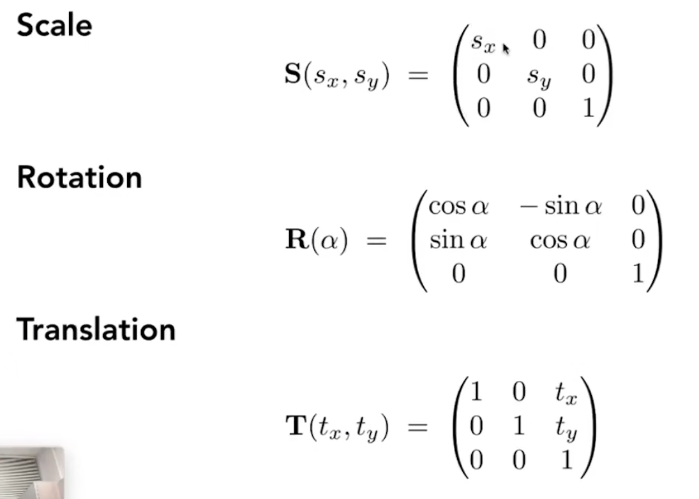

## 四、逆变换

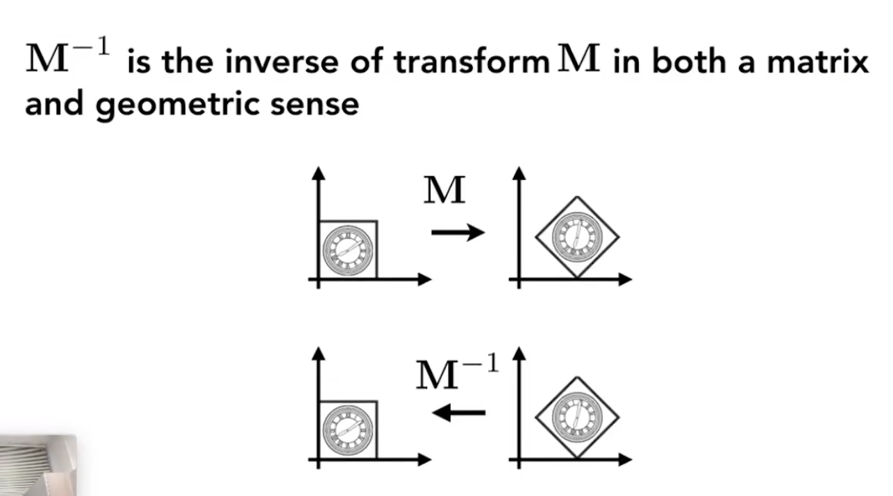

## 五、变换组合

> 先平移再旋转 和 先旋转再平移是不同的

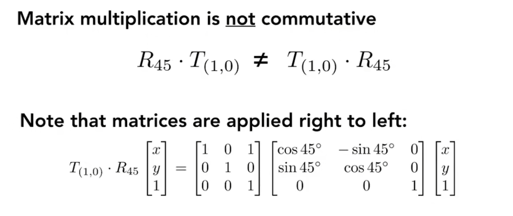

:bulb: 可以把多个仿射变换 预乘积为 单一矩阵

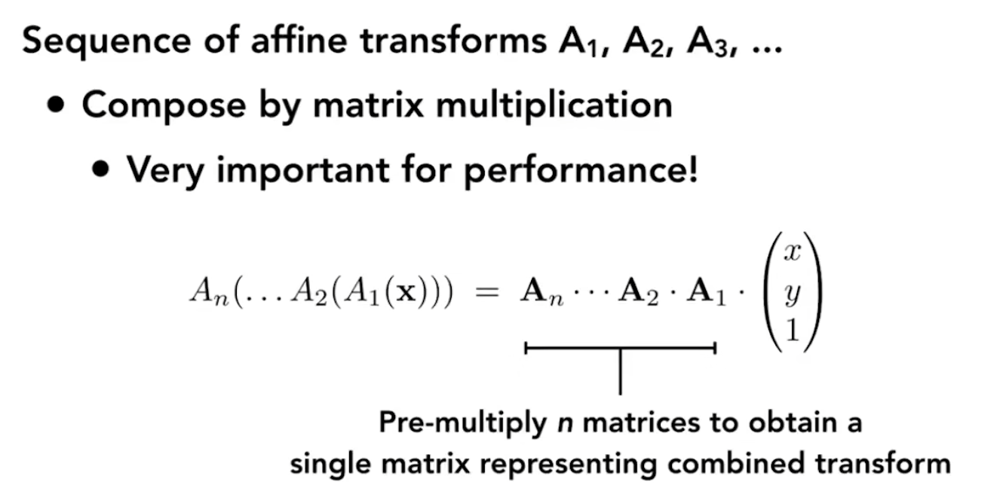

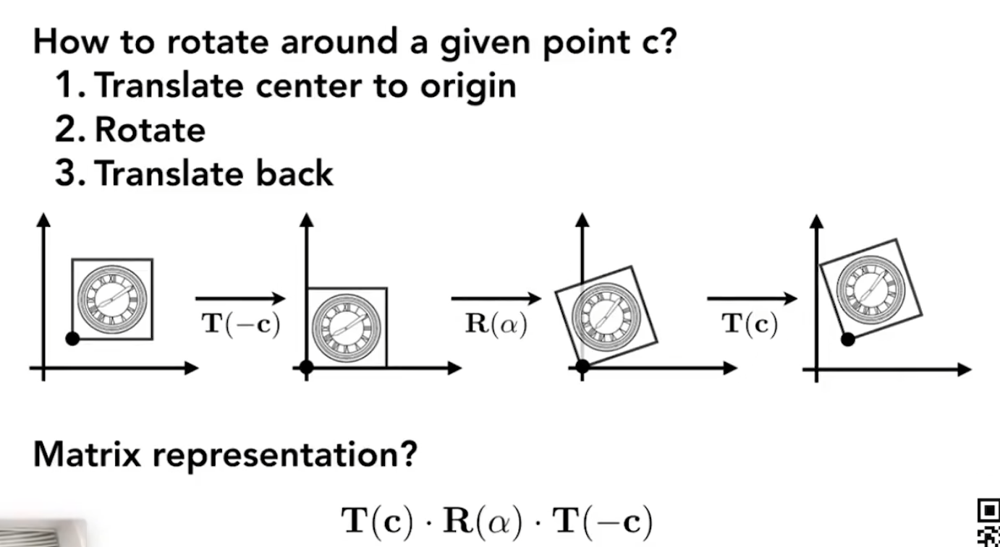

## 六、3D变换

P04