# GIS常用空间分析

> 补充地理学大定律
>
> - 地理学第一定律由WaldoTobler提出，**空间相关性**定律“All things are related, but nearby things are more related than distant things.”空间相关性，地物之间的相关性与距离有关，一般来说，距离越近，地物间相关性越大；距离越远，地物间相异性越大。
> - 地理学第二定律由MichaelGoodchild提出，**空间异质性**定律(Law of Spatial Heterogeneity)，空间的隔离，造成了地物之间的差异，即异质性。（分为空间局域异质性（spatial local heterogeneity）和空间分层异质性（简称空间分异性）（spatial stratified heterogeneity）
> - 朱阿兴等在探索空间推测的理论依据时，将地理现象所遵循的另外一个规律命名为地理学第三定律，即“**地理环境越相似，地理特征越相近**”（The more similar geographic configurations of two points(areas), the more similar the values (processes) of the target variable at these two points (areas)），即地理相似性规律。

## 一、矢量数据的分析方法

### 1、频数频率统计

- 解释：将变量xi (i=i,2,…,n)按大小顺序排序，并按一定的间距分组。变量在各组出现或发生的次数称为频数，各组频数与总频数之比叫做频率，`输出结果是一个dbf表格`

- 应用：分析工具-->统计-->频率（frequency）

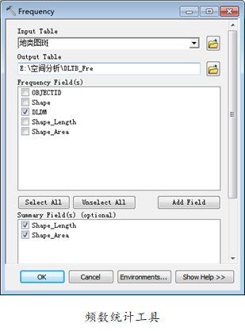

### 2、最近邻要素分析

- 解释：指对于输入要素的每个要素，在指定的搜索半径内，在近邻要素中找出与其距离最近的要素，并计算器距离、位置和方向角度的一种分析方法，`输出结果是将分析结果添加到输入要素的属性表中`
- 应用：分析工具-->近邻（Proximity）-->近邻（Near）

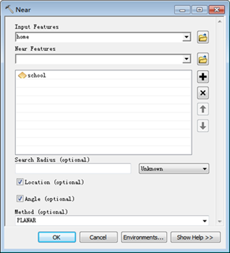

### 3、点距分析

- 解释：针对输入要素中的每个点，在指定的搜索半径内，计算其与近邻要素中每个点的距离，`输出结果为一个表格，表格中三个字段，输入要素FID,最近要素FID，两者间的距离`
- 应用：分析工具-->proximity-->点距

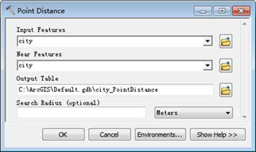

### 4、泰森多边形

- 解释：①每个泰森多边形内仅含有一个离散点；②泰森多边形内的点到相应离散点的距离最近③位于泰森多边形边上的点到其两边的离散点的距离相等，`输出结果是一个面shp`
- 应用：分析工具-->proximity-->创建泰森多边形

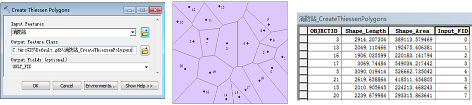

### 5、矢量叠置

> 合并

- 将输入图层和叠置图层的空间区域联合起来。`输出图层`的范围是输入图层和叠置图层范围和，并保留两个图层的空间要素和属性信息。

> 识别

- 以输入图层定义的区域范围为界，保留边界内输入图层和叠置图层的所有多边形。`输出图层`的范围是输入图层的范围，同时包含输入和叠置图层的属性信息。

> 相交

- `输出图层`保留输入图层和叠置图层公共部分的空间图形，并综合两个叠加图层的属性。

**补充：对于小碎多边形，三种消除方法。1.设置模糊容差、2数据预处理和后处理（拓扑）、3融合**

### 6、网络分析

> 对于单个shp 或者 gdb中的数据集均可创建`网络数据集`
>
> `记得全部选中后打断相交线  或者  通过要素转线工具实现打断`

- ArcMap-->帮助-->扩展名-->NetWork Analyst-->教程

- 容差

  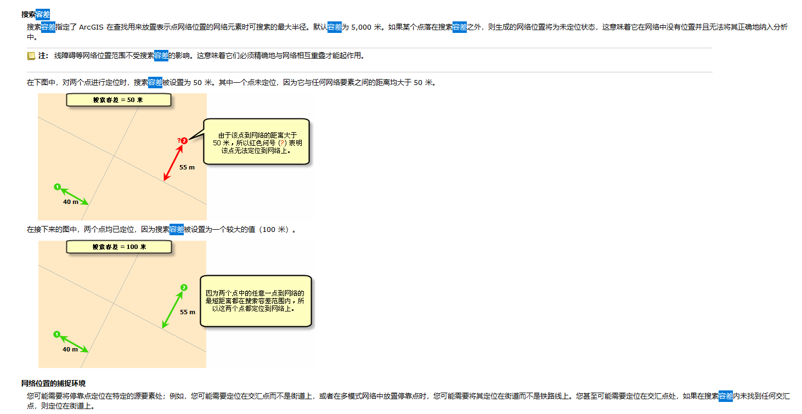

### 7、创建拓扑

> 针对数据集进行创建拓扑，设置对应点、线 和 面的拓扑规则并检查

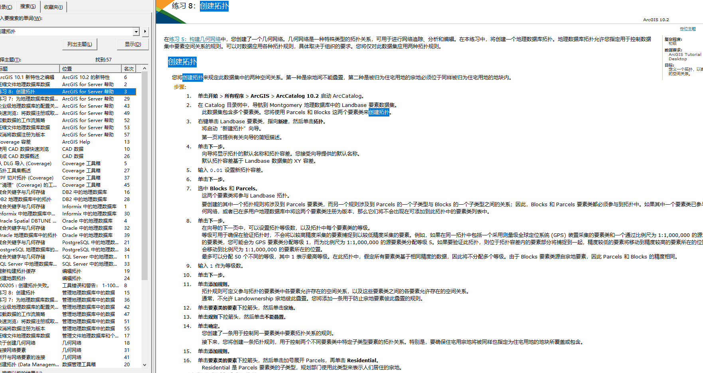

## 二、栅格数据的分析方法

### 1、栅格计算器

> 前提：1.要求栅格数据格式相同 2.有相同的坐标系统，像元大小及像素深度等保持一致，输出结果是`栅格文件`

常见的运算方法：

- 算术运算： 加减乘除
- 关系运算：\>、<、=、 >=、 <=、 <> ，符合条件位置赋值1，不符合0
- 布尔运算：与(And，&)、与(Or，|)、异或(XOr，^)、非(Not，~)
- 函数运算：三角函数、对数函数、指数函数、幂函数、统计函数
- 其他函数：转换函数Con（）、空值设置函数SetNull（）、提取函数Pick（）、空值判断IsNull（）

### 2、重分类

略，按需重分类即可

### 3、邻域统计（焦点统计）

- 解释：利用邻域内的像元值来进行统计，并将统计结果赋予目标像元。`输出结果是新的栅格`

- 应用：空间分析工具-->邻域分析-->焦点统计focal Statistics

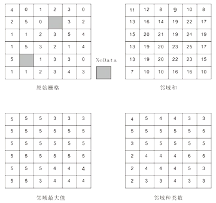

### 4、分区统计

- 解释：指在对区域进行类型划分的基础上，在每个类型内对某一属性进行的栅格运算，`输出结果赋予输出栅格或输出为表格`
- 应用：空间分析工具-->zonal-->分区统计

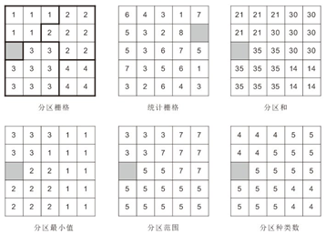

### 5、坡度 和 坡向

- 解释

  - 坡度：坡面与水平面之间的夹角
  - 坡向：是对坡面朝向的量度，是指地表上一点的切平面的法线矢量在水平面的投影与过该点的正北方向之间的夹角
    - 规定正北方向为0°，顺时针旋转从0-360°
    - 平地不具有坡向，取值-1

  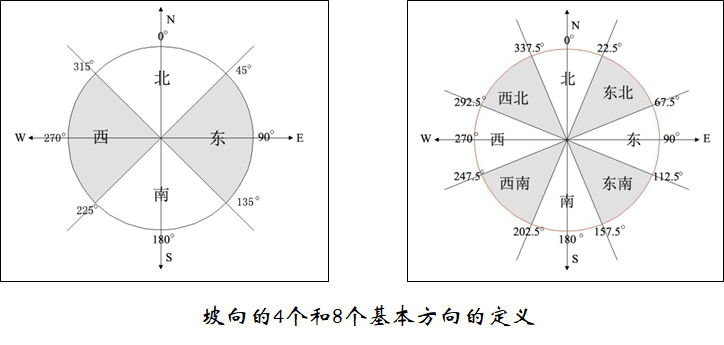

- 应用：空间分析工具-->表面-->坡度/坡向

### 6、地表起伏度

- 解释：描述区域地形特征的一个宏观性指标，反映地表高低起伏特征。公式：R = H_max - H_min，其中R为地表起伏度，H_max和H_min分别为一定邻域范围内的最大和最小高程
- 应用：空间分析工具-->邻域统计，**统计类型选择Range**

### 7、体积计算

- 解释：是计算公路、铁路等的体积。1.生成DEM 2.计算高差（DEM-基准面高程值）3.计算每个像元体积 = 高差 * 像元面积   4最后总体积 = ∑像元体积，`输出结果是一个txt文本文件`
- 应用：3D分析工具-->表面分析-->surface Volume

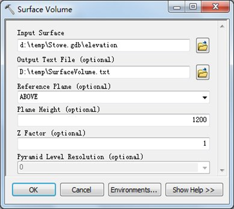

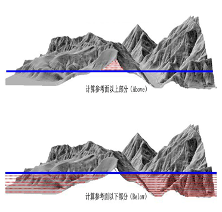

### 8、阴影

- 解释：通过设定一个光源的位置，分析像元间的遮蔽关系，计算每个栅格像元的亮度值从而获得一个被光源照射的表面
  - 决定光源位置有两个参数：太阳方位角[太阳的所在方位]，太阳高度角
- 应用：空间分析工具-->表面-->阴影hillshade

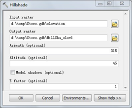

### 9、等值线

- 解释：将表面上具有相同值的相邻点连接起来生成的线，`输出结果是线要素`

- 应用：空间分析工具-->表面-->contour

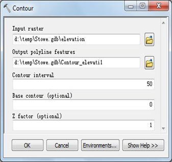

### 10、成本路径

- 解释：计算从源到目标的最小成本路径，`输出结果是一个栅格路径`
  1. 重分类得到栅格计算器后成本cost
  2. 成本距离工具：利用cost + 起点要素 => **成本距离栅格 + 成本回溯栅格**
  3. 成本路径：**利用成本距离栅格 + 成本回溯栅格 +  终点要素** => 成本路径
- 应用：空间分析工具 --> 距离分析 --> 成本路径

## 三、插值分析

- 解释：根据已知点的值来估算栅格中每个像元的值
  - 必备条件
    - 控制点
    - 插值方法
      1. 反距离权重法
      2. 样条函数法
      3. 克里金插值法
      4. 自然邻域法
      5. 趋势面法
      6. 径向基函数法
- 应用：地理分析工具--> 插值interpolation-->各种插值分析

## 四、Arcmap切片方案

数据管理工具 > 切片缓存 > 生成切片缓存切片方案

设置数据源、切片方案导出的绝对路径、比例级数 和 高级设置等（`其中高级设置可以确定存储格式是紧凑compact > .bundle & 还是稀疏exploded > .png`）

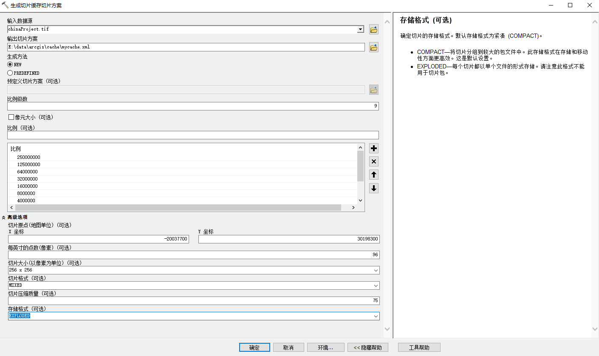

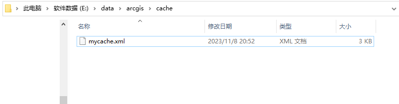

数据管理工具 > 切片缓存 > 管理切片缓存

`缓存位置`：最终导出的切片结果存储绝对路径

`管理模式`：（类似于Geoserver的Type of operation）

- RECREATE_ALL_TILES—如果范围发生改变或将图层添加到多图层缓存，则需要更换现有切片并添加新切片。 
- RECREATE_EMPTY_TILES—只重新创建空切片。现有切片将保持不变。 
- DELETE_TILES—将从缓存中删除切片。缓存文件夹结构不会删除。

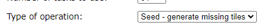

`输入数据源`：具体的.tif

`输入切片方案（可选）`：用于指定切片方案的可选参数

- ARCGISONLINE_SCHEME—使用默认 ArcGIS Online 切片方案
- IMPORT_SCHEME—导入现有的切片方案

`导入切片方案`：这里使用刚才创建好的切片方案

`最小最大缓存比例`：默认从导入的切片方案中找出

`感兴趣区域`：定义感兴趣区以对将创建或删除的切片进行约束。

- 它可能是一个要素类，也可能是在 ArcMap 中以交互方式定义的要素。

- 该参数用于为形状不规则的区域管理切片。它对您要对某些区域进行预缓存或让较少访问的区域保持未缓存的状态等情形也同样有用

`最大源像元大小`：用于定义生成了缓存的数据源的可见性的值。默认情况下，该值为空。

如果该值为空，

- 对于数据源可见范围内的缓存级别，缓存是由数据源生成的。 
- 对于超出数据源可见性范围的缓存级别，缓存是由前一级缓存生成的。 

如果该值大于零，

- 对于像元大小小于等于最大源像元大小 (max_cell_size) 的级别，缓存是由数据源生成的。 
- 对于源像元大小大于最大源像元大小 (max_cell_size) 的级别，缓存是由前一级缓存生成的。 

最大源像元大小值的单位应与源数据集的像元大小的单位相同。

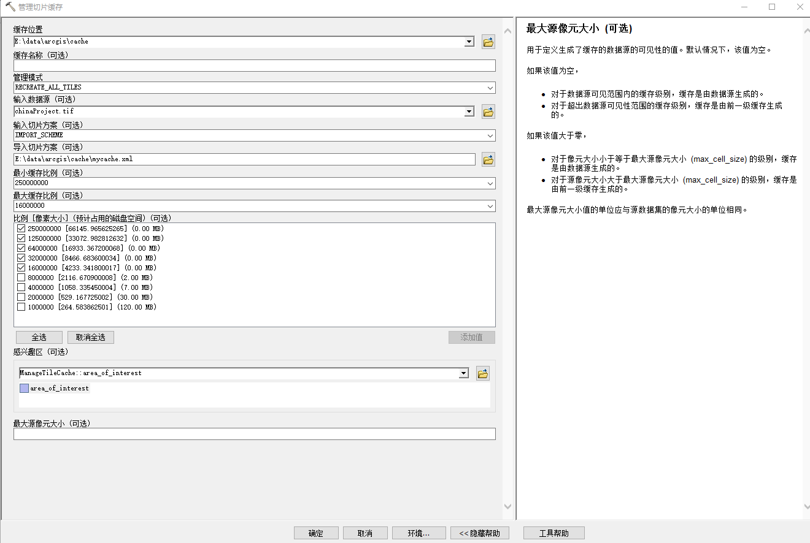

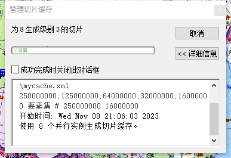

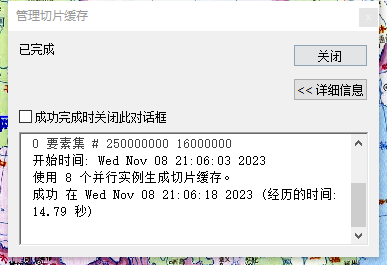

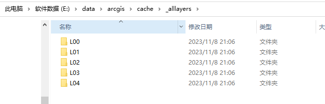

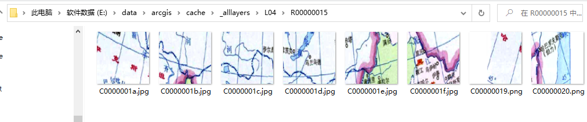
