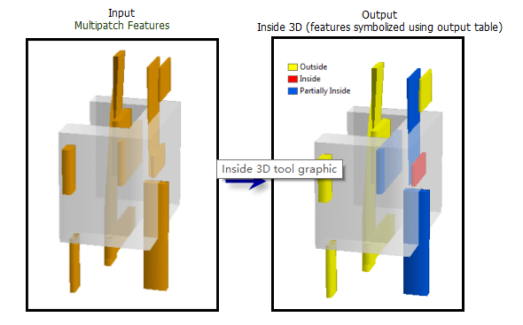
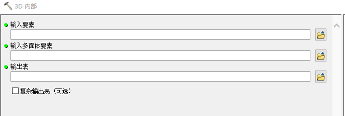
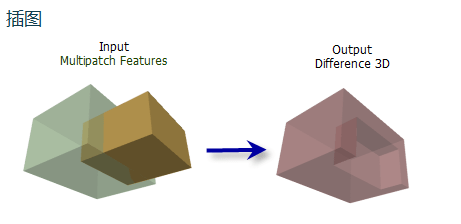
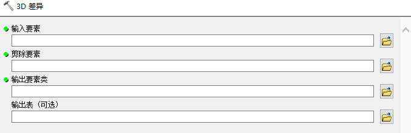
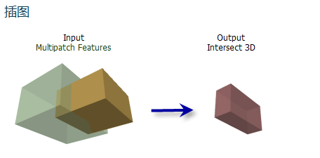
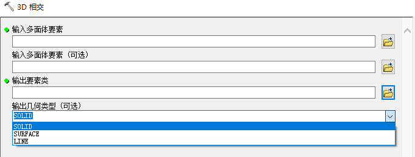
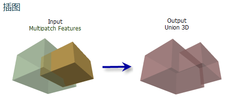
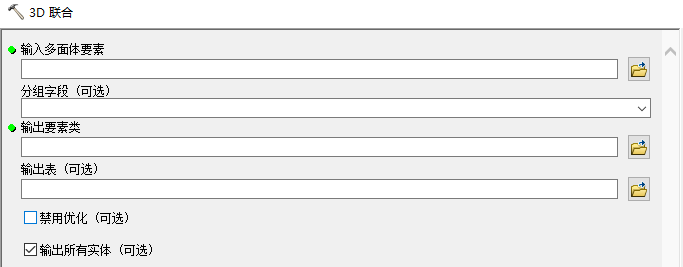
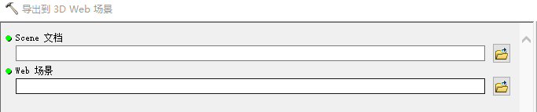

# ArcMap数学相关

## 一、3D Analyst

### 1.1 3D要素

#### 1.1.1  3D内部

> 确定来自输入要素类的 3D 要素是否包含在闭合的多面体中，并写入用于记录要素（部分或全部在多面体中）的输出表
>

| 参数                       | 说明                                                         | 数据类型      |
| -------------------------- | ------------------------------------------------------------ | ------------- |
| in_target_feature_class    | 输入多面体或 3D 点、线或面要素类。                           | Feature Layer |
| in_container_feature_class | 用作输入要素容器的闭合多面体要素。                           | Feature Layer |
| out_table                  | 输出表，它提供全部或部分位于闭合输入多面体要素内部的 3D 输入要素的列表。输出表包含  OBJECTID（对象 ID）、Target_ID 和 Status 字段。Status 将指明输入要素 (Target_ID) 是否完全或部分落入多面体内。 | Table         |

#### 1.1.2 3D差异

> 消除重叠部分

| 参数                   | 说明                                                         | 数据类型      |
| ---------------------- | ------------------------------------------------------------ | ------------- |
| in_features_minuend    | 通过剪除要素移除其自身要素的多面体要素。                     | Feature Layer |
| in_features_subtrahend | 将从输入中减去的多面体要素。                                 | Feature Layer |
| out_feature_class      | 包含所生成要素的输出多面体要素类。                           | Feature Class |
| out_table (可选)       | 可选表，存储有关输入要素和差异输出之间关系的信息。此表中会显示下列字段： Output_ID - 输出要素类的唯一 ID。 Minuend_ID - 主多面体的唯一 ID。 Subtrahend -  已从主多面体中减去的多面体要素的唯一 ID。 | Table         |

#### 1.1.3 3D相交

> 根据相交体积生成多面体要素，根据相交面生成面要素或根据相交边生成线要素。

| 参数                        | 说明                                                         | 数据类型      |
| --------------------------- | ------------------------------------------------------------ | ------------- |
| in_feature_class_1          | 要相交的多面体属性。只有一个输入要素                         | Feature Layer |
| in_feature_class_2 (可选)   | 与第一个多面体要素类相交的第二个多面体要素类（可选）。       | Feature Layer |
| out_feature_class           | 输出要素类。                                                 | Feature Class |
| output_geometry_type (可选) | 确定创建的相交几何的类型。  SOLID —创建表示输入要素之间重叠体积的闭合多面体。这是默认设置。 SURFACE —创建表示输入要素之间共享面的多面体表面。 POLYLINE — 创建表示输入要素之间共享边的折线。 | String        |

#### 1.1.4 3D联合

> 基于输入要素类对闭合的重叠多面体要素进行合并

| 参数               | 说明                                           | 数据类型      |
| ------------------ | ---------------------------------------------- | ------------- |
| in_feature_class   | 要相交和聚合的闭合多面体要素。                 | Feature Layer |
| group_field (可选) | 用于标识应归到一组的要素的字段。               | Field         |
| out_feature_class  | 将存储聚合要素的输出多面体要素类。             | Feature Class |
| out_table (可选)   | 表示输入要素与其对应的聚合要素关系的多对一表。 | Table         |

#### 1.1.5 依据属性实现要素转3D

> 使用从输入要素属性获得的高度值创建 3D 要素。

- 支持点、多点、线和面几何。 
- 各要素的高程都从在指定高度字段中包含的值获得而来。 
- 线要素还可提供第二个高度字段。使用两个高度字段将使各线要素始于在第一个高度字段中获取的  Z 值，止于在第二个高度字段中获取的 Z 值。中间所有折点的高度都将根据两个端点连线的坡度进行内插。

| 参数                   | 说明                                                         | 数据类型      |
| ---------------------- | ------------------------------------------------------------ | ------------- |
| in_features            | 用于创建 3D 要素的要素。                                     | Feature Layer |
| out_feature_class      | 输出要素类。                                                 | Feature Class |
| height_field           | 其值被用于定义所生成的 3D  要素的高度的字段。                | Field         |
| to_height_field (可选) | 用于线的第二个可选高度字段。如果使用两个高度字段，则每条线的起点使用第一个高度，终点使用第二个高度（成坡状）。 | Field         |

### 1.2 CityEngine

> 需要补充Esri CityEngine内容
>
> https://esriaustralia.com.au/arcgis-cityengine

#### 1.2.1 基于CityEngine 规则转换要素

按照在 Esri CityEngine 中创作的规则基于现有 2D 和 3D 输入要素生成 3D 几何。

#### 1.2.2 导出到3D Web场景

将 ArcScene 文档 (.sxd) 导出为 Esri CityEngine Web 场景 (.3ws) 格式，以便将其显示在 CityEngine  Web 查看器中。

CityEngine Web 查看器使用 HTML5 和 WebGL 技术在 Web 浏览器中绘制 3D 内容。在支持 WebGL 的浏览器中查看 3D  场景不需要插件或 Esri CityEngine 许可

### 1.3 功能性表面

#### 1.3.1 3D线与表面相交

## 二、Data Interoperability

## 三、Geostatistical Analyst

## 四、Network Analyst

## 五、Spatial Analyst

## 六、地理编码工具

## 七、多维工具

> 解释NetCDF

## 八、分析工具

## 九、服务器工具

## 十、空间统计工具

## 十一、数据管理工具

## 十二、制图工具

## 十三、转换工具

