# ArcGIS Server

> 安装arcgis server略
>
> 可参考：https://jackie-sun.blog.csdn.net/article/details/123496342?spm=1001.2014.3001.5502
>
> 数据：
>
> - 河北省3857
> - china3857

## 一、发布WFS & WMS

### 1、arcgis加载shp数据

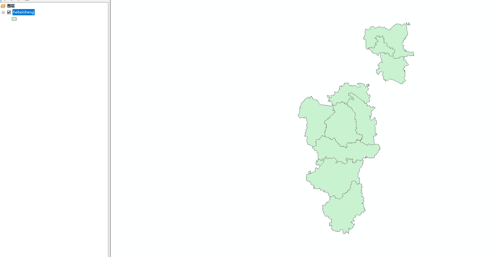

### 2、点击**文件**->**共享为**->**服务**，之后设定`服务名称`

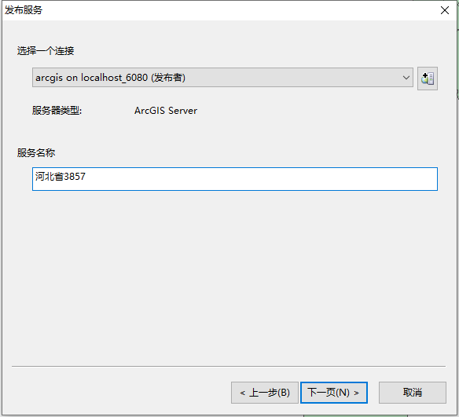

### 3、服务发布至文件夹，选择现有的或者创建新的，这里默认

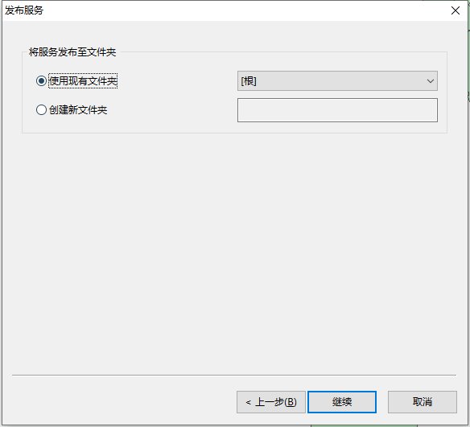

### 4、在**服务编辑窗口**->**功能**中选择需要发布的服务：本次勾选WFS、WMS

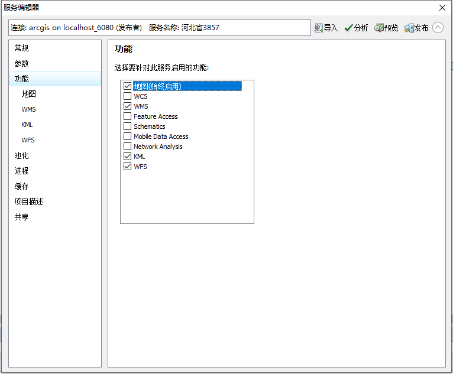

:bulb: 可以点击预览按钮，查看是否正确，确认后点击发布即可。

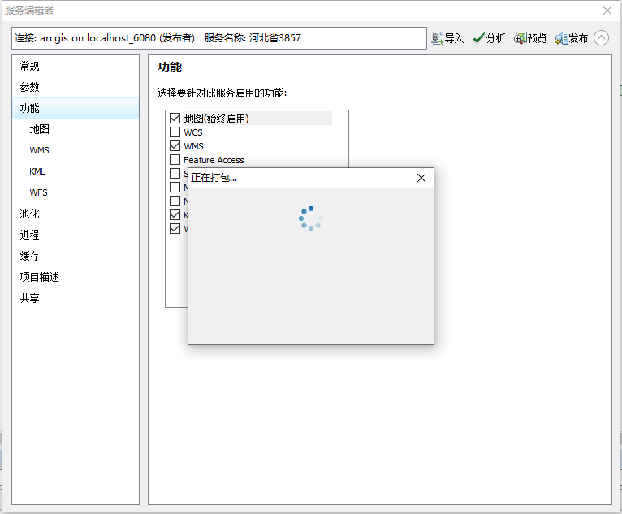

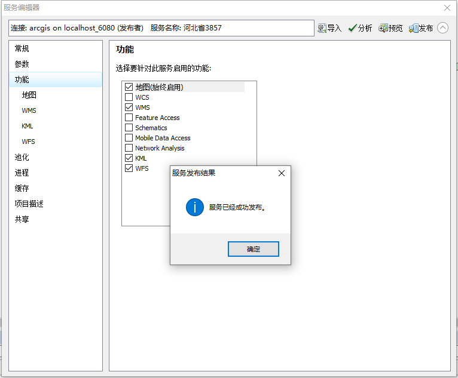

### 5、arcgis server查看效果

输入网址：`http://localhost:6080/arcgis/manager/`，查看刚才发布的河北省3857，

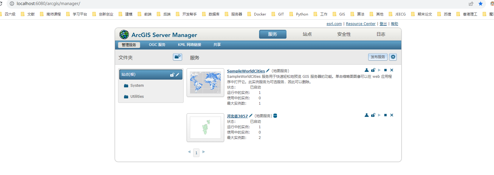

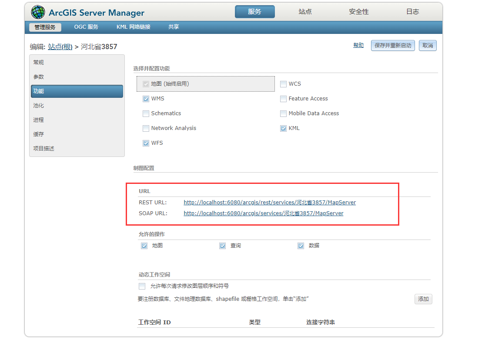

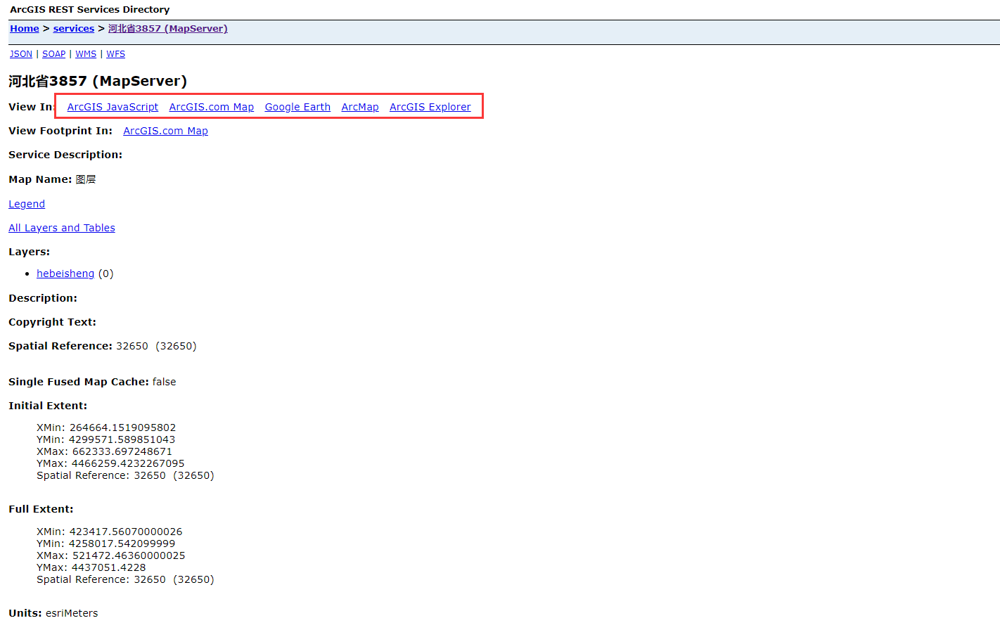

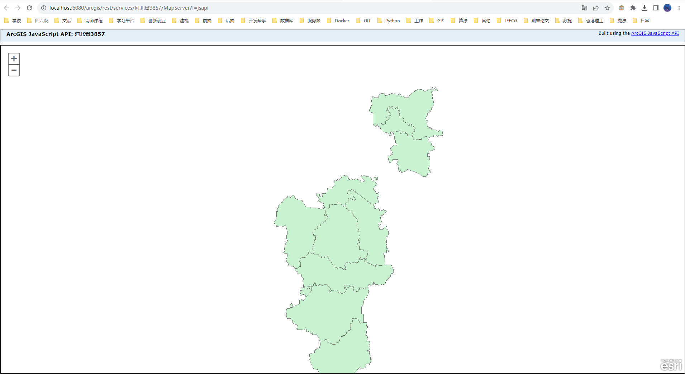

```
http://localhost:6080/arcgis/services/%E6%B2%B3%E5%8C%97%E7%9C%813857/MapServer/WMSServer?request=GetCapabilities&service=WMS
```


```xml
<WMS_Capabilities xmlns="http://www.opengis.net/wms" xmlns:xsi="http://www.w3.org/2001/XMLSchema-instance" xmlns:esri_wms="http://www.esri.com/wms" version="1.3.0" xsi:schemaLocation="http://www.opengis.net/wms http://schemas.opengis.net/wms/1.3.0/capabilities_1_3_0.xsd http://www.esri.com/wms http://localhost:6080/arcgis/services/河北省3857/MapServer/WmsServer?version=1.3.0%26service=WMS%26request=GetSchemaExtension">
<Service>
<Name>
...
</Name>
<Title>WMS</Title>
<Abstract>WMS</Abstract>
<KeywordList>
...
</KeywordList>
<OnlineResource xmlns:xlink="http://www.w3.org/1999/xlink" xlink:type="simple" xlink:href="http://localhost:6080/arcgis/services/河北省3857/MapServer/WmsServer?"/>
<ContactInformation>
...
</ContactInformation>
<Fees>
<![CDATA[ ]]>
</Fees>
<AccessConstraints>
...
</AccessConstraints>
<MaxWidth>4096</MaxWidth>
<MaxHeight>4096</MaxHeight>
</Service>
<Capability>
<Request>
<GetCapabilities>
<Format>application/vnd.ogc.wms_xml</Format>
<Format>text/xml</Format>
<DCPType>
...
</DCPType>
</GetCapabilities>
<GetMap>
<Format>image/bmp</Format>
<Format>image/jpeg</Format>
<Format>image/tiff</Format>
<Format>image/png</Format>
<Format>image/png8</Format>
<Format>image/png24</Format>
<Format>image/png32</Format>
<Format>image/gif</Format>
<Format>image/svg+xml</Format>
<DCPType>
<HTTP>
<Get>
<OnlineResource xmlns:xlink="http://www.w3.org/1999/xlink" xlink:type="simple" xlink:href="http://localhost:6080/arcgis/services/河北省3857/MapServer/WmsServer?"/>
</Get>
</HTTP>
</DCPType>
</GetMap>
<GetFeatureInfo>
<Format>application/vnd.esri.wms_raw_xml</Format>
<Format>application/vnd.esri.wms_featureinfo_xml</Format>
<Format>application/vnd.ogc.wms_xml</Format>
<Format>text/xml</Format>
<Format>text/html</Format>
<Format>text/plain</Format>
<DCPType>
<HTTP>
<Get>
<OnlineResource xmlns:xlink="http://www.w3.org/1999/xlink" xlink:type="simple" xlink:href="http://localhost:6080/arcgis/services/河北省3857/MapServer/WmsServer?"/>
</Get>
</HTTP>
</DCPType>
</GetFeatureInfo>
<esri_wms:GetStyles>
...
</esri_wms:GetStyles>
</Request>
<Exception>
<Format>application/vnd.ogc.se_xml</Format>
<Format>application/vnd.ogc.se_inimage</Format>
<Format>application/vnd.ogc.se_blank</Format>
<Format>text/xml</Format>
<Format>XML</Format>
</Exception>
<Layer>
<Title>
<![CDATA[ 图层 ]]>
</Title>
<CRS>CRS:84</CRS>
<CRS>EPSG:4326</CRS>
<CRS>EPSG:32650</CRS>
<EX_GeographicBoundingBox>
<westBoundLongitude>116.101781</westBoundLongitude>
<eastBoundLongitude>117.251859</eastBoundLongitude>
<southBoundLatitude>38.467188</southBoundLatitude>
<northBoundLatitude>40.083738</northBoundLatitude>
</EX_GeographicBoundingBox>
<BoundingBox CRS="CRS:84" minx="116.101781" miny="38.467188" maxx="117.251859" maxy="40.083738"/>
<BoundingBox CRS="EPSG:4326" minx="38.467188" miny="116.101781" maxx="40.083738" maxy="117.251859"/>
<BoundingBox CRS="EPSG:32650" minx="423417.560700" miny="4258017.542100" maxx="521472.463600" maxy="4437051.422800"/>
<Layer queryable="1">
<Name>0</Name>
<Title>
<![CDATA[ hebeisheng ]]>
</Title>
<Abstract>
<![CDATA[ hebeisheng ]]>
</Abstract>
<CRS>CRS:84</CRS>
<CRS>EPSG:4326</CRS>
<CRS>EPSG:32650</CRS>
<EX_GeographicBoundingBox>
<westBoundLongitude>116.101781</westBoundLongitude>
<eastBoundLongitude>117.251859</eastBoundLongitude>
<southBoundLatitude>38.467188</southBoundLatitude>
<northBoundLatitude>40.083738</northBoundLatitude>
</EX_GeographicBoundingBox>
<BoundingBox CRS="CRS:84" minx="116.101781" miny="38.467188" maxx="117.251859" maxy="40.083738"/>
<BoundingBox CRS="EPSG:4326" minx="38.467188" miny="116.101781" maxx="40.083738" maxy="117.251859"/>
<BoundingBox CRS="EPSG:32650" minx="423417.560700" miny="4258017.542100" maxx="521472.463600" maxy="4437051.422800"/>
<Style>
<Name>default</Name>
<Title>0</Title>
<LegendURL width="16" height="16">
<Format>image/png</Format>
<OnlineResource xmlns:xlink="http://www.w3.org/1999/xlink" xlink:href="http://localhost:6080/arcgis/services/河北省3857/MapServer/WmsServer?request=GetLegendGraphic%26version=1.3.0%26format=image/png%26layer=0" xlink:type="simple"/>
</LegendURL>
</Style>
</Layer>
</Layer>
</Capability>
</WMS_Capabilities>
```

:bulb: 补充上述xml文档标签解释（chatgpt3.5）

```shell

上述XML文档是一个描述地理信息服务的元数据和能力的文件，遵循了 WMS（Web Map Service）标准。以下是对该XML文档的主要部分的解释：

<WMS_Capabilities>：这是XML文档的根元素，表示这是一个WMS服务能力描述文档。

xmlns 属性：指定了命名空间，其中包括了 "http://www.opengis.net/wms" 和其他命名空间，这些命名空间用于指定XML文档的元素和属性。

version 属性：指定了WMS服务的版本，这里是 "1.3.0"。

<Service>：包含有关WMS服务的基本信息，如名称、标题、摘要、关键字、在线资源、联系信息、费用和访问约束等。

<Capability>：描述WMS服务的各种功能和请求，包括获取地图、获取功能信息、异常处理等。

<Request>：定义了可以向WMS服务发出的不同请求类型，例如 GetCapabilities、GetMap、GetFeatureInfo 等。

<Exception>：指定了WMS服务返回的异常响应格式。

<Layer>：包含有关地图图层的信息，包括标题、坐标参考系统、地理范围、样式、图层查询性等。

<Style>：定义了图层的样式，包括名称、标题和图例URL。

这个XML文档描述了一个WMS服务的元数据和功能，包括支持的请求类型、图层信息以及与服务相关的其他属性。 WMS服务允许客户端应用程序根据用户需求获取地图图像。
```

## 二、发布WMTS

### 1、arcgis加载tif影像

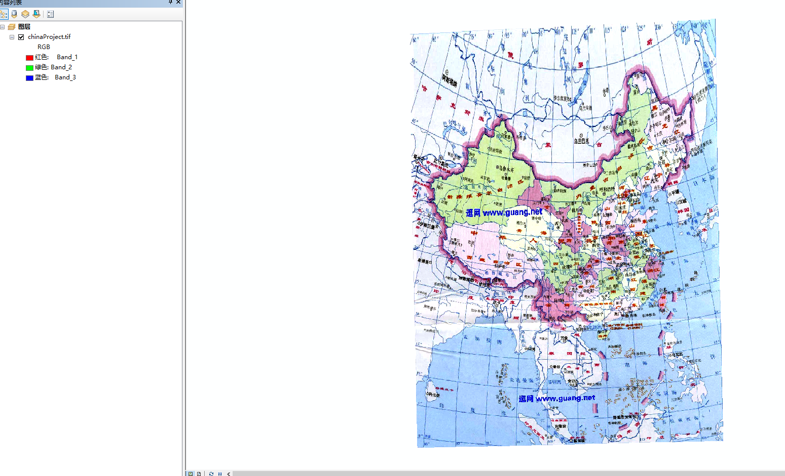

### 2、点击**文件**->**共享为**->**服务**：

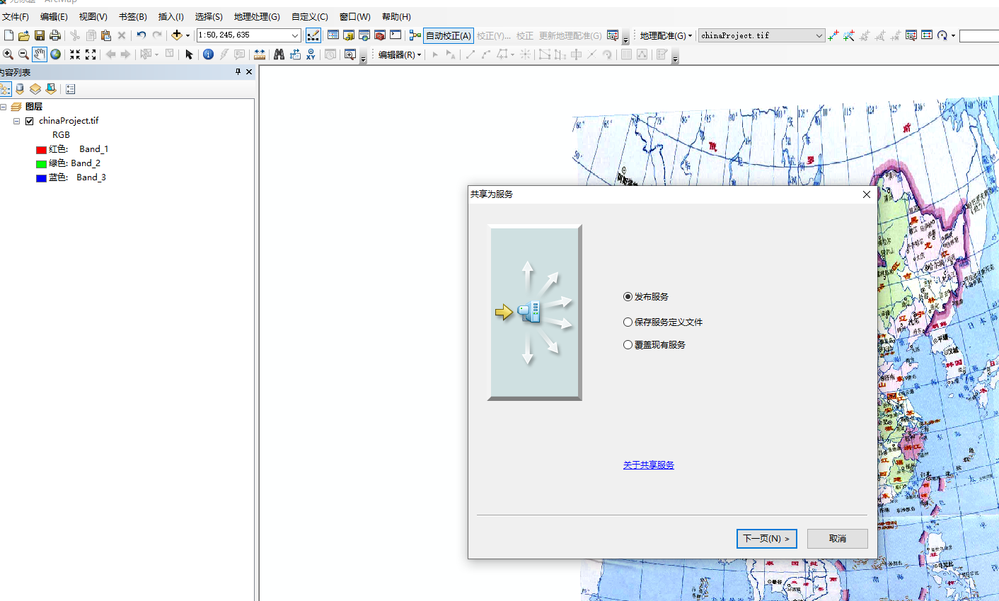

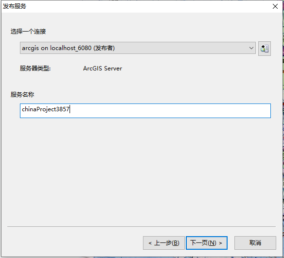

### 3、服务发布至文件夹，选择现有的或者创建新的，这里默认


### 4、在**服务编辑窗口**选择**缓存**，在**缓存窗口**选择**使用缓存中的切片**，设定切片方案的最大层级与最小层级（最好使用推荐的配置）：

选择使用缓存中的切片，切片方案选择`Arcgis Online... `，切片等级可行调整，这里我调整为3-9，最后点击计算缓存大小，启动后发布即可。

:bulb: 具体的切片方式详见GeoserverWMTS

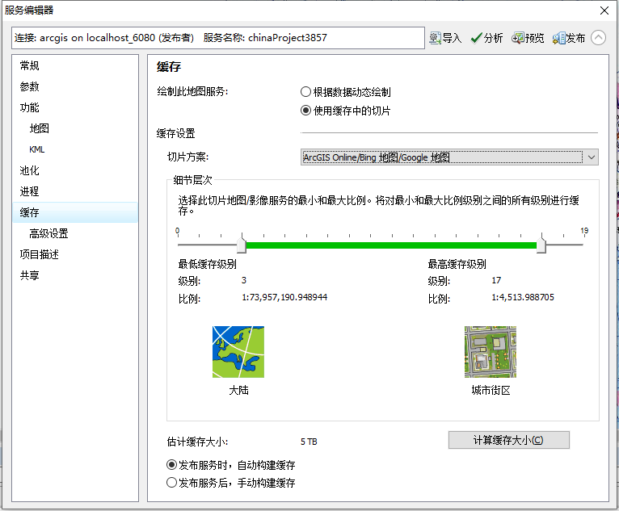

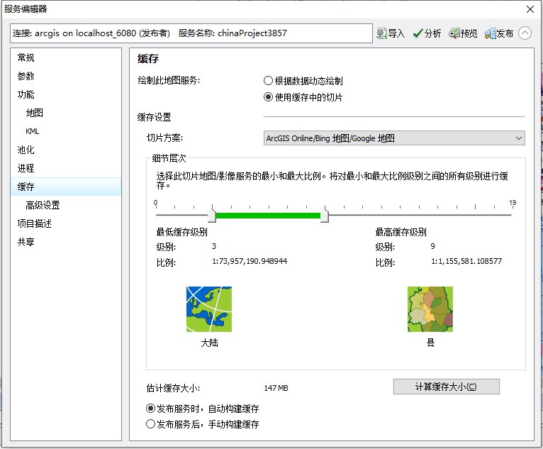

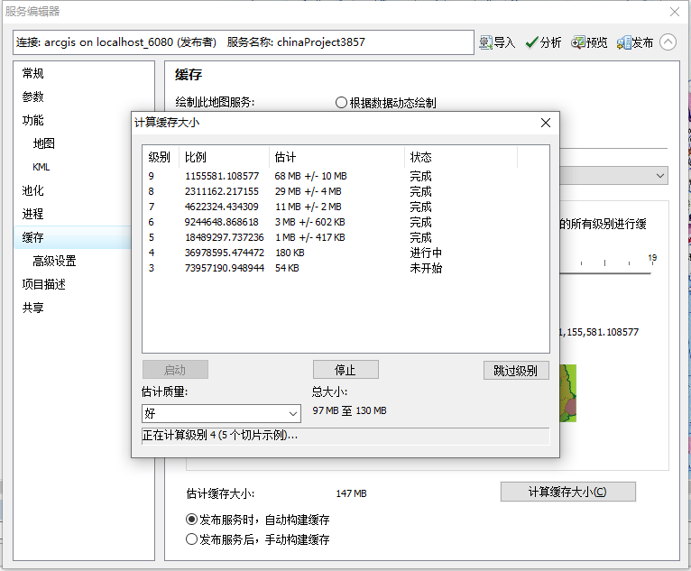

### 5、arcgis server查看效果

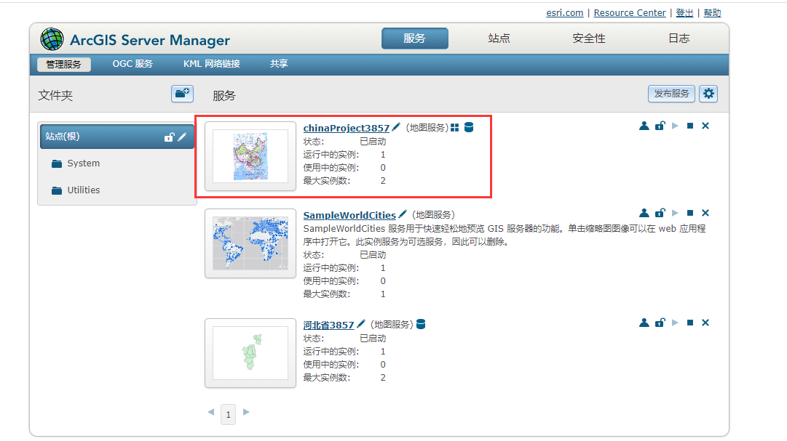

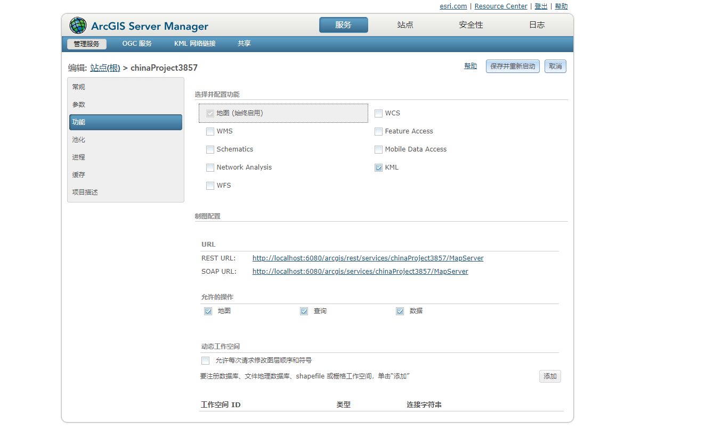

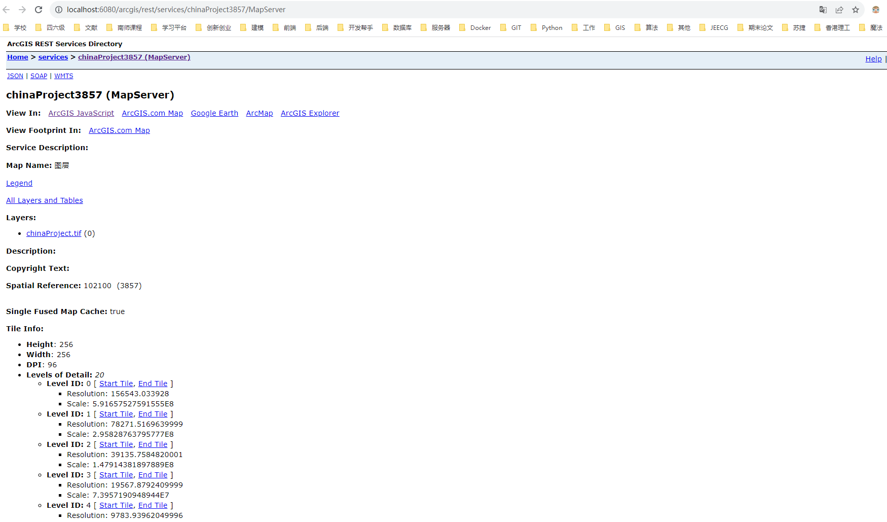

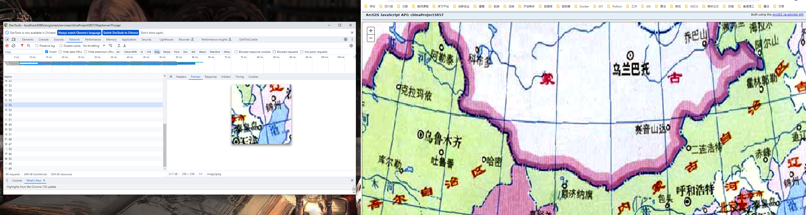

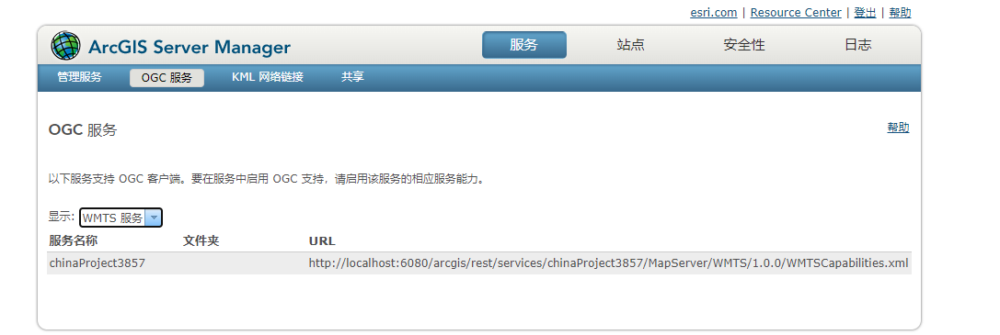

`http://localhost:6080/arcgis/rest/services/chinaProject3857/MapServer/WMTS/1.0.0/WMTSCapabilities.xml`

```xml
<Capabilities xmlns="http://www.opengis.net/wmts/1.0" xmlns:ows="http://www.opengis.net/ows/1.1" xmlns:xlink="http://www.w3.org/1999/xlink" xmlns:xsi="http://www.w3.org/2001/XMLSchema-instance" xmlns:gml="http://www.opengis.net/gml" xsi:schemaLocation="http://www.opengis.net/wmts/1.0 http://schemas.opengis.net/wmts/1.0/wmtsGetCapabilities_response.xsd" version="1.0.0">
<!--  Service Identification  -->
<ows:ServiceIdentification>
<ows:Title>chinaProject3857</ows:Title>
<ows:ServiceType>OGC WMTS</ows:ServiceType>
<ows:ServiceTypeVersion>1.0.0</ows:ServiceTypeVersion>
</ows:ServiceIdentification>
<!--  Operations Metadata  -->
<ows:OperationsMetadata>
<ows:Operation name="GetCapabilities">
<ows:DCP>
<ows:HTTP>
<ows:Get xlink:href="http://localhost:6080/arcgis/rest/services/chinaProject3857/MapServer/WMTS/1.0.0/WMTSCapabilities.xml">
<ows:Constraint name="GetEncoding">
<ows:AllowedValues>
<ows:Value>RESTful</ows:Value>
</ows:AllowedValues>
</ows:Constraint>
</ows:Get>
<!--  add KVP binding in 10.1  -->
<ows:Get xlink:href="http://localhost:6080/arcgis/rest/services/chinaProject3857/MapServer/WMTS?">
<ows:Constraint name="GetEncoding">
<ows:AllowedValues>
<ows:Value>KVP</ows:Value>
</ows:AllowedValues>
</ows:Constraint>
</ows:Get>
</ows:HTTP>
</ows:DCP>
</ows:Operation>
<ows:Operation name="GetTile">
<ows:DCP>
<ows:HTTP>
<ows:Get xlink:href="http://localhost:6080/arcgis/rest/services/chinaProject3857/MapServer/WMTS/tile/1.0.0/">
<ows:Constraint name="GetEncoding">
<ows:AllowedValues>
<ows:Value>RESTful</ows:Value>
</ows:AllowedValues>
</ows:Constraint>
</ows:Get>
<ows:Get xlink:href="http://localhost:6080/arcgis/rest/services/chinaProject3857/MapServer/WMTS?">
<ows:Constraint name="GetEncoding">
<ows:AllowedValues>
<ows:Value>KVP</ows:Value>
</ows:AllowedValues>
</ows:Constraint>
</ows:Get>
</ows:HTTP>
</ows:DCP>
</ows:Operation>
</ows:OperationsMetadata>
<Contents>
<!-- Layer -->
<Layer>
<ows:Title>chinaProject3857</ows:Title>
<ows:Identifier>chinaProject3857</ows:Identifier>
<ows:BoundingBox crs="urn:ogc:def:crs:EPSG::3857">
<ows:LowerCorner>7399799.993986716 -2155338.650924592</ows:LowerCorner>
<ows:UpperCorner>1.5642148534618216E7 9184766.300709203</ows:UpperCorner>
</ows:BoundingBox>
<ows:WGS84BoundingBox crs="urn:ogc:def:crs:OGC:2:84">
<ows:LowerCorner>66.4735343402581 -19.00342069748582</ows:LowerCorner>
<ows:UpperCorner>140.51581105115318 63.34264747798527</ows:UpperCorner>
</ows:WGS84BoundingBox>
<Style isDefault="true">
<ows:Title>Default Style</ows:Title>
<ows:Identifier>default</ows:Identifier>
</Style>
<Format>image/jpgpng</Format>
<TileMatrixSetLink>
<TileMatrixSet>default028mm</TileMatrixSet>
</TileMatrixSetLink>
<TileMatrixSetLink>
<!-- Only show this TileMatrixSet if the tiling scheme is compliant to Google Maps (and that happens with tile width = 256 px) -->
<TileMatrixSet>GoogleMapsCompatible</TileMatrixSet>
</TileMatrixSetLink>
<ResourceURL format="image/jpgpng" resourceType="tile" template="http://localhost:6080/arcgis/rest/services/chinaProject3857/MapServer/WMTS/tile/1.0.0/chinaProject3857/{Style}/{TileMatrixSet}/{TileMatrix}/{TileRow}/{TileCol}"/>
</Layer>
<!-- TileMatrixSet -->
<TileMatrixSet>
<ows:Title>TileMatrix using 0.28mm</ows:Title>
<ows:Abstract>The tile matrix set that has scale values calculated based on the dpi defined by OGC specification (dpi assumes 0.28mm as the physical distance of a pixel).</ows:Abstract>
<ows:Identifier>default028mm</ows:Identifier>
<ows:SupportedCRS>urn:ogc:def:crs:EPSG::3857</ows:SupportedCRS>
<TileMatrix>
<ows:Identifier>0</ows:Identifier>
<ScaleDenominator>5.59082264028501E8</ScaleDenominator>
<TopLeftCorner>-2.0037508342787E7 2.0037508342787E7</TopLeftCorner>
<TileWidth>256</TileWidth>
<TileHeight>256</TileHeight>
<MatrixWidth>1</MatrixWidth>
<MatrixHeight>1</MatrixHeight>
</TileMatrix>
<TileMatrix>
<ows:Identifier>1</ows:Identifier>
<ScaleDenominator>2.7954113201425016E8</ScaleDenominator>
<TopLeftCorner>-2.0037508342787E7 2.0037508342787E7</TopLeftCorner>
<TileWidth>256</TileWidth>
<TileHeight>256</TileHeight>
<MatrixWidth>2</MatrixWidth>
<MatrixHeight>2</MatrixHeight>
</TileMatrix>
<TileMatrix>
<ows:Identifier>2</ows:Identifier>
<ScaleDenominator>1.3977056600712565E8</ScaleDenominator>
<TopLeftCorner>-2.0037508342787E7 2.0037508342787E7</TopLeftCorner>
<TileWidth>256</TileWidth>
<TileHeight>256</TileHeight>
<MatrixWidth>4</MatrixWidth>
<MatrixHeight>3</MatrixHeight>
</TileMatrix>
<TileMatrix>
<ows:Identifier>3</ows:Identifier>
<ScaleDenominator>6.988528300356229E7</ScaleDenominator>
<TopLeftCorner>-2.0037508342787E7 2.0037508342787E7</TopLeftCorner>
<TileWidth>256</TileWidth>
<TileHeight>256</TileHeight>
<MatrixWidth>8</MatrixWidth>
<MatrixHeight>5</MatrixHeight>
</TileMatrix>
<TileMatrix>
<ows:Identifier>4</ows:Identifier>
<ScaleDenominator>3.494264150178117E7</ScaleDenominator>
<TopLeftCorner>-2.0037508342787E7 2.0037508342787E7</TopLeftCorner>
<TileWidth>256</TileWidth>
<TileHeight>256</TileHeight>
<MatrixWidth>15</MatrixWidth>
<MatrixHeight>9</MatrixHeight>
</TileMatrix>
<TileMatrix>
<ows:Identifier>5</ows:Identifier>
<ScaleDenominator>1.7471320750890587E7</ScaleDenominator>
<TopLeftCorner>-2.0037508342787E7 2.0037508342787E7</TopLeftCorner>
<TileWidth>256</TileWidth>
<TileHeight>256</TileHeight>
<MatrixWidth>29</MatrixWidth>
<MatrixHeight>18</MatrixHeight>
</TileMatrix>
<TileMatrix>
<ows:Identifier>6</ows:Identifier>
<ScaleDenominator>8735660.375445293</ScaleDenominator>
<TopLeftCorner>-2.0037508342787E7 2.0037508342787E7</TopLeftCorner>
<TileWidth>256</TileWidth>
<TileHeight>256</TileHeight>
<MatrixWidth>57</MatrixWidth>
<MatrixHeight>36</MatrixHeight>
</TileMatrix>
<TileMatrix>
<ows:Identifier>7</ows:Identifier>
<ScaleDenominator>4367830.187722629</ScaleDenominator>
<TopLeftCorner>-2.0037508342787E7 2.0037508342787E7</TopLeftCorner>
<TileWidth>256</TileWidth>
<TileHeight>256</TileHeight>
<MatrixWidth>114</MatrixWidth>
<MatrixHeight>71</MatrixHeight>
</TileMatrix>
<TileMatrix>
<ows:Identifier>8</ows:Identifier>
<ScaleDenominator>2183915.093861797</ScaleDenominator>
<TopLeftCorner>-2.0037508342787E7 2.0037508342787E7</TopLeftCorner>
<TileWidth>256</TileWidth>
<TileHeight>256</TileHeight>
<MatrixWidth>228</MatrixWidth>
<MatrixHeight>142</MatrixHeight>
</TileMatrix>
<TileMatrix>
<ows:Identifier>9</ows:Identifier>
<ScaleDenominator>1091957.546930427</ScaleDenominator>
<TopLeftCorner>-2.0037508342787E7 2.0037508342787E7</TopLeftCorner>
<TileWidth>256</TileWidth>
<TileHeight>256</TileHeight>
<MatrixWidth>456</MatrixWidth>
<MatrixHeight>284</MatrixHeight>
</TileMatrix>
<TileMatrix>
<ows:Identifier>10</ows:Identifier>
<ScaleDenominator>545978.773465685</ScaleDenominator>
<TopLeftCorner>-2.0037508342787E7 2.0037508342787E7</TopLeftCorner>
<TileWidth>256</TileWidth>
<TileHeight>256</TileHeight>
<MatrixWidth>912</MatrixWidth>
<MatrixHeight>568</MatrixHeight>
</TileMatrix>
<TileMatrix>
<ows:Identifier>11</ows:Identifier>
<ScaleDenominator>272989.38673236995</ScaleDenominator>
<TopLeftCorner>-2.0037508342787E7 2.0037508342787E7</TopLeftCorner>
<TileWidth>256</TileWidth>
<TileHeight>256</TileHeight>
<MatrixWidth>1824</MatrixWidth>
<MatrixHeight>1135</MatrixHeight>
</TileMatrix>
<TileMatrix>
<ows:Identifier>12</ows:Identifier>
<ScaleDenominator>136494.69336618498</ScaleDenominator>
<TopLeftCorner>-2.0037508342787E7 2.0037508342787E7</TopLeftCorner>
<TileWidth>256</TileWidth>
<TileHeight>256</TileHeight>
<MatrixWidth>3647</MatrixWidth>
<MatrixHeight>2269</MatrixHeight>
</TileMatrix>
<TileMatrix>
<ows:Identifier>13</ows:Identifier>
<ScaleDenominator>68247.34668309249</ScaleDenominator>
<TopLeftCorner>-2.0037508342787E7 2.0037508342787E7</TopLeftCorner>
<TileWidth>256</TileWidth>
<TileHeight>256</TileHeight>
<MatrixWidth>7294</MatrixWidth>
<MatrixHeight>4537</MatrixHeight>
</TileMatrix>
<TileMatrix>
<ows:Identifier>14</ows:Identifier>
<ScaleDenominator>34123.673341546244</ScaleDenominator>
<TopLeftCorner>-2.0037508342787E7 2.0037508342787E7</TopLeftCorner>
<TileWidth>256</TileWidth>
<TileHeight>256</TileHeight>
<MatrixWidth>14588</MatrixWidth>
<MatrixHeight>9074</MatrixHeight>
</TileMatrix>
<TileMatrix>
<ows:Identifier>15</ows:Identifier>
<ScaleDenominator>17061.836671245605</ScaleDenominator>
<TopLeftCorner>-2.0037508342787E7 2.0037508342787E7</TopLeftCorner>
<TileWidth>256</TileWidth>
<TileHeight>256</TileHeight>
<MatrixWidth>29175</MatrixWidth>
<MatrixHeight>18147</MatrixHeight>
</TileMatrix>
<TileMatrix>
<ows:Identifier>16</ows:Identifier>
<ScaleDenominator>8530.918335622784</ScaleDenominator>
<TopLeftCorner>-2.0037508342787E7 2.0037508342787E7</TopLeftCorner>
<TileWidth>256</TileWidth>
<TileHeight>256</TileHeight>
<MatrixWidth>58349</MatrixWidth>
<MatrixHeight>36293</MatrixHeight>
</TileMatrix>
<TileMatrix>
<ows:Identifier>17</ows:Identifier>
<ScaleDenominator>4265.459167338928</ScaleDenominator>
<TopLeftCorner>-2.0037508342787E7 2.0037508342787E7</TopLeftCorner>
<TileWidth>256</TileWidth>
<TileHeight>256</TileHeight>
<MatrixWidth>116697</MatrixWidth>
<MatrixHeight>72586</MatrixHeight>
</TileMatrix>
<TileMatrix>
<ows:Identifier>18</ows:Identifier>
<ScaleDenominator>2132.7295841419354</ScaleDenominator>
<TopLeftCorner>-2.0037508342787E7 2.0037508342787E7</TopLeftCorner>
<TileWidth>256</TileWidth>
<TileHeight>256</TileHeight>
<MatrixWidth>233393</MatrixWidth>
<MatrixHeight>145171</MatrixHeight>
</TileMatrix>
<TileMatrix>
<ows:Identifier>19</ows:Identifier>
<ScaleDenominator>1066.364791598498</ScaleDenominator>
<TopLeftCorner>-2.0037508342787E7 2.0037508342787E7</TopLeftCorner>
<TileWidth>256</TileWidth>
<TileHeight>256</TileHeight>
<MatrixWidth>466785</MatrixWidth>
<MatrixHeight>290342</MatrixHeight>
</TileMatrix>
</TileMatrixSet>
<TileMatrixSet>
<ows:Title>GoogleMapsCompatible</ows:Title>
<ows:Abstract>the wellknown 'GoogleMapsCompatible' tile matrix set defined by OGC WMTS specification</ows:Abstract>
<ows:Identifier>GoogleMapsCompatible</ows:Identifier>
<ows:SupportedCRS>urn:ogc:def:crs:EPSG:6.18.3:3857</ows:SupportedCRS>
<WellKnownScaleSet>urn:ogc:def:wkss:OGC:1.0:GoogleMapsCompatible</WellKnownScaleSet>
<TileMatrix>
<ows:Identifier>0</ows:Identifier>
<ScaleDenominator>559082264.0287178</ScaleDenominator>
<TopLeftCorner>-20037508.34278925 20037508.34278925</TopLeftCorner>
<TileWidth>256</TileWidth>
<TileHeight>256</TileHeight>
<MatrixWidth>1</MatrixWidth>
<MatrixHeight>1</MatrixHeight>
</TileMatrix>
<TileMatrix>
<ows:Identifier>1</ows:Identifier>
<ScaleDenominator>279541132.0143589</ScaleDenominator>
<TopLeftCorner>-20037508.34278925 20037508.34278925</TopLeftCorner>
<TileWidth>256</TileWidth>
<TileHeight>256</TileHeight>
<MatrixWidth>2</MatrixWidth>
<MatrixHeight>2</MatrixHeight>
</TileMatrix>
<TileMatrix>
<ows:Identifier>2</ows:Identifier>
<ScaleDenominator>139770566.0071794</ScaleDenominator>
<TopLeftCorner>-20037508.34278925 20037508.34278925</TopLeftCorner>
<TileWidth>256</TileWidth>
<TileHeight>256</TileHeight>
<MatrixWidth>4</MatrixWidth>
<MatrixHeight>4</MatrixHeight>
</TileMatrix>
<TileMatrix>
<ows:Identifier>3</ows:Identifier>
<ScaleDenominator>69885283.00358972</ScaleDenominator>
<TopLeftCorner>-20037508.34278925 20037508.34278925</TopLeftCorner>
<TileWidth>256</TileWidth>
<TileHeight>256</TileHeight>
<MatrixWidth>8</MatrixWidth>
<MatrixHeight>8</MatrixHeight>
</TileMatrix>
<TileMatrix>
<ows:Identifier>4</ows:Identifier>
<ScaleDenominator>34942641.50179486</ScaleDenominator>
<TopLeftCorner>-20037508.34278925 20037508.34278925</TopLeftCorner>
<TileWidth>256</TileWidth>
<TileHeight>256</TileHeight>
<MatrixWidth>16</MatrixWidth>
<MatrixHeight>16</MatrixHeight>
</TileMatrix>
<TileMatrix>
<ows:Identifier>5</ows:Identifier>
<ScaleDenominator>17471320.75089743</ScaleDenominator>
<TopLeftCorner>-20037508.34278925 20037508.34278925</TopLeftCorner>
<TileWidth>256</TileWidth>
<TileHeight>256</TileHeight>
<MatrixWidth>32</MatrixWidth>
<MatrixHeight>32</MatrixHeight>
</TileMatrix>
<TileMatrix>
<ows:Identifier>6</ows:Identifier>
<ScaleDenominator>8735660.375448715</ScaleDenominator>
<TopLeftCorner>-20037508.34278925 20037508.34278925</TopLeftCorner>
<TileWidth>256</TileWidth>
<TileHeight>256</TileHeight>
<MatrixWidth>64</MatrixWidth>
<MatrixHeight>64</MatrixHeight>
</TileMatrix>
<TileMatrix>
<ows:Identifier>7</ows:Identifier>
<ScaleDenominator>4367830.187724357</ScaleDenominator>
<TopLeftCorner>-20037508.34278925 20037508.34278925</TopLeftCorner>
<TileWidth>256</TileWidth>
<TileHeight>256</TileHeight>
<MatrixWidth>128</MatrixWidth>
<MatrixHeight>128</MatrixHeight>
</TileMatrix>
<TileMatrix>
<ows:Identifier>8</ows:Identifier>
<ScaleDenominator>2183915.093862179</ScaleDenominator>
<TopLeftCorner>-20037508.34278925 20037508.34278925</TopLeftCorner>
<TileWidth>256</TileWidth>
<TileHeight>256</TileHeight>
<MatrixWidth>256</MatrixWidth>
<MatrixHeight>256</MatrixHeight>
</TileMatrix>
<TileMatrix>
<ows:Identifier>9</ows:Identifier>
<ScaleDenominator>1091957.546931089</ScaleDenominator>
<TopLeftCorner>-20037508.34278925 20037508.34278925</TopLeftCorner>
<TileWidth>256</TileWidth>
<TileHeight>256</TileHeight>
<MatrixWidth>512</MatrixWidth>
<MatrixHeight>512</MatrixHeight>
</TileMatrix>
<TileMatrix>
<ows:Identifier>10</ows:Identifier>
<ScaleDenominator>545978.7734655447</ScaleDenominator>
<TopLeftCorner>-20037508.34278925 20037508.34278925</TopLeftCorner>
<TileWidth>256</TileWidth>
<TileHeight>256</TileHeight>
<MatrixWidth>1024</MatrixWidth>
<MatrixHeight>1024</MatrixHeight>
</TileMatrix>
<TileMatrix>
<ows:Identifier>11</ows:Identifier>
<ScaleDenominator>272989.3867327723</ScaleDenominator>
<TopLeftCorner>-20037508.34278925 20037508.34278925</TopLeftCorner>
<TileWidth>256</TileWidth>
<TileHeight>256</TileHeight>
<MatrixWidth>2048</MatrixWidth>
<MatrixHeight>2048</MatrixHeight>
</TileMatrix>
<TileMatrix>
<ows:Identifier>12</ows:Identifier>
<ScaleDenominator>136494.6933663862</ScaleDenominator>
<TopLeftCorner>-20037508.34278925 20037508.34278925</TopLeftCorner>
<TileWidth>256</TileWidth>
<TileHeight>256</TileHeight>
<MatrixWidth>4096</MatrixWidth>
<MatrixHeight>4096</MatrixHeight>
</TileMatrix>
<TileMatrix>
<ows:Identifier>13</ows:Identifier>
<ScaleDenominator>68247.34668319309</ScaleDenominator>
<TopLeftCorner>-20037508.34278925 20037508.34278925</TopLeftCorner>
<TileWidth>256</TileWidth>
<TileHeight>256</TileHeight>
<MatrixWidth>8192</MatrixWidth>
<MatrixHeight>8192</MatrixHeight>
</TileMatrix>
<TileMatrix>
<ows:Identifier>14</ows:Identifier>
<ScaleDenominator>34123.67334159654</ScaleDenominator>
<TopLeftCorner>-20037508.34278925 20037508.34278925</TopLeftCorner>
<TileWidth>256</TileWidth>
<TileHeight>256</TileHeight>
<MatrixWidth>16384</MatrixWidth>
<MatrixHeight>16384</MatrixHeight>
</TileMatrix>
<TileMatrix>
<ows:Identifier>15</ows:Identifier>
<ScaleDenominator>17061.83667079827</ScaleDenominator>
<TopLeftCorner>-20037508.34278925 20037508.34278925</TopLeftCorner>
<TileWidth>256</TileWidth>
<TileHeight>256</TileHeight>
<MatrixWidth>32768</MatrixWidth>
<MatrixHeight>32768</MatrixHeight>
</TileMatrix>
<TileMatrix>
<ows:Identifier>16</ows:Identifier>
<ScaleDenominator>8530.918335399136</ScaleDenominator>
<TopLeftCorner>-20037508.34278925 20037508.34278925</TopLeftCorner>
<TileWidth>256</TileWidth>
<TileHeight>256</TileHeight>
<MatrixWidth>65536</MatrixWidth>
<MatrixHeight>65536</MatrixHeight>
</TileMatrix>
<TileMatrix>
<ows:Identifier>17</ows:Identifier>
<ScaleDenominator>4265.459167699568</ScaleDenominator>
<TopLeftCorner>-20037508.34278925 20037508.34278925</TopLeftCorner>
<TileWidth>256</TileWidth>
<TileHeight>256</TileHeight>
<MatrixWidth>131072</MatrixWidth>
<MatrixHeight>131072</MatrixHeight>
</TileMatrix>
<TileMatrix>
<ows:Identifier>18</ows:Identifier>
<ScaleDenominator>2132.729583849784</ScaleDenominator>
<TopLeftCorner>-20037508.34278925 20037508.34278925</TopLeftCorner>
<TileWidth>256</TileWidth>
<TileHeight>256</TileHeight>
<MatrixWidth>262144</MatrixWidth>
<MatrixHeight>262144</MatrixHeight>
</TileMatrix>
</TileMatrixSet>
</Contents>
<ServiceMetadataURL xlink:href="http://localhost:6080/arcgis/rest/services/chinaProject3857/MapServer/WMTS/1.0.0/WMTSCapabilities.xml"/>
</Capabilities>
```

:bulb: 补充上述xml文档标签解释（chatgpt3.5）

```shell
这是一个XML文档，用于描述一个WMTS（Web Map Tile Service）服务的能力（Capabilities）。下面是每行代码的解释：

1. `<Capabilities xmlns="http://www.opengis.net/wmts/1.0" xmlns:ows="http://www.opengis.net/ows/1.1" xmlns:xlink="http://www.w3.org/1999/xlink" xmlns:xsi="http://www.w3.org/2001/XMLSchema-instance" xmlns:gml="http://www.opengis.net/gml" xsi:schemaLocation="http://www.opengis.net/wmts/1.0 http://schemas.opengis.net/wmts/1.0/wmtsGetCapabilities_response.xsd" version="1.0.0">` - 这是XML文档的根元素，定义了命名空间和XML文档的版本。  #wos ->  "Open Web Services",用于描述有关地理信息服务的元数据、操作和标识等信息。

2. `<ows:ServiceIdentification>` - 这是WMTS服务的身份信息部分，包含有关服务的一般信息。

3. `<ows:Title>chinaProject3857</ows:Title>` - 服务的标题，描述服务的名称。

4. `<ows:ServiceType>OGC WMTS</ows:ServiceType>` - 服务的类型，这里是OGC WMTS。

5. `<ows:ServiceTypeVersion>1.0.0</ows:ServiceTypeVersion>` - 服务的类型版本，这里是1.0.0。

6. `<ows:OperationsMetadata>` - 这是关于服务操作的元数据部分，定义了可以执行的操作。

7. `<ows:Operation name="GetCapabilities">` - 描述了一个名为"GetCapabilities"的操作。

8. `<ows:DCP>` - 描述了操作的协议绑定。  #DCP -> "Distribution and Communication Protocols"，用于描述和定义地理信息服务的分发和通信协议。DCP 包括了各种通信协议的定义，例如 HTTP、HTTPS、SOAP 等，以便客户端可以与地理信息服务进行通信和数据分发。

9. `<ows:HTTP>` - 描述了HTTP协议。

10. `<ows:Get xlink:href="http://localhost:6080/arcgis/rest/services/chinaProject3857/MapServer/WMTS/1.0.0/WMTSCapabilities.xml">` - 描述了一个HTTP GET请求，其中包括了GetCapabilities文档的URL。

11. `<ows:Constraint name="GetEncoding">` - 定义了Get请求的编码方式。

12. `<ows:Value>RESTful</ows:Value>` - 允许的编码方式，这里是"RESTful"。

13. `<ows:TileMatrixSetLink>` - 描述了瓦片矩阵集的链接，指定了可用的瓦片矩阵集。

14. `<TileMatrixSet>default028mm</TileMatrixSet>` - 描述了一个瓦片矩阵集，其中包含了标识符和支持的坐标参考系统（CRS）。

15. `<TileMatrix>` - 描述了瓦片矩阵，包括标识符、比例尺分母、左上角坐标、瓦片大小等信息。

16. `<ResourceURL format="image/jpgpng" resourceType="tile" template="http://localhost:6080/arcgis/rest/services/chinaProject3857/MapServer/WMTS/tile/1.0.0/chinaProject3857/{Style}/{TileMatrixSet}/{TileMatrix}/{TileRow}/{TileCol}"/>` - 描述了瓦片资源的URL模板，用于获取瓦片。

17. `<ServiceMetadataURL xlink:href="http://localhost:6080/arcgis/rest/services/chinaProject3857/MapServer/WMTS/1.0.0/WMTSCapabilities.xml"/>` - 描述了服务元数据的URL，用于获取更多关于服务的信息。

这个XML文档提供了有关WMTS服务的能力信息，包括服务的身份、支持的操作、瓦片矩阵集和瓦片资源的信息。这些信息对于客户端应用程序了解和使用WMTS服务非常重要。
```

:bulb: 补充arcgis切片后的图层缓存位置 arcgis server 的directories>arcgiscache>chinaProject3857>图层>_alllayers

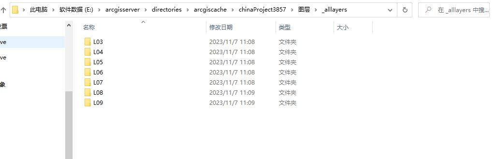

:star: 这里要说明一下切片的数据格式有两种，上图中为紧凑方式

- COMPACT（紧凑格式：bundle）
- EXPLODED（稀疏格式：png）

