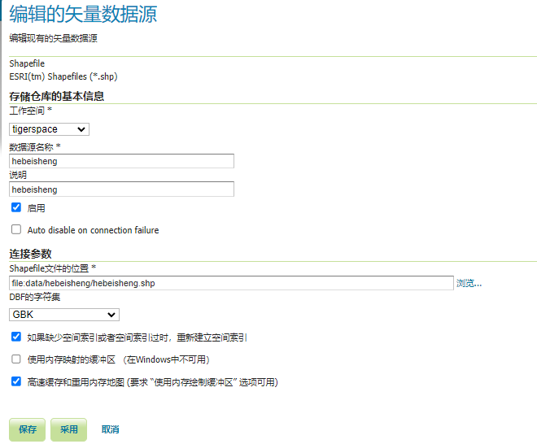
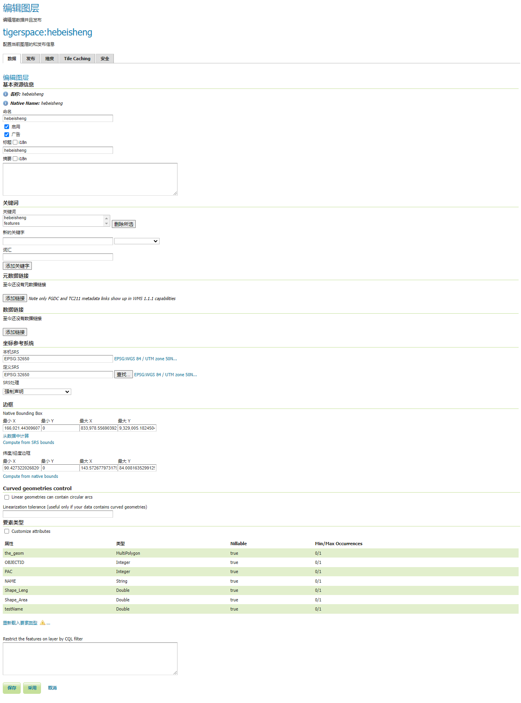
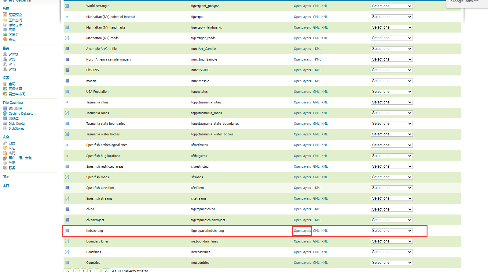
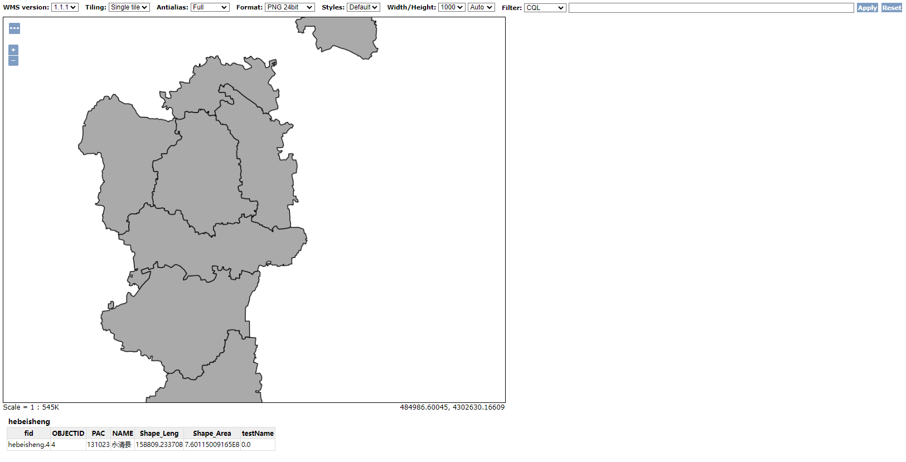
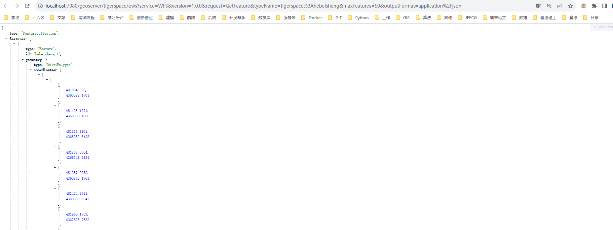
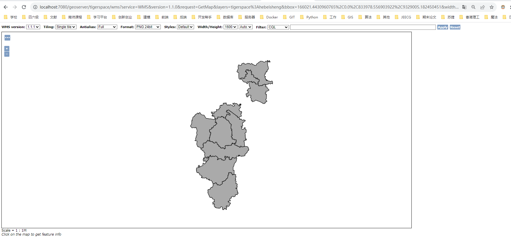

# Geoserver 发布WFS

> 数据准备：河北省3857
>
> 链接：https://pan.baidu.com/s/1CJZykoMUpANCZWKPTg2kyw 
> 提取码：uqti

## 一、创建工作空间

- 命名自定义
  - `tigerspace`
- 命名空间URI 自定义
  - `http://localhost:7080/geoserver/tigerspace`


:bulb: 设置完成后返回工作空间，勾选需要的服务，这里默认将四个服务全部勾选


## 二、创建存储仓库

1. 选择矢量数据源下的Shapefile

2. 选择对应的工作空间，设置数据源名称 和 说明，连接参数处设置对应shp

   :bulb: 如果内部有中文，将对应DBF字符集设置为GBK的编码格式




## 三、发布图层

大部分参数默认即可，注意以下几处

- `坐标参考系统`：更改为默认shp的坐标系（默认情况下Geoserver会自动读取shp的坐标系），之后SRS处理设置为强制声明
- `边框`：根据需求指定
  - Native Bounding Box
    - 从数据中计算：选取数据本身的上下左右做边界
    - compute from SRS bounds：把整个对应坐标系的边界作为边界
  - 纬度/经度边框
    - compute from native bounds：把整个对应坐标系的边界作为边界

最后保存即可。



## 四、图层预览

返回图层预览，找到hebeisheng图层，点击OpenLayers查看





:bulb: 当然也有其他的预览方式，根据需求自选即可

```
http://localhost:7080/geoserver/tigerspace/ows?service=WFS&version=1.0.0&request=GetFeature&typeName=tigerspace%3Ahebeisheng&maxFeatures=50&outputFormat=application%2Fjson
```



```
http://localhost:7080/geoserver/tigerspace/wms?service=WMS&version=1.1.0&request=GetMap&layers=tigerspace%3Ahebeisheng&bbox=166021.4430960765%2C0.0%2C833978.556903922%2C9329005.182450451&width=330&height=768&srs=EPSG%3A32650&styles=&format=application/openlayers#toggle
```

