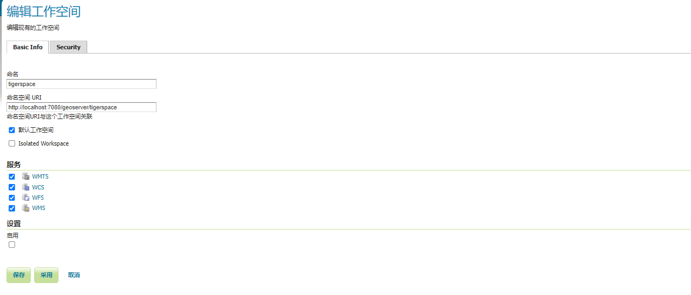
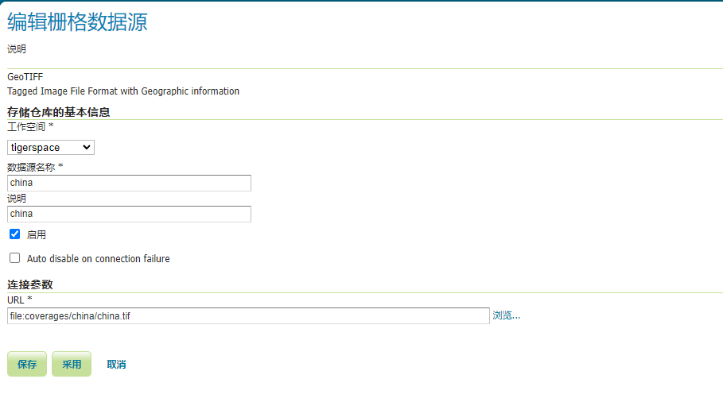
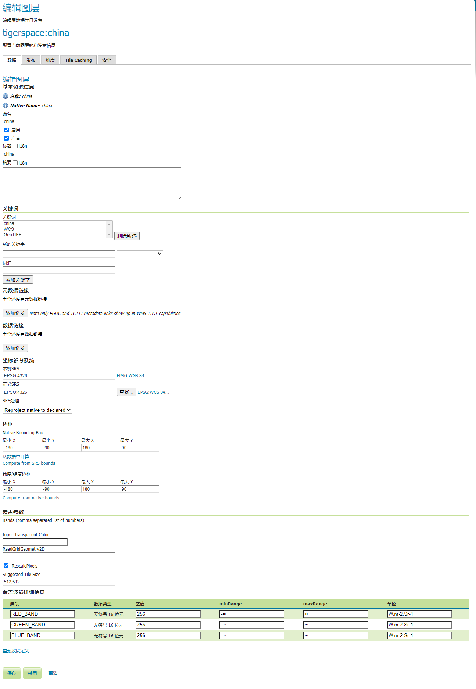
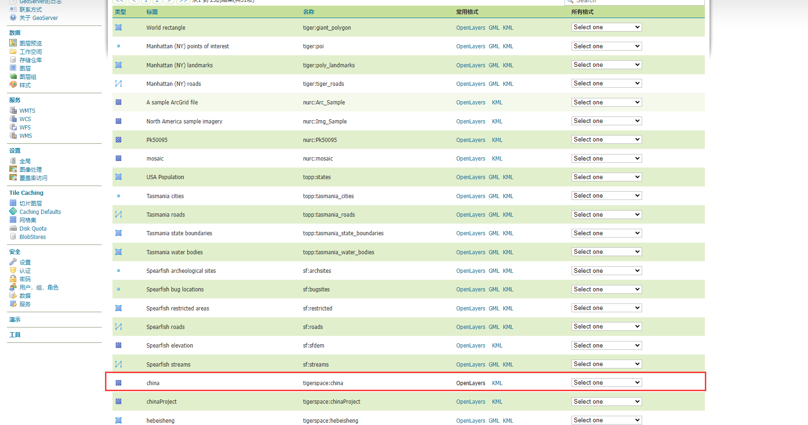
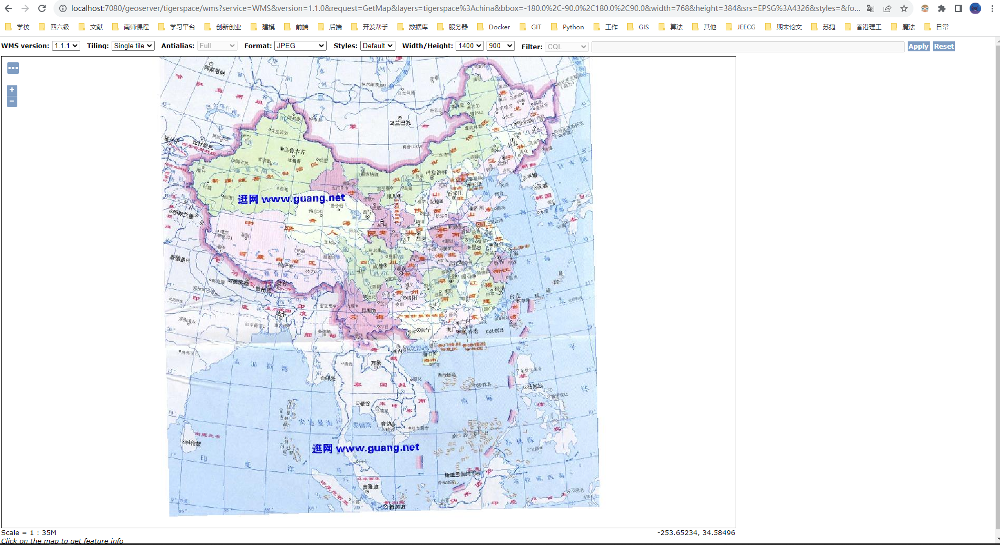

# Geoserver 发布WMS

> 数据准备：china4326
>
> 链接：https://pan.baidu.com/s/1ZuBd_TqS7w3vVe3pmYRxnA 
> 提取码：uaj2

## 一、创建工作空间

- 命名自定义
  - `tigerspace`
- 命名空间URI 自定义
  - `http://localhost:7080/geoserver/tigerspace`

:bulb: 设置完成后返回工作空间，勾选需要的服务，这里默认将四个服务全部勾选

## 二、创建存储仓库

1. 选择栅格数据集下的GeoTiff（视情况而定）
2. 数据源名称 和 说明自定义
3. 连接参数找到对应影像位置即可

## 三、发布图层

大部分参数默认即可，注意以下几处

- `坐标参考系统`：更改为默认shp的坐标系（默认情况下Geoserver会自动读取shp的坐标系），之后SRS处理设置为强制声明
- `边框`：根据需求指定
  - Native Bounding Box
    - 从数据中计算：选取数据本身的上下左右做边界
    - compute from SRS bounds：把整个对应坐标系的边界作为边界
  - 纬度/经度边框
    - compute from native bounds：把整个对应坐标系的边界作为边界

最后保存即可。

最后点击保存即可

## 四、图层预览

返回图层预览，找到hebeisheng图层，点击OpenLayers查看

