# Geoserver 发布WMTS

> 数据准备：china3857
>
> 链接：https://pan.baidu.com/s/1r6qrMjJ5m-_5b94_nPVHFA 
> 提取码：4kp4

## 一、创建工作空间

- 命名自定义
  - `tigerspace`
- 命名空间URI 自定义
  - `http://localhost:7080/geoserver/tigerspace`

:bulb: 设置完成后返回工作空间，勾选需要的服务，这里默认将四个服务全部勾选

## 二、创建存储仓库

1. 选择栅格数据集下的GeoTiff（视情况而定）
2. 数据源名称 和 说明自定义
3. 连接参数找到对应影像位置即可

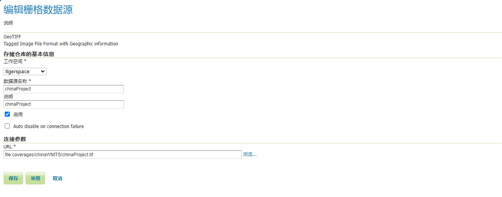

## 三、创建网格集 或者 用已有的切片方案

- 找到网格集，添加新网格集（如有需要）

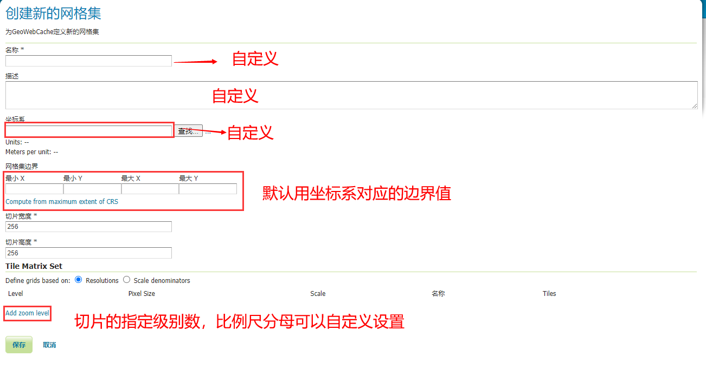

- 不需要的话用已有的切片网格集即可

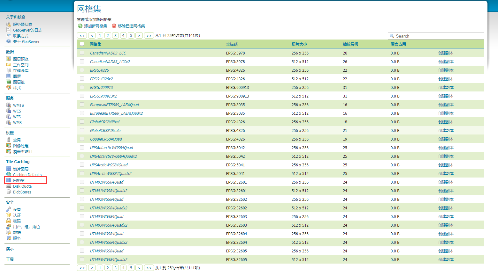

## 四、对影像进行切片

- 找到切片图层，选择对应的切片图层，点击Seed/Truncate

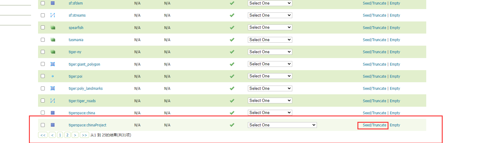

- 设置切片参数，其中大部分参数不用修改，注意以下几个即可
  - Type of operation
    - Seed - generate missing tiles 默认选项，会自动生成缺失的瓦片，适合全部生成 和 缺失的瓦片 :+1: 
  - Zoom start
    - 最小级别数
  - Zoom stop
    - 最大级别数

设置完成后，最后点击最下方的Submit即可

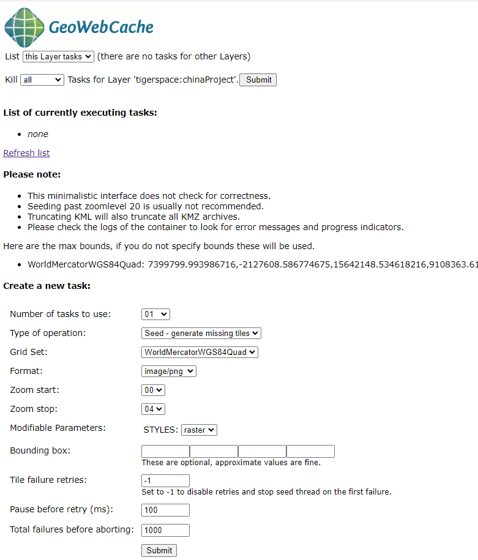

查看切好的瓦片

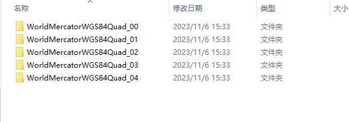

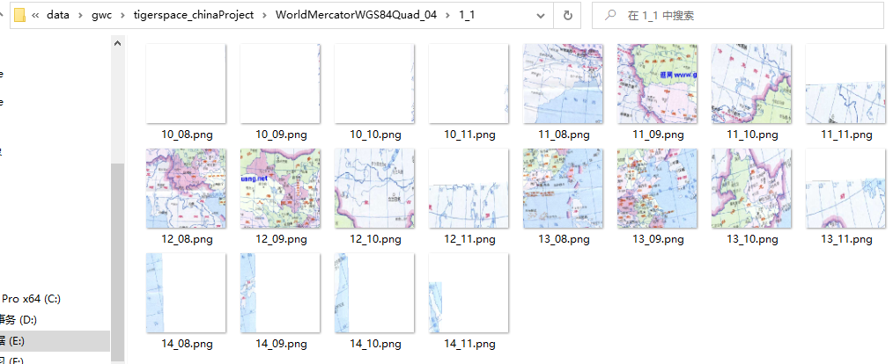

:bulb: 补充切片方案

geoserver采用的osgeo的切片方案

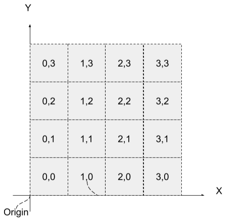

补充其他，如*Google、Open Street Maps、ESRI* 使用的另一套切片方案

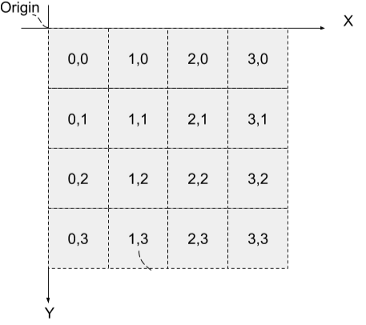

## 五、发布图层

找到刚才的仓库图层，大部分参数默认即可，注意以下几处

- `坐标参考系统`：更改为默认shp的坐标系（默认情况下Geoserver会自动读取shp的坐标系），之后SRS处理设置为强制声明
- `边框`：根据需求指定
  - Native Bounding Box
    - 从数据中计算：选取数据本身的上下左右做边界
    - compute from SRS bounds：把整个对应坐标系的边界作为边界
  - 纬度/经度边框
    - compute from native bounds：把整个对应坐标系的边界作为边界
- Tile Caching
  - 这里采用Geoserver自带的网格集切片方案，WorldMercatorWGS84Quad

最后保存即可。

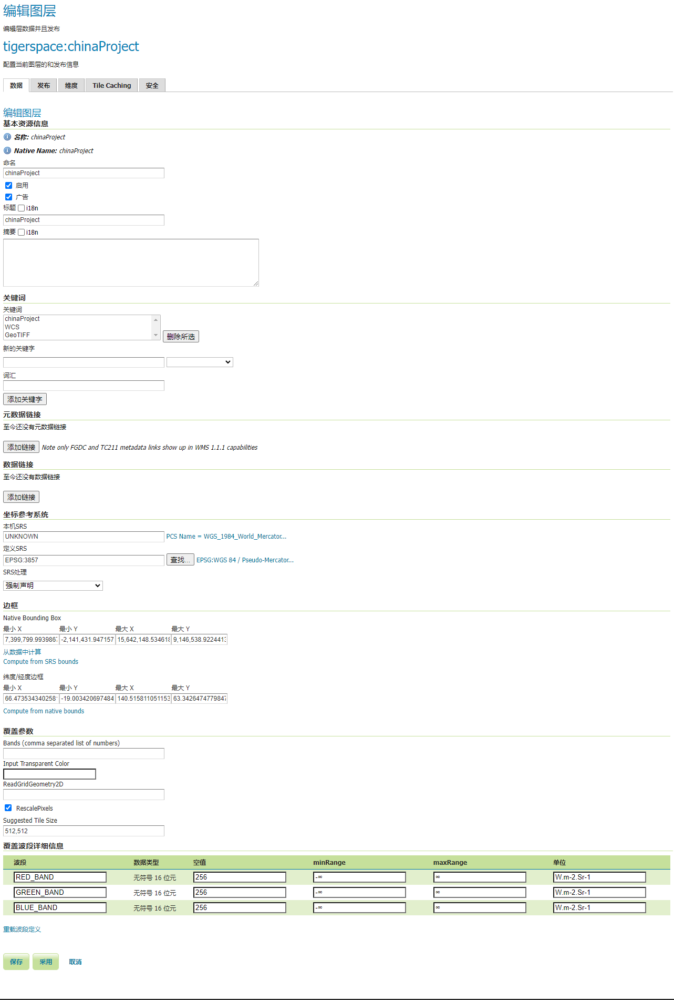

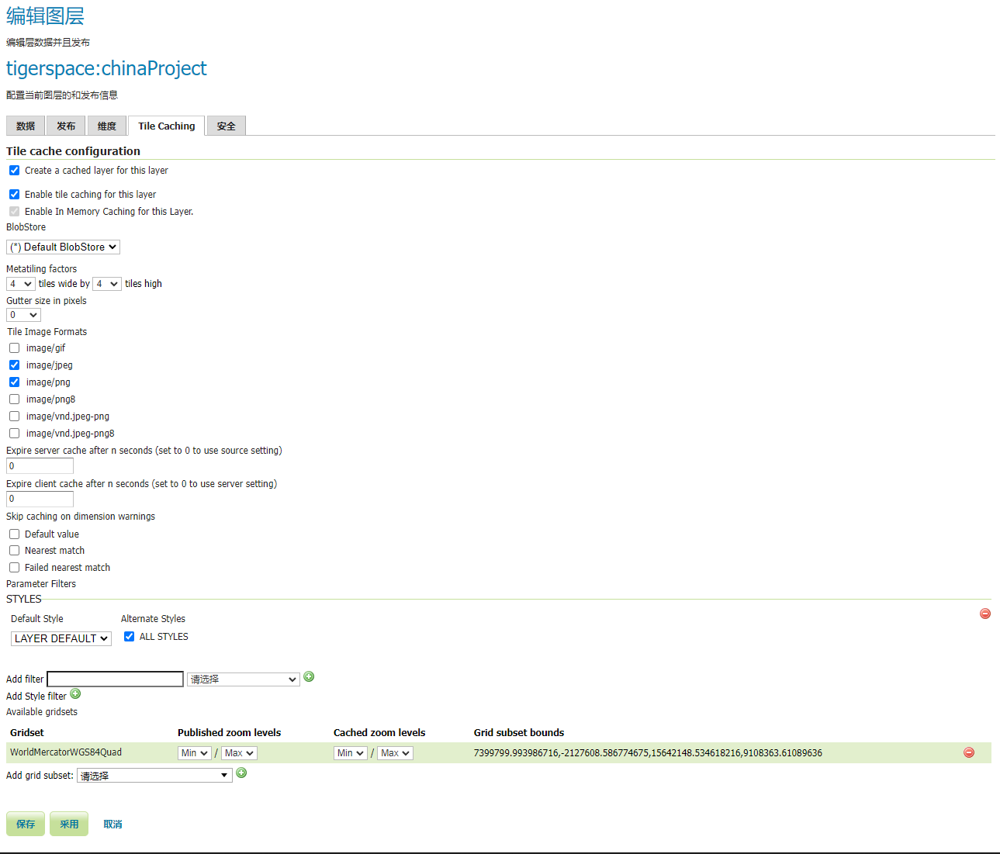

## 六、图层预览

​	-	找到切片图层，选择 jpeg 或者 png查看即可

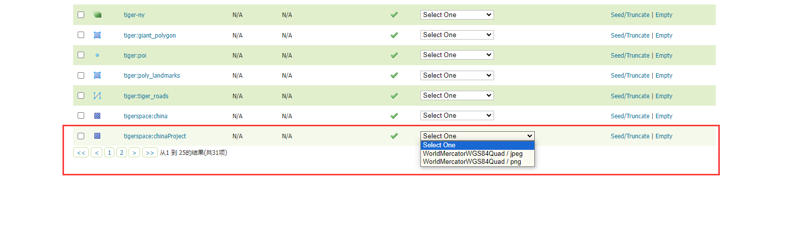

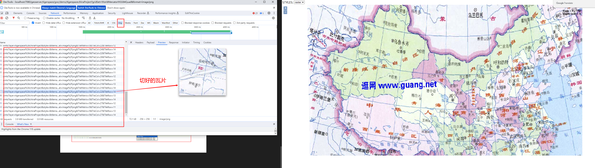
