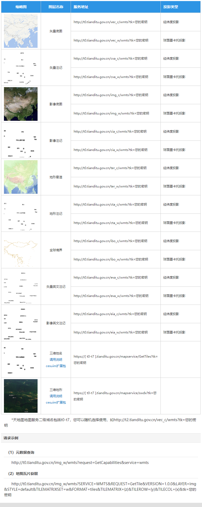
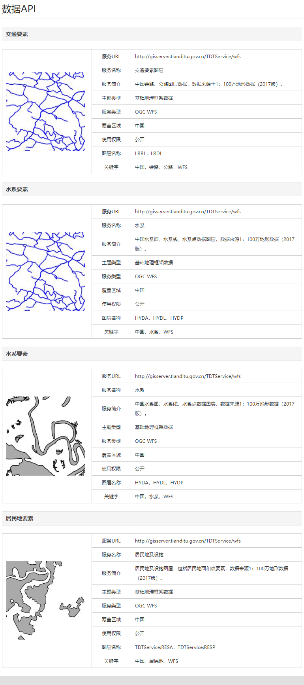

# 天地图

## 一、地图API

http://lbs.tianditu.gov.cn/server/MapService.html

有对应的地图服务列表，这些在线地图




## 二、网页API

http://lbs.tianditu.gov.cn/api/js4.0/guide.html

类似Cesium、arcgis api for js等，直接创建对象后调用内部方法即可。

```html
<!DOCTYPE html>
<html>
<head>
    <meta charset="UTF-8"/>
    <title>HELLO WORLD</title>
    <script type="text/javascript" src="http://api.tianditu.gov.cn/api?v=4.0&tk=您的密钥"></script>
    <script>
        var map;
        var zoom = 12;
        function onLoad() {
            map = new T.Map('mapDiv');
            map.centerAndZoom(new T.LngLat(116.40769, 39.89945), zoom);
        }
    </script>
</head>
<body onLoad="onLoad()">
<div id="mapDiv" style="position:absolute;width:500px; height:400px"></div>
</body>
</html>
```


## 三、WEB服务API

http://lbs.tianditu.gov.cn/server/guide.html

天地图Web服务API为用户提供HTTP/HTTPS接口，即开发者可以通过这些接口使用各类型的地理信息数据服务，可以基于此开发跨平台的地理信息应用。

:star: 调用这些常见的在线方法


## 四、数据API

http://lbs.tianditu.gov.cn/data/dataapi.html

符合OGC标准服务的一些在线图层


