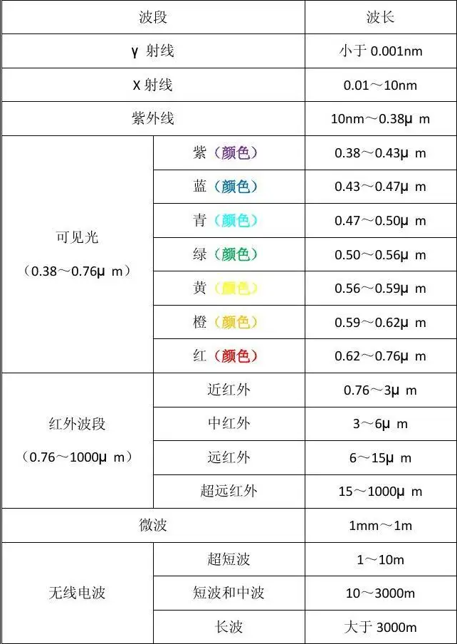

# 遥感原理

## 一、遥感基本概念

### 广义

一切无接触的远距离探测，包括对电磁场、力场、机械波（声波、地震波）等的探测。

### 狭义

应用探测仪器，不与探测目标相接触，从远处把目标的电磁波特性记录下来，通过分析，揭示出物体的特征性质及变化的综合性探测技术。

## 二、电磁波谱和电磁辐射

### 电磁波谱

电磁波谱：按照电磁波在真空中传播的波长或频率，递增或递减排列，则构成了电磁波谱

### 电磁辐射的度量

任何物体都是辐射源，不仅能够吸收其他物体的辐射，也能够向外辐射

辐射能量（单位 J ）

- 辐射通量：单位时间内通过某一面积的辐射能量
- 辐射通量密度：单位时间内通过物体单位面积上的辐射通量
- 辐照度：被辐射的物体表面单位面积上的辐射通量
- 辐射出射度：辐射源物体表面单位面积上的辐射通量
- 辐射亮度：略

## 三、遥感图像的特征

### 空间分辨率

指像素所代表的地面范围的大小，或地面物体能分辨的最小单元

### 波谱分辨率

指传感器在接收目标辐射时能分辨的最小波长间隔，间隔越小，分辨率越高

### 辐射分辨率

指传感器接收波谱信号时，能分辨的最小辐射度差，在遥感图像上表现为每一像元的辐射量化级

### 时间分辨率

指对同一地点进行遥感采样的时间间隔，即采样的时间频率，也称重访周期

## 四、遥感图像处理

### 辐射校正

进入传感器的辐射强度反映在图像上就是亮度值（灰度值）。辐射强度越大，则亮度越亮。该值主要受两个物理量影响：`太阳辐射照射到地面的辐射强度` + `地物的光谱反射率`。

- 当太阳辐射相同时，图像上像元亮度值的差异直接反映了地物目标光谱反射率的差异。
- 但实际测量时，还受到其他影响，即需要校正的部分（需要辐射校正的辐射畸变因素）

引起辐射畸变的因素：

- 传感器仪器本身产生的误差
- 大气对辐射的影响  （又称大气校正）

### 几何校正

当遥感图像在几何位置上发生了变化，产生行列不均匀，像元大小与地面大小对应不准确，地物形状不规则变化等畸变时，则说明遥感影像发生了几何畸变。

引起几何畸变的因素：

- 遥感平台位置和运动状态变化的影响
- 地形起伏的影响
- 地球表面曲率的影响
- 大气折射的影响
- 地球自转的影响

