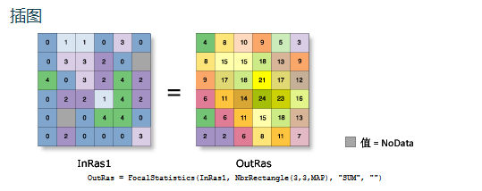

# 影像处理 

> 针对栅格像素点的常用计算方法	
>
> arcMap中为spitial analyst > 邻域分析 > 焦点统计

## 一、中值滤波 或 均值滤波等

为每个输入像元位置计算其周围指定邻域内的值的统计数据。

| 参数                   | 说明                                                         | 数据类型     |
| ---------------------- | ------------------------------------------------------------ | ------------ |
| in_raster              | 要执行焦点统计计算的栅格。                                   | Raster Layer |
| neighborhood (可选)    | [邻域](JavaScript:IDA45DLB.Click())类表示用于计算统计数据的各像元周围区域的形状。 可用的不同类型的邻域包括  [NbrAnnulus](JavaScript:IDAQAELB.Click())、 [NbrCircle](JavaScript:IDA1AELB.Click())、 [NbrRectangle](JavaScript:IDAGBELB.Click())、 [NbrWedge](JavaScript:IDARBELB.Click())、 [NbrIrregular](JavaScript:IDA2BELB.Click()) 和  [NbrWeight](JavaScript:IDAHCELB.Click())。 以下为邻域的形式： NbrAnnulus({innerRadius}, {outerRadius}, {CELL \| MAP})  NbrCircle({radius}, {CELL \| MAP}  NbrRectangle({width}, {height}, {CELL \| MAP})  NbrWedge({radius}, {start_angle}, {end_angle}, {CELL \|  MAP})  NbrIrregular(kernel_file)  NbrWeight(kernel_file) {CELL \|  MAP} 参数可将距离单位定义为“像元”单位或“地图”单位。 默认邻域为宽和高为 3 个像元的正方形 NbrRectangle。 | Neighborhood |
| statistics_type (可选) | 要计算的统计数据类型。  MEAN — 计算邻域内像元的平均值。  MAJORITY — 计算邻域内像元的众数（出现次数最多的值）。  MAXIMUM — 计算邻域内像元的最大值。  MEDIAN — 计算邻域内像元的中值。  MINIMUM — 计算邻域内像元的最小值。  MINORITY — 计算邻域内像元的少数（出现次数最少的值）。  RANGE — 计算邻域内像元的范围（最大值和最小值之差）。  STD — 计算邻域内像元的标准差。  SUM — 计算邻域内像元的总和（所有值的总和）。  VARIETY — 计算邻域内像元的变异度（唯一值的数量）。  默认统计类型为平均值。 | String       |
| ignore_nodata (可选)   | 指示在进行统计计算时是否忽略 NoData 值。  DATA — 可指定如果在邻域内存在 NoData 值，则 NoData  值将被忽略。将仅使用邻域内具有数据值的像元来确定输出值。这是默认设置。  NODATA —可指定如果邻域内任意像元的值都是 NoData，则处理像元的输出将为 NoData。使用此选项时，存在 NoData  值表明确定邻域的统计值所需要的信息不足。 | Boolean      |

## 二、