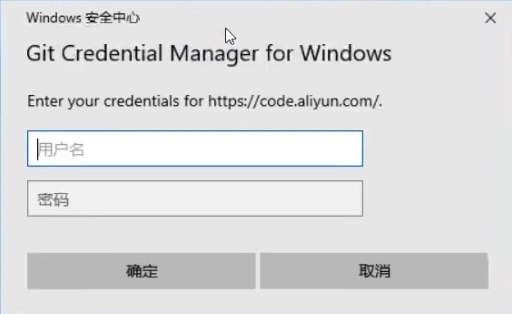
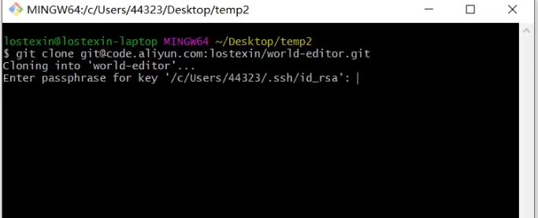
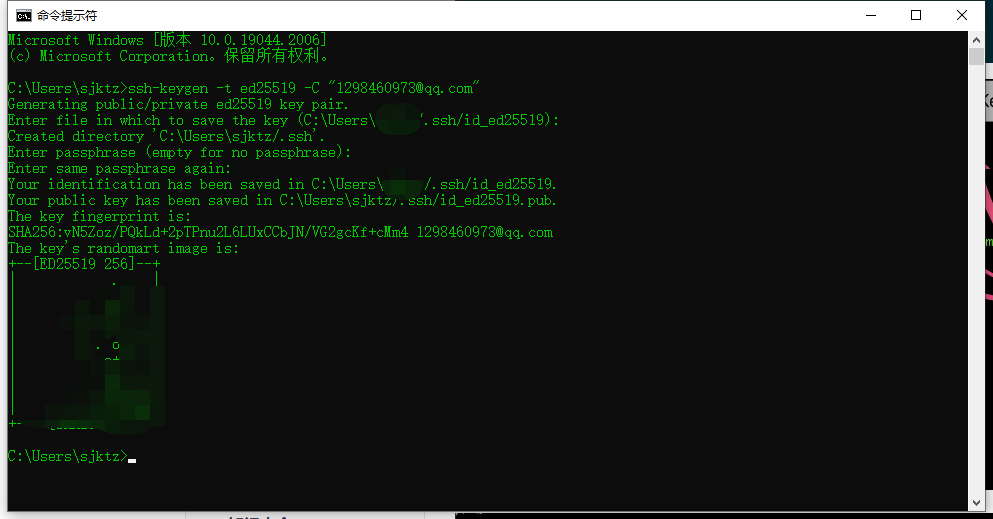
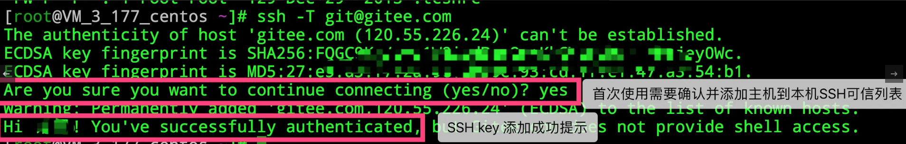

# Git

## http

### 从远程仓库克隆到本地

- git clone https：//xxx.git
  - 第一次登录可能需要登录对应管理仓库的账号密码
  - 

### 合并提交

#### master 到 lsh

```
- 在本地lsh分支写代码，写好后提交到远端lsh分支
  - git add . 、 git commit -m "feat: xx 459965" 、git push origin lsh
- 切换到本地master分支，拉取远端master分支保证本地master最新
  - git checkout main 、git pull origin main
- 切换回本地lsh分支，再分支--合并将master 合并到本地lsh分支
  - git checkout lsh 、git merge master、git push origin lsh
- 在lsh分支继续开发
```

#### lsh 到 master

```
- 同上先将远端最新master拉取到本地master，完成本地master到本地lsh的合并及提交到远端lsh
- 切换到本地master分支，合并本地lsh分支，提交到远端master分支
  - git pull origin master、 git merge lsh、然后同步（连不上多试几次）、如果测试-打包npm run build chore 前端打包（暂存所有更改后提交）、同步git push origin master
```

:bulb: 常用提交说明

- feat(新页面 新功能) 
- fix（bug）
- chore（打包 工具 配置）
- style（css）
- refactor（重构）
- docs（文档更新）
- ci（CI/CD配置）
- revert（回滚）


## ssh(*Secure Shell*)

1. 从远程仓库克隆到本地

   1. git clone xxx.git

      - 这里涉及ssh秘钥，如果之前配置过，会在C/user/.ssh文件夹下有对应的excel表格等，如果想要清除，删除.ssh文件夹即可
      - 这个一般会看对应仓库的地址，如gitee的生成方式  https://gitee.com/help/articles/4181 

      

      

      

   2.  其他克隆 提交 和 更新操作都类似

