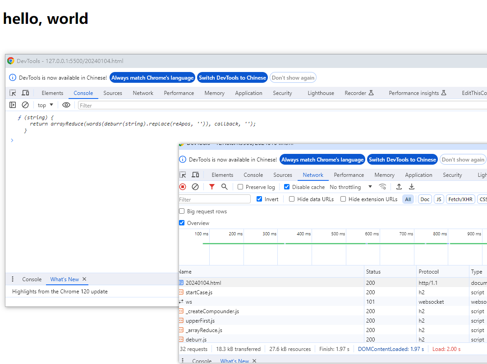
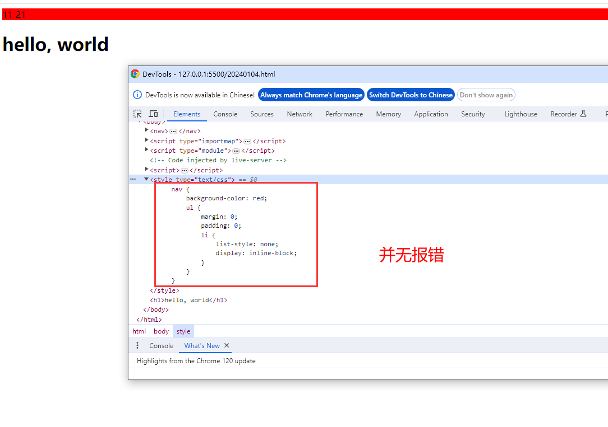

# 2023前端生态 

> 参考引用：https://mp.weixin.qq.com/s/-m36NQCOjGsdykaiaXKT2w

## 一、scrollend

在网页开发过程中，可以通过 `onscroll` 事件来监听浏览器是否发生了滚动，但很难知道滚动何时完成。以前，可能会使用 `setTimeout` 来预估滚动可能在一定时间后完成，但这可能导致回调函数在滚动过程中或滚动结束一段时间后触发，用户体验不佳。


:bulb: `scrollend` 事件会在以下情况触发：浏览器动画结束或滚动完成、用户的触摸被释放、用户的鼠标释放了滚动键、用户的按键被释放、滚动到片段完成、滚动捕捉完成、`scrollTo()` 完成、用户滚动了可视视口。但在用户的手势没有导致任何滚动位置变化或 `scrollTo()` 没有产生任何位置变化的情况下，`scrollend` 事件不会触发。

```typescript
addEventListener("scrollend", (event) => {
  // 滚动结束
});

aScrollingElement.addEventListener("scrollend", (event) => {
  // 滚动结束
});
```


## 二、Import Maps

在常见的模块化系统中，模块导入语句通过 Node.js 运行时或相关构建工具映射到特定（版本）的文件。用户需要在 `import` 语句中直接编写模块说明符（通常是包名），模块就可以自动处理，最后经过`构建步骤(转译如babel，打包，压缩(如删除不必要空格 注释等)，资源优化(减少不必要图像字体等)和环境配置(根据目标换设置不同的API端点及调整日志级别等))`确保这种方式编写的代码可在浏览器中运行。

:bulb: `Import maps` 可以解决这个问题，它可以将模块说明符（包名）自动映射到它的相对或绝对路径。从而让我们不使用构建工具也能使用简洁的模块导入语法。我们可以通过 `HTML` 中的 `<script type="importmap">` 标签来指定一个 `Import maps`。

```typescript
<script type="importmap">
    {
        "imports": {
            "@lodash/startCase": "https://unpkg.com/lodash-es@4.17.21/startCase.js"
        }
    }
</script>
<script type="module">
    import startCase from '@lodash/startCase';
    console.log(startCase)
    const el = document.createElement('h1');
    const words = "hello, world";
    const text = document.createTextNode(words);
    el.appendChild(text);

    document.body.appendChild(el);
</script>
```



:bulb: `Import Mpas` 已经获得了全部三大浏览器引擎（`Blink、Gecko、WebKit`）的支持。

1. **Blink**：Blink 是一个由 Google 开发的浏览器渲染引擎，最初是基于WebKit内核的一个分支，用于Google Chrome和Opera浏览器。
2. **Gecko**：Gecko 是 Mozilla 基金会开发的一个浏览器引擎，用于 Mozilla Firefox 浏览器。
3. **WebKit**：WebKit 是一个开源的浏览器引擎，最初由 Apple 开发，用于 Safari 浏览器。现在也是其他一些浏览器的基础，例如苹果的Safari浏览器（移动和桌面版本的核心）、微软的Edge浏览器（从2020年起使用Chromium作为核心，但早期版本使用的是EdgeHTML，即微软自己的内核）。


## 三、CSS 支持嵌套语法

在原生的 `CSS` 中每个选择器都需要明确地声明，互相独立。这样会导致编写很多重复的样式，可读性以及编写体验都很差，`CSS` 的原生嵌套语法在 `Chrome 112` 版本中正式支持了，支持嵌套的样式规则允许我们将规则嵌套在父选择器中，而不需要重复写父选择器，这样就可以极大简化 `CSS` 的编写，让代码更具有可读性：

```css
nav {
  background-color: red;
  ul {
    margin: 0;
    padding: 0;
    li {
      list-style: none;
      display: inline-block;
    }
  }
}
```




## 四、CSS 支持 @scope 规则

在没有 `@scope` 的情况下，应用的规则是最后声明的样式。使用 `@scope`，可以书写嵌套的样式，并且我们可以根据邻近度来进行样式覆盖：

并且，`@scope` 还可以让我们免于编写又长又复杂的类名，并且可以轻松管理较大的项目并避免命名冲突。

```css
@scope(.first-box){
  .main-content {
   color: grey;
  }
}
@scope(.second-box){
  .main-content {
   color: mediumturquoise;
  }
}
```


