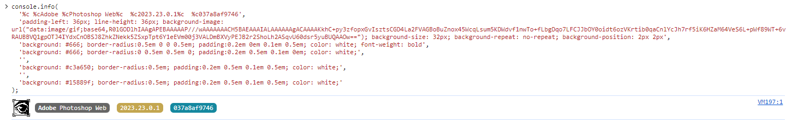
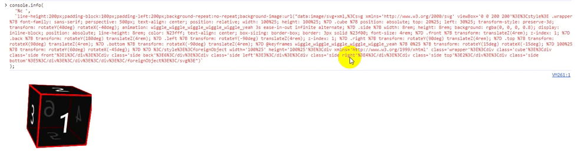
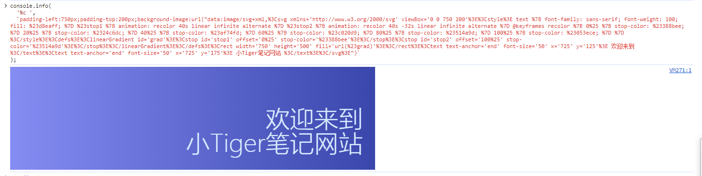

# consoleLog玩法

> https://mp.weixin.qq.com/s/_HY4ot3HhECrAXyD_zEOuw?poc_token=HP9Y3WWjP4VlCSDLStCWVEEUUrALxgWkUqPRf_LF
>
> 控制台不仅可以打印文本和变量，还可渲染 `CSS、SVG` 甚至 `HTML`

## 一、渲染CSS

`console.log` 用于调试目的，而 `console.info` 用于提供更相关于最终用户的信息。在浏览器处理它们的方式上，它们之间唯一的区别是一些样式上的差异。

在控制台中输入如下内容

```typescript
console.info(
  '%c %cAdobe %cPhotoshop Web%c  %c2023.23.0.1%c  %c037a8af9746',
  'padding-left: 36px; line-height: 36px; background-image: url("data:image/gif;base64,R0lGODlhIAAgAPEBAAAAAP///wAAAAAAACH5BAEAAAIALAAAAAAgACAAAAKkhC+py3zfopxGvIsztsCGD4La2FVAGBoBuZnox45WcqLsum5KDWdvf1nwTo+fLbgDqo7LFCJJbOY0oidt6ozVKrtib0qaCnlYcJh7rf5iK6HZaM64VeS6L+pWf89WT+6vRAUBBVQ1gpOTJ4IYdxCnOBSJ8ZhkZNekk5ZSxpTpt6Y1eEVm00j3VALDmBXVyPEJB2r2ShoLh2ASqvU60dsr5yuBUQAAOw=="); background-size: 32px; background-repeat: no-repeat; background-position: 2px 2px',
  'background: #666; border-radius:0.5em 0 0 0.5em; padding:0.2em 0em 0.1em 0.5em; color: white; font-weight: bold',
  'background: #666; border-radius:0 0.5em 0.5em 0; padding:0.2em 0.5em 0.1em 0em; color: white;',
  '',
  'background: #c3a650; border-radius:0.5em; padding:0.2em 0.5em 0.1em 0.5em; color: white;',
  '',
  'background: #15889f; border-radius:0.5em; padding:0.2em 0.5em 0.1em 0.5em; color: white;'
);
```



:bulb: `%c` 后面跟着的字符串对应着每个元素。每个元素都会生成一个具有`display: inline`样式的新元素。`SVG` 以 `data:image` 的形式进行渲染，任何数据图像在这里都可以使用！


## 二、渲染HTML

没办法直接编写 `HTML` 代码，但是可以在 `SVG` 的背景图像中渲染 `HTML`。

`HTML` 内容具有与 `SVG` 本身相同类型的限制，例如不允许使用 `<a>` 标签，不允许使用事件监听器等。

```typescript
console.info(
  '%c ',
  `line-height:200px;padding-block:100px;padding-left:200px;background-repeat:no-repeat;background-image:url("data:image/svg+xml,%3Csvg xmlns='http://www.w3.org/2000/svg' viewBox='0 0 200 200'%3E%3Cstyle%3E .wrapper %7B font-family: sans-serif; perspective: 500px; text-align: center; position: relative; width: 100%25; height: 100%25; %7D .cube %7B position: absolute; top: 20%25; left: 30%25; transform-style: preserve-3d; transform: rotateY(40deg) rotateX(-40deg); animation: wiggle_wiggle_wiggle_wiggle_wiggle_yeah 3s ease-in-out infinite alternate; %7D .side %7B width: 8rem; height: 8rem; background: rgba(0, 0, 0, 0.8); display: inline-block; position: absolute; line-height: 8rem; color: %23fff; text-align: center; box-sizing: border-box; border: 3px solid %23f00; font-size: 4rem; %7D .front %7B transform: translateZ(4rem); z-index: 1; %7D .back %7B transform: rotateY(180deg) translateZ(4rem); %7D .left %7B transform: rotateY(-90deg) translateZ(4rem); z-index: 1; %7D .right %7B transform: rotateY(90deg) translateZ(4rem); %7D .top %7B transform: rotateX(90deg) translateZ(4rem); %7D .bottom %7B transform: rotateX(-90deg) translateZ(4rem); %7D @keyframes wiggle_wiggle_wiggle_wiggle_wiggle_yeah %7B 0%25 %7B transform: rotateY(15deg) rotateX(-15deg); %7D 100%25 %7B transform: rotateY(60deg) rotateX(-45deg); %7D %7D %3C/style%3E%3CforeignObject width='100%25' height='100%25'%3E%3Cdiv xmlns='http://www.w3.org/1999/xhtml' class='wrapper'%3E%3Cdiv class='cube'%3E%3Cdiv class='side front'%3E1%3C/div%3E%3Cdiv class='side back'%3E6%3C/div%3E%3Cdiv class='side left'%3E3%3C/div%3E%3Cdiv class='side right'%3E4%3C/div%3E%3Cdiv class='side top'%3E2%3C/div%3E%3Cdiv class='side bottom'%3E5%3C/div%3E%3C/div%3E%3C/div%3E%3C/foreignObject%3E%3C/svg%3E")`
);
```




## 三、特殊效果

#### 欢迎条幅

为自己的网站增加欢迎条幅

```typescript
console.info(
  '%c ',
  `padding-left:750px;padding-top:200px;background-image:url("data:image/svg+xml,%3Csvg xmlns='http://www.w3.org/2000/svg' viewBox='0 0 750 200'%3E%3Cstyle%3E text %7B font-family: sans-serif; font-weight: 100; fill: %23d8eaff; %7D %23stop1 %7B animation: recolor 40s linear infinite alternate %7D %23stop2 %7B animation: recolor 40s -32s linear infinite alternate %7D @keyframes recolor %7B 0%25 %7B stop-color: %23388bee; %7D 20%25 %7B stop-color: %2324c6dc; %7D 40%25 %7B stop-color: %23af74fd; %7D 60%25 %7B stop-color: %23c020d9; %7D 80%25 %7B stop-color: %23514a9d; %7D 100%25 %7B stop-color: %23053ece; %7D %7D %3C/style%3E%3Cdefs%3E%3ClinearGradient id='grad'%3E%3Cstop id='stop1' offset='0%25' stop-color='%23388bee'%3E%3C/stop%3E%3Cstop id='stop2' offset='100%25' stop-color='%23514a9d'%3E%3C/stop%3E%3C/linearGradient%3E%3C/defs%3E%3Crect width='750' height='500' fill='url(%23grad)'%3E%3C/rect%3E%3Ctext text-anchor='end' font-size='50' x='725' y='125'%3E 欢迎来到 %3C/text%3E%3Ctext text-anchor='end' font-size='50' x='725' y='175'%3E 小Tiger笔记网站 %3C/text%3E%3C/svg%3E")`
);
```




#### 粒子效果

```typescript
console.info(
  '%c ',
  `padding-left:800px;line-height:250px;padding-block:125px;background-repeat:no-repeat;background-image:url("data:image/svg+xml,%3Csvg class='svg-snowscene' viewBox='0 0 800 250' xmlns='http://www.w3.org/2000/svg'%3E%3Cstyle%3E@keyframes snowing%7B0%25%7Bfill-opacity:1%7D100%25%7Bfill-opacity:0;transform:translateY(250px)%7D%7D.svg-snowscene%7Bbackground-color:%239cf;background-image:linear-gradient(%236af,%23bdf)%7Dtext%7Bfill:%23fff;font-family:cursive%7Dcircle%7Bfill:%23fff;animation-name:snowing;animation-iteration-count:infinite;animation-timing-function:ease-out%7Dcircle:nth-child(1n)%7Banimation-delay:-.2s;animation-duration:7s%7Dcircle:nth-child(2n)%7Banimation-delay:-.4s;animation-duration:6s%7Dcircle:nth-child(3n)%7Banimation-delay:-.6s;animation-duration:8s%7Dcircle:nth-child(4n)%7Banimation-delay:-.8s;animation-duration:9s%7Dcircle:nth-child(5n)%7Banimation-delay:-1s;animation-duration:8s%7Dcircle:nth-child(6n)%7Banimation-delay:-1.2s;animation-duration:10s%7Dcircle:nth-child(7n)%7Banimation-delay:-1.4s;animation-duration:10s%7Dcircle:nth-child(8n)%7Banimation-delay:-1.6s;animation-duration:10s%7Dcircle:nth-child(9n)%7Banimation-delay:-1.8s;animation-duration:8s%7Dcircle:nth-child(10n)%7Banimation-delay:-2s;animation-duration:9s%7Dcircle:nth-child(11n)%7Banimation-delay:-2.2s;animation-duration:7s%7Dcircle:nth-child(12n)%7Banimation-delay:-2.4s;animation-duration:8s%7Dcircle:nth-child(13n)%7Banimation-delay:-2.6s;animation-duration:9s%7Dcircle:nth-child(14n)%7Banimation-delay:-2.8s;animation-duration:10s%7Dcircle:nth-child(15n)%7Banimation-delay:-3s;animation-duration:10s%7Dcircle:nth-child(16n)%7Banimation-delay:-3.2s;animation-duration:6s%7Dcircle:nth-child(17n)%7Banimation-delay:-3.4s;animation-duration:7s%7Dcircle:nth-child(18n)%7Banimation-delay:-3.6s;animation-duration:6s%7Dcircle:nth-child(19n)%7Banimation-delay:-3.8s;animation-duration:8s%7Dcircle:nth-child(20n)%7Banimation-delay:-4s;animation-duration:6s%7Dcircle:nth-child(21n)%7Banimation-delay:-4.2s;animation-duration:9s%7Dcircle:nth-child(22n)%7Banimation-delay:-4.4s;animation-duration:9s%7Dcircle:nth-child(23n)%7Banimation-delay:-4.6s;animation-duration:8s%7Dcircle:nth-child(24n)%7Banimation-delay:-4.8s;animation-duration:7s%7Dcircle:nth-child(25n)%7Banimation-delay:-5s;animation-duration:8s%7Dcircle:nth-child(26n)%7Banimation-delay:-5.2s;animation-duration:7s%7Dcircle:nth-child(27n)%7Banimation-delay:-5.4s;animation-duration:6s%7Dcircle:nth-child(28n)%7Banimation-delay:-5.6s;animation-duration:8s%7Dcircle:nth-child(29n)%7Banimation-delay:-5.8s;animation-duration:10s%7Dcircle:nth-child(30n)%7Banimation-delay:-6s;animation-duration:10s%7Dcircle:nth-child(31n)%7Banimation-delay:-6.2s;animation-duration:9s%7Dcircle:nth-child(32n)%7Banimation-delay:-6.4s;animation-duration:10s%7Dcircle:nth-child(33n)%7Banimation-delay:-6.6s;animation-duration:10s%7Dcircle:nth-child(34n)%7Banimation-delay:-6.8s;animation-duration:6s%7Dcircle:nth-child(35n)%7Banimation-delay:-7s;animation-duration:6s%7Dcircle:nth-child(36n)%7Banimation-delay:-7.2s;animation-duration:10s%7Dcircle:nth-child(37n)%7Banimation-delay:-7.4s;animation-duration:7s%7Dcircle:nth-child(38n)%7Banimation-delay:-7.6s;animation-duration:9s%7Dcircle:nth-child(39n)%7Banimation-delay:-7.8s;animation-duration:9s%7Dcircle:nth-child(40n)%7Banimation-delay:-8s;animation-duration:8s%7Dcircle:nth-child(41n)%7Banimation-delay:-8.2s;animation-duration:6s%7Dcircle:nth-child(42n)%7Banimation-delay:-8.4s;animation-duration:10s%7Dcircle:nth-child(43n)%7Banimation-delay:-8.6s;animation-duration:7s%7Dcircle:nth-child(44n)%7Banimation-delay:-8.8s;animation-duration:9s%7Dcircle:nth-child(45n)%7Banimation-delay:-9s;animation-duration:10s%7Dcircle:nth-child(46n)%7Banimation-delay:-9.2s;animation-duration:6s%7Dcircle:nth-child(47n)%7Banimation-delay:-9.4s;animation-duration:7s%7Dcircle:nth-child(48n)%7Banimation-delay:-9.6s;animation-duration:9s%7Dcircle:nth-child(49n)%7Banimation-delay:-9.8s;animation-duration:7s%7Dcircle:nth-child(50n)%7Banimation-delay:-10s;animation-duration:7s%7D%3C/style%3E%3Ctext font-size='80' text-anchor='middle' x='400' y='140'%3E小Tiger笔记网站%3C/text%3E%3Ccircle cx='25.995103990111105%25' cy='-77.81008995571561' r='2.749159658185124'%3E%3C/circle%3E%3Ccircle cx='89.62561554717637%25' cy='-46.78148229694086' r='2.393631489179748'%3E%3C/circle%3E%3Ccircle cx='5.135745159612563%25' cy='-38.81872689180804' r='2.841244102307123'%3E%3C/circle%3E%3Ccircle cx='40.819201884845775%25' cy='-34.58293639476059' r='1.4458270158519961'%3E%3C/circle%3E%3Ccircle cx='26.212971825618283%25' cy='-12.498573576229386' r='2.9709903306827465'%3E%3C/circle%3E%3Ccircle cx='76.68859580291824%25' cy='-62.21926850640058' r='1.1347363710323926'%3E%3C/circle%3E%3Ccircle cx='55.72266234658971%25' cy='-74.73326327616485' r='1.113806305196924'%3E%3C/circle%3E%3Ccircle cx='39.0317830273073%25' cy='-58.703705511039225' r='2.3100083626369976'%3E%3C/circle%3E%3Ccircle cx='89.7176436793289%25' cy='-10.281820667480222' r='2.0469063477660447'%3E%3C/circle%3E%3Ccircle cx='83.96827591096722%25' cy='-81.2478772998329' r='1.790201302779563'%3E%3C/circle%3E%3Ccircle cx='7.260053772750218%25' cy='-96.49215734429552' r='2.3545864333810256'%3E%3C/circle%3E%3Ccircle cx='26.883202292253728%25' cy='-37.108549732420656' r='1.9978674352572674'%3E%3C/circle%3E%3Ccircle cx='58.50316757093038%25' cy='-44.19563368875621' r='2.1333080325968745'%3E%3C/circle%3E%3Ccircle cx='49.153134743170924%25' cy='-96.61192814231214' r='1.0338012128288736'%3E%3C/circle%3E%3Ccircle cx='80.66335728120768%25' cy='-92.60017007342769' r='1.352444421725643'%3E%3C/circle%3E%3Ccircle cx='49.21716180537502%25' cy='-15.736517819787414' r='2.56514014572579'%3E%3C/circle%3E%3Ccircle cx='18.159072047777208%25' cy='-41.662630986758565' r='1.827289622857739'%3E%3C/circle%3E%3Ccircle cx='28.591656766804356%25' cy='-75.40392903873996' r='2.540805639719657'%3E%3C/circle%3E%3Ccircle cx='75.7560667785456%25' cy='-42.093604757726446' r='1.411351114203426'%3E%3C/circle%3E%3Ccircle cx='95.86623136857125%25' cy='-86.17237490881534' r='1.6437772466697007'%3E%3C/circle%3E%3Ccircle cx='66.57358996698223%25' cy='-33.05038635630268' r='1.224578596470813'%3E%3C/circle%3E%3Ccircle cx='37.87486333612133%25' cy='-91.98642442806697' r='1.5164858217037178'%3E%3C/circle%3E%3Ccircle cx='99.9780409949983%25' cy='-85.25670632025145' r='1.093408865757894'%3E%3C/circle%3E%3Ccircle cx='6.258195692333731%25' cy='-82.17612056080935' r='2.5970745236726915'%3E%3C/circle%3E%3Ccircle cx='76.92756548357505%25' cy='-39.05022432020484' r='1.3903120977596086'%3E%3C/circle%3E%3Ccircle cx='35.30776480586916%25' cy='-5.100866152259875' r='2.490933162143621'%3E%3C/circle%3E%3Ccircle cx='21.888577746640067%25' cy='-53.61306945430116' r='1.5911619566776065'%3E%3C/circle%3E%3Ccircle cx='5.408329205067845%25' cy='-25.216367465595514' r='1.7561674911504097'%3E%3C/circle%3E%3Ccircle cx='11.607577654364524%25' cy='-50.29316328357586' r='1.9271574194581076'%3E%3C/circle%3E%3Ccircle cx='80.61508259836967%25' cy='-56.47870637418366' r='2.7379039794681383'%3E%3C/circle%3E%3Ccircle cx='75.29235125946235%25' cy='-24.205675758687455' r='1.7921437262309654'%3E%3C/circle%3E%3Ccircle cx='97.78226376693122%25' cy='-32.21154549976014' r='1.529148319088483'%3E%3C/circle%3E%3Ccircle cx='73.75693711579706%25' cy='-23.004150289082606' r='2.4556699382045046'%3E%3C/circle%3E%3Ccircle cx='41.419838495897%25' cy='-65.31921232448768' r='2.8044281379588676'%3E%3C/circle%3E%3Ccircle cx='40.950298123173106%25' cy='-26.292156289520896' r='2.419680017572999'%3E%3C/circle%3E%3Ccircle cx='47.867691980584716%25' cy='-26.242657523185184' r='1.0923877243334101'%3E%3C/circle%3E%3Ccircle cx='62.81766527782989%25' cy='-89.701930860537' r='1.7949190430635444'%3E%3C/circle%3E%3Ccircle cx='48.69722811509327%25' cy='-10.958255978759077' r='2.861844670749401'%3E%3C/circle%3E%3Ccircle cx='34.57978264890831%25' cy='-1.1612908265357433' r='1.6199043038315515'%3E%3C/circle%3E%3Ccircle cx='37.96738880106298%25' cy='-12.825961059362545' r='2.8559531388340513'%3E%3C/circle%3E%3Ccircle cx='85.46233678220392%25' cy='-88.02351857384527' r='1.0984128042737793'%3E%3C/circle%3E%3Ccircle cx='64.4596084875124%25' cy='-19.803934792180392' r='2.6968494185321026'%3E%3C/circle%3E%3Ccircle cx='56.87846924216383%25' cy='-68.9330339781381' r='2.441322855837859'%3E%3C/circle%3E%3Ccircle cx='87.67115279021654%25' cy='-57.12781963683186' r='1.268498259959995'%3E%3C/circle%3E%3Ccircle cx='87.86909883390128%25' cy='-65.7354110827157' r='1.2941568814088011'%3E%3C/circle%3E%3Ccircle cx='30.16692089861322%25' cy='-34.69868021057453' r='1.082850239075611'%3E%3C/circle%3E%3Ccircle cx='63.21354400809286%25' cy='-48.79787125206968' r='2.6866316912738153'%3E%3C/circle%3E%3Ccircle cx='73.1130164281696%25' cy='-14.128826564618988' r='2.396208563109712'%3E%3C/circle%3E%3Ccircle cx='49.592435166991244%25' cy='-28.576612560341417' r='2.265863084175359'%3E%3C/circle%3E%3Ccircle cx='12.364052530549507%25' cy='-22.31568226585923' r='2.8058073048920886'%3E%3C/circle%3E%3Cscript%3Efunction r(min, max) %7B return Math.random() * (max - min) + min; %7D const s = document.querySelectorAll('circle'); function l() %7B for (let i = 0; i &amp;lt; s.length; i++) %7B let f = s%5Bi%5D; f.setAttribute('cx', r(1, 100) + '%25'); f.setAttribute('cy', '-' + r(1, 100)); f.setAttribute('r', r(1, 3)); %7D %7D l();%3C/script%3E%3C/svg%3E")`
);
```

#### ASCLL的艺术

```typescript
console.log(
  `%c
                  ,d"=≥,.,qOp,
                 ,7'  ''²$(  )
                ,7'      '?q$7'
             ..,$$,.
   ,.  .,,--***²""²***--,,.  .,
 ²   ,p²''              ''²q,   ²
:  ,7'                      '7,  :
 ' $      ,db,      ,db,      $ '
  '$      ²$$²      ²$$²      $'    Using Reddit at work? Work for Reddit.
  '$                          $'      https://www.redditinc.com/careers
   '$.     .,        ,.     .$'
    'b,     '²«»«»«»²'     ,d'
     '²?bn,,          ,,nd?²'
       ,7$ ''²²²²²²²²'' $7,
     ,² ²$              $² ²,
     $  :$              $:  $
     $   $              $   $
     'b  q:            :p  d'
      '²«?$.          .$?»²'
         'b            d'
       ,²²'?,.      .,?'²²,
      ²==--≥²²==--==²²≤--==²
`,
  `font-family: monospace`
);
```


其他参考

```shell
https://stackoverflow.com/q/7798748/2065702
https://codepen.io/lorryc/pen/pjwEJK
https://frontendmasters.com/blog/console-delight/
https://codepen.io/acarlie/pen/eYmqEVB
https://gist.github.com/ZachSaucier/ea8ebf65079febbde4f2f9190ae6644a
https://github.com/david-fong/detect-devtools-via-debugger-heartstop
```

