# jeecgVue3源码学习

> 补：Ant Design Vue Pro：https://pro.loacg.com/docs/getting-started
>
> Vue2 和 Vue3对应的后台都是相同的
>
> **本地192.168.1.X 比 localhost更合适一些，因为同一个局域网里面手机也可以访问到**

## 一、开发环境准备

### 1.基础环境要求(安装略)

#### JDK 1.8+ (小于11)

```shell
#dos窗口
C:\Users\XXX>java -version
java version "1.8.0_341"
Java(TM) SE Runtime Environment (build 1.8.0_341-b10)
Java HotSpot(TM) 64-Bit Server VM (build 25.341-b10, mixed mode)
```

#### Maven 3.5+

```shell
#dos窗口
C:\Users\XXX>mvn -version
Apache Maven 3.8.6 (84538c9988a25aec085021c365c560670ad80f63)
Maven home: D:\maven386\apache-maven-3.8.6
Java version: 1.8.0_341, vendor: Oracle Corporation, runtime: D:\JAVA\JDK\jre
Default locale: zh_CN, platform encoding: GBK
OS name: "windows 10", version: "10.0", arch: "amd64", family: "windows"
```

#### MySql 5.7+

> 方法一：可通过搜索框查找**mysql Command Line** **Clint**，之后输入密码查看mysql版本信息

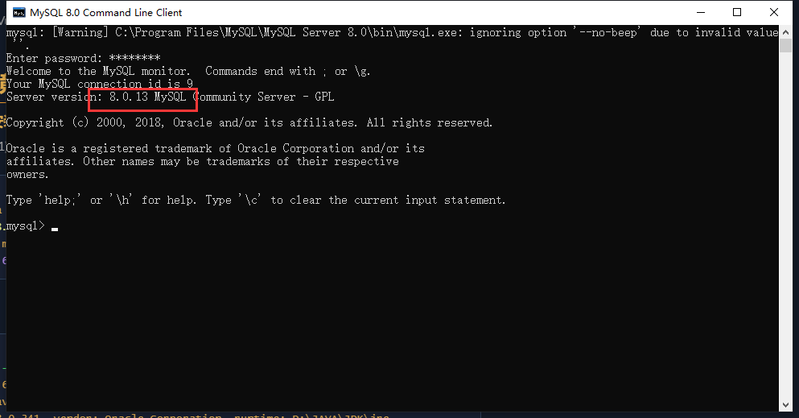

> 方法二：可通过navicat 查看服务器版本

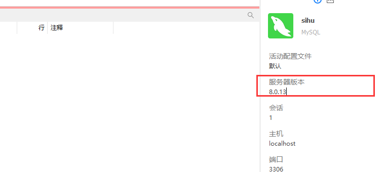

#### Redis 3.2+

1. 打开redis所在目录启动 redis-server 服务器端
2. 启动 redis-cli 客户端
3. 输入 info

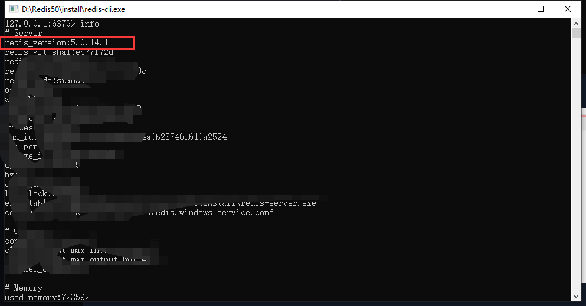

#### Node 10.0+

```shell
C:\Users\sjktz>node -v
v16.17.0
```

#### Npm 5.6.0+

```shell
C:\Users\XXX>npm -v
8.19.1
```

#### Yarn 1.21.1+

```shell
C:\Users\XXX>yarn -v
1.22.19
```

### 2、环境准备

#### 2.1 package.json script命令

```
"scripts": {
  # 安装依赖
  "bootstrap": "yarn install",
  # 运行项目
  "serve": "npm run dev",
  # 运行项目
  "dev": "vite",
  # 构建项目
  "build": "vite build && esno ./build/script/postBuild.ts",
  # 清空缓存后构建项目
  "build:no-cache": "yarn clean:cache && npm run build",
  # 生成打包分析，在 `Mac OS` 电脑上执行完成后会自动打开界面，在 `Window` 电脑上执行完成后需要打开 `./build/.cache/stats.html` 查看
  "report": "cross-env REPORT=true npm run build",
  # 类型检查
  "type:check": "vue-tsc --noEmit --skipLibCheck",
  # 预览打包后的内容（先打包在进行预览）
  "preview": "npm run build && vite preview",
  # 直接预览本地 dist 文件目录
  "preview:dist": "vite preview",
  # 生成 ChangeLog
  "log": "conventional-changelog -p angular -i CHANGELOG.md -s",
  # 删除缓存
  "clean:cache": "rimraf node_modules/.cache/ && rimraf node_modules/.vite",
  # 删除 node_modules (`window` 系统手动删除该目录较慢，可以使用该命令来进行删除)
  "clean:lib": "rimraf node_modules",
  # 执行 eslint 校验，并修复部分问题
  "lint:eslint": "eslint \"{src,mock}/**/*.{vue,ts,tsx}\" --fix",
  # 执行 prettier 格式化（该命令会对项目所有代码进行 prettier 格式化，请谨慎执行）
  "lint:prettier": "prettier --write --loglevel warn \"src/**/*.{js,json,tsx,css,less,scss,vue,html,md}\"",
  # 执行 stylelint 格式化
  "lint:stylelint": "stylelint --fix \"**/*.{vue,less,postcss,css,scss}\" --cache --cache-location node_modules/.cache/stylelint/",
  "lint:lint-staged": "lint-staged -c ./.husky/lintstagedrc.js",
  "lint:pretty": "pretty-quick --staged",
  # 对打包结果进行 gzip 测试
  "test:gzip": "http-server dist --cors --gzip -c-1",
  # 对打包目录进行 brotli 测试
  "test:br": "http-server dist --cors --brotli -c-1",
  # 重新安装依赖，见下方说明
  "reinstall": "rimraf yarn.lock && rimraf package.lock.json && rimraf node_modules && npm run bootstrap",
  "install:husky": "is-ci || husky install",
  # 生成图标集，见下方说明
  "gen:icon": "esno ./build/generate/icon/index.ts",
  "postinstall": "npm run install:husky"
},

```

**生成图标集**

该命令会生成所选择的图标集，提供给图标选择器使用。具体使用方式请查看[图标集生成](https://vvbin.cn/doc-next/dep/icon.html#图标集预生成)

**重新安装依赖**

该命令会先删除`node_modules`、`yarn.lock`、`package.lock.json`后再进行依赖重新安装（安装速度会明显变慢）。

#### 2.2目录结构

```bash

.
├── build # 打包脚本相关
│   ├── config # 配置文件
│   ├── generate # 生成器
│   ├── script # 脚本
│   └── vite # vite配置
├── mock # mock文件夹
├── public # 公共静态资源目录
├── src # 主目录
│   ├── api # 接口文件
│   ├── assets # 资源文件
│   │   ├── icons # icon sprite 图标文件夹
│   │   ├── images # 项目存放图片的文件夹
│   │   └── svg # 项目存放svg图片的文件夹
│   ├── components # 公共组件
│   ├── design # 样式文件
│   ├── directives # 指令
│   ├── enums # 枚举/常量
│   ├── hooks # hook
│   │   ├── component # 组件相关hook
│   │   ├── core # 基础hook
│   │   ├── event # 事件相关hook
│   │   ├── setting # 配置相关hook
│   │   └── web # web相关hook
│   ├── layouts # 布局文件
│   │   ├── default # 默认布局
│   │   ├── iframe # iframe布局
│   │   └── page # 页面布局
│   ├── locales # 多语言
│   ├── logics # 逻辑
│   ├── main.ts # 主入口
│   ├── router # 路由配置
│   ├── settings # 项目配置
│   │   ├── componentSetting.ts # 组件配置
│   │   ├── designSetting.ts # 样式配置
│   │   ├── encryptionSetting.ts # 加密配置
│   │   ├── localeSetting.ts # 多语言配置
│   │   ├── projectSetting.ts # 项目配置
│   │   └── siteSetting.ts # 站点配置
│   ├── store # 数据仓库
│   ├── utils # 工具类
│   └── views # 页面
├── test # 测试
│   └── server # 测试用到的服务
│       ├── api # 测试服务器
│       ├── upload # 测试上传服务器
│       └── websocket # 测试ws服务器
├── types # 类型文件
├── vite.config.ts # vite配置文件
└── windi.config.ts # windcss配置文件
```

#### 2.3 项目配置项说明

##### 2.3.1环境变量配置

```bash
.env                # 在所有的环境中被载入
.env.local          # 在所有的环境中被载入，但会被 git 忽略
.env.[mode]         # 只在指定的模式中被载入
.env.[mode].local   # 只在指定的模式中被载入，但会被 git 忽略

```

| 模式                             | 配置文件         |
| :------------------------------- | :--------------- |
| 基础配置（开发、生产、测试）共用 | .env             |
| 开发环境                         | .env.development |
| 生产环境                         | .env.production  |
| 测试环境                         | .env.test        |

> 只有以 `VITE_` 开头的变量会被嵌入到客户端侧的包中，你可以项目代码中这样访问它们
>
> ```typescript
> console.log(import.meta.env.VITE_PROT);
> ```
>
> 以 `VITE_GLOB_*` 开头的的变量，在打包的时候，会被加入[_app.config.js](http://vue3.jeecg.com/2503894#生产环境动态配置)配置文件当中

**.env**

```bash
# 端口号
VITE_PORT=3100
# 网站标题
VITE_GLOB_APP_TITLE=JeecgBoot企业级低代码平台
# 简称，用于配置文件名字 不要出现空格、数字开头等特殊字符
VITE_GLOB_APP_SHORT_NAME=JeecgBootAdmin
# 文件预览地址
VITE_GLOB_ONLINE_VIEW_URL=http://fileview.jeecg.com/onlinePreview
# 是否开启单点登录
VITE_GLOB_APP_OPEN_SSO = false
# 单点登录服务端地址
VITE_GLOBE_APP_CAS_BASE_URL=http://cas.test.com:8443/cas
# 开启微前端模式
VITE_GLOB_APP_OPEN_QIANKUN=true
```

**.env.development**

```bash
#后台接口父地址(必填)
VITE_GLOB_API_URL=/jeecgboot
#后台接口全路径地址(必填)
VITE_GLOB_DOMAIN_URL=http://localhost:8080/jeecg-boot
# 本地开发代理，可以解决跨域及多地址代理
# 如果接口地址匹配到，则会转发到http://localhost:3000，防止本地出现跨域问题
# 可以有多个，注意多个不能换行，否则代理将会失效
VITE_PROXY=[["/jeecgboot","http://localhost:8080/jeecg-boot"],["api1","http://localhost:3001"],["/upload","http://localhost:3001/upload"]]
# 是否开启mock数据，关闭时需要自行对接后台接口
VITE_USE_MOCK=true
# 资源公共路径,需要以 /开头和结尾
VITE_PUBLIC_PATH=/
# 是否删除Console.log
VITE_DROP_CONSOLE=false
# 是否开启单点登录
VITE_GLOB_APP_OPEN_SSO = false
# 接口父路径前缀，有些系统所有接口地址都有前缀，可以在这里统一加，方便切换
VITE_GLOB_API_URL_PREFIX=
```

> 如果修改了.env.development的属性`VITE_GLOB_API_URL`，则需要同步修改mock项目前缀
>
> `mock/_util.ts`
>
> ```typescript
> export const baseUrl = '/jeecgboot/mock';   //把jeecgboot改为自己设置的/sihu-boot即可
> ```
>
> 后端：`jeecg-boot-module-system/src/resource/application-dev.yml`  
>
> ```shell
>   servlet:
>     context-path: /sihu-boot
> ```

**.env.production**

```bash
# 是否开启mock
VITE_USE_MOCK=true
# 接口地址 可以由nginx做转发或者直接写实际地址
VITE_GLOB_API_URL=/jeecgboot
#后台接口全路径地址(必填)
VITE_GLOB_DOMAIN_URL=http://localhost:8080/jeecg-boot
# 接口地址前缀，有些系统所有接口地址都有前缀，可以在这里统一加，方便切换
VITE_GLOB_API_URL_PREFIX=
# 是否删除Console.log
VITE_DROP_CONSOLE=true
# 资源公共路径,需要以 / 开头和结尾
VITE_PUBLIC_PATH=/
# 打包是否输出gz｜br文件
# 可选: gzip | brotli | none
# 也可以有多个, 例如 ‘gzip’|'brotli',这样会同时生成 .gz和.br文件
VITE_BUILD_COMPRESS = 'gzip'
# 打包是否压缩图片
VITE_USE_IMAGEMIN = false
# 打包是否开启pwa功能
VITE_USE_PWA = false
# 是否兼容旧版浏览器。开启后打包时间会慢一倍左右。会多打出旧浏览器兼容包,且会根据浏览器兼容性自动使用相应的版本
VITE_LEGACY = false
# 是否开启单点登录
VITE_GLOB_APP_OPEN_SSO = false
```

##### 2.3.2配置文件路径

> `[src/settings/projectSetting.ts]`
>
> 项目配置文件用于配置项目内展示的内容、布局、文本等效果，存于`localStorage`中。如果更改了项目配置，需要手动**清空**`localStorage` 缓存，刷新重新登录后方可生效。

```typescript
// ! 改动后需要清空浏览器缓存
const setting: ProjectConfig = {
  // 是否显示SettingButton
  showSettingButton: true,

  // 是否显示主题切换按钮
  showDarkModeToggle: true,

  // 设置按钮位置 可选项
  // SettingButtonPositionEnum.AUTO: 自动选择
  // SettingButtonPositionEnum.HEADER: 位于头部
  // SettingButtonPositionEnum.FIXED: 固定在右侧
  settingButtonPosition: SettingButtonPositionEnum.AUTO,

  // 权限模式,默认前端角色权限模式
  // ROUTE_MAPPING: 前端模式（菜单由路由生成，默认）
  // ROLE：前端模式（菜单路由分开）
  permissionMode: PermissionModeEnum.ROUTE_MAPPING,
  // 权限缓存存放位置。默认存放于localStorage
  permissionCacheType: CacheTypeEnum.LOCAL,
  // 会话超时处理方案
  // SessionTimeoutProcessingEnum.ROUTE_JUMP: 路由跳转到登录页
  // SessionTimeoutProcessingEnum.PAGE_COVERAGE: 生成登录弹窗，覆盖当前页面
  sessionTimeoutProcessing: SessionTimeoutProcessingEnum.ROUTE_JUMP,
  // 项目主题色
  themeColor: primaryColor,
  // 网站灰色模式，用于可能悼念的日期开启
  grayMode: false,
  // 色弱模式
  colorWeak: false,
  // 是否取消菜单,顶部,多标签页显示, 用于可能内嵌在别的系统内
  fullContent: false,
  // 主题内容宽度
  contentMode: ContentEnum.FULL,
  // 是否显示logo
  showLogo: true,
  // 是否显示底部信息 copyright
  showFooter: true,
  // 头部配置
  headerSetting: {
    // 背景色
    bgColor: '#ffffff',
    // 固定头部
    fixed: true,
    // 是否显示顶部
    show: true,
    // 主题
    theme: MenuThemeEnum.LIGHT,
    // 开启锁屏功能
    useLockPage: true,
    // 显示全屏按钮
    showFullScreen: true,
    // 显示文档按钮
    showDoc: true,
    // 显示消息中心按钮
    showNotice: true,
    // 显示菜单搜索按钮
    showSearch: true,
  },
  // 菜单配置
  menuSetting: {
    // 背景色
    bgColor: '#273352',
    // 是否固定住菜单
    fixed: true,
    // 菜单折叠
    collapsed: false,
    // 折叠菜单时候是否显示菜单名
    collapsedShowTitle: false,
    // 是否可拖拽
    canDrag: true,
    // 是否显示
    show: true,
    // 菜单宽度
    menuWidth: 180,
    // 菜单模式
    mode: MenuModeEnum.INLINE,
    // 菜单类型
    type: MenuTypeEnum.SIDEBAR,
    // 菜单主题
    theme: MenuThemeEnum.DARK,
    // 分割菜单
    split: false,
    // 顶部菜单布局
    topMenuAlign: 'start',
    // 折叠触发器的位置
    trigger: TriggerEnum.HEADER,
    // 手风琴模式，只展示一个菜单
    accordion: true,
    // 在路由切换的时候关闭左侧混合菜单展开菜单
    closeMixSidebarOnChange: false,
    // 左侧混合菜单模块切换触发方式
    mixSideTrigger: MixSidebarTriggerEnum.CLICK,
    // 是否固定左侧混合菜单
    mixSideFixed: false,
  },
  // 多标签
  multiTabsSetting: {
    // 刷新后是否保留已经打开的标签页
    cache: false,
    // 开启
    show: true,
    // 开启快速操作
    showQuick: true,
    // 是否可以拖拽
    canDrag: true,
    // 是否显示刷新那妞
    showRedo: true,
    // 是否显示折叠按钮
    showFold: true,
  },

  // 动画配置
  transitionSetting: {
    //  是否开启切换动画
    enable: true,
    // 动画名
    basicTransition: RouterTransitionEnum.FADE_SIDE,
    // 是否打开页面切换loading
    openPageLoading: true,
    //是否打开页面切换顶部进度条
    openNProgress: false,
  },

  // 是否开启KeepAlive缓存  开发时候最好关闭,不然每次都需要清除缓存
  openKeepAlive: true,
  // 自动锁屏时间，为0不锁屏。 单位分钟 默认1个小时
  lockTime: 0,
  // 显示面包屑
  showBreadCrumb: true,
  // 显示面包屑图标
  showBreadCrumbIcon: false,
  // 是否使用全局错误捕获
  useErrorHandle: false,
  // 是否开启回到顶部
  useOpenBackTop: true,
  //  是否可以嵌入iframe页面
  canEmbedIFramePage: true,
  // 切换界面的时候是否删除未关闭的message及notify
  closeMessageOnSwitch: true,
  // 切换界面的时候是否取消已经发送但是未响应的http请求。
  // 如果开启,想对单独接口覆盖。可以在单独接口设置
  removeAllHttpPending: true,
};

```

##### 2.3.3 缓存配置

用于配置缓存内容加密信息，对缓存到浏览器的信息进行 AES 加密

##### 2.3.4多语言配置

`src/settings/localeSetting.ts`

```typescript
export const LOCALE: { [key: string]: LocaleType } = {
  ZH_CN: 'zh_CN',
  EN_US: 'en',
};

export const localeSetting: LocaleSetting = {
  // 是否显示语言选择器
  showPicker: true,
  // 当前语言
  locale: LOCALE.ZH_CN,
  // 默认语言
  fallback: LOCALE.ZH_CN,
  // 允许的语言
  availableLocales: [LOCALE.ZH_CN, LOCALE.EN_US],
};

// 语言列表
export const localeList: DropMenu[] = [
  {
    text: '简体中文',
    event: LOCALE.ZH_CN,
  },
  {
    text: 'English',
    event: LOCALE.EN_US,
  },
];
```

##### 2.3.5主题色配置

默认全局颜色配置在` [build/config/glob/themeConfig.ts]`，只需要修改 primaryColor 属性值为需要的颜色即可。

```typescript
export const primaryColor = '#0960bd';
```

##### 2.3.6前缀设置

不懂

##### 2.3.7颜色配置

用于预设一些颜色数组，在` [src/settings/designSetting.ts] `内配置

```typescript
//  app主题色预设
export const APP_PRESET_COLOR_LIST: string[] = [
  '#0960bd',
  '#0084f4',
  '#009688',
  '#536dfe',
  '#ff5c93',
  '#ee4f12',
  '#0096c7',
  '#9c27b0',
  '#ff9800',
];

// 顶部背景色预设
export const HEADER_PRESET_BG_COLOR_LIST: string[] = [
  '#ffffff',
  '#009688',
  '#5172DC',
  '#1E9FFF',
  '#018ffb',
  '#409eff',
  '#4e73df',
  '#e74c3c',
  '#24292e',
  '#394664',
  '#001529',
  '#383f45',
];

// 左侧菜单背景色预设
export const SIDE_BAR_BG_COLOR_LIST: string[] = [
  '#001529',
  '#273352',
  '#ffffff',
  '#191b24',
  '#191a23',
  '#304156',
  '#001628',
  '#28333E',
  '#344058',
  '#383f45',
];
```

##### 2.3.8组件默认参数配置

在 `[src/settings/componentSetting.ts]` 内配置

```typescript
// 用于配置某些组件的常规配置，而无需修改组件
import type { SorterResult } from '../components/Table';

export default {
  // 表格配置
  table: {
    // 表格接口请求通用配置，可在组件prop覆盖
    // 支持 xxx.xxx.xxx格式
    fetchSetting: {
      // 传给后台的当前页字段
      pageField: 'page',
      // 传给后台的每页显示多少条的字段
      sizeField: 'pageSize',
      // 接口返回表格数据的字段
      listField: 'items',
      // 接口返回表格总数的字段
      totalField: 'total',
    },
    // 可选的分页选项
    pageSizeOptions: ['10', '50', '80', '100'],
    //默认每页显示多少条
    defaultPageSize: 10,
    // 默认排序方法
    defaultSortFn: (sortInfo: SorterResult) => {
      const { field, order } = sortInfo;
      return {
        // 排序字段
        field,
        // 排序方式 asc/desc
        order,
      };
    },
    // 自定义过滤方法
    defaultFilterFn: (data: Partial<Recordable<string[]>>) => {
      return data;
    },
  },
  // 滚动组件配置
  scrollbar: {
    // 是否使用原生滚动样式
    // 开启后，菜单，弹窗，抽屉会使用原生滚动条组件
    native: false,
  },
};
```


## 二、上线部署

- 暂时不需要


## 三、项目配置

#### 1.1菜单配置

如何引入自定义前端组件、外部链接


#### 1.2菜单缓存

- 组件需要 `name`属性，不可重复
- 菜单组件名称加上对应name，勾选是否缓存路由


#### 1.3首页配置

配置一些颜色 默认显示内容


#### 1.4国际化

> 在 [src/settings/localeSetting.ts]内可以配置默认语言

```typescript
export const LOCALE: { [key: string]: LocaleType } = {
  ZH_CN: 'zh_CN',
  EN_US: 'en',
};

export const localeSetting: LocaleSetting = {
  // 是否显示语言选择器
  showPicker: true,
  // 当前语言
  locale: LOCALE.ZH_CN,
  // 默认语言
  fallback: LOCALE.ZH_CN,
  // 允许的语言
  availableLocales: [LOCALE.ZH_CN, LOCALE.EN_US],
};

// 配置语言列表
export const localeList: DropMenu[] = [
  {
    text: '简体中文',
    event: 'zh_CN',
  },
  {
    text: 'English',
    event: 'en',
  },
];
```

配置语言

> 利用vue-i18n依赖
>
> 在 [src/locales/setupI18n.ts]内引入的 i18n 这个无需修改

语言文件夹

```bash
# locales/lang/

# 中文语言
zh_CN:
  component: 组件相关
  layout: 布局相关
  routes: 路由菜单相关
  sys: 系统页面相关

en: 同上
```

`后续需要自定义语言内容 可以 在locales内部配置语言即可`


#### 1.5组件注册

> 同element的自定义全局组件注册，按需导入


#### 1.6样式库

项目中使用的通用样式，都存放于src/design下面。

```bash
.
├── ant # ant design 一些样式覆盖
├── color.less # 颜色
├── index.less # 入口
├── public.less # 公共类
├── theme.less # 主题相关
├── config.less  # 每个组件都会自动引入样式
├── transition # 动画相关
└── var # 变量

```


#### 1.7图标生成

需要再处理


#### 1.8Package依赖包介绍

| 依赖名                    | 介绍                                                         | 是否可删除               |
| :------------------------ | :----------------------------------------------------------- | :----------------------- |
| @iconify/iconify          | Iconify 是最通用的图标框架。                                 |                          |
| @fullcalendar/core        | 提供核心功能，包括 Calendar 类                               | 已删除                   |
| @fullcalendar/daygrid     | 在月视图或日网格视图上显示事件                               | 已删除                   |
| @fullcalendar/interaction | 提供事件拖放、调整大小、日期单击和可选操作的功能             | 已删除                   |
| @fullcalendar/timegrid    | 在时隙网格上显示您的事件                                     | 已删除                   |
| @fullcalendar/vue3        | 这个项目为 FullCalendar 提供了一个官方的 Vue 组件，所有的设置都是一样的。 | 已删除                   |
| @vueuse/core              | 基本的 Vue 组合实用程序集合。是一组基于 Composition API 的实用函数。 |                          |
| @zxcvbn-ts/core           | 密码强度估计器。（用户更改密码时评估密码强度）               |                          |
| ant-design-vue            | AntDesignVue核心依赖                                         |                          |
| axios                     | 用于浏览器和 node.js 的基于 Promise 的 HTTP 客户端           |                          |
| china-area-data           | 中国地区（省市区）数据                                       |                          |
| clipboard                 | 用于复制到剪贴板功能                                         |                          |
| cron-parser               | 用于解析和操作 cron 表达式                                   |                          |
| cropperjs                 | 图片裁剪功能                                                 | 可删除                   |
| crypto-js                 | 用于加密操作                                                 |                          |
| dayjs                     | Day.js 是一个轻量的处理时间和日期的 JavaScript 库，和 Moment.js 的 API 设计保持完全一样. 如果您曾经用过 Moment.js, 那么您就知道如何使用 Day.js |                          |
| dom-align                 | 灵活地将源 html 元素与目标 html 元素对齐。                   |                          |
| echarts                   | 一个基于 JavaScript 的开源可视化图表库                       |                          |
| enquire.js                | 用于编程方式响应媒体查询。（用于页面自适应）                 |                          |
| intro.js                  | 开源 vanilla Javascript / CSS 库，用于添加分步介绍或提示。   |                          |
| js-cookie                 | 用于处理 cookie 的 JavaScript API                            | 可删除                   |
| lodash-es                 | Lodash 库导出为 ES 模块。                                    |                          |
| lodash.get                | lodash 方法 _.get 导出为 Node.js 模块。                      |                          |
| lodash.pick               | lodash 方法 _.pick 导出为 Node.js 模块。                     | 可删除                   |
| md5                       | 一个用 MD5 散列消息的 JavaScript 函数。                      |                          |
| mockjs                    | Mock.js 是一个模拟数据生成器，帮助前端开发和原型与后端进度分离，减少一些单调，特别是在编写自动化测试时。 |                          |
| nprogress                 | 顶部细长进度条。                                             |                          |
| path-to-regexp            | 将 /user/:name 等路径字符串转换为正则表达式。                |                          |
| pinia                     | 直观、类型安全且灵活的 Vue Store（替代Vuex）                 |                          |
| print-js                  | 可实现 Web 打印。                                            | 可删除                   |
| qrcode                    | 二维码/二维条码生成器。                                      | 可删除                   |
| qrcodejs2                 | 用于生成二维码。支持 HTML5 Canvas 和 DOM 中的表格标签的跨浏览器。 | 可删除                   |
| resize-observer-polyfill  | Resize Observer API 的 polyfill。                            |                          |
| sortablejs                | 用于拖拽排序                                                 |                          |
| codemirror                | 代码编辑器                                                   | 可删除                   |
| tinymce                   | 开源富文本编辑器。                                           | 可删除                   |
| vditor                    | 一款浏览器端的 Markdown 编辑器                               | 可删除                   |
| showdown                  | Showdown 是一个 Javascript Markdown 到 HTML 转换器，基于 John Gruber 的原作。 Showdown 可以用于客户端（在浏览器中）或服务器端（使用 NodeJs）。 | 可删除                   |
| vue                       | VueJS核心依赖                                                |                          |
| vue-cropper               | 一个图片裁剪插件                                             | 可删除                   |
| vue-cropperjs             | cropperjs 的 Vue 包装器组件。                                |                          |
| vue-i18n                  | Vue.js 的国际化插件                                          |                          |
| vue-infinite-scroll       | 是 vue.js 的无限滚动指令。                                   |                          |
| vue-print-nb-jeecg        | vue-print-nb特定改造版本： 解决IE兼容问题和支持Canvas自适应打印 |                          |
| vue-router                | Vue路由核心依赖                                              |                          |
| vue-types                 | Vue.js 的类型定义。                                          |                          |
| vuedraggable              | Vue拖动排序组件                                              |                          |
| vxe-table                 | VxeTable核心依赖                                             |                          |
| vxe-table-plugin-antd     | VxeTableAntd插件                                             |                          |
| xe-utils                  | VxeTable依赖JavaScript 函数库、工具类                        |                          |
| xlsx                      | 生成适用于传统和现代软件的新电子表格。                       | 已删除                   |
| qiankun                   | 利用微前端构建企业级 Web 应用程序                            | 默认删除(需要请放开注释) |
| vue-json-pretty           | 用于将 JSON 数据呈现为树结构。                               | 可删除                   |

#### 1.9修改菜单TAB风格

修改 `multiTabsSetting.theme` 即可，可通过`TabsThemeEnum`枚举来赋值

- 圆滑（smooth）

  

- 卡片（card）

  

- 极简（simple）


## 四、UI封装组件

#### 1.antv封装组件

- template方式：常规
  - 组件使用、组件引用、setup使用，注意变量的类型及ref/reactive
- useModel方式
  - 组件使用、组件及初始化方法引入、注意方法的结构赋值及解构后的API使用
    - 具体初始化方法需要的参数见文档
    - 解构后的API见文档

`注：接口的使用（变量）`

#### 2.Jeecg组件

- 封装的组件，可单独使用，可作为插槽使用


#### 3.基础组件

- 基本组件，正常使用

`注：setup两种使用方式`


## 五、前端权限

#### 1.1表单权限

- 显隐控制
  - usePermission（） =>  { hasPermission } 的 方法 结合 antv封装组件的show方法 
    - 也可在插槽中使用
- 禁用控制
  - usePermission（） =>  { isDisabledAuth } 结合 antv封装组件的dynamicDisabled方法 


#### 1.2列表权限

- 按钮显隐
  - usePermission（） =>  { hasPermission } 结合 antv封装组件的show方法  直接在组件上通过v-if / disabled使用
- 列字段显隐控制


#### 1.3行编辑组件权限

JVxeTable的列表禁用权限


## 六、代码生成

#### 1.1Online开发（低代码开发）

##### 1.1.1通过online表单在线建表

> 补充字段类型 ：
>
> BigDecimal：**可以表示一个任意大小且精度完全准确的浮点数**
>
> Blob：**二进制大型对象（Binary Large Object)。它用于存储数据库中的大型二进制对象**

> **新增**按钮完成后 => **同步数据库**即完成数据库地创建

###### 单表

- 数据库属性 => 新建字段及类型

  - 其中BigDecimal对应的字段类型，可以设置精度，实验中小数点后5

- 页面属性 => 配置前端的展示样式

- 校验字段（如果某一字段的页面属性是下拉框，那选项对应如下字段Text）

  - 字典Table => 选出特定的其他创建的数据表
  - 字典Code => 
  - 字段Text => 下拉框的显示字段值

  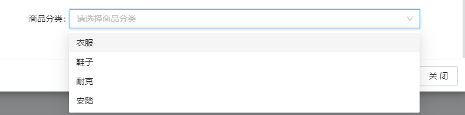

- 自定义树类型（下拉框选项可有子项）

  - 字段Text => 自定义树控件，同时设置校验字段：字典Table表名，字典Code 0，字典Text **ID列,父ID列,显示列,是否有子节点列**，如id,pid,name,has_child

  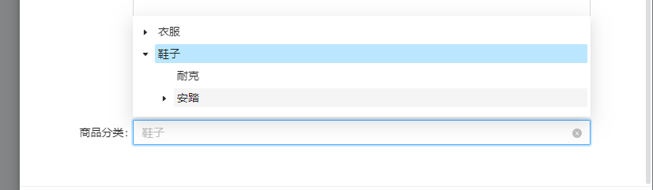

###### 单表树

- 是否树：是

- 树表单父ID: pid 默认不用更改

- 树开表单列：哪一列可以展开，一般是name字段

  - 添加下级时，会在分类名字下有子集

  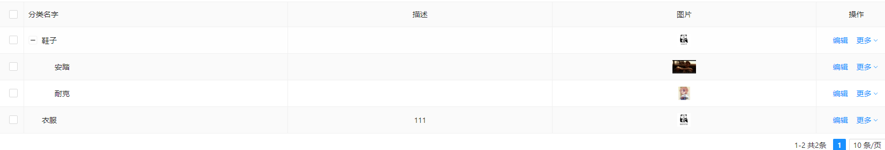

###### 附表

- 表类型：附表
  - 一对多：主表中一条记录对应附表多个记录
  - 一对一：主表中一条记录对应附表一个记录
  - 序号：1 2等用来控制显示的顺序
- 外键：某一字段要对应 主表名 及 主表字段
- 校验字段：内部字典Code可以使用系统字段sex，用以分别性别

###### 主表

- 可以看到对应有哪些附表
- 新建字段
  - 默认主键一般自动生成
  - 外键对应其他表的主键
    - 可有多个外键
  - **页面属性 => 控件默认值**，用于表单默认值填充，该值可以通过**低代码开发 => 系统编码规则**来添加新的**规则Code**
    - 规则Code不懂

###### 控件默认值表达式

- 某一字段的默认填充值 =>  ￥{XXX}

  - 先找到低代码开发（系统编码规则）

  - 规则编码对应XXX

  - 规则实现类

    - 在 src/main/java/org/jeecg/modules/system/rule 路径下生成新的文件，shopOrderNumberRule

    - 在该文件中创建公共类

      ```java
      package org.jeecg.modules.system.rule;
      import com.alibaba.fastjson.JSONObject;
      import org.apache.commons.lang.StringUtils;
      import org.apache.commons.lang.math.RandomUtils;
      import org.jeecg.common.handler.IFillRuleHandler;
      
      import java.text.SimpleDateFormat;
      import java.util.Date;
      
      public class shopOrderNumberRule implements IFillRuleHandler {
      
          @Override
          public Object execute(JSONObject params, JSONObject formData) {
              String prefix = "CN";
              //订单前缀默认为CN 如果规则参数不为空，则取自定义前缀
              if (params != null) {
                  Object obj = params.get("prefix");
                  if (obj != null) {
                      prefix = obj.toString();
                  }
              }
              SimpleDateFormat format = new SimpleDateFormat("yyyyMMddHHmmss");
              int random = RandomUtils.nextInt(90) + 10;
              String value = prefix + format.format(new Date()) + random;
              // 根据formData的值的不同，生成不同的订单号
              String name = formData.getString("name");
              if (!StringUtils.isEmpty(name)) {
                  value += name;
              }
              return value;
          }
      
      }
      
      ```

    - 新增编码规则的实现类 对应创建的类 shopOrderNumberRule

###### JS增强

- 可用于页面的动态计算 或者 字段动态显隐（如 单价 * 数量 = 总价）

  - 主表：JS增强

    ```javascript
    // ces_order_goods 用于监测的表名 
    ces_order_goods_onlChange(){
        return {
            //监听该表中num字段值的变化
            num(){
              let id = event.row.id
              let price = event.row.price
              let num = event.row.num
              let target = event.target
              let allPrice = price * num
              let row = {'zong_price': allPrice}
              this.triggleChangeValues(row,id,target)
            },
            //监听该表中price字段值的变化
          	price(){
              let id = event.row.id
              let price = event.row.price
              let num = event.row.num
              let target = event.target
              let allPrice = price * num
              let row = {'zong_price': allPrice}
              this.triggleChangeValues(row,id,target)
            }
        }
    }
    ```

- 列表中添加button按钮、link下拉按钮、form表单

  - button 或者 link可以在列表中直接添加
    - 可对该表添加JS增强
  - form表单选中后，再选中表单内的按钮种类


##### 1.1.2生成代码界面

选中当前表单，点击`生成`按钮，更改

- 单表
  - 代码生成目录：自定义[默认目录由后端`jeecg_config.properties`文件的project_path变量控制]
  - 页面风格： 三选一
  - 功能说明：自定义描述性文字
  - 表名：
  - 实体类名：主表实体类名称
  - 包名（小写）：生成的代码，子业务包名
- 

- 一对多界面
  - 代码生成目录：自定义
  - 页面风格：同上
  - 功能说明：自定义描述性文字
  - 实体类名：主表实体类名称
  - 子表信息：
    - 子表实体：子表实体类名称，可自定义
    - 子表的功能说明：自定义描述性文字

注：一对多的online表，正常情况只需要更改包名，其他可根据需要修改

子表引用主表主键ID作外键，外键字段需_ID结尾，如ORDER_ID

主表和子表的外键字段名称，必须相同（除主键ID外）


#### 1.2GUI代码生成

##### 1.2.1配置数据库

配置文件：`jeecg-boot-module-system\src\main\resources\jeecg\jeecg_database.properties`

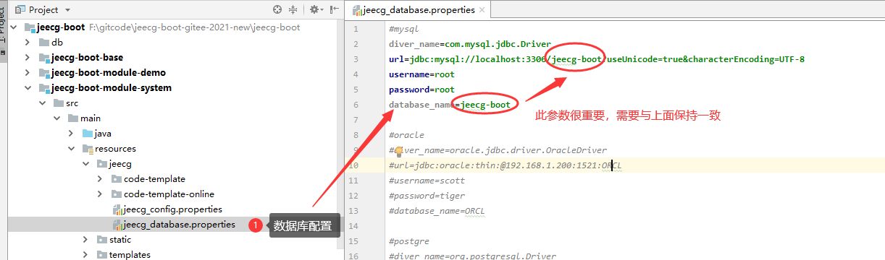

##### 1.2.2配置生成代码路径

配置文件：`jeecg-boot-module-system\src\main\resources\jeecg\jeecg_config.properties`

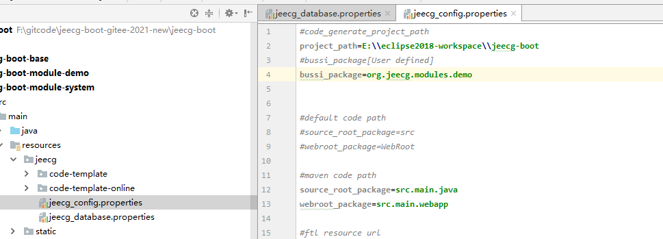

##### 1.2.3单表代码生成

找到类 `jeecg-boot-module-system\src\main\java\org\jeecg\JeecgOneGUI.java` 右键执行弹出GUI代码生成界面，按照提示输入参数。

> 注意：代码生成会同时生成vue2和vue3的页面，手工选择所需版本的代码

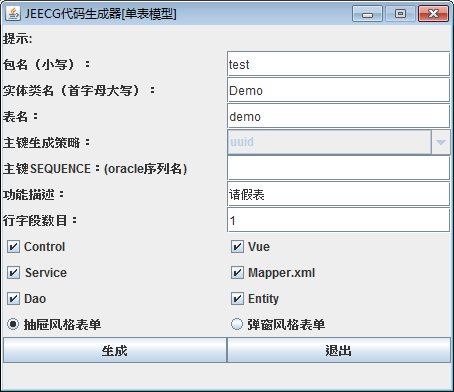

##### 1.2.4一对多代码生成

找到类 `jeecg-boot\jeecg-boot-module-system\src\main\java\org\jeecg\JeecgOneToMainUtil.java`
修改代码参数配置，右键执行生成代码

##### 1.2.5生成结果目录

> 需要哪个vue版本的页面，复制哪个目录下的代码到前端项目即可

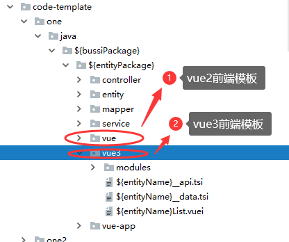

#### 1.3代码生成模板介绍

- `vue3` Vue3版vben风格包装写法
- `vue3Native` Vue3版原生写法未经过包装
- `vue` vue2版的代码（使用vue3版前端忽略即可）

```
vue3和vue3Native主要区别为：
`vue3`表单数据和查询数据均在`*.data.ts页面`，均以json的格式进行填写，而`vue3Native`以`Ant Design Vue`原生写法实现，更加灵活
```

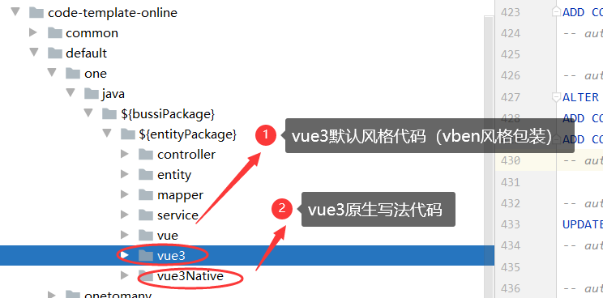

#### 1.4Vue3和Vue3Native详细说明

##### 1.4.1Vue3

- `*list.vue`如（TestCustomerList.vue）：vue列表页
- `*.data.list`如（TestCustomer.data.ts）：数据页面，包含列渲染数据、查询区域渲染数据及表单渲染数据，以`json`的方式进行配置
- `*.api.ts`如（TestCustomer.api.ts）：接口页面
- `*.sql`如（TestCustomer_menu_insert.sql）：可执行的菜单升级sql
- `*Modal.vue`如（TestCustomerModal.vue）：表单弹窗渲染页面

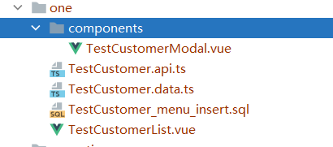

##### 1.4.2Vue3Native

- `*list.vue`如（TestCustomerList.vue）：vue列表页
- `*.api.ts`如（TestCustomer.api.ts）：接口页面
- `*.sql`如（TestCustomer_menu_insert.sql）：可执行的菜单升级sql
- `*Modal.vue`如（TestCustomerModal.vue）：弹窗页面
- `*Form.vue`如（TestCustomerForm.vue）：表单渲染页面

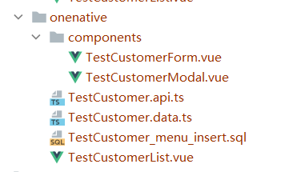


## 七、深入开发


## 八、前端小技巧


## 九、online表单


## 十、Online报表


## 十一、其他功能


## 问题

1、JAVA停留在基础语法，maven项目结构不清楚；

2、生成代码的过程 及 生成结果不是很清楚如何使用（后续如何分离出来，还是说把之前写的融到这个平台中，然后改这个平台的样式）

3、这个视频要求基础感觉有点高，java内部的代码我基本都不认识，前端组件的引用方式和之前写页面差的很多，感觉要的基础挺多的，有点驾驭不过来

4、用户和角色区别


1、完成Online表格的在线创建 及 动态更新

2、整个系统的UI及菜单等等更改

3、将自己的项目移植过去（好的，后面要参考给出的代码，把数据从你自己的前端读取出来）

4、后续服务器的项目搭建（视情况是否需要Docker）


