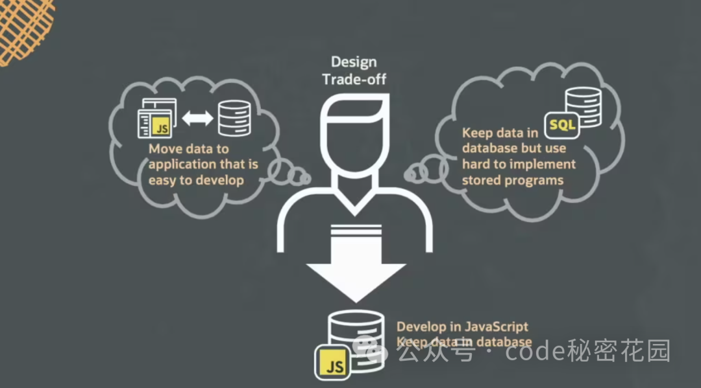
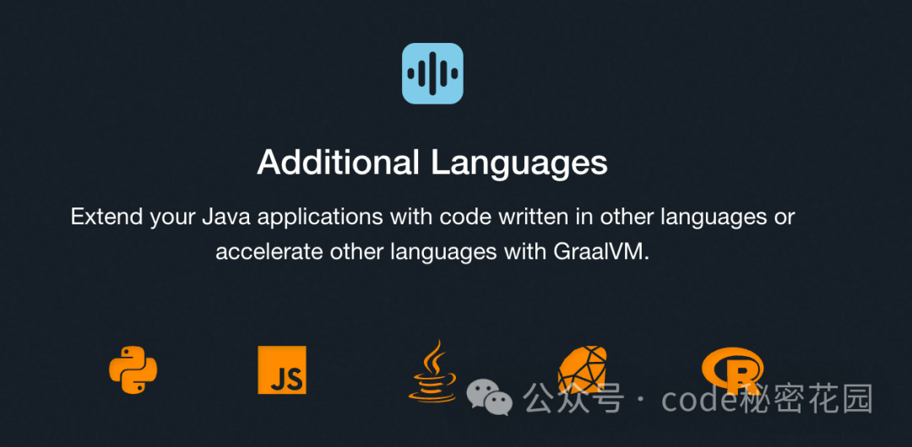

# mysql-JavaScript

> https://www.graalvm.org/
>
> https://mp.weixin.qq.com/s/5XGhgs5PI9RPwHD0RjbroA
>

## 一、JavaScript存储过程

当需要持久性存储时，`MySQL` 作为最流行的开源数据库，将成为 `JavaScript` 开发人员的自然选择。通过支持存储过程中的 `JavaScript`，开发人员将能够用熟悉的语言编写 `MySQL` 存储过程，并利用广泛的 `JavaScript` 生态系统！

存储过程通过减少数据库服务器和应用程序之间的数据移动，提供了一个重要的优势。

- 这需要耗费时间，并且可能会导致网络开销增加。
- 当应用程序进行频繁交互时，增加的延迟可能会变得明显。
- 在中间层或应用层处理大容量数据需要大量的内存和存储资源，增加了成本。
- 由于安全风险和数据保护要求，通常需要避免在机器之间传输大量数据，尤其是在云环境中。
- 将大量数据移出数据库服务，将增加出口费用。



## 二、使用

### 2.1 概述

`MySQL` 现在引入了对 `JavaScript` 存储过程的支持，用户现在可以在数据库内部表达丰富的过程逻辑。`JavaScript` 运行时通过 `GraalVM` 集成，用户可以免费使用 `GraalVM` 企业版（EE）的所有功能，如编译器优化、性能和安全功能。

此版本支持以下功能：

- 基于 `ECMAScript 2021` 的 `JavaScript` 语言
- 存储过程和存储函数
- `MySQL` 数据类型，如各种整数、浮点数和 `CHAR/VARCHAR` 类型




### 2.2 定义JavaScript存储过程

```shell

CREATE FUNCTION gcd_js (a INT, b INT) RETURNS INT 
LANGUAGE JAVASCRIPT AS $$

  let [x, y] = [Math.abs(a), Math.abs(b)];
  while(y) [x, y] = [y, x % y];
  return x;

$$;
```

`JavaScript` 代码直接嵌入在 `SQL` 可调用函数的定义（上面的a 和 b）中。参数的名称可以直接在 `JavaScript` 代码中引用，在调用函数时，`SQL` 类型和 `JavaScript` 类型之间会进行隐式类型转换。


### 2.3 在SQL语句中执行JavaScript

```shell
SELECT col1, col2, gcd_js(col1,col2)
FROM my_table
WHERE gcd_js(col1, col2) > 1
ORDER BY gcd_js(col1, col2);

CREATE TABLE gcd_table 
AS SELECT gcd_js(col1,col2)
FROM my_table;
```

