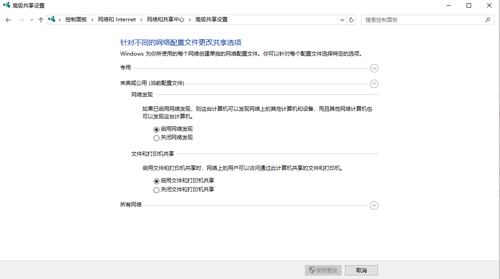
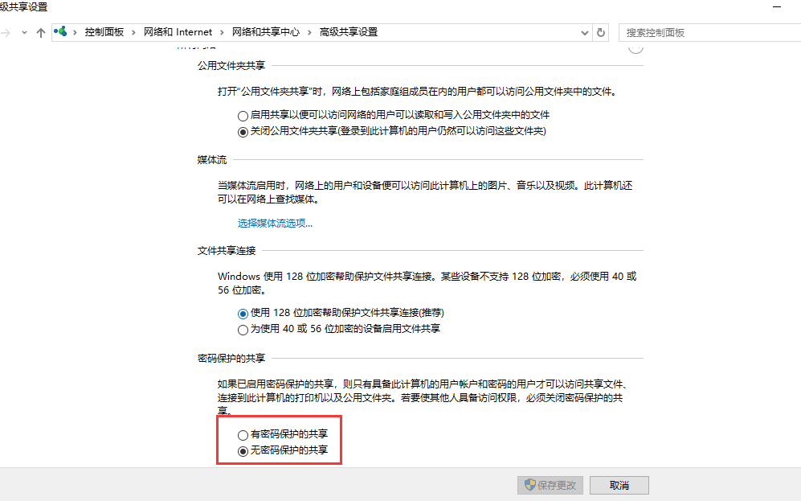
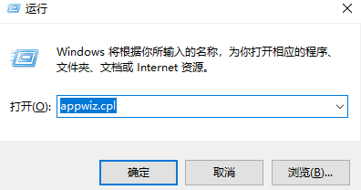
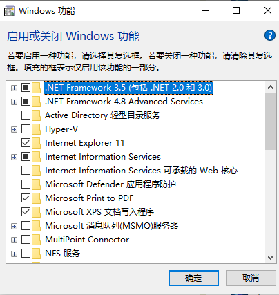
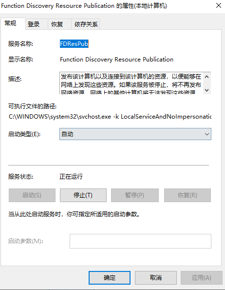
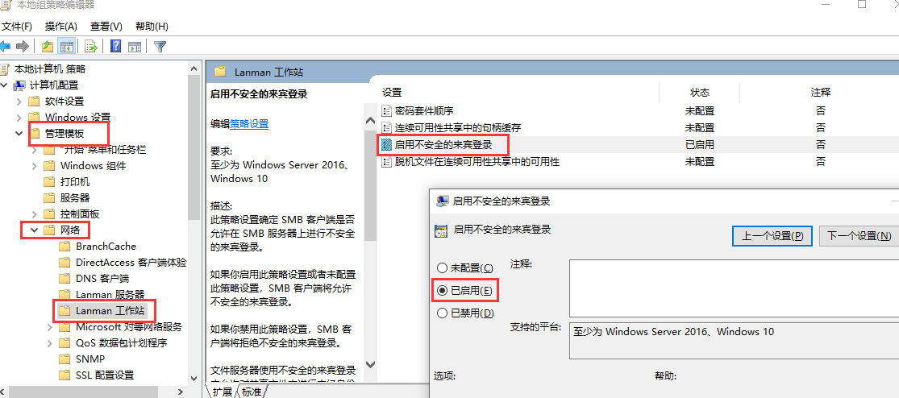
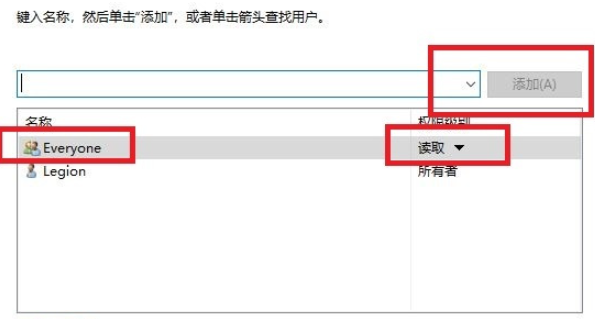
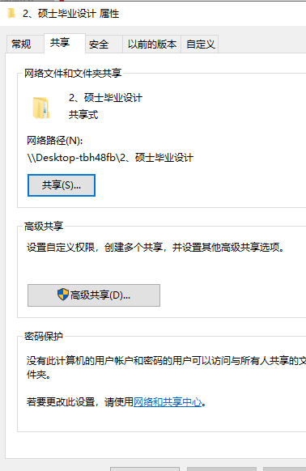
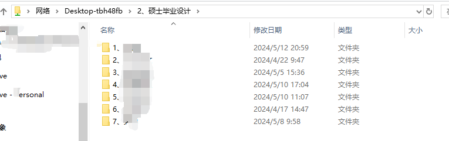

# 局域网文件共享 

## 1、控制面板--更改高级共享设置

**选择“来宾或公用（当前配置文件）”，\**勾选“启用网络发现”和“启动文件和打印机共享”\****

**点击“所有网络”，\**勾选“无密码保护的共享”，\**（建议勾选“有密码保护的共享”，即设置登录密码**

## 2、启用**“\**SMB 1.0/CIFS File Sharing Support”\****

按下Win + R，输入***\*appwiz.cpl\****，启用或关闭Windows功能

## 3、更改服务类型 - 自动

按下Win + R，输入***\*services.msc\****，将以下服务设置为自动

1. Function Discovery Resource Publication
2. Server
3. TCP/IP NetBIOS Helper
4. Workstation

## 4、更改本地组策略编辑器

按下Win + R，输入***\*gpedit.msc\****，**依次打开\**“管理模板”->“网络”->“Lanman 工作站”->“启用不安全的来宾登录”，勾选“已启用”\**，并确定。**

## 5、共享所需文件夹

选择指定文件夹 - 属性 - 共享，***\*从下拉框中选择“Everyone”，\**点击“\**添加\**”，**    **点击\**“读取”可修改访\**问权限。\**默认为“读取/写入”\**。**

:bulb: 上图中的`\\Desktop-tbh48fb\2、硕士毕业设计` 即可在局域网内其他电脑访问。

