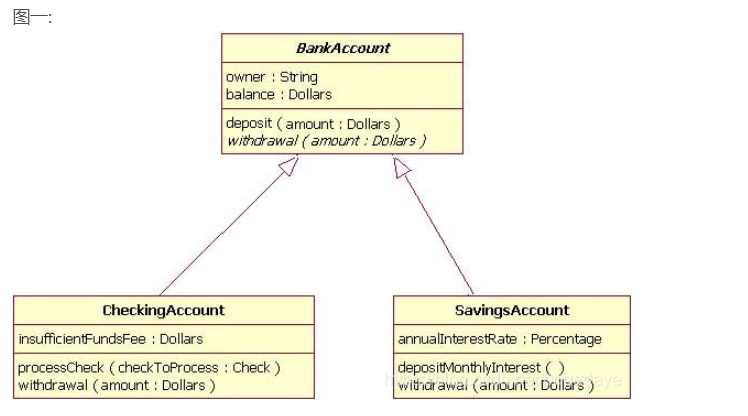
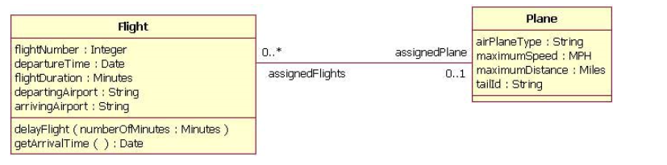
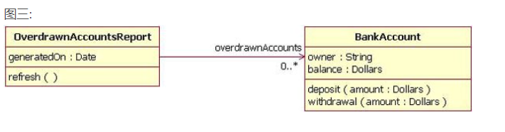
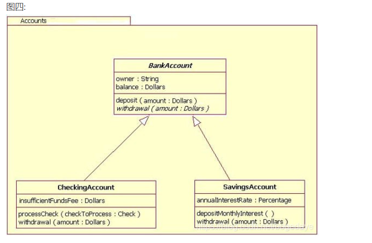
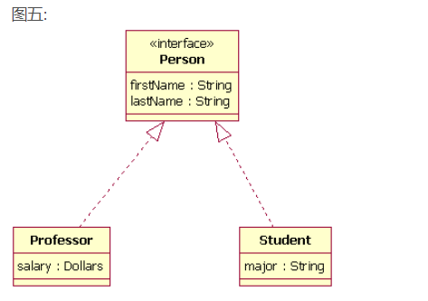
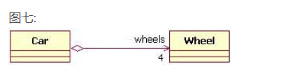
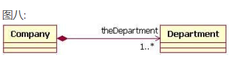

# UML图

## 继承

实线箭头

                                

## 双向关联

**从左到右：**Flight扮演assignedFights角色, 有0到1个Plane跟他关联(一个航班要么取消了没有飞机,要么只能对应一架飞机)

**从右到左：**Plane扮演着assignedPlane角色, 有0到多个Flight跟他关联(一个飞机可以参与多个航班, 也可以停在仓库里面烂掉)

## 单向关联

右侧类不知道左侧类

## 软件包

大的包围框叫软件包 , 名字为Account

## 实现接口

虚线箭头

## 聚合

带菱形的箭头表示基本聚合, 由下图知道, Wheel类扮演wheels角色, 聚合4个到Car对象里面去,
空心的菱形表示Wheel对象并不随Car的创建而创建,销毁而销毁 .

实心菱形表示Department对象随Company对象的创建而创建,销毁而销毁 

