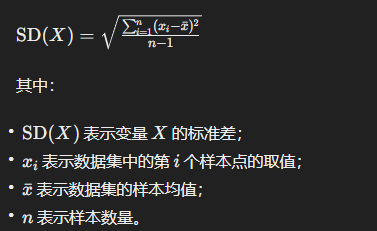
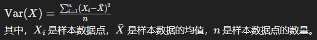
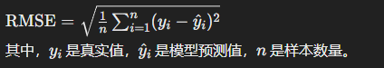
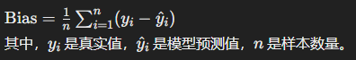
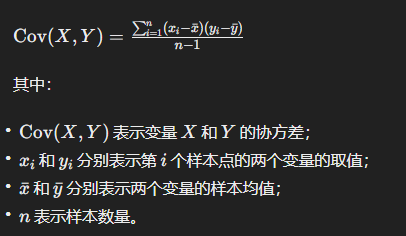

# 地统计相关

## 一、地统计分析

地统计分析是一种应用统计学原理和方法来分析地理空间数据的方法。它结合了地理信息系统（GIS）和统计学的技术，用于理解和描述地理现象的空间变异性、空间关联性和空间分布规律。地统计分析通常涉及以下几个方面的内容：

1. **空间数据的描述和可视化：** 地统计分析首先涉及对地理空间数据的描述和可视化。这包括对点、线、面等地理要素的几何形状和属性数据的统计描述、绘制地图、制作空间图表等。
2. **空间数据的空间自相关性分析：** 地统计分析通常关注地理现象在空间上的相关性和相关结构。空间自相关性分析用于识别和量化地理现象的空间聚集性、空间分布的不均匀性以及空间相关性的程度。
3. **空间插值和空间预测：** 地统计分析常常涉及到空间插值和空间预测问题。空间插值用于估计在不同位置的地理现象的值，常见的插值方法包括克里金插值、逆距离加权插值等。空间预测则是利用地理空间数据来预测未来的地理现象变化趋势和空间分布模式。
4. **空间回归分析：** 类似于传统的统计回归分析，空间回归分析用于研究地理现象之间的空间关联性和影响关系。它考虑到地理空间数据的空间依赖性和空间自相关性，并利用空间权重矩阵等方法来进行模型建立和参数估计。
5. **地理空间模式识别：** 地统计分析也用于识别和描述地理空间数据中的特定模式和结构，例如点模式（点聚集、点均匀分布、点随机分布）、线模式（线的方向、长度、分布）、面模式（面的形状、大小、分布）等。

地统计分析的应用领域包括自然资源管理、环境科学、城市规划、流行病学、经济地理学等，它为我们理解地理空间数据背后的规律和关系提供了重要的工具和方法。

## 二、常用的地统计分析方法

## 三、其他相关

#### 3.1 鲁棒性

> 鲁棒性是指系统或者过程对于外部变化、异常情况或者噪声的稳健性和健壮性。在不同的领域，鲁棒性具有不同的含义，但核心思想是系统能够在面对各种不确定性和干扰时，仍能够维持其正常的功能和性能。以下是鲁棒性的一些重要概念：
>

1. **对抗性（Resilience）：** 对抗性是指系统能够在面对挑战、灾难或者攻击时保持稳定并迅速恢复正常状态的能力。这种能力通常包括快速识别问题、自我修复和适应性等方面。
2. **容错性（Fault Tolerance）：** 容错性是指系统能够在硬件或软件故障发生时继续提供服务，而不会导致系统崩溃或数据丢失。容错性通常通过备份、冗余和错误检测与恢复机制来实现。
3. **稳健性（Robustness）：** 稳健性是指系统能够在面对不确定性、变化或者噪声时保持一定的性能水平。一个稳健的系统能够适应不同的环境条件，并且对输入数据的变化具有一定的容忍度。
4. **安全性（Security）：** 安全性是指系统能够保护其资源、数据和功能，防止未经授权的访问、窃取或者破坏。安全性是鲁棒性的一个重要方面，特别是在面对恶意攻击和网络安全威胁时。
5. **适应性（Adaptability）：** 适应性是指系统能够根据环境变化或者用户需求进行调整和改变，以保持其有效性和适用性。适应性通常需要系统具有灵活性和智能性。

#### 3.2 Pearson相关性分析

> Pearson相关性分析是一种统计方法，`用于衡量两个连续变量之间的线性相关程度`。

它通过计算Pearson相关系数来描述两个变量之间的线性关系，取值范围在-1到1之间。相关系数为正表示正相关，相关系数为负表示负相关，相关系数接近0表示无相关性。

#### 3.3 主成分分析

> `一种常用的数据降维技术，用于减少数据集中的维度并保留数据集中最重要的信息。`

`PCA通过线性变换将原始数据映射到一个新的特征空间中，其中新的特征称为主成分，它们是原始特征的线性组合`。这些主成分按照重要性递减的顺序排列，可以选择其中的前几个主成分来表示原始数据的大部分方差。主成分分析通常用于数据预处理、特征提取和数据可视化等领域。

:bulb: 基于主成分分析的回归模型（一种利用主成分分析（PCA）降维后的特征进行回归分析的模型。）

#### 3.4 支持向量机SVM的概念

> `一种用于分类和回归分析的监督学习算法。`

`基本思想是找到一个最优的超平面，将不同类别的数据分隔开来，并使得超平面到最近的数据点的距离最大化。`在分类问题中，SVM试图找到一个使得间隔最大的超平面，使得该超平面能够尽可能地正确分类训练数据，并且对新的数据具有较好的泛化能力。在回归问题中，SVM试图找到一个最优的拟合曲面，以尽量减小预测误差。

:bulb: 超平面是用来分隔不同类别的数据点的一个特殊的线性平面。`它是一个 n*−1维的线性空间，其中n是数据点的特征数量。在二维空间中，超平面就是一条直线；在三维空间中，超平面就是一个平面。在高维空间中，超平面是一个n−1维的线性子空间`。

:bulb: 超平面的特点是：它将不同类别的数据点分隔开来，并且使得`到超平面的最近的数据点的距离（称为间隔）最大化`。这些`最近的数据点被称为支持向量（Support Vectors）`。支持向量机的目标是找到一个最优的超平面，使得这个超平面与支持向量之间的间隔最大化。

#### 3.5 （标准差 方差 均方根误差 偏差 协方差） 概念 及 公式

> 标准差（Standard Deviation）：

用于衡量数据集中数据的离散程度的统计量，它的计算公式如下：

标准差是方差的平方根，它表示数据集中数据点的平均偏离程度。

> 方差（**Variance**）：

统计学中用来衡量数据分布的离散程度的一种指标。方差越大，表示模型对训练数据的拟合程度越差，泛化能力可能会受到影响。计算公式如下：

> 均方根误差（**Root Mean Square Error，RMSE**）：

用来衡量模型预测值与真实值之间的差异程度的一种指标。是预测值与真实值之间差异的平方的平均值的平方根。均方根误差越小，表示模型的预测能力越好。计算公式如下：

> 偏差（**Bias**）：

衡量模型预测值与真实值之间的平均差异，用于评估模型的准确性。计算公式如下：

> 协方差（Covariance）：

用于衡量两个随机变量之间关系的统计量，它的计算公式如下：

#### 3.6 归一化处理

> 数据归一化是一种常用的数据预处理技术，它将不同特征的数据缩放到相似的范围内，以消除特征之间的量纲差异和大小差异。数据归一化的主要作用包括：

