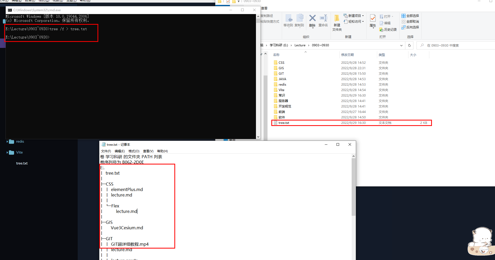

# 计算机实用小技巧

## window生成树形结构目录

1. 找到文件对应的位置

2. 进入cmd界面

3. 输入tree /f > tree.txt，会将当前目录结构下的文件（含子文件）都记录在tree.txt文件中

## 计算机存储单位

计算机中的最小存储单位是比特（bit），它表示二进制的最小数据单元，可以存储一个二进制值，即0或1。比特是计算机内存和存储设备中的基本构建块。通常，8个比特组合在一起形成一个字节（byte）。

以下是一些存储容量单位，以便更好地理解如何从比特增长到TB（特比字节）：

- **字节（Byte）**：一个字节包含8个比特。它通常用于存储一个字符的数据。
- **千字节（KB，Kilobyte）**：1 KB 等于 1024 字节，或 8,192 比特。
- **兆字节（MB，Megabyte）**：1 MB 等于 1,024 KB，或 1,048,576 字节，或 8,388,608 比特。
- **千兆字节（GB，Gigabyte）**：1 GB 等于 1,024 MB，或 1,048,576 KB，或 1,073,741,824 字节，或 8,589,934,592 比特。
- **特比字节（TB，Terabyte）**：1 TB 等于 1,024 GB，或 1,048,576 MB，或 1,073,741,824 KB，或 1,099,511,627,776 字节，或 8,796,093,022,208 比特。

:bulb: `通常情况下，一个英文字母（拉丁字符）通常占用1个字节的存储空间。这是因为英文字母可以由ASCII编码表示，ASCII编码使用一个字节来表示每个字符`

:bulb: `中文汉字的存储空间通常是2个字节，因为中文字符通常需要使用Unicode编码中的多字节编码（通常是UTF-8或UTF-16）来表示。UTF-8编码中，大部分汉字会占用3个字节，但一些常见汉字会占用2个字节。在UTF-16编码中，中文字符通常占用2个字节`

