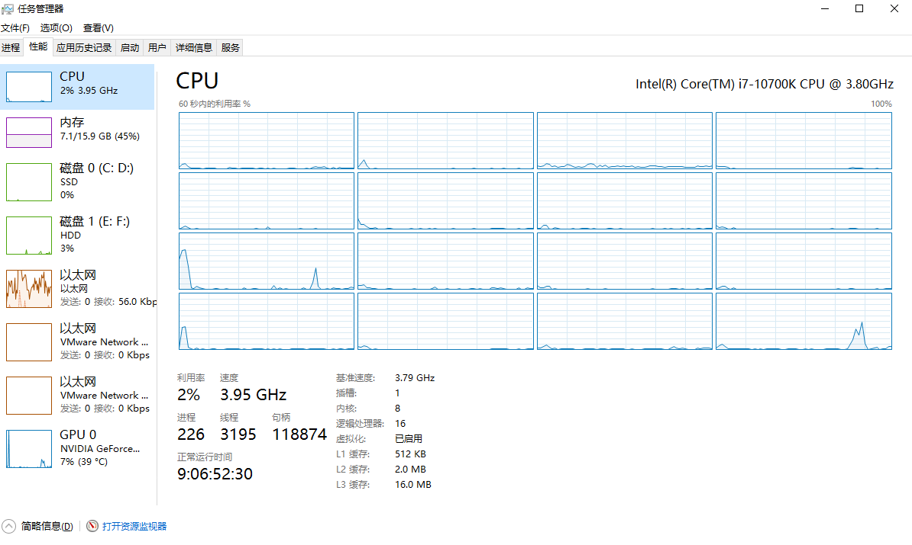
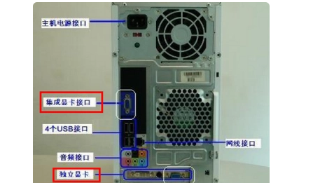

# 计算机硬件

## 一、主板

:book: 看接口类型 及 数量，整体数量越多越好

## 二、cpu

主板中央处理器（Control processing unit），目前市场主要包括：AMD 和 Intel

### 2.1Intel

celeron（赛扬）、pentium（奔腾）、core（酷睿），目前主要是core系列，如i3、i5、i7、i9等；

- i9-12900k：
  - i9：系列
  - 12：代次指示符，越高越好
  - 900性能代号：数值越大性能越好
  - k：产品线后缀

:bulb: 后缀带F是不带核显的，需要自行额外配置独立显卡，如i7-12700KF

### 2.2 AMD

速龙、RYZEN（锐龙系列）；目前主要是锐龙系列；

同样数值越大越好；X3D和HX后缀性能好

:bulb: 主频（睿频）：单核的性能上限，越大越好；

### 2.3 核心 线程 缓存

越多越好

### 2.4 任务管理器

ctrl + shift + esc

切换多核逻辑处理器：性能 -> cpu -> 右键将图形更改为 逻辑处理器；

## 三、内存条

> cpu-z可检查系统主板、内存（DDRX类型）、SPD、显卡等
>
> - SPD 可见每个内存条的插槽

RAM - 随机存取存储器 

:bulb: DDRX： X是几 代表第几代

:bulb: 注意主板与内存条的互支持

## 四、电源

> :bulb:台式机电源根据显卡、CPU损耗选取不同`额定瓦数`的电源，；笔记本电源自带；

京东 - 查找自身显卡 建议额定瓦数，在此基础上再加200W左右

## 五、硬盘

### 5.1 机械硬盘

:warning: 较老，特点便宜量大，但访问速度越来越慢

:warning: 一般只用于台式机

2TB--7200RPM--SATA：  2TB表示大小，RPM表示转速，SATA表示接口类型，即对主板插口的类型

### 5.2 固态硬盘

:bulb: 笔记本 和 台式机 部分可互用

:bulb: 接口类型多于机械硬盘，有SATA、MiniSATA(废弃)、PCI-E(废弃)、U.2(废弃) 和 M.2

### 5.3 比较

**读写速度方面--(读一般快于写)**

- 机械硬盘
  - 如SATA，一般 小于 110MB/S
- 固态硬盘
  - SATA，一般小于 550MB/S
  - PCI-E，一般在5000M/S
  - M.2，现流行，3000-7000，逐渐提升中

## 六、显卡

> 主要是NVIDIA  和 AMD
>
> 显卡内存：能将多少图形渲染到显卡中

### 6.1 NVIDIA

GeForce10系列：GTX1050、GTX1050Ti、GTX1060、GTX1080Ti

GeForce16系列：GTX1660、……

GeForce20系列：RTX2060、RTX2070、RTX2080、RTX2080Super、RTX2080Ti、

GeForce30系列：RTX3050、3060、3090、(笔记本是RTX3060 LapTop)

:bulb: RXT 和 GTX区别：RTX光线追踪技术

GTX

RTX

### 6.2 AMD

### 6.3 核显和独显的区别及用途

1. 核显（集成）

   - 买CPU送显卡，基本的内容显卡

   - 连接显示器，用于显示内容

2. 独立显卡：高档游戏需要额外配置

:bulb: 自行购置的主机，一般下边的是独显，上面是集成显卡

### 6.4 天梯图

可查看不同版本的CPU 和 显卡的优劣对比图，连接如下等

https://www.mydrivers.com/zhuanti/tianti/gpu/index.html

## 七、显示器

> 分辨率： 1080P 2K 4K
>
> HDR 对比度
>
> 刷新率Hz：越高越好

一般分辨率越高，对显卡负载越高，`如果高分辨率显示器 配 低 显卡，会出现卡顿，如3060支持2K，但3060对4K会卡顿`

## 八、自行配置电脑

去官网查找不同的  主板对 各样的CPU及其他硬件信息的 兼容率

