# 图形推断

## 20240325

#### （1） 曲线数目

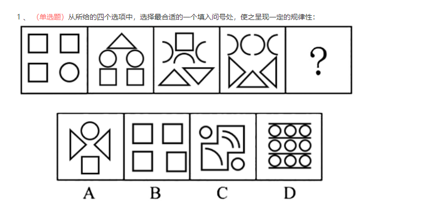

C

第一步，观察特征。
图形组成不同，考虑数量类或者属性类，图中出现单一的曲线条，考虑数曲线。
第二步，一条式，从左到右找规律。
`题干每幅图中曲线条数依次为1、2、3、4、？，呈现等差数列`，问号处应该选择一个曲线条数为5的图形，只有C项符合，其中A项曲线数为1，B项曲线数为0，C项曲线数为5，D项曲线数为9。
因此，选择C选项。

#### （2）对称轴 和 面个数

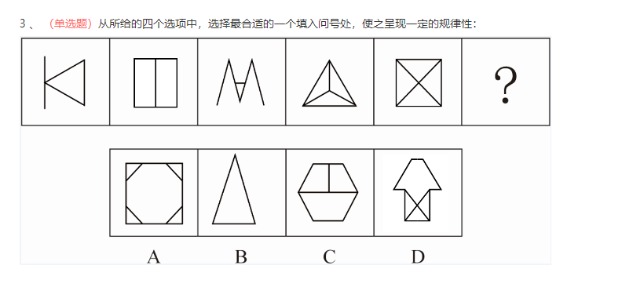

B

第一步，观察特征。
组成元素不同，优先考虑数量类或属性类。图形对称特征明显，考虑对称性。
第二步，一条式，从左到右找规律。
`题干图形对称轴的个数依次为1、2、1、3、4，继续观察图形均出现多个封闭空间，图形面的个数依次为1、2、1、3、4，发现图形对称轴的个数与面的个数相同，即对称轴个数减面的个数为0，问号处图形对称轴的个数应该与面的个数相同，只有B项符合。`
因此，选择B选项。

#### （3）一笔画完成

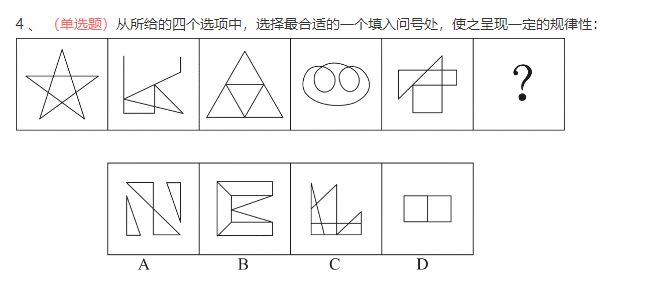

D

第一步，观察特征。
组成元素不同，优先考虑数量类或属性类。题干图形出现五角星，考虑笔画数。
第二步，一条式，从左到右找规律。
题干图形笔画数均为1，则问号处应为一笔画图形，只有D项符合。
因此，选择D选项。

## 20240326

#### （1）黑圆分割白圆数目

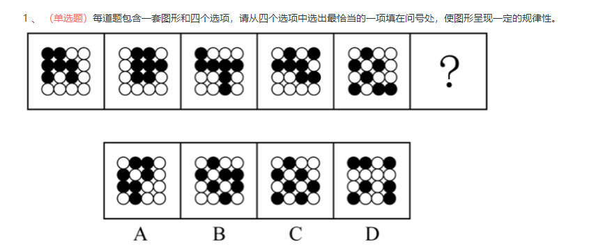

第一步，观察特征。
图形组成相同，但动态位置无明显规律，考虑黑圆的分割功能。
第二步，一条式，从左到右找规律。
题干图形中相邻黑圆连线，第一幅图黑圆连线将白圆分割成1部分，第二幅图黑圆连线将白圆分割成2部分，第三幅图黑圆连线将白圆分割成3部分，第四幅图黑圆连线将白圆分割成4部分，第五幅图黑圆连线将白圆分割成5部分，所以问号处黑圆连线应该将白圆分割成6部分，只有B项符合。
因此，选择B选项。

#### （2）三角形个数

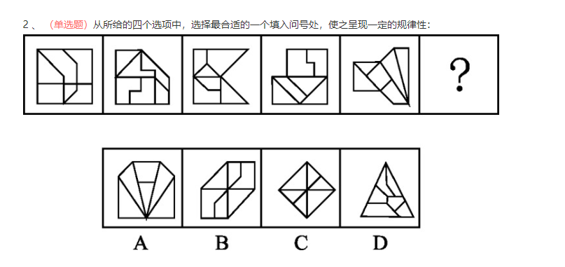

第一步，观察特征。
图形组成不同，考虑数量类或属性类。
第二步，一条式，从左到右找规律。
三角形形状的面的个数分别是0，1，2，3，4，问号处应该选择5个三角形形状的面的选项，只有A选项图形有5个三角形形状的面。
因此，选择A选项

## 20240327 

#### （1）占图形面积数

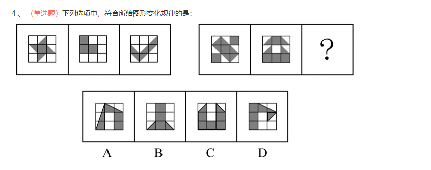

第一步，观察特征。
组成元素相似，内部填充不同，但无定义叠加规律，考虑图形面积。
第二步，两段式，第一段找规律，第二段应用规律。
第一段，每个图形黑色部分的面积均为3个方格；第二段，两个图形黑色部分的面积均为6个方格，只有C项符合。
因此，选择C选项。

#### （2）图形个数

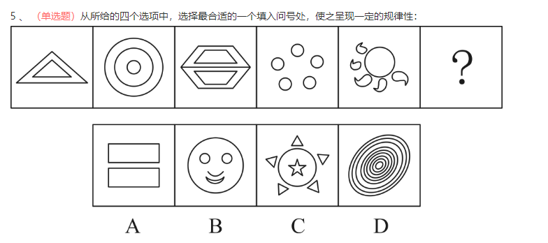

第一步，观察特征。
组成元素不同，优先考虑数量类或属性类。封闭空间特征明显，考虑数面。
第二步，一条式，从左到右找规律。
题干已知图形中面的个数依次为2、3、4、5、6，呈等差规律，所以问号处的图形应有7个面，只有C项符合。
因此，选择C选项。

#### （3）相切 或 相交

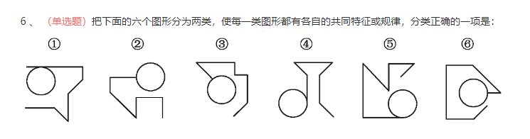

第一步，观察特征。
组成元素不同，优先考虑数量类或属性类。
第二步，根据规律进行分组。
所有图形均存在圆形及若干直线，观察圆形和直线的位置关系发现，图①④⑤中圆和直线相切，两者形成一个切点，②③⑥中圆和直线相交，两者形成一个曲直交点，据此分为两组。
因此，选择A选项。

## 20240328

#### （1）十字交点数量

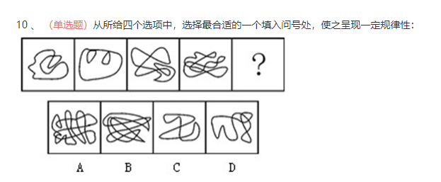

第一步，观察特征。
组成元素不同，优先考虑数量类或属性类。图形出现十字交点，考虑数点。
第二步，一条式，从左到右找规律。
题干图形交点个数依次为1、2、4、8，呈等比规律，问号处应是有16个交点的图形，选项交点个数依次为17、16、2、5，只有B项符合。
因此，选择B选项。

## 20240329

#### （1）图形连接关系

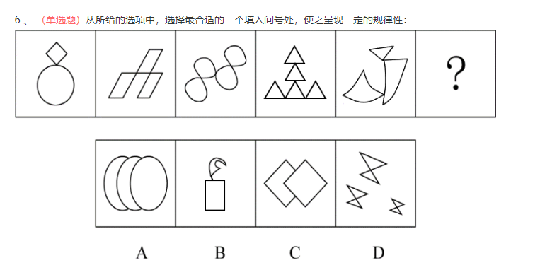

第一步，观察特征。
组成元素结构相似，摆放比较奇怪，考虑静态位置连接性。
第二步，一条式，从左到右找规律。
题干图形均为1部分且为点连接，只有B项符合。
因此，选择B选项。

#### （2）封闭图形个数

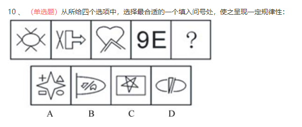

第一步，观察特征。
组成元素不同，优先考虑数量类或属性类。且每个图形均有封闭区间，考虑数面。
第二步，一条式，从左到右找规律。
题干图形均有1个封闭空间，只有D项符合。
因此，选择D选项。

## 20240331

#### （1）边个数

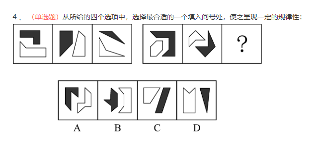

第一步，观察特征。
图形组成不同，考虑数量类或者属性类。
第二步，两段式，第一段找规律，第二段用规律。
第一段中，观察发现，黑色图形线条数比白色图形的线条数依次为多1条、相等、少1条。第二段中，前两个图形中，黑色图形线条数比白色图形线条数分别为多1条、相等，因此问号处应为黑色图形线条数比白色图形线条数少1条的。分析选项，黑色图形线条数比白色图形线条数分别为少1条、多1条、相等、少2条，符合规律的只有A项。

#### （2）面数 和 排序规律

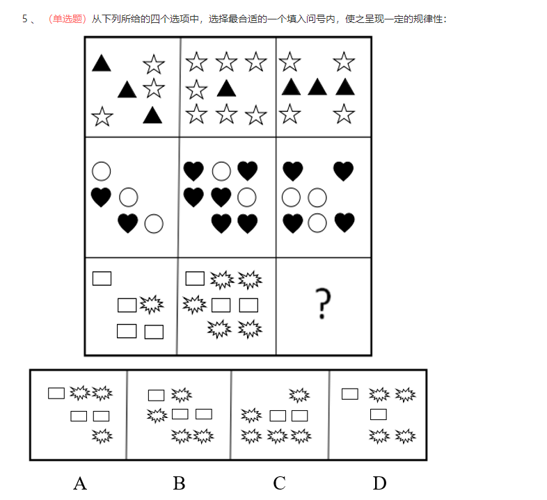

第一步，观察特征。
每行组成元素相同，但数量不同，考虑元素数量之间的运算。
第二步，九宫格，横向规律较为常见，优先考虑。
第一行，图1和图3的星星个数相加等于图2的星星数，即3+4=7；第二行，图1和图3的心形数相加等于图2的心形数，即2+4=6 ；第三行，图1和图3图的星星数相加等于图2的星星数，即1+？=5，因此问号处应填入4个星星，排除A、C选项。进一步观察另一种元素的个数，每一行中另外一种元素的个数，第一行中三角形个数相加为7，第二行中圆形个数相加为8，则第三行矩形个数相加之和为9，只有D项符合。

#### （3）切点个数

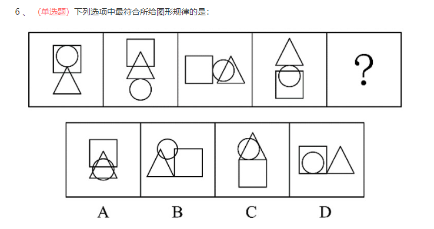

第一步，观察特征。
元素组成相同，且均存在相切关系。
第二步，一条式，从左到右找规律。
所有图形中均存在切点，考虑切点个数。已知图形的切点个数均为1，故问号处图形切点个数也应为1。观察选项：A、B项，无切点，排除；C项，切点个数为2，排除；D项，切点个数为1，符合规律。

#### （4）封闭面数

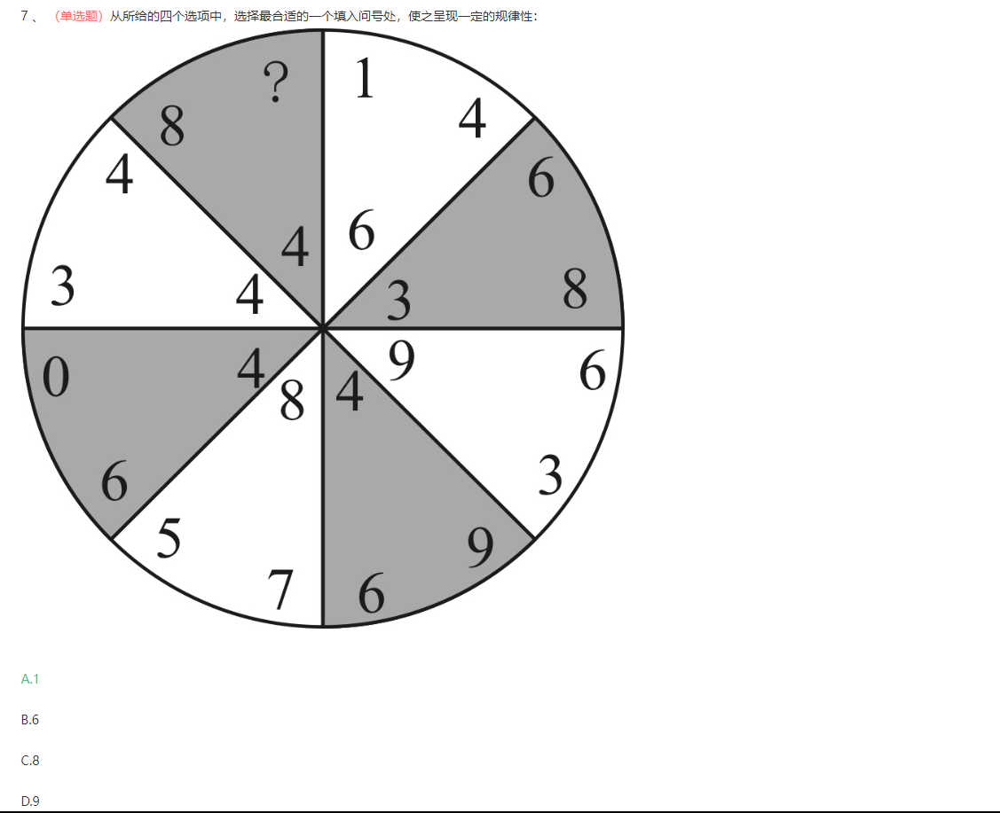

第一步，观察特征。
组成元素不同，优先考虑数量类或属性类。每个图形均有封闭区间，考虑数面。
第二步，饼状图，分析每个区间内的规律。
从问号右侧的扇形开始沿着顺时针方向观察，第一个扇形中的数字为“1、4、6”，这三个数字中一共有2个封闭面（4内有一个封闭区域，6也是），第二个扇形中的数字为“3、6、8”，这三个数字中一共有3个封闭面，依次数下去，扇形每个面内的三个数字中包含的封闭空间数依次为2、3、2、3、2、3、2，呈交替出现的规律，所以左上角扇形内的数字组合封闭空间数应为3，只有A项符合。

## 20240401

#### （1）一笔画完成

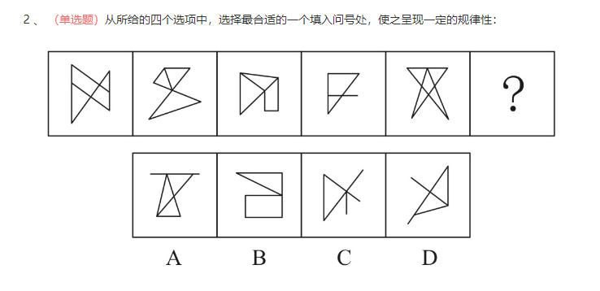

第一步，观察特征。
组成元素不同，优先考虑数量类或属性类。图5为一笔画的特征图形五角星的变形，考虑笔画数。
第二步，一条式，从左到右找规律。
题干所给图形均能一笔画出，所以问号处应选择一笔画图形，只有B项符合。

#### （2）边个数

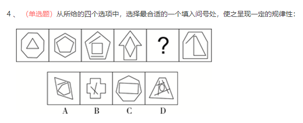

第一步，观察特征。
组成元素不同，优先考虑数量类或属性类。且每个图形均有封闭区间，考虑数面。
第二步，一条式，从左到右找规律。
观察题干，每个图形均有2个面，排除B、D项；进一步观察，每个图形都是11条直线，问号处也应选择11条直线的图形，排除A项，只有C项符合。

#### （3）图形个数

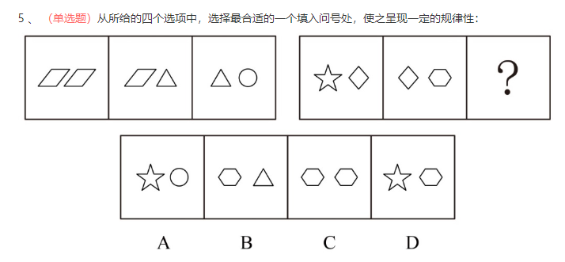

第一步，观察特征。
组成元素不同，优先考虑数量类或属性类。每个图形均由多种元素组成，考虑元素的个数和种类。
第二步，两段式，第一段找规律，第二段应用规律。
第一段，图形平行四边形、三角形、圆的个数依次为：3、2、1，呈等差规律；第二段应用规律，补充C项后，六边形、菱形、五角星的个数依次为：3、2、1，只有C项符合。
