# 图形推断 

> 一般考虑数目：:star: 
>
> - 笔画数
> - 横线竖线直线平行线个数
> - 直角个数
> - 交点个数
> - 封闭面个数
> - 倍数关系

## 20240402

#### （1）数量类，角

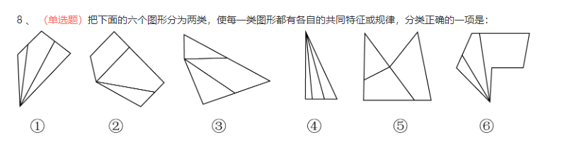

第一步，观察特征。
图形组成不同，优先考虑数量类或者属性类。
第二步，分组分类，根据规律进行分组。
图①④⑥分别是锐角引出2条线，图②③⑤不是锐角引出两条线，分为两组。
因此，选择填D选项。

#### （2）数量类，一笔画

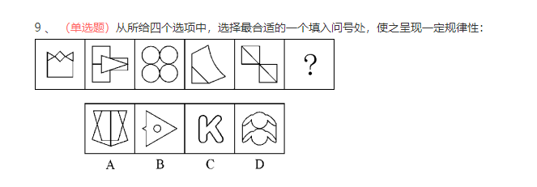

第一步，观察特征。
组成元素不同，优先考虑数量类或属性类。第四个图形是“日”字的变形，考虑一笔画。
第二步，一条式，从左到右找规律。
题干已知图形均属于一笔画图形，故问号处也应选择一笔画图形，只有C项符合。

#### （3）数量类，线

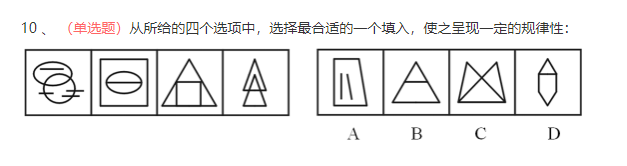

第一步，观察特征。
组成元素不同，优先考虑数量类或属性类。线条的特征比较明显，考虑数线。
第二步，一条式，从左到右找规律。
题干图形总线条数均为6，接下来应选择有6条线的图形，只有A项符合。

## 20240403

#### （1）数量类，交点数

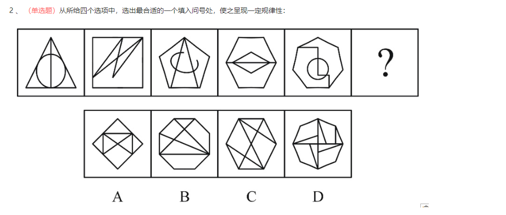

第一步，观察特征。
组成元素不同，优先考虑数量类或属性类。直线数量和交叉特征明显，考虑数量类。
第二步，一条式，从左到右找规律。
题干图形外部的直线数依次为3、4、5、6、7，呈等差数列，问号处图形外部线条数应为8条，排除A、C两项；图形内部的交点数依次为1、2、3、4、5，呈等差数列，问号处图形内部交点应为6个，只有D符合规律。

#### （2）数量类

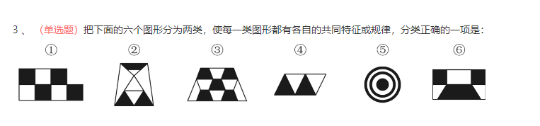

第一步，观察特征。
组成元素不同，优先考虑数量类或属性类，每个图形都有封闭区域，考虑数面。
第二步，依据规律进行分组。
面的个数没有规律，继续观察发现面的形状存在一定规律，图形①③④的黑色区域形状完全相同，图形②⑤⑥的黑色区域形状不完全相同。
因此，选择D选项。

#### （3）数量类，交点

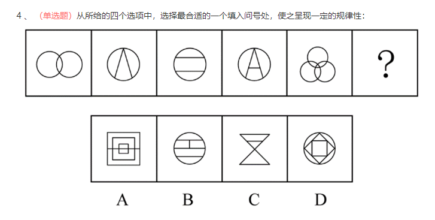

第一步，观察特征。
图形元素不同，优先考虑数量类或属性类，图形线条相交明显，考虑数交点。
第二步，一条式 ，从左到右找规律。
观察图形，发现交点的个数依次为2、3、4、5、6、？，问号处图形交点的个数应该为7。A选项为18个交点，B选项为8个交点，C选项为7个交点，D选项为8个交点，只有C项符合。

## 20240404

#### （1）数量类，直线

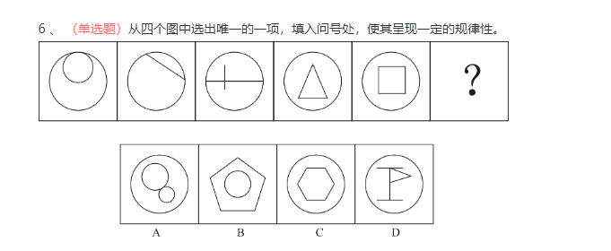

第一步， 观察特征。
线条数量特征明显， 考虑数线。
第二步， 一条式， 从左到右找规律。
图形中直线的数量依次为： ０、 １、 ２、 ３、 ４， 且直线的位置均位于图形内部， 选项中只有 Ｄ 项直线数量为 ５， 且位于图形内部。

#### （2）数量类，平行线

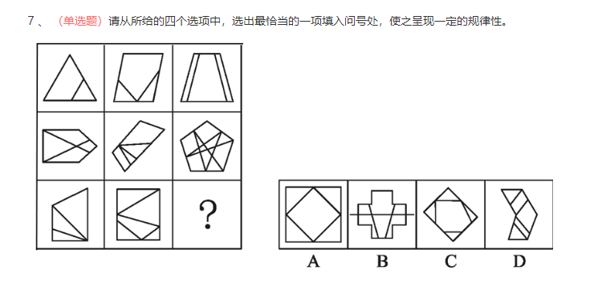

第一步，观察特征。
组成元素不同，可以考虑数量类，图形平行线特征较为明显，考虑平行线。
第二步，九宫格，优先横着看。
第一行，平行线的组数依次为1组、2组、3组，验证第二行，规律成立，运用到第三行中，选择有3组平行线的图形，如下图所示，只有C项符合。

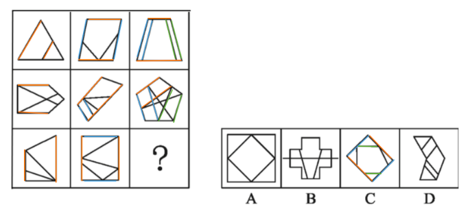

#### （3）数量类，平行线

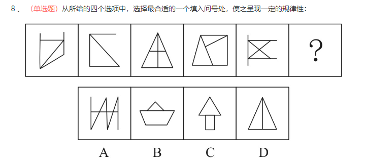

第一步，观察特征。
组成元素不同，优先考虑数量类或属性类。线条的位置特征比较明显，考虑线条之间的相对位置关系。
第二步，一条式，从左到右找规律。
每个图形均有且只有1组平行线，只有B项符合。

## 20240405

#### （1）数量类，直角

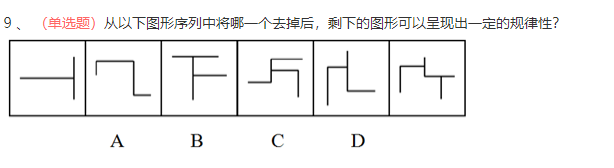

第一步，观察特征。
组成元素不同，优先考虑数量类或属性类。每个图形均由互相垂直的直线构成，优先数直角。
第二步，一条式，从左到右找规律。
直角的个数依次为：2、3、4、5、4、6，去掉D项后，呈等差数规律，只有D项符合。

#### （2）数量类，笔画

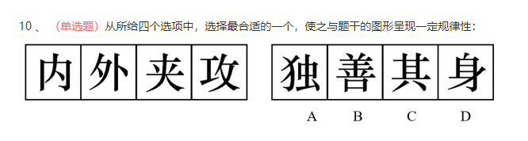

第一步，观察特征。
组成元素不同，即汉字均不相同，优先考虑数量类或属性类。汉字无明显共性，考虑数笔画。
第二步，一条式，从左到右找规律。
汉字笔画数依次为4、5、6、7，呈等差数列，下一个汉字笔画数应为8，只有C项符合。

## 20240408

#### （1）数量类，交点

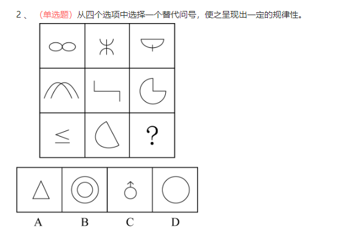

第一步，观察特征。
组成元素不同，优先考虑数量类或属性类。图形出现十字交点，考虑数点。
第二步，九宫格，横向规律较为常见，优先考虑。
第一行中，图形交点个数分别为1、2、3；第二行验证规律，图形交点个数分别为1、2、3；第三行应用此规律，前两个图形的交点个数分别为1、2，所以问号处的图形中交点的个数应为3，只有A项符合。

#### （2）数量类，计算

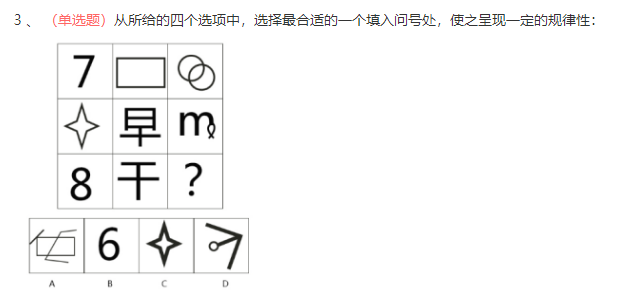

第一步，观察特征。
组成元素不同，优先考虑数量类或属性类。且每个图形均有封闭区间，考虑数面。
第二步，九宫格，横向规律较为常见，优先考虑。
第一行图形面的个数依次为：0、1、3，第一行面总数为4；第二行图形面的个数依次为：1、2、1，面的总和为4；第三行应用规律，面的个数依次为：2、0、？，问号处应为面的个数为2的图形，只有A项符合。

## 20240410

#### （1）数量类，计算

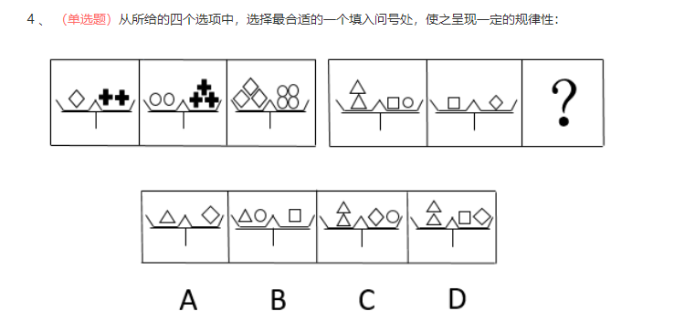

第一步，观察特征。
组成元素不同，优先考虑数量类或属性类。每个图形均由多个元素组成，考虑元素的个数和种类。
第二步，两段式，第一段找规律，第二段应用规律。
第一段：题干图形为天平，天平两边应相等，1个菱形=2个“十”字，2个圆形=3个“十”字，3个菱形=6个“十”=4个圆形，验证天平两端元素换算后相等的规律正确；第二段应用规律，2个三角形=1个正方形+1个圆形，1个正方形=1个菱形，在选项中应用该等量关系，只有C项符合。

#### （2）数量类，

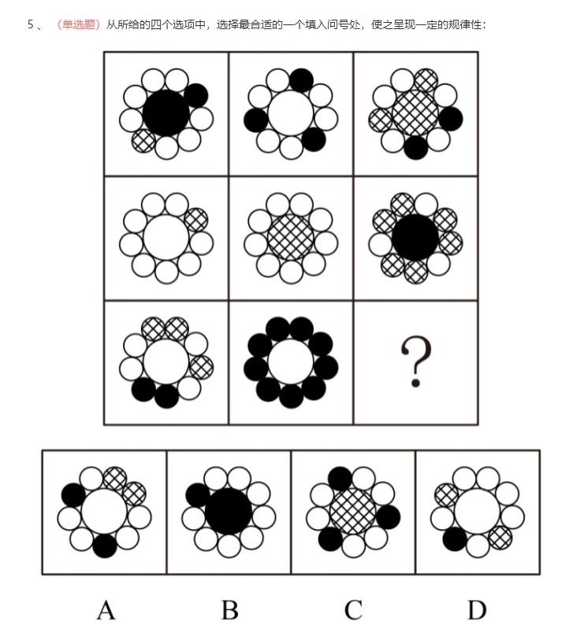

第一步，第一步，观察特征。
组成元素相似，都由若干黑圆、白圆和网状圆组成，优先考虑样式类。
第二步，九宫格，横向观察，没有明显规律，考虑整体观察规律。
题干图形都由白色圆、黑色圆和网状圆三种元素构成，观察每种元素的个数，发现图形白色圆个数均为奇数，第一行依次为7、7、5，第二行依次为9、9、3，第三行依次为5、1、？，依此规律，问号处应选择有奇数个白色圆的图形，只有D项符合

#### （3）数量类，封闭面

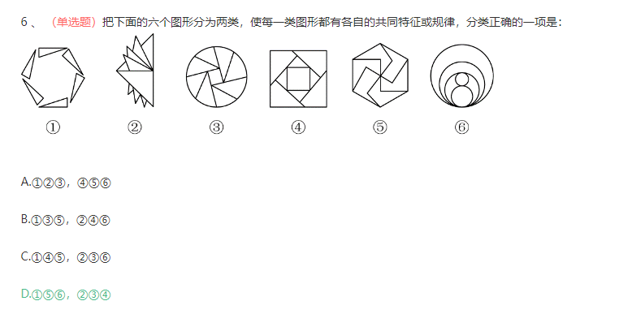

第一步，观察特征。
图形组成不同，优选考虑数量类或者属性类，图形封闭区间较多，考虑数面。
第二步，分组分类，根据规律进行分组。
图①⑤⑥均为6个面，图②③④均为9个面，分为两组。
因此，选择D选项。

#### （4）数量类，计算

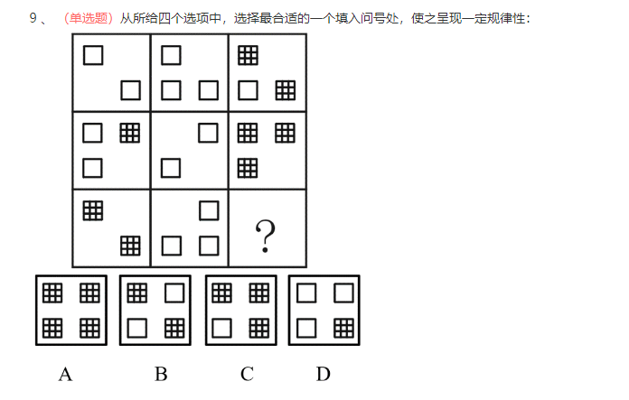

第一步，观察特征。
组成元素不同，优先考虑数量类或属性类。每个图形均由多种元素组成，考虑元素的个数和种类。
第二步，九宫格，横向规律较为常见，优先考虑。
元素个数和种类无规律，考虑元素换算。图1+图2=图3，即2□+3□=2▓+□，可得：1▓=2□，将所有▓换算成□，可得：第一行中所有图形的□个数为2、3、5，2+3=5，呈运算规律；第二行中所有图形的□个数为4、2、6，符合规律；第三行中前两个图形的□个数为4、3，所以问号处应选择可以换算成7个□的选项，只有C项符合。

## 20240411

#### （1）数量类，交点

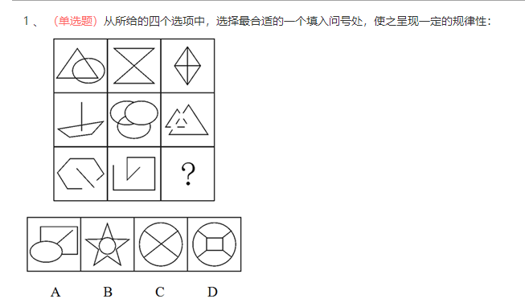

第一步，观察特征。
组成元素不同，优先考虑数量类或属性类。图形出现十字交点，考虑数点。
第二步，九宫格，横向规律较为常见，优先考虑。
第一行，交点数均为5，呈常数规律；第二行验证，交点数均为5，符合规律；第三行应用规律，问号处应选择交点数为5的图形，只有C项符合。

#### （2）数量类，封闭面

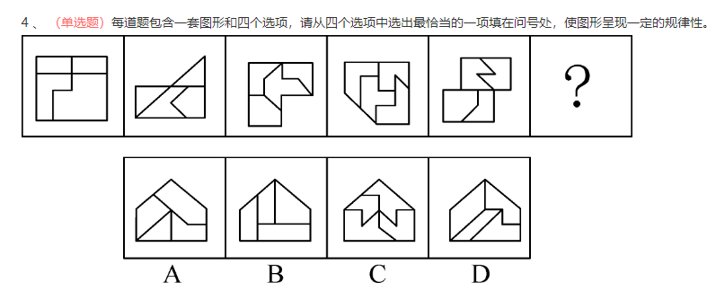第一步，观察特征。
组成元素不相同，优先考虑数量和属性类，无属性特征，所以考虑数量类。
第二步，一条式，从左到右找规律。
封闭空间明显，优先考虑数面的个数，题干中都是4个面，选项中也都是4个面。进一步观察，题干中的图形都有两个相同形状的面，只有B项符合。

## 20240412

#### （1）数量类，点面

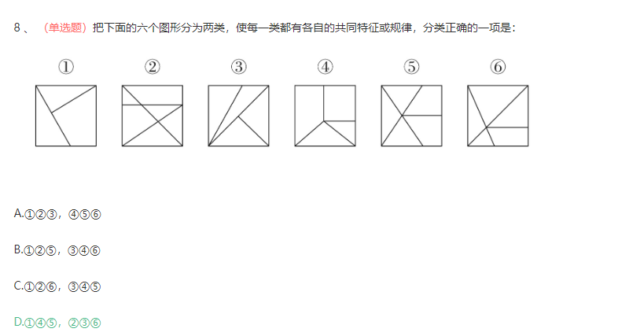

第一步，观察特征。
组成元素不同，优先考虑数量类或属性类。且每个图形均有封闭区间，考虑数面。
第二步，根据规律进行分组。

图①④⑤中点减去面的差为3，图②③⑥中点减去面的差为2，依此规律分为两组。
因此，选择D选项。

#### （2）数量类，交点

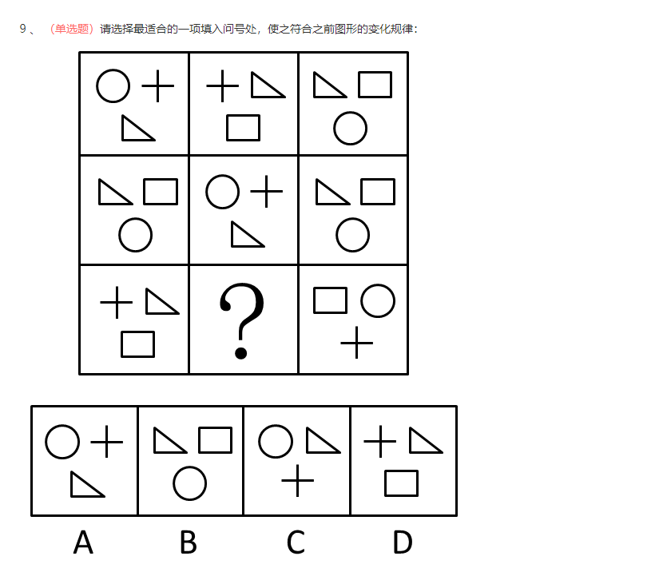

第一步，观察特征。
九宫格内是相同的几种元素，优先考虑数量类规律或者元素遍历。
第二步，九宫格，横向观察，没有明显规律，考虑竖向规律。
“十”字型优先考虑点，第一列，交点个数分别为4、7、8，和为19；第三列，交点个数分别为7、7、5，和为19；第二列，交点个数分别为8、4、？，和为19，问号处交点个数应该为7，只有B符合。

#### （3）数量类，倍数

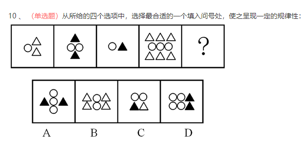

第一步，观察特征。
组成元素不同，优先考虑数量类或属性类。题干图形均由三种元素组成，元素的个数和种类无规律，考虑换算。
第二步，一条式，从左到右找规律。
整体观察，发现图1和图4中△的个数是○个数的2倍，而图2和图3中▲和○个数相等，当1▲=2△时，可以满足△的个数为○的2倍的规律。问号处应选择△的个数是○个数的2倍的图形，只有B项符合。

## 20240414

#### （1）数量类，封闭面

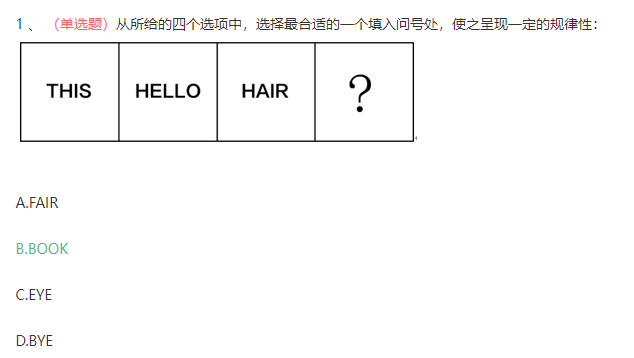

第一步，观察特征。
图形组成不同，考虑数量类或属性类。图形均为单词，为字母构成，考虑封闭区间。
第二步，一条式，从左到右找规律。
“THIS”中存在封闭区间的字母个数为0，“HELLO“中存在封闭区间的字母个数为1，
“HAIR“中存在封闭区间的字母个数为2，则问号处应选择存在封闭区间的字母为3个的单词。“BOOK”中“B”"O""O"3个字母含有封闭空间，符合规律。
因此，选择B选项。

#### （2）数量类，交点

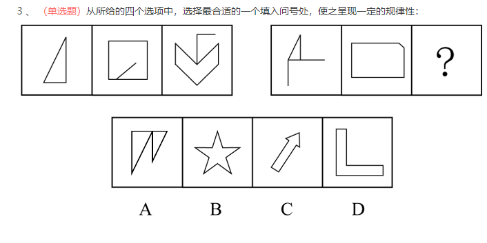

第一步，观察特征。
图形组成不同，考虑数量类或属性类。图形的相交特征明显，考虑数点。
第二步，两段式，第一段找规律，第二段用规律。
第一段中，三个图形的交点数量分别为3、5、7，呈等差规律；第二段中，前两个图形的交点数量分别为3、5，所以问号处的图形中交点个数应为7，只有C项符合。

## 20240415

#### （1）数量类，要素个数

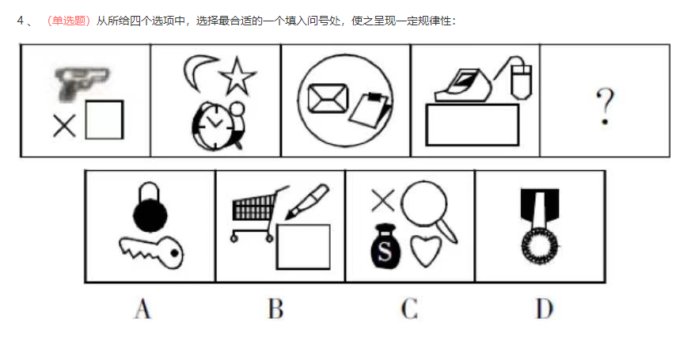

第一步，观察图形特征。
组成元素不同，优先考虑数量类或属性类。每个图形均由多种元素组成，考虑元素的个数和种类。
第二步，一条式，从左到右找规律。
题干前四个图形均由三个元素组成。所以问号处的图形应该包含3个元素，只有B项符合。

#### （2）笔画

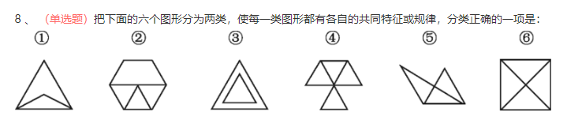

第一步，观察特征。
组成元素不同，优先考虑数量类或属性类。题干图形出现“田”字变形图，考虑笔画数。
第二步，根据规律进行分组。
图①④⑤均为一笔画图形，图②③⑥均为两笔画图形，据此分为两组。

## 20240416

#### （1）数量类，封闭面

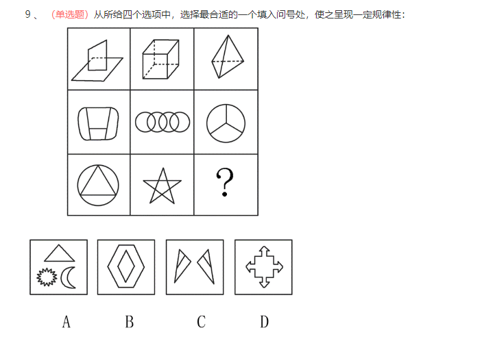

第一步，观察特征。
组成元素不同，优先考虑数量类或属性类。每个图形均有封闭区间，考虑数面。
第二步，九宫格，横向规律较为常见，优先考虑。
第一行立体图形中面的个数依次为2、6、4，2+4=6；第二行平面图形中面的个数依次为4、7、3，4+3=7，符合规律；第三行应用规律，前两个图形中面的个数依次为4、6、？，所以问号处应选择有2个面的图形，只有B项符合。

#### （2）数量类，封闭面

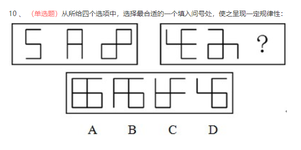

第一步，观察特征。
组成元素不同，优先考虑数量类或属性类。封闭空间特征明显，考虑数面。
第二步，两段式，第一段找规律，第二段应用规律。
第一段中面的个数依次为0、1、2，呈等差数列，第二段中前两个图形面的个数分别为0、1，所以问号处图形面的个数应为2。因此，选择B选项。

## 20240418

#### （1）数量类，直线及封闭面

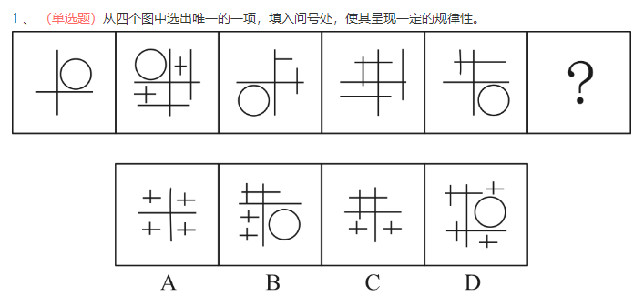

第一步，观察特征。
组成元素不同，但均含有明显的横线竖线以及封闭空间，优先考虑数线和数面。
第二步，一条式，从左到右找规律。
每幅图形中横线和竖线的数量均相等，排除D项；每幅图形均有一个封闭空间，排除A、B项。
因此，选择C选项。

## 20240419

#### （1）数量类，一笔画

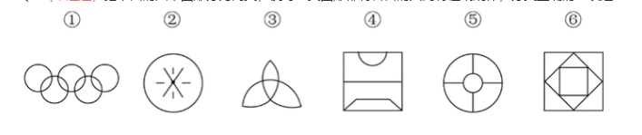

第一步，观察特征。
图形组成不同，考虑数量类或属性类。图形①多个圆相交是典型的一笔画特征图，因此考虑笔画数。
第二步，根据规律进行分组。
图形①③⑥为一笔画，图形②④⑤为多笔画，分为两组。
因此，选择B选项。

## 20240422

#### （1）数量类，直角

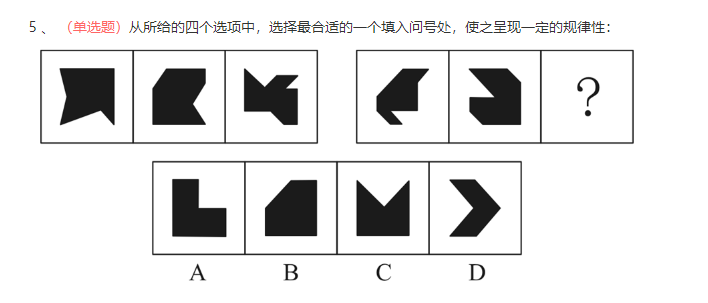

第一步，观察特征。
已知图形由黑色区域组成，且每个区域中均存在直角。优先考虑数量类数角。
第二步，两段式，第一段找规律，第二段应用规律。
第一段中，观察发现，黑色区域内部的直角个数分别为1、2、3。第二段中，图形的黑色区域内部的直角个数为1、2、？那么问号中应填入黑色区域内部的直角个数为3个的图形。分析选项，黑色区域内部的直角个数分别为：5、3、2、1，符合规律的只有B项。
