# CSS面试题

## CSS

##### 1、CSS引入方式有哪些

- 行内式，写在dom节点style属性中
- 内嵌式，写在style标签中
- 外链式，ink标签引入
- link 和 import 的区别
  - 加载资源限制
    - link是XHTML的标签，除了加载CSS，也可加载其他
    - @import只能加载CSS
  - 加载方式
    - link同步加载
    - @import异步加载


##### 2、CSS哪些样式可以继承，哪些不可以继承

> 与字体相关的样式通常可以继承，与尺寸相关的样式通常不能继承

- 可继承
  - font-size
  - font-family
  - color
- 不可继承
  - border
  - padding
  - margin
  - width
  - height


##### 3、为何要初始化CSS

消除不同浏览器的标签默认值

```css
* {
    padding: 0;
    margin:0
}
```


##### 4、CSS sprite（精灵）

网页需要的背景图片整合到一张图片文件中，再利用三个属性组成完成背景精确定位

- background-image
- background-repeat
- background-position

> 也可基于图片的base64格式编码存储，后将图片与其他类型的文件打包


##### 5、display:none 和 visiblity:hidden区别是什么

- ##### visiblity:hidden

  - 隐藏对应的元素，文档流中仍然留下分配空间

- display:none

  - 隐藏对应的元素，文档流不保留原来的空间位置


##### 6、如何让超出宽度的文字显示未省略号

```html
<div style="width: 40px;overflow:hidden;text-overflow: ellipsis;white-space: nowrap;">aaaaaaaaaaaaaaaaaaaaaaaaaaaaaaaaaaaaaaaaaaaaaaaaaaaaaaa</div>
```

`text-overflow: ellipsis;`：文本内容溢出时显示省略号（...）


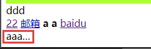


##### 7、px 和 em的区别是什么

- px

  - 固定值

- em

  - 相对值

    ```html
    <div style="font-size: 50px;">
        <div style="font-size: 100px;">
            还哈酒
        </div>
    </div>
    ```

    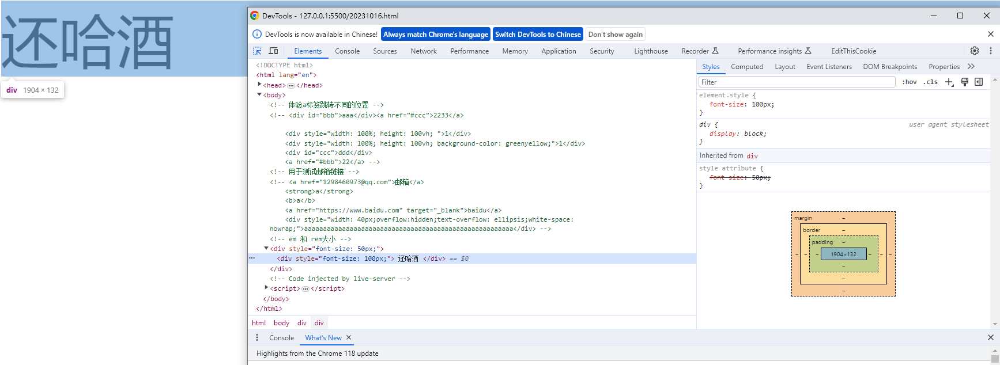

    ```html
    <div style="font-size: 50px;">
        <div style="font-size: 2em;">
            还哈酒
        </div>
    </div>
    ```

    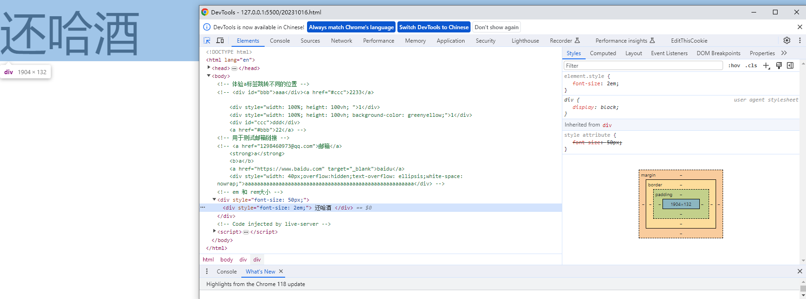

- rem

  - 相对于根元素（通常是html根元素）字体的大小

    ```html
    <div>
        还哈酒
    </div>
    ```

    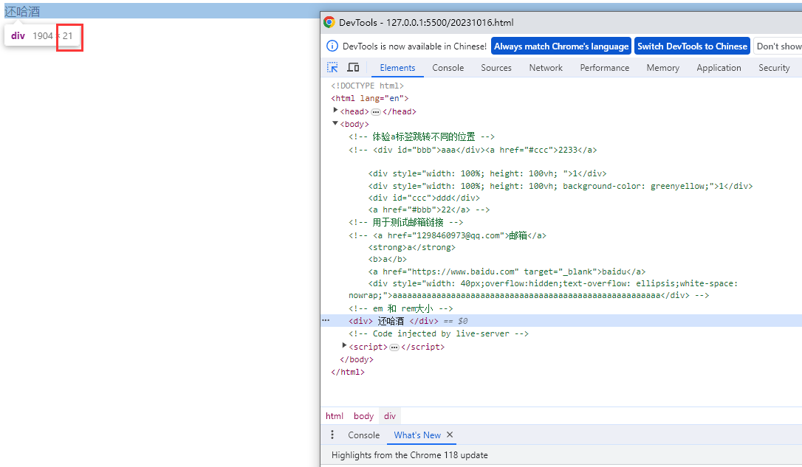

    ```html
    <div style="font-size: 2rem;">
        <div style="font-size: 2rem;">
            还哈酒
        </div>
    </div>
    ```

    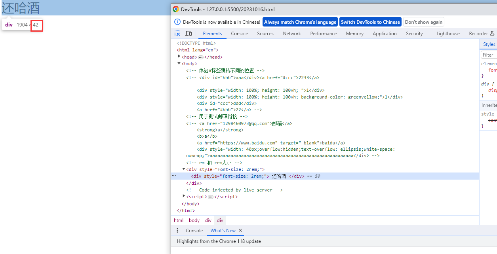


​					

##### 8、div+css布局较table布局的优点

- 表现与结构分离
  - 改版时候只需要更改CSS文件
- 搜索引擎优化SEO更友好


##### 9、解释BFC

BFC（Block Formatting Context） 块级格式化上下文

- 作用：在指定区域有独立渲染方式，内部元素无法影响外部元素
- 条件：
  - float
  - overflow不为visible
  - display-flex
  - position-absolute, fixed


##### 10、rgba 和 opacity的透明度有什么区别

- **`opacity`**：

  - 用于文本和背景，从0（完全透明）到1（完全不透明）的值

  - `opacity 会影响元素内所有内容（包括文本和子元素）的透明度。`

  - 示例：

    ```css
    .element {
        opacity: 0.5; /* 50%透明度 */
    }
    ```
  
- **`rgba`**：

  - 设置元素背景或文本的局部透明度，而不会影响元素内的其他内容。

  - 它接受四个参数：红、绿、蓝和透明度（alpha通道），透明度的值从0（完全透明）到1（完全不透明）。

  - 示例：

    ```css
    .element {
        background-color: rgba(255, 0, 0, 0.5); /* 红色背景，50%透明度 */
    }
    
    ```
  
    

##### 11、letter-spacing如何使用

`letter-spacing` 是CSS属性，用于控制文本中字符之间的空间间隔（字母间距）。可以使用它来增加或减少字符之间的距离，以改变文本的排列方式。以下是如何使用 `letter-spacing` 属性：

```css
.selector {
    letter-spacing: value;
}
```

- `.selector` 是您要应用样式的元素选择器。

- `value` 是一个长度值，可以是正数、负数或零，用来表示字符间的间距。它可以用像素（px）、百分比（%）、em、rem等单位来表示。

- 案例

  ```css
  /*下述代码将段落中的字符之间的间距增加2像素，使文本字符之间更宽*/
  p {
      letter-spacing: 2px;
  }
  
  /*下述代码将h1标题中的字符之间的间距减少1像素，使文本字符之间更紧凑。*/
  h1 {
      letter-spacing: -1px;
  }
  
  ```


##### 12、var 和 em是什么标签

`<var>` 标签：

- `<var>` 标签用于表示文本中的变量或占位符。它通常用于技术文档或数学公式中，以标识需要替换或代表某个值的文本。
- 例如，`<var>` 标签可以用于以下情况：

```html
<p>在方程式 <var>y = mx + b</var> 中，<var>m</var> 表示斜率，<var>b</var> 表示截距。</p>
```

- 浏览器通常会以斜体样式来呈现 `<var>` 中的文本，以突出显示它们作为变量的性质。

`<em>` 标签：

- `<em>` 标签用于表示文本中的强调，通常是斜体字。它用于强调文本的重要性或强调其中的关键词或短语。
- 例如，`<em>` 标签可以用于以下情况：

```html
<p>请小心处理文档中的 <em>重要</em> 信息。</p>
```

`<em>` 标签的目的是为了语义上强调文本，而不仅仅是样式上的斜体字。

:bulb: 要使文本显示为粗体（加粗），可以使用 `<b>` 或 `<strong>` 标签。通常推荐使用 `<strong>` 标签，因为它更加语义化，有助于提高文档的可访问性和搜索引擎优化。


##### 13、空白符合并的概念和使用场景

- 概念

  - 在HTML和CSS中，文本中的多个连续空白字符（例如空格、制表符和换行符）在渲染时被合并为单个空格字符，以减少文本内容中不必要的空格

- 使用场景

  - 在HTML中，浏览器通常会将多个连续的空白字符（空格、制表符、换行符等）合并为单个空格字符，以确保文本内容在渲染时不会产生额外的空间。这种合并不会影响HTML标签之间的空格，但会影响标签内部和标签文本之间的空格。例如：

    ```html
    <p>This    is       an        example.</p>
    ```

    在上面的HTML中，多个连续的空格字符在渲染时会被合并，显示为 "This is an example."。

    在CSS中，空白符合并也发生在文本内容中，以确保文本的渲染在布局时更一致。这可以通过CSS属性 `white-space` 来控制，具体取决于如何处理空白字符。以下是一些 `white-space` 属性的取值：

    - `normal`（默认值）：浏览器会进行空白符合并。
    - `nowrap`：不允许文本换行，但会进行空白符合并。
    - `pre`：保留所有空白字符，不进行空白符合并。

    例如，可以使用以下CSS来禁用空白符合并：

    ```css
    p {
        white-space: pre;
    }
    ```

    这将导致 `<p>` 元素中的空白字符被保留，而不会合并为单个空格字符。


##### 14、自适应的单位有哪些

- 百分比 %
- 相对于视口宽度的单位 vw
- 相对于视口高度的单位 vh
- 相对于视口宽度 或者 高度的单位 vm
- 相对于父元素字体大小的单位 em
- 相对于根元素字体大小的单位 rem

:bulb: `%` 单位是相对于父元素的百分比，它会随着包含元素的大小变化。`vm` 单位是相对于视口宽度的百分比，它会随着视口宽度的变化而变化，用于创建响应式设计。


## CSS3

> 如有不清楚的属性，可在[MDN网站中查找](https://developer.mozilla.org/zh-CN/docs/Web/CSS)

##### 1、CSS3新增了哪些伪类

:bulb: 伪类：一种CSS选择器，用于选择HTML元素的特定状态或位置，而不是元素本身的名称、类名或ID。伪类以冒号（:）开头，紧随元素选择器而来，用于添加特定的样式规则。

p：first-of-type 表示一组兄弟元素中其类型的第一个元素

```html
<dl>
  <dt>Vegetables:</dt>
  <dd>1. Tomatoes</dd>
  <dd>2. Cucumbers</dd>
  <dd>3. Mushrooms</dd>
  <dt>Fruits:</dt>
  <dd>4. Apples</dd>
  <dd>5. Mangos</dd>
  <dd>6. Pears</dd>
  <dd>7. Oranges</dd>
</dl>
```

```css
dt {
  font-weight: bold;
}

dd {
  margin: 3px;
}

dd:first-of-type {
  border: 2px solid orange;
}

```

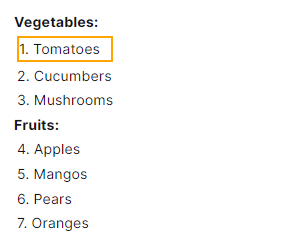

:first-of-type 和 :first-child两者有不同

- type匹配的是该类型的第一个元素
- child父元素的第一个子元素，可以说是结构上的第一个子元素


p：last-of-type 表示了在（它父元素的）子元素列表中，最后一个给定类型的元素。当代码类似 Parent tagName:last-of-type 的作用区域包含父元素的所有子元素中的最后一个选定元素，也包括子元素的最后一个子元素并以此类推。

```html
<p>
  <em>我没有颜色 :(</em><br />
  <strong>我没有颜色 :(</strong><br />
  <em>我有颜色 :D</em><br />
  <strong>我也没有颜色 :(</strong><br />
</p>

<p>
  <em>我没有颜色 :(</em><br />
  <span><em>我有颜色！</em></span
  ><br />
  <strong>我没有颜色 :(</strong><br />
  <em>我有颜色 :D</em><br />
  <span>
    <em>我在子元素里，但没有颜色！</em><br />
    <span style="text-decoration:line-through;"> 我没有颜色 </span><br />
    <em>我却有颜色！</em><br /> </span
  ><br />
  <strong>我也没有颜色 :(</strong>
</p>

```

```css
p em:last-of-type {
  color: lime;
}
```

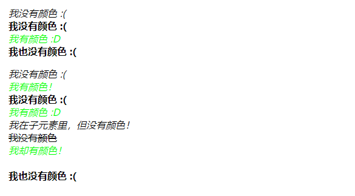

p：only-of-type 代表了任意一个元素，这个元素没有其他相同类型的兄弟元素。

```html
<p>To find out more about <b>QUIC</b>, check <a href="#">RFC 9000</a> and <a href="#">RFC 9114</a>.</p>

<dl>
  <dt>Published</dt>
  <dd>2021</dd>
  <dd>2022</dd>
</dl>

<p>Details about <b>QPACK</b> can be found in <a href="#">RFC 9204</a>.</p>

<dl>
  <dt>Published</dt>
  <dd>2022</dd>
</dl>

```

```css
a:only-of-type {
  color: fuchsia;
}

dd:only-of-type {
  background-color: bisque;
}

```

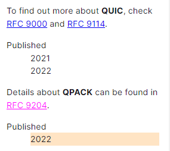

p：only-child 表示没有任何兄弟元素的元素。这与 `:first-child:last-child` 或 `:nth-child(1):nth-last-child(1)` 相同，但前者具有更小的权重性。

```html
<p>Stars expected to attend:</p>
<ol>
  <li>Robert Downey, Jr.</li>
</ol>

<p>Stars yet to confirm:</p>
<ol>
  <li>Scarlett Johansson</li>
  <li>Samuel L. Jackson</li>
  <li>Chris Pratt</li>
</ol>

<p>The ceremony is going to be held in <b>The Dolby Theatre</b>.</p>

```

```css
li:only-child {
  color: fuchsia;
}

b:only-child {
  text-decoration: underline;
}

```

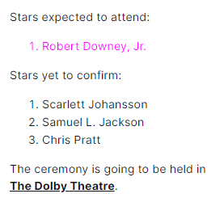

p：nth-child() 首先找到所有当前元素的兄弟元素，然后按照位置先后顺序从 1 开始排序，选择的结果为 CSS 伪类:nth-child 括号中表达式（an+b）匹配到的元素集合（n=0，1，2，3...）。示例：

- `0n+3` 或简单的 `3` 匹配第三个元素。
- `1n+0` 或简单的 `n` 匹配每个元素。
- `2n+0` 或简单的 `2n` 匹配位置为 2、4、6、8...的元素（n=0 时，2n+0=0，第 0 个元素不存在，因为是从 1 开始排序)。你可以使用关键字 **`even`** 来替换此表达式。
- `2n+1` 匹配位置为 1、3、5、7...的元素。你可以使用关键字 **`odd`** 来替换此表达式。
- `3n+4` 匹配位置为 4、7、10、13...的元素。

```html
<h3>
  <code>span:nth-child(2n+1)</code>, WITHOUT an <code>&lt;em&gt;</code> among
  the child elements.
</h3>
<p>Children 1, 3, 5, and 7 are selected.</p>
<div class="first">
  <span>Span 1!</span>
  <span>Span 2</span>
  <span>Span 3!</span>
  <span>Span 4</span>
  <span>Span 5!</span>
  <span>Span 6</span>
  <span>Span 7!</span>
</div>

<br />

<h3>
  <code>span:nth-child(2n+1)</code>, WITH an <code>&lt;em&gt;</code> among the
  child elements.
</h3>
<p>
  Children 1, 5, and 7 are selected.<br />
  3 is used in the counting because it is a child, but it isn't selected because
  it isn't a <code>&lt;span&gt;</code>.
</p>
<div class="second">
  <span>Span!</span>
  <span>Span</span>
  <em>This is an `em`.</em>
  <span>Span</span>
  <span>Span!</span>
  <span>Span</span>
  <span>Span!</span>
  <span>Span</span>
</div>

<br />

<h3>
  <code>span:nth-of-type(2n+1)</code>, WITH an <code>&lt;em&gt;</code> among the
  child elements.
</h3>
<p>
  Children 1, 4, 6, and 8 are selected.<br />
  3 isn't used in the counting or selected because it is an
  <code>&lt;em&gt;</code>, not a <code>&lt;span&gt;</code>, and
  <code>nth-of-type</code> only selects children of that type. The
  <code>&lt;em&gt;</code> is completely skipped over and ignored.
</p>
<div class="third">
  <span>Span!</span>
  <span>Span</span>
  <em>This is an `em`.</em>
  <span>Span!</span>
  <span>Span</span>
  <span>Span!</span>
  <span>Span</span>
  <span>Span!</span>
</div>

```

```css
html {
  font-family: sans-serif;
}

span,
div em {
  padding: 5px;
  border: 1px solid green;
  display: inline-block;
  margin-bottom: 3px;
}

.first span:nth-child(2n + 1),
.second span:nth-child(2n + 1),
.third span:nth-of-type(2n + 1) {
  background-color: lime;
}

```

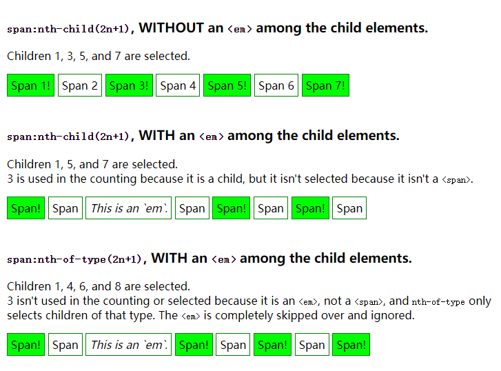

:enabled:disabled 表示任何已启用的元素。如果元素可以被激活（例如被选择、单击、输入文本等），或者能够获得焦点，那么它就是启用的。该元素还有一个被禁用的状态，在此状态下它无法被激活或接受焦点。

```html
<form>
  <label for="name">Name:</label>
  <input name="name" type="text" />

  <label for="emp">Employed:</label>
  <select name="emp" disabled>
    <option>No</option>
    <option>Yes</option>
  </select>

  <label for="empDate">Employment Date:</label>
  <input name="empDate" type="date" disabled />

  <label for="resume">Resume:</label>
  <input name="resume" type="file" />
</form>

```

```css
label {
  display: block;
  margin-top: 1em;
}

*:enabled {
  background-color: gold;
}

```

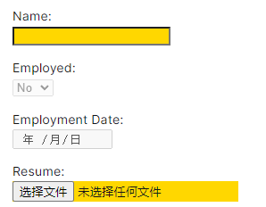

:checked 表示任何处于选中状态的**radio**(`<input type="radio">`), **checkbox** (`<input type="checkbox">`) 或 ("select") 元素中的**option** HTML 元素 ("option")。

```html
<div>
  <input type="radio" name="my-input" id="yes" />
  <label for="yes">Yes</label>

  <input type="radio" name="my-input" id="no" />
  <label for="no">No</label>
</div>

<div>
  <input type="checkbox" name="my-checkbox" id="opt-in" />
  <label for="opt-in">Check me!</label>
</div>

<select name="my-select" id="fruit">
  <option value="opt1">Apples</option>
  <option value="opt2">Grapes</option>
  <option value="opt3">Pears</option>
</select>

```

```css
div,
select {
  margin: 8px;
}

/* Labels for checked inputs */
input:checked + label {
  color: red;
}

/* Radio element, when checked */
input[type="radio"]:checked {
  box-shadow: 0 0 0 3px orange;
}

/* Checkbox element, when checked */
input[type="checkbox"]:checked {
  box-shadow: 0 0 0 3px hotpink;
}

/* Option elements, when selected */
option:checked {
  box-shadow: 0 0 0 3px lime;
  color: red;
}

```

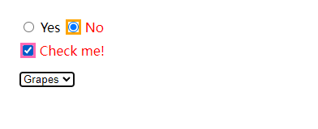


:book: animation动画，transition过渡，transform变形

##### 2、animation

###### 2.1 animation-name 

> 指定一个或多个名称，这些名称描述了要应用于元素的动画。

- 该名称由区分大小写的字母 `a` 到 `z`、数字 `0` 到 `9`、下划线（`_`）和/或破折号（`-`）组成。第一个非破折号字符必须是一个字母。此外，在标识符开头不能有两个破折号。此外，标识符不能为 `none`、`unset`、`initial` 或 `inherit`。

- 示例

  ```html
  <div class="box"></div>
  ```

  ```css
  .box {
    background-color: rebeccapurple;
    border-radius: 10px;
    width: 100px;
    height: 100px;
  }
  
  .box:hover {
    animation-name: rotate;
    animation-duration: 0.7s;
  }
  
  @keyframes rotate {
    0% {
      transform: rotate(0);
    }
    100% {
      transform: rotate(360deg);
    }
  }
  
  ```

  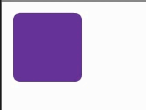

###### 2.2 animation-duration

>  设置动画完成一个周期需要的时间。

- 可以用秒（`s`）或毫秒（`ms`）指定。值必须是正数或零，单位是必需的

- 如果未提供值，则使用默认值 `0s`

- 示例

  ```html
  <div class="box"></div>
  
  ```

  ```css
  .box {
    background-color: rebeccapurple;
    border-radius: 10px;
    width: 100px;
    height: 100px;
  }
  
  .box:hover {
    animation-name: rotate;
    animation-duration: 0.7s;
  }
  
  @keyframes rotate {
    0% {
      transform: rotate(0);
    }
    100% {
      transform: rotate(360deg);
    }
  }
  
  ```

  

###### 2.3 animation-timing-funcion 

> 设置动画在每个周期的持续时间内如何进行。

- 值

  - [`ease`](https://developer.mozilla.org/zh-CN/docs/Web/CSS/animation-timing-function#ease)

    等同于 `cubic-bezier(0.25, 0.1, 0.25, 1.0)`，即默认值，表示动画在中间加速，在结束时减速

  - [`linear`](https://developer.mozilla.org/zh-CN/docs/Web/CSS/animation-timing-function#linear)

    等同于 `cubic-bezier(0.0, 0.0, 1.0, 1.0)`，表示动画以匀速运动。

  - [`ease-in`](https://developer.mozilla.org/zh-CN/docs/Web/CSS/animation-timing-function#ease-in)

    等同于 `cubic-bezier(0.42, 0, 1.0, 1.0)`，表示动画一开始较慢，随着动画属性的变化逐渐加速，直至完成。

  - [`ease-out`](https://developer.mozilla.org/zh-CN/docs/Web/CSS/animation-timing-function#ease-out)

    等同于 `cubic-bezier(0, 0, 0.58, 1.0)`，表示动画一开始较快，随着动画的进行逐渐减速。

  - [`ease-in-out`](https://developer.mozilla.org/zh-CN/docs/Web/CSS/animation-timing-function#ease-in-out)

    等同于 `cubic-bezier(0.42, 0, 0.58, 1.0)`，表示动画属性一开始缓慢变化，随后加速变化，最后再次减速变化。

  - [`cubic-bezier(p1, p2, p3, p4)`](https://developer.mozilla.org/zh-CN/docs/Web/CSS/animation-timing-function#cubic-bezierp1_p2_p3_p4)

    开发者自定义的三次贝塞尔曲线，其中 p1 和 p3 的值必须在 0 到 1 的范围内。

  - 其他如steps 略，详见[这里](https://developer.mozilla.org/zh-CN/docs/Web/CSS/animation-timing-function)

- 示例

```css
.ease {
  animation-timing-function: ease;
}
.easein {
  animation-timing-function: ease-in;
}
.easeout {
  animation-timing-function: ease-out;
}
.easeinout {
  animation-timing-function: ease-in-out;
}
.linear {
  animation-timing-function: linear;
}
.cb {
  animation-timing-function: cubic-bezier(0.2, -2, 0.8, 2);
}

```

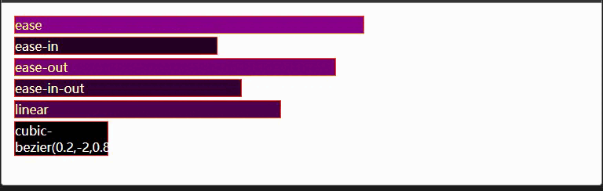

###### 2.4 animation-delay

> 指定从应用动画到元素开始执行动画之前等待的时间量。动画可以稍后开始、立即从开头开始或立即开始并在动画中途播放。

- 值
  - 可以用秒（`s`）或毫秒（`ms`）指定。单位是必需的。
  - 正值表示动画应在指定的时间量过去后开始。默认值为 `0s`，表示动画应立即开始。
  - 负值会导致动画立即开始，但是从动画循环的某个时间点开始。
- 示例

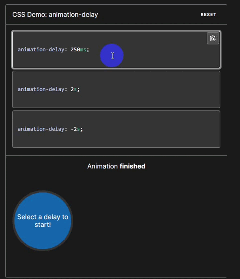

###### 2.5 animation-iteration-count

> 设置动画序列在停止前应播放的次数

- 值

  - [`infinite`](https://developer.mozilla.org/zh-CN/docs/Web/CSS/animation-iteration-count#infinite)

  无限循环播放动画。

  - `number`

  动画重复的次数；默认为 `1`。你可以指定非整数值以播放动画循环的一部分：例如，`0.5` 将播放动画循环的一半。负值是无效的。

- 示例

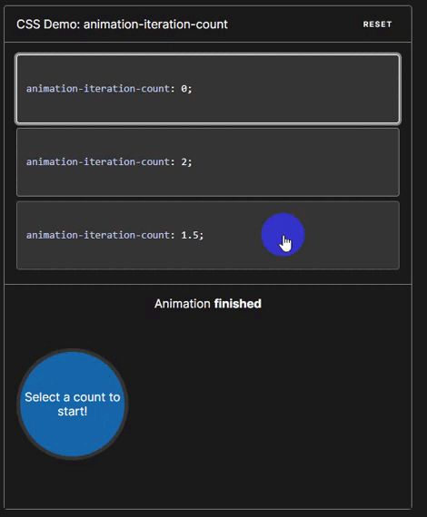

###### 2.6 animation-direction

> 设置动画是应正向播放、反向播放还是在正向和反向之间交替播放。

- 值

  - [`normal`](https://developer.mozilla.org/zh-CN/docs/Web/CSS/animation-direction#normal)
    - 动画在每个循环中*正向*播放。换句话说，每次动画循环时，动画将重置为起始状态并重新开始。这是默认值。

  - [`reverse`](https://developer.mozilla.org/zh-CN/docs/Web/CSS/animation-direction#reverse)
    - 动画在每个循环中*反向*播放。换句话说，每次动画循环时，动画将重置为结束状态并重新开始。动画步骤将反向执行，并且时间函数也将被反转。例如，`ease-in` 时间函数变为 `ease-out`。

  - [`alternate`](https://developer.mozilla.org/zh-CN/docs/Web/CSS/animation-direction#alternate)
    - 动画在每个循环中正反交替播放，第一次迭代是*正向*播放。确定循环是奇数还是偶数的计数从 1 开始。
  - [`alternate-reverse`](https://developer.mozilla.org/zh-CN/docs/Web/CSS/animation-direction#alternate-reverse)
    - 动画在每个循环中正反交替播放，第一次迭代是*反向*播放。确定循环是奇数还是偶数的计数从 1 开始。

- 示例

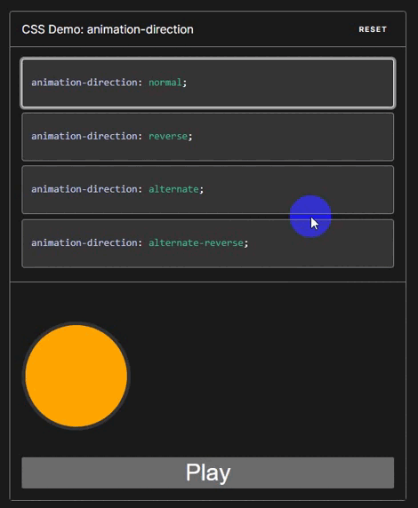

###### 2.7 animation-fill-mode

> 设置 CSS 动画在执行之前和之后如何将样式应用于其目标。

- 值

  - [`none`](https://developer.mozilla.org/zh-CN/docs/Web/CSS/animation-fill-mode#none)

    当动画未执行时，动画将不会将任何样式应用于目标，而是已经赋予给该元素的 CSS 规则来显示该元素。这是默认值。

  - [`forwards`](https://developer.mozilla.org/zh-CN/docs/Web/CSS/animation-fill-mode#forwards)

    目标将保留由执行期间遇到的最后一个关键帧计算值。最后一个关键帧取决于animaiton-direction 和 animation-iteration-count值

    | `animation-direction` | `animation-iteration-count` | last keyframe encountered |
    | :-------------------- | :-------------------------- | :------------------------ |
    | `normal`              | even or odd                 | `100%` or `to`            |
    | `reverse`             | even or odd                 | `0%` or `from`            |
    | `alternate`           | even                        | `0%` or `from`            |
    | `alternate`           | odd                         | `100%` or `to`            |
    | `alternate-reverse`   | even                        | `100%` or `to`            |
    | `alternate-reverse`   | odd                         | `0%` or `from`            |

  - [`backwards`](https://developer.mozilla.org/zh-CN/docs/Web/CSS/animation-fill-mode#backwards)

    动画将在应用于目标时立即应用第一个关键帧中定义的值，并在animation-delay期间保留此值。第一个关键帧取决于animation-direction值

    | `animation-direction`            | first relevant keyframe |
    | :------------------------------- | :---------------------- |
    | `normal` or `alternate`          | `0%` or `from`          |
    | `reverse` or `alternate-reverse` | `100%` or `to`          |

  - [`both`](https://developer.mozilla.org/zh-CN/docs/Web/CSS/animation-fill-mode#both)

    动画将遵循`forwards`和`backwards`的规则，从而在两个方向上扩展动画属性。

- 示例

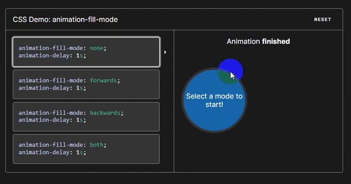

###### 2.8 animation-play-state

> 设置动画是运行还是暂停。

- 值

  - [`running`](https://developer.mozilla.org/zh-CN/docs/Web/CSS/animation-play-state#running)

    当前**动画**正在**运行**。

  - [`paused`](https://developer.mozilla.org/zh-CN/docs/Web/CSS/animation-play-state#paused)

    当前**动画**已被**停止**。

- 示例

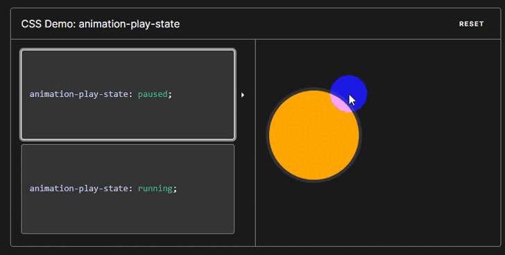

###### 2.9 animation简写方式 :star:

- [详细使用地址在这里](https://developer.mozilla.org/zh-CN/docs/Web/CSS/animation)

- 示例1

```css
/* @keyframes duration | easing-function | delay |
iteration-count | direction | fill-mode | play-state | name */
animation: 3s ease-in 1s 2 reverse both paused slidein;

/* @keyframes duration | easing-function | delay | name */
animation: 3s linear 1s slidein;

/* two animations */
animation:
  3s linear slidein,
  3s ease-out 5s slideout;
```

- 示例2 赛龙人之眼

```html
<div class="view_port">
  <div class="polling_message">Listening for dispatches</div>
  <div class="cylon_eye"></div>
</div>
```

```css
.polling_message {
  color: white;
  float: left;
  margin-right: 2%;
}

.view_port {
  background-color: black;
  height: 25px;
  width: 100%;
  overflow: hidden;
}

.cylon_eye {
  background-color: red;
  background-image: linear-gradient(
    to right,
    rgba(0, 0, 0, 0.9) 25%,
    rgba(0, 0, 0, 0.1) 50%,
    rgba(0, 0, 0, 0.9) 75%
  );
  color: white;
  height: 100%;
  width: 20%;

  -webkit-animation: 4s linear 0s infinite alternate move_eye;
  animation: 4s linear 0s infinite alternate move_eye;
}

@-webkit-keyframes move_eye {
  from {
    margin-left: -20%;
  }
  to {
    margin-left: 100%;
  }
}
@keyframes move_eye {
  from {
    margin-left: -20%;
  }
  to {
    margin-left: 100%;
  }
}

```

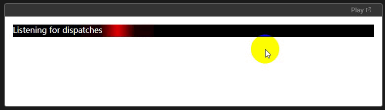

##### 3、transition 

###### 3.1 transition-property

> 指定应用过渡属性的名称

- 值

  - [`none`](https://developer.mozilla.org/zh-CN/docs/Web/CSS/transition-property#none)

    没有过渡动画。

  - [`all`](https://developer.mozilla.org/zh-CN/docs/Web/CSS/transition-property#all)

    所有可被动画的属性都表现出过渡动画。

  - [`IDENT`](https://developer.mozilla.org/zh-CN/docs/Web/CSS/transition-property#ident)

    属性名称。由小写字母 `a` 到 `z`，数字 `0` 到 `9`，下划线（`_`）和破折号（`-`）。第一个非破折号字符不能是数字。同时，不能以两个破折号开头。

- 示例

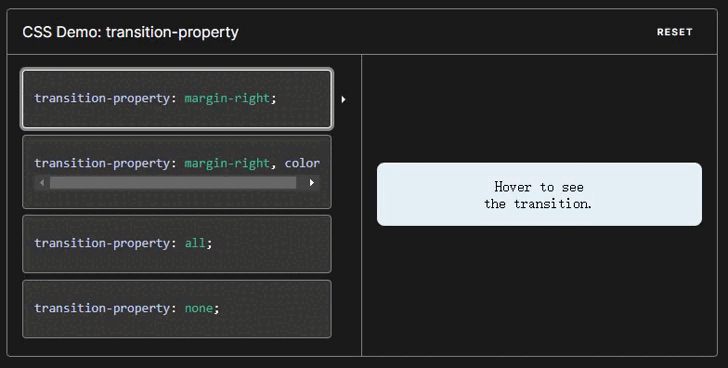

###### 3.2 transition-duration

> 以秒或毫秒为单位指定过渡动画所需的时间。默认值为 `0s`，表示不出现过渡动画。

- 值
  - [`time`](https://developer.mozilla.org/zh-CN/docs/Web/CSS/transition-duration#time)类型。表示过渡属性从旧的值转变到新的值所需要的时间。如果时长是 `0s` ，表示不会呈现过渡动画，属性会瞬间完成转变。不接受负值。
- 示例

```html
<div class="box duration-1">0.5 秒</div>

<div class="box duration-2">2 秒</div>

<div class="box duration-3">4 秒</div>

<button id="change">变换</button>

```

```css
.box {
  margin: 20px;
  padding: 10px;
  display: inline-block;
  width: 100px;
  height: 100px;
  background-color: red;
  font-size: 18px;
  transition-property: background-color font-size transform color;
  transition-timing-function: ease-in-out;
}

.transformed-state {
  transform: rotate(270deg);
  background-color: blue;
  font-size: 12px;
  transition-property: background-color font-size transform color;
  transition-timing-function: ease-in-out;
}

.duration-1 {
  transition-duration: 0.5s;
}

.duration-2 {
  transition-duration: 2s;
}

.duration-3 {
  transition-duration: 4s;
}

```

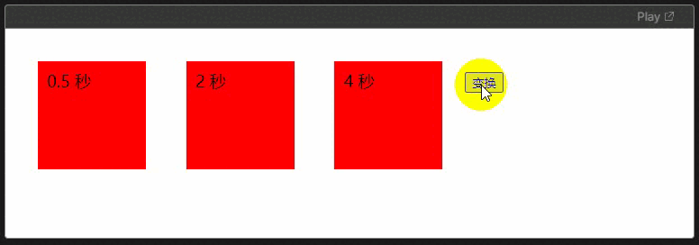


###### 3.3 transition-timing-funcion

> 用来描述这个中间值是怎样计算的。实质上，通过这个函数会建立一条加速度曲线，因此在整个 transition 变化过程中，变化速度可以不断改变。

- 值
  - 通过[`transition-property`](https://developer.mozilla.org/zh-CN/docs/Web/CSS/transition-property)中定义被过渡属性，每个timing-function的值代表与这个属性相对应的 timing function.
- 示例

```css
.ease {
  transition-timing-function: ease;
}
.easein {
  transition-timing-function: ease-in;
}
.easeout {
  transition-timing-function: ease-out;
}
.easeinout {
  transition-timing-function: ease-in-out;
}
.linear {
  transition-timing-function: linear;
}
.cb {
  transition-timing-function: cubic-bezier(0.2, -2, 0.8, 2);
}

```

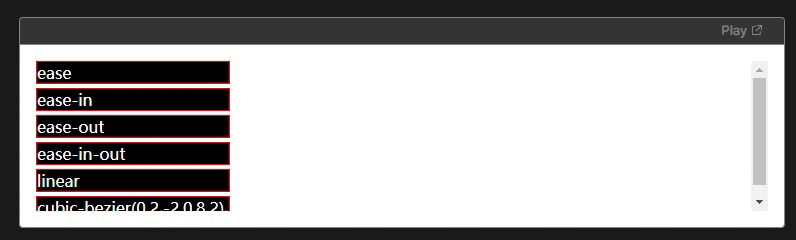

###### 3.4 transition-delay

> 规定了在过渡效果开始前需要等待的时间

- 值
  - 以秒（s）或毫秒（ms）为单位，表明动画过渡效果将在何时开始。取值为正时会延迟一段时间来响应过渡效果；取值为负时会导致过渡立即开始。
- 示例

```css
.box {
  margin: 20px;
  padding: 10px;
  display: inline-block;
  width: 100px;
  height: 100px;
  background-color: red;
  font-size: 18px;
  transition-property: background-color, font-size, transform, color;
  transition-timing-function: ease-in-out;
  transition-duration: 3s;
}

.transformed-state {
  transform: rotate(270deg);
  background-color: blue;
  color: yellow;
  font-size: 12px;
  transition-property: background-color, font-size, transform, color;
  transition-timing-function: ease-in-out;
  transition-duration: 3s;
}

.delay-1 {
  transition-delay: 0.5s;
}

.delay-2 {
  transition-delay: 2s;
}

.delay-3 {
  transition-delay: 4s;
}

```

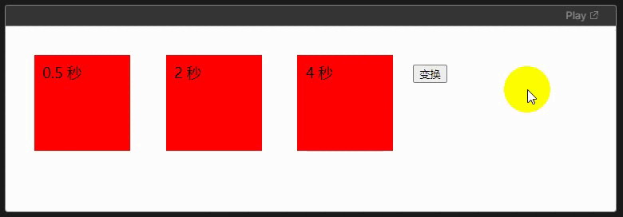

###### 3.5 transition简写方式 :star: 

> 是上述transition-property、transition-duration、transition-timing-function 和 transition-delay的简写属性

[详细地址在这里](https://developer.mozilla.org/zh-CN/docs/Web/CSS/transition)

- 示例1

```css
/* Apply to 1 property */
/* property name | duration */
transition: margin-right 4s;

/* property name | duration | delay */
transition: margin-right 4s 1s;

/* property name | duration | timing function */
transition: margin-right 4s ease-in-out;

/* property name | duration | timing function | delay */
transition: margin-right 4s ease-in-out 1s;

/* Apply to 2 properties */
transition:
  margin-right 4s,
  color 1s;

/* Apply to all changed properties */
transition: all 0.5s ease-out;

/* Global values */
transition: inherit;
transition: initial;
transition: unset;

```

- 实例2

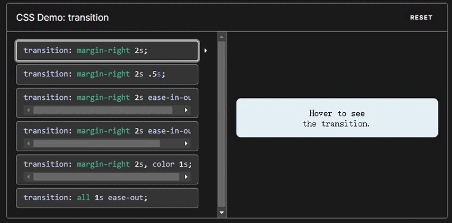

##### 4、animation & transition 的区别 :star:

animation 和 transition 功能相同，都是通过改变元素的属性值来实现动画效果。

- transition 只能指定属性的开始值 和 结束值，然后在这两个属性值之间使用平滑过渡的方式实现动画效果，不能实现复杂的效果
- animation 通过定义多个关键帧，以及每个关键帧中元素的属性值来实现更复杂的动画效果。


##### 5、transform 

> 旋转，缩放，倾斜或平移给定元素。这是通过修改 CSS 视觉格式化模型的坐标空间来实现的。

```css
/* Keyword values */
transform: none;

/* Function values */
transform: matrix(1, 2, 3, 4, 5, 6);
transform: translate(12px, 50%);
transform: translateX(2em);
transform: translateY(3in);
transform: scale(2, 0.5);
transform: scaleX(2);
transform: scaleY(0.5);
transform: rotate(0.5turn);
transform: skew(30deg, 20deg);
transform: skewX(30deg);
transform: skewY(1.07rad);
transform: matrix3d(1, 2, 3, 4, 5, 6, 7, 8, 9, 10, 11, 12, 13, 14, 15, 16);
transform: translate3d(12px, 50%, 3em);
transform: translateZ(2px);
transform: scale3d(2.5, 1.2, 0.3);
transform: scaleZ(0.3);
transform: rotate3d(1, 2, 3, 10deg);
transform: rotateX(10deg);
transform: rotateY(10deg);
transform: rotateZ(10deg);
transform: perspective(17px);

/* Multiple function values */
transform: translateX(10px) rotate(10deg) translateY(5px);

/* Global values */
transform: inherit;
transform: initial;
transform: unset;

```

示例

```
transform: matrix(1, 2, 3, 4, 5, 6);
```

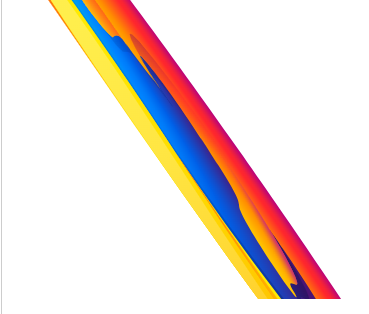

```
transform: translate(20px, 20%);
```


```
transform: scale(2, 0.5);
```

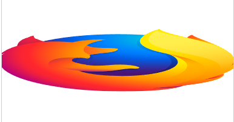

```
transform: rotate(0.5turn);
```


```
transform: skew(30deg, 20deg);
```


```
transform: scale(0.5) translate(-100%, -100%);
```

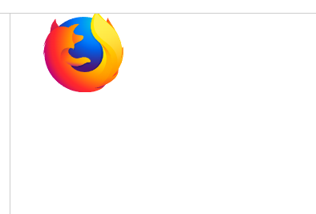

##### 6、如何设置CSS3文本阴影

> text-shadow 为文本添加阴影。可为文字添加多个阴影，阴影值之间用逗号隔开。每个阴影值由元素在X和Y方向的偏移量、模糊半径 和 颜色值组成。

- 使用方式

  - 每个阴影都有两到三个 `<length>` 参数，以及一个与阴影颜色相关的 `<color>` 参数。前两个 `<length>` 参数，是以“文字中心”为原点的坐标轴，分别为 x 轴 `<offset-x>` 和 y 轴 `<offset-y>` 的值；如果有第三个 `<length>` 参数，则第三个数值为形成阴影效果的半径的数值 `<blur-radius>`。

- 值

  - [`color`](https://developer.mozilla.org/zh-CN/docs/Web/CSS/color_value)

    可选。阴影的颜色。可以在偏移量之前或之后指定。如果没有指定颜色，则使用用户代理自行选择的颜色，因此需要跨浏览器的一致性时，应该明确定义它。

  - [`offse-x 和 offset-y`](https://developer.mozilla.org/zh-CN/docs/Web/CSS/text-shadow#offset-x_offset-y)

    必选。这些 [``](https://developer.mozilla.org/zh-CN/docs/Web/CSS/length) 值指定阴影相对文字的偏移量。`<offset-x>` 指定水平偏移量，若是负值则阴影位于文字左侧。`<offset-y>` 指定垂直偏移量，若是负值则阴影位于文字上方。如果两者均为 `0`，则阴影位于文字正后方，如果设置了 `<blur-radius>` 则会产生模糊效果。

  - [`blur-radius`](https://developer.mozilla.org/zh-CN/docs/Web/CSS/text-shadow#blur-radius)

    可选。这是 [``](https://developer.mozilla.org/zh-CN/docs/Web/CSS/length) 值。如果没有指定，则默认为 0。值越大，模糊半径越大，阴影也就越大越淡（wider and lighter）。

- 案例

  ```css
  /* offset-x | offset-y | blur-radius | color */
  text-shadow: 1px 1px 2px black;
  
  /* color | offset-x | offset-y | blur-radius */
  text-shadow: #fc0 1px 0 10px;
  
  /* offset-x | offset-y | color */
  text-shadow: 5px 5px #558abb;
  
  /* color | offset-x | offset-y */
  text-shadow: white 2px 5px;
  
  /* offset-x | offset-y
  /* Use defaults for color and blur-radius */
  text-shadow: 5px 10px;
  ```

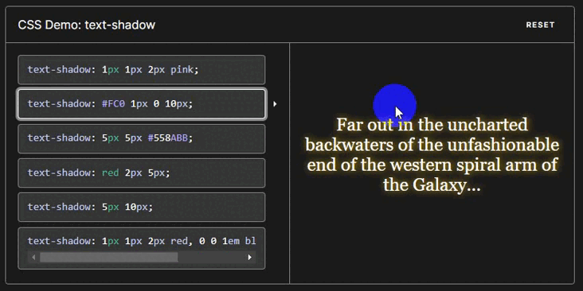

##### 7、如何设置盒阴影

> box-shadow 用于在元素的框架上添加阴影效果。你可以在同一个元素上设置多个阴影效果，并用逗号将他们分隔开。该属性可设置的值包括阴影的 X 轴偏移量、Y 轴偏移量、模糊半径、扩散半径和颜色。

- 使用方式
  - 当给出两个、三个或四个`<length>`值时。
    - 如果只给出两个值，那么这两个值将会被当作 `<offset-x><offset-y>` 来解释。
    - 如果给出了第三个值，那么第三个值将会被当作`<blur-radius>`解释。
    - 如果给出了第四个值，那么第四个值将会被当作`<spread-radius>`来解释。
  - 可选，`inset`关键字
    - 如果没有指定`inset`，默认阴影在边框外，即阴影向外扩散。 使用 `inset` 关键字会使得阴影落在盒子内部，这样看起来就像是内容被压低了。此时阴影会在边框之内 (即使是透明边框）、背景之上、内容之下
  - 可选，`<color>`值。
- 案例

```css
/* x 偏移量 | y 偏移量 | 阴影颜色 */
box-shadow: 60px -16px teal;

/* x 偏移量 | y 偏移量 | 阴影模糊半径 | 阴影颜色 */
box-shadow: 10px 5px 5px black;

/* x 偏移量 | y 偏移量 | 阴影模糊半径 | 阴影扩散半径 | 阴影颜色 */
box-shadow: 2px 2px 2px 1px rgba(0, 0, 0, 0.2);

/* 插页 (阴影向内) | x 偏移量 | y 偏移量 | 阴影颜色 */
box-shadow: inset 5em 1em gold;

/* 任意数量的阴影，以逗号分隔 */
box-shadow:
  3px 3px red,
  -1em 0 0.4em olive;

/* 全局关键字 */
box-shadow: inherit;
box-shadow: initial;
box-shadow: unset;

```

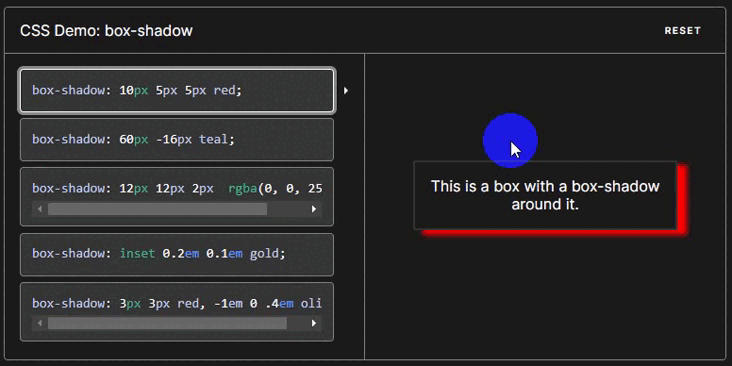

##### 8、如何使用@keyframes

- 定义关键帧
  - 创建一个带名称的 `@keyframes` 规则，以便后续使用[`animation-name`](https://developer.mozilla.org/zh-CN/docs/Web/CSS/animation-name) 属性将动画同其关键帧声明匹配。每个 `@keyframes` 规则包含多个关键帧，也就是一段样式块语句，每个关键帧有一个百分比值作为名称，代表在动画进行中，在哪个阶段触发这个帧所包含的样式。

- 使用关键帧
  - 如果一个关键帧规则没有指定动画的开始或结束状态（也就是，`0%`/`from` 和`100%`/`to`，浏览器将使用元素的现有样式作为起始/结束状态。这可以用来从初始状态开始元素动画，最终返回初始状态。
  - 如果在关键帧的样式中使用了不能用作动画的属性，那么这些属性会被忽略掉，支持动画的属性仍然是有效的，不受波及。
- 如果多个关键帧使用同一个名称，以最后一次定义的为准 :warning: 

```css
/* 50% 关键帧中分别最后设置的属性 top: 10px 和 left: 20px 是有效的，但是其他的属性会被忽略。*/
@keyframes identifier {
  0% {
    top: 0;
  }
  50% {
    top: 30px;
    left: 20px;
  }
  50% {
    top: 10px;
  }
  100% {
    top: 0;
  }
}

```

- 案例

```html
<!DOCTYPE html>
<html lang="en">
<head>
    <meta charset="UTF-8">
    <meta name="viewport" content="width=device-width, initial-scale=1.0">
    <title>Document</title>
    <style>
        .mydiv{
            width: 100px;
            height: 50px;
            background-color: #f30;
            position: relative;
            animation: myMove 5s;
        }
        @keyframes myMove {
            0% {
                top: 0;
                left: 0;
            }
            30% {
                top: 50px;
            }
            68%,
            72% {
                left: 50px;
            }
            100% {
                top: 100px;
                left: 200px;
            }     
        }
    </style>
</head>
<body>
    <div style="background-color: rebeccapurple;" class="mydiv">
        111
    </div>
</body>
</html>
```

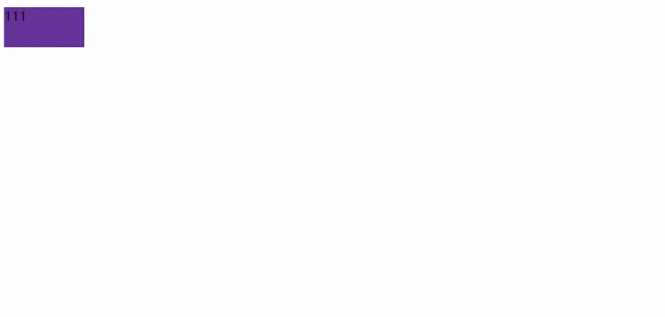