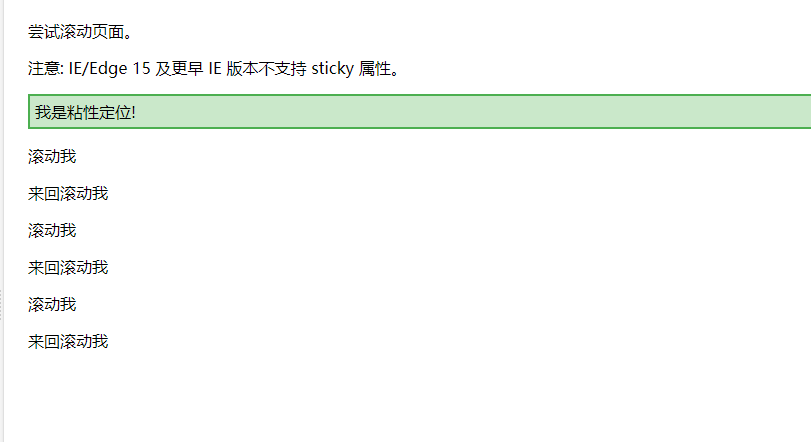
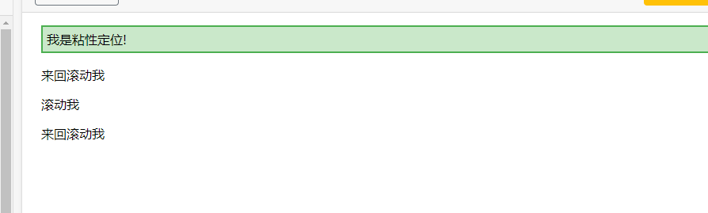

# 面试题

## 1、position值分别是相对哪个位置定位的

- relative：相对自己本身所在正常文档流的位置进行定位
- absolute：相对于最近一级的父元素
- static：默认值
- sticky：生成粘性定位的元素

:bulb: 粘性定位的元素是依赖于用户的滚动，在 **position:relative** 与 **position:fixed** 定位之间切换。它的行为就像 **position:relative;** 而当页面滚动超出目标区域时，它的表现就像 **position:fixed;**，它会固定在目标位置。





## 2、em 和 rem

em: 相对父元素

rem: 相对根元素（HTML元素）


## 3、opacity 和 rgba区别

1. **作用范围**：`opacity`影响整个元素，包括内容和边框；而`rgba`只影响元素的填充色。
2. **使用场景**：如果你需要设置整个元素的透明度，使用`opacity`；如果你需要设置元素的颜色和填充透明度，使用`rgba`。

```css
.element {
  opacity: 0.5; /* 元素50%透明 */
}

.element {
  background-color: rgba(255, 255, 255, 0.5); /* 背景颜色为白色，50%透明 */
}
```


## 4、Canvas 和 SVG

Canvas：

- 绘制完成后不能访问像素或操作该对象，适于游戏动画（因不需要后续操作）
- 结果是位图

SVG：

- SVG需要记录坐标，同时可绑定事件
- 结果是矢量图


## 5、rem使用方式

```css
@media (max-width: 600px) {
  html {
    font-size: 14px; /* 在小屏幕上减小字体大小 */
  }
}

.element {
  width: 20rem; /* 相当于20 * 16px = 320px */
  padding: 1rem; /* 相当于16px */
  font-size: 1.5rem; /* 相当于24px */
}
```

