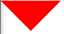
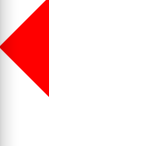
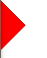
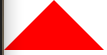
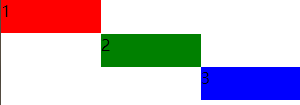
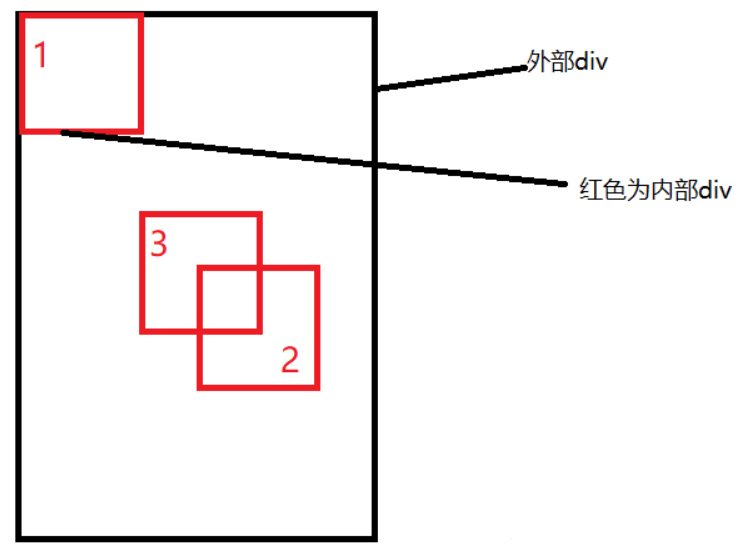

# CSS面试题

## 1、css动画

animation： 指定标签css如hover事件，设置动画名称（自定义），动画持续时间，根据动画名称内的变形去做展示

```html
<div class="box"></div>
```

```css
.box {
  background-color: rebeccapurple;
  border-radius: 10px;
  width: 100px;
  height: 100px;
}

.box:hover {
  animation-name: myrotate;
  animation-duration: 0.7s;
}

@keyframes myrotate {
  0% {
    transform: rotate(0);
  }
  100% {
    transform: rotate(360deg);
  }
}
```

transition: 在标签css上设置transition属性，变换属性名称、变换持续时间等的描述，并设置变换后的结果如在hover上设置变换后的结果

```html
 <p>
    下面的盒子包含 width、height、background-color 和 rotate
    的过渡效果。鼠标停留在盒子上以观察这些属性是如何变化的。
</p>
<div class="box">示例</div>
```

```css
.box {
  border-style: solid;
  border-width: 1px;
  display: block;
  width: 100px;
  height: 100px;
  background-color: #0000ff;
  transition:
    width 2s,
    height 2s,
    background-color 2s,
    rotate 2s;
}

.box:hover {
  background-color: #ffcccc;
  width: 200px;
  height: 200px;
  rotate: 180deg;
}
```


transform变形

## 2、手写三角形

向下

```css
.triangle {
    width: 0;
    height: 0;
    border-style:solid;
    border-width: 50px 50px 0;
    border-color: red transparent;
    position: relative;
}
```



向左

```css
.triangle {
    width: 0;
    height: 0;
    border-style:solid;
    border-width: 50px 50px 50px 0;
    border-color: transparent red ;
    position: relative;
}
```



向右

```css
.triangle {
    width: 0;
    height: 0;
    border-style:solid;
    border-width: 50px 0 50px 50px;
    border-color: transparent red ;
    position: relative;
}
```



向上

```css
.triangle {
    width: 0;
    height: 0;
    border-style:solid;
    border-width: 0 50px 50px;
    border-color: red transparent ;
    position: relative;
}
```




## 3、flex--斜对角布局

```html
    <style type="text/css">
        *{
            padding: 0;
            margin: 0;
        }
        .triangle {
            width: 300px;
            height: 100px;
            display: flex;
            justify-content: space-between;
            /* align-items: center; */
        }
        .itemOne,.itemTwo,.itemThree{
            width: 100px;
            height: 33px;
        }
        .itemOne{
            background-color: red;
            align-self: self-start;
        }
        .itemTwo{
            background-color: green;
            align-self: center;
        }
        .itemThree{
            background-color: blue;
            align-self: self-end;
        }
    </style>
</head>
<body>
    <div class="triangle">
        <div class="itemOne">1</div>
        <div class="itemTwo">2</div>
        <div class="itemThree">3</div>
    </div>
</body>
```



## 4、px em rem vh vw

px 绝对单位，按精确像素展示

em 相对单位，基准点为父节点的字体大小，如果自身定义了font-size则按自身来

rem 相对单位，总是相对根节点html的字体大小

vh vw相对视口大小布局

:bulb: position:fixed也是相对视口大小

:bulb: position:absolute相对父元素

em 和 rem的使用小技巧：这样 `12px = 1.2em`, `10px = 1em`, 也就是说只需要将你的原来的`px` 数值除以 10，然后换上 `em`作为单位就行了

```html
<style type="text/css">
	html {font-size: 10px;  } /*  公式16px*62.5%=10px  */  
    .big{font-size: 1.4rem}
    .small{font-size: 1.2rem}
</style>
<div class="big">
    我是14px=1.4rem<div class="small">我是12px=1.2rem</div>
</div>
```


## 5、居中方式

##### 5.1 绝对定位 + margin:auto

```html
<style>
    .father{
        width:500px;
        height:300px;
        border:1px solid #0a3b98;
        position: relative;
    }
    .son{
        width:100px;
        height:40px;
        background: #f0a238;
        position: absolute;
        top:0;
        left:0;
        right:0;
        bottom:0;
        margin:auto;
    }
</style>
<div class="father">
    <div class="son"></div>
</div>
```

父级设置为相对定位，子级绝对定位 ，并且四个定位属性的值都设置了0，那么这时候如果子级没有设置宽高，则会被拉开到和父级一样宽高

这里子元素设置了宽高，所以宽高会按照我们的设置来显示，但是实际上子级的虚拟占位已经撑满了整个父级，这时候再给它一个`margin：auto`它就可以上下左右都居中了


##### 5.2 绝对定位 + maring:负值

```html
<style>
    .father {
        position: relative;
        width: 200px;
        height: 200px;
        background: skyblue;
    }
    .son {
        position: absolute;
        top: 50%;
        left: 50%;
        margin-left:-50px;
        margin-top:-50px;
        width: 100px;
        height: 100px;
        background: red;
    }
</style>
<div class="father">
    <div class="son"></div>
</div>
```




##### 5.3 绝对定位 + transform

```html
<style>
    .father {
        position: relative;
        width: 200px;
        height: 200px;
        background: skyblue;
    }
    .son {
        position: absolute;
        top: 50%;
        left: 50%;
        transform: translate(-50%,-50%);
        width: 100px;
        height: 100px;
        background: red;
    }
</style>
<div class="father">
    <div class="son"></div>
</div>
```

`translate(-50%, -50%)`将会将元素位移自己宽度和高度的-50%

这种方法其实和最上面被否定掉的margin负值用法一样，可以说是`margin`负值的替代方案，并不需要知道自身元素的宽高


##### 5.4 flex弹性布局

```html
<style>
    .father {
        display: flex;
        justify-content: center;
        align-items: center;
        width: 200px;
        height: 200px;
        background: skyblue;
    }
    .son {
        width: 100px;
        height: 100px;
        background: red;
    }
</style>
<div class="father">
    <div class="son"></div>
</div>
```

- display: flex时，表示该容器内部的元素将按照flex进行布局
- align-items: center表示这些元素将相对于本容器水平居中
- justify-content: center也是同样的道理垂直居中


## 6、两栏布局 和 三栏布局

##### 6.1 flex弹性布局 --两栏

```html
<style>
    .box{
        display: flex;
    }
    .left {
        width: 100px;
    }
    .right {
        flex: 1;
    }
</style>
<div class="box">
    <div class="left">左边</div>
    <div class="right">右边</div>
</div>
```

:bulb: `flex`可以说是最好的方案了，代码少，使用简单

注意的是，`flex`容器的一个默认属性值:`align-items: stretch;`

这个属性导致了列等高的效果。 为了让两个盒子高度自动，需要设置: `align-items: flex-start`


##### 6.2 absolute + margin -- 三栏布局

```html
<style>
  .container {
    position: relative;
  }
  
  .left,
  .right,
  .main {
    height: 200px;
    line-height: 200px;
    text-align: center;
  }

  .left {
    position: absolute;
    top: 0;
    left: 0;
    width: 100px;
    background: green;
  }

  .right {
    position: absolute;
    top: 0;
    right: 0;
    width: 100px;
    background: green;
  }

  .main {
    margin: 0 110px;
    background: black;
    color: white;
  }
</style>

<div class="container">
  <div class="left">左边固定宽度</div>
  <div class="right">右边固定宽度</div>
  <div class="main">中间自适应</div>
</div>
```

- 左右两边使用绝对定位，固定在两侧。
- 中间占满一行，但通过 margin和左右两边留出10px的间隔


##### 6.3 flex -- 三栏布局

```html
<style type="text/css">
    .wrap {
        display: flex;
        justify-content: space-between;
    }

    .left,
    .right,
    .middle {
        height: 100px;
    }

    .left {
        width: 200px;
        background: coral;
    }

    .right {
        width: 120px;
        background: lightblue;
    }

    .middle {
        background: #555;
        width: 100%;
        margin: 0 20px;
    }
</style>
<div class="wrap">
    <div class="left">左侧</div>
    <div class="middle">中间</div>
    <div class="right">右侧</div>
</div>
```

- 仅需将容器设置为`display:flex;`，
- 盒内元素两端对其，将中间元素设置为`100%`宽度，或者设为`flex:1`，即可填充空白
- 盒内元素的高度撑开容器的高度


## 7、媒体查询

```css
@media screen and (min-width: 769px)
@media screen and (max-width: 768px)
```

- 媒体类型
  - print
  - screen
- 逻辑操作符
  - not
  - and
  - only
- 常用判断
  - max-width
  - min-width
