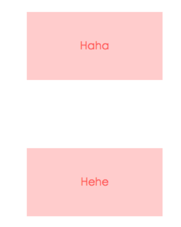
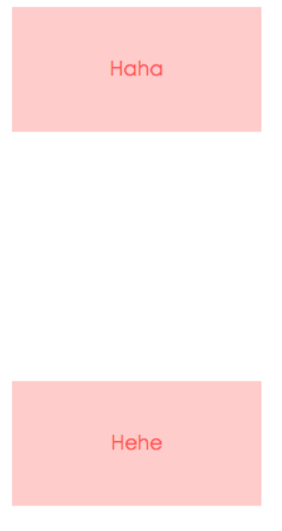
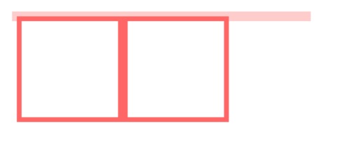
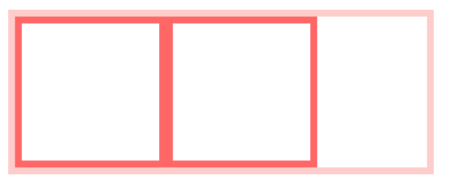

# CSS面试题

## 1、BFC & 边距重叠

概念：块级格式化上下文，目的是形成一个相对于外界完全独立的空间，让内部的子元素不会影响到外部的元素

触发条件：

- 浮动元素：float值为left、right
- overflow值不为 visible，为 auto、scroll、hidden
- display的值为inline-block、inltable-cell、table-caption、table、inline-table、flex、inline-flex、grid、inline-grid
- position的值为absolute或fixed

#### margin会重叠

两个`p`元素之间的距离为`100px`，发生了`margin`重叠（塌陷），以最大的为准

```html
<style>
    p {
        color: #f55;
        background: #fcc;
        width: 200px;
        line-height: 100px;
        text-align:center;
        margin: 100px;
    }
</style>
<body>
    <p>Haha</p >
    <p>Hehe</p >
</body>
```



可以在`p`外面包裹一层容器，并触发这个容器生成一个`BFC`，那么两个`p`就不属于同一个`BFC`，则不会出现`margin`重叠

```html
<style>
    .wrap {
        overflow: hidden;// 新的BFC
    }
    p {
        color: #f55;
        background: #fcc;
        width: 200px;
        line-height: 100px;
        text-align:center;
        margin: 100px;
    }
</style>
<body>
    <p>Haha</p >
    <div class="wrap">
        <p>Hehe</p >
    </div>
</body>
```



#### 清除内部浮动

```html
<style>
    .par {
        border: 5px solid #fcc;
        width: 300px;
    }
 
    .child {
        border: 5px solid #f66;
        width:100px;
        height: 100px;
        float: left;
    }
</style>
<body>
    <div class="par">
        <div class="child"></div>
        <div class="child"></div>
    </div>
</body>
```



触发`.par`元素生成`BFC`，则内部浮动元素计算高度时候也会计算

```css
.par {
    overflow: hidden;
}
```




## 2、移动端像素

#### 物理像素

设备屏幕上的最小显示单元，直接与设备的硬件相关。例如，iPhone 12 Pro 的物理分辨率为 1170x2532，这意味着屏幕实际包含了 1170 列和 2532 行的物理像素点。


####  逻辑像素

开发过程中使用的虚拟单位，它通过设备的像素比（DPR，Device Pixel Ratio）映射到物理像素上。

例如，`DPR 为 2 `的设备意味着每个逻辑像素会映射到 2x2 个物理像素，也就是四个物理像素，这就是 @2x 图片的概念；同理，`DPR 为 3 `的设备每个逻辑像素对应 9 个物理像素，就是 @3x。`

 

#### 使用方式--媒体查询

为每个图片资源提供 @1x、@2x 和 @3x 三种分辨率的版本，并且按照一定的命名规则存放。通常情况下，图片命名规则如下：

- `image.png`（标准分辨率图片，适用于低密度屏幕）。
- `image@2x.png`（适用于 Retina 屏幕）。
- `image@3x.png`（适用于超高像素密度设备）

```css

.example-image {
  background-image: url('/static/image.png');
}

@media only screen and (-webkit-min-device-pixel-ratio: 2), 
       only screen and (min--moz-device-pixel-ratio: 2), 
       only screen and (-o-min-device-pixel-ratio: 2/1), 
       only screen and (min-device-pixel-ratio: 2), 
       only screen and (min-resolution: 192dpi) {
  .example-image {
    background-image: url('/static/image@2x.png');
  }
}

@media only screen and (-webkit-min-device-pixel-ratio: 3), 
       only screen and (min--moz-device-pixel-ratio: 3), 
       only screen and (-o-min-device-pixel-ratio: 3/1), 
       only screen and (min-device-pixel-ratio: 3), 
       only screen and (min-resolution: 288dpi) {
  .example-image {
    background-image: url('/static/image@3x.png');
  }
}
```

