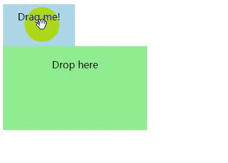
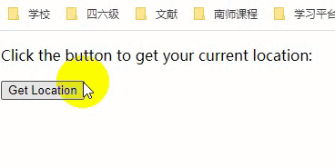
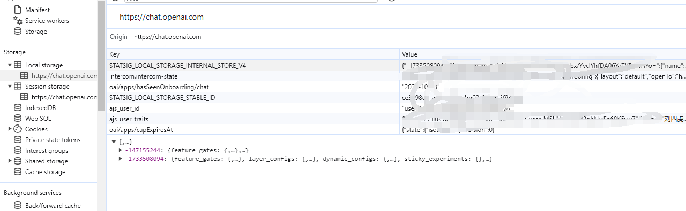
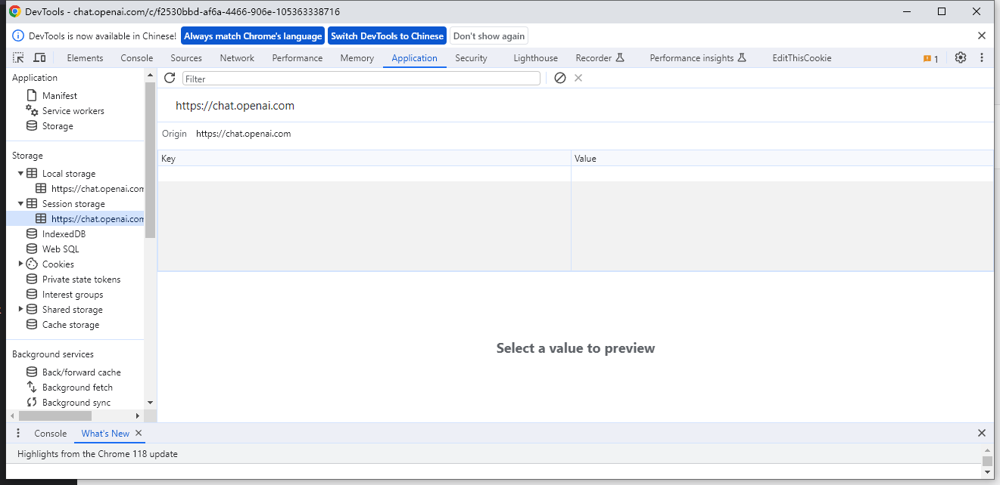
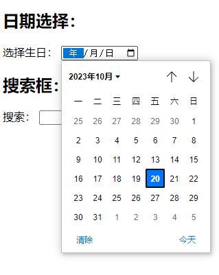
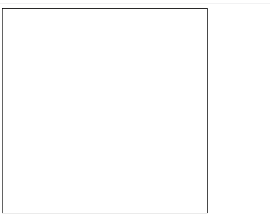
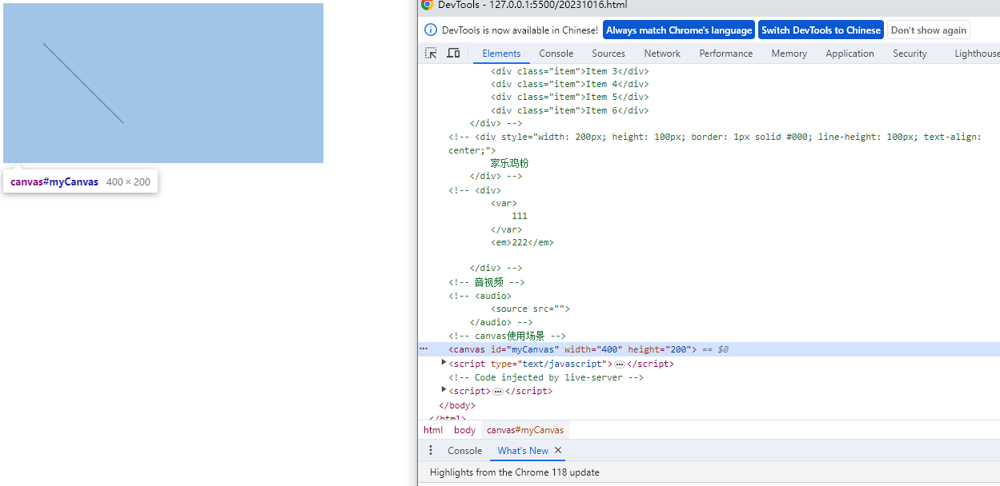
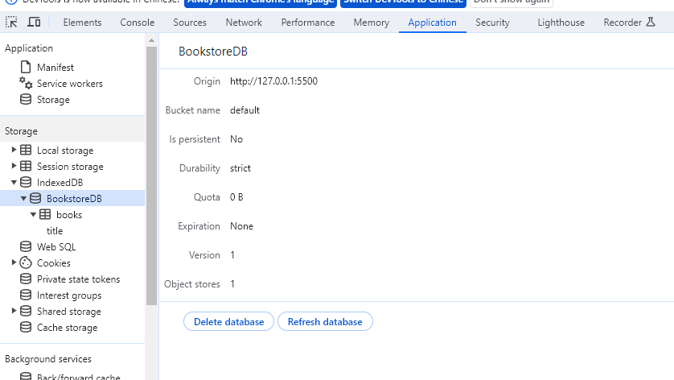
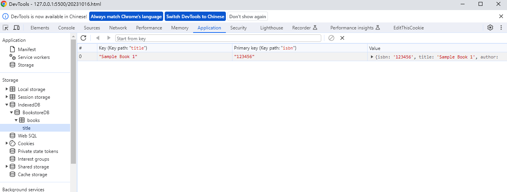

# Html & H5面试题

## HTML


##### 1、Html 和 XHTML有什么区别

XHTML元素必须正确地嵌套，元素必须关闭，标签必须小写，必须有根元素；

html则没有这些限制


##### 2、DOCTYPE有什么作用？严格模式和混杂模式如何区分，如何触发这两种模式？

- DOCTYPE 声明在文档最前边，用于告知浏览器用什么文档类型规范来解析这个文档
  - :bulb: DTD 是文档类型定义的简称
- 严格模式不允许有任何表现层的语法
- 混杂模式是一种向后兼容的解析方法
  - html文档开始后不声明具体的DTD 默认表示混合模式


##### 3、语义化的主要目的是什么

- 页面内容结构化，便于浏览器解析和搜索引擎解析

- :book: 比如尽量少使用没有语义的div，多使用有语义信息的标签，具体如下

  - header 定义文档的页眉

  - section 定义文档节，表示文档中一个具体的组成部分

  - footer 定义某区域的脚注信息

  - nav 定义页面的导航链接部分

  - article 定义文档中的节，表示文档中一个具体的组成部分

  - aside 定义页面的一些额外组成部分，如广告栏、侧边栏和相关引用信息


##### 4、锚点的作用？

锚点是文档中某行的一个记号，用于连接到文档的某个位置。定义锚点后，可以直接跳转到该锚点位置。如下例子

```html
<!DOCTYPE html>
<html lang="en">
<head>
    <meta charset="UTF-8">
    <meta name="viewport" content="width=device-width, initial-scale=1.0">
    <title>Document</title>
</head>
<body>
    <!-- 体验a标签跳转不同的位置 -->
    <div id="bbb">aaa</div><a href="#ccc">2233</a>
    <div style="width: 100%; height: 100vh; ">1</div>
    <div style="width: 100%; height: 100vh; background-color: greenyellow;">1</div>
    <div id="ccc">ddd</div>
    <a href="#bbb">22</a>
</body>
</html>
```


##### 5、chrome的渲染引擎 和 JS引擎

- 渲染引擎 Webkit
- JS引擎V8


##### 6、img标签的title 和 alt

- title 为元素提供标题信息，鼠标悬浮标签上后显示的信息
- alt图片无法加载时，显示的文字


##### 7、空元素有哪些

:bulb: 空元素及单标签元素

br、hr、img、input、link、meta


##### 8、新窗口打开a标签链接的方式

target=_blank

```html
<!DOCTYPE html>
<html lang="en">
<head>
    <meta charset="UTF-8">
    <meta name="viewport" content="width=device-width, initial-scale=1.0">
    <title>Document</title>
</head>
<body>
    <!--新页面跳转-->
    <a href="https://www.baidu.com" target="_blank">baidu</a>
</body>
</html>
```


## H5

##### 1、说明!DOCTYPE html 和 meta标签的作用

```html
<!DOCTYPE html>
<html lang="en">
<head>
    <meta charset="UTF-8">
    <meta name="viewport" content="width=device-width, initial-scale=1.0">
    <title>Document</title>
</head>
```

1. `<!DOCTYPE html>`：
   - `<!DOCTYPE html>` 是文档类型声明，也称为DOCTYPE声明。它指定了HTML文档的类型和版本。
   - 这个声明告诉浏览器文档使用的是HTML5标准。
   - 它有助于浏览器正确解释和渲染文档，确保文档按照最新的HTML标准呈现。
   - 缺少正确的文档类型声明可能会导致浏览器以混乱的方式解释文档，因此 `<!DOCTYPE html>` 声明是HTML5文档的首要部分。
2. `<meta>` 标签：
   - `<meta>` 标签用于提供关于文档的元信息（元数据），如字符编码、视口设置和其他信息。
   - 在上述代码中，`<meta charset="UTF-8">` 用于指定文档的字符编码为UTF-8，这是一种通用的字符编码标准，支持多种字符集，包括国际化字符。
   - `<meta name="viewport" content="width=device-width, initial-scale=1.0">` 用于控制文档的视口（viewport）设置，有助于响应式设计。它告诉浏览器文档的宽度应该等于设备的宽度，并且初始缩放级别为1.0。
   - 这对移动设备优化和响应式设计非常重要，以确保网页在不同设备上呈现良好。


##### 2、H5新增了哪些特性，简要介绍及使用案例

1. **Darg and drop API**（标签属性）

   - 用于实现拖动和放置元素之间的交互操作。这些API允许用户拖动可拖拽的元素并将它们放置到目标区域.

     1. **拖拽事件（Drag Events）**：
        - `dragstart`：拖动操作开始时触发，通常用于设置拖动的数据。
        - `drag`：拖动操作进行中不断触发，可用于实时更新拖动元素的外观。
        - `dragend`：拖动操作结束时触发，可用于清理和收尾操作。
     2. **放置事件（Drop Events）**：
        - `dragenter`：拖动元素进入目标区域时触发。
        - `dragover`：拖动元素在目标区域上方移动时触发，通常需要阻止默认行为才能允许放置。
        - `dragleave`：拖动元素离开目标区域时触发。
        - `drop`：拖动元素放置到目标区域时触发，通常用于处理放置操作。

   - **拖放使用案例：**

     ```html
     <!DOCTYPE html>
     <html lang="en">
     <head>
         <meta charset="UTF-8">
         <meta name="viewport" content="width=device-width, initial-scale=1.0">
         <style>
             .draggable {
                 width: 100px;
                 height: 50px;
                 background-color: lightblue;
                 text-align: center;
                 padding: 10px;
                 cursor: grab;
             }
             .droppable {
                 width: 200px;
                 height: 100px;
                 background-color: lightgreen;
                 text-align: center;
                 padding: 20px;
             }
         </style>
     </head>
     <body>
         <div class="draggable" draggable="true" ondragstart="event.dataTransfer.setData('text/plain', 'Drag me!')">Drag me!</div>
         <div class="droppable" ondragover="event.preventDefault()" ondrop="event.preventDefault(); event.target.innerText = event.dataTransfer.getData('text/plain');">Drop here</div>
     </body>
     </html>
     
     ```

     

2. 语义化更好的内容标签

   - header、nav、footer、aside、article、section

3. 音视频 audio 和 video

4. 画布 Canvas

5. 地理 Geolocation API

   - `一种用于获取用户设备的地理位置信息的JavaScript API`。它允许Web应用程序获取有关用户所在地区的**经度、纬度、高程、速度**等信息。这对于创建位置相关的Web应用程序和服务非常有用。以下是Geoloaction API的主要组成部分：

     - **`navigator.geolocation` 对象**：
       - Geolocation API 的核心是 `navigator.geolocation` 对象，它提供了访问地理位置信息的方法和属性。
       - **`getCurrentPosition()` 方法**：
         - `getCurrentPosition()` 方法用于获取用户的当前地理位置信息。
         - 该方法接受三个参数：成功回调函数、失败回调函数和可选的选项对象。
       - **`watchPosition()` 方法**：
         - `watchPosition()` 方法用于连续监测用户的位置变化。
         - 它也接受成功回调函数、失败回调函数和可选的选项对象。
       - **`clearWatch()` 方法**：
         - `clearWatch()` 方法用于停止位置监测，需要传递监测ID。

   - getCurrentPosition**使用案例：**

     ```html
     <!DOCTYPE html>
     <html lang="en">
     <head>
         <meta charset="UTF-8">
         <meta name="viewport" content="width=device-width, initial-scale=1.0">
     </head>
     <body>
         <p>Click the button to get your current location:</p>
         <button onclick="getLocation()">Get Location</button>
         <p id="location"></p>
     
         <script>
             function getLocation() {
                 if (navigator.geolocation) {
                     navigator.geolocation.getCurrentPosition(showPosition, showError);
                 } else {
                     document.getElementById("location").innerHTML = "Geolocation is not supported by this browser.";
                 }
             }
     
             function showPosition(position) {
                 var latitude = position.coords.latitude;
                 var longitude = position.coords.longitude;
                 document.getElementById("location").innerHTML = "Latitude: " + latitude + "<br>Longitude: " + longitude;
             }
     
             function showError(error) {
                 switch(error.code) {
                     case error.PERMISSION_DENIED:
                         document.getElementById("location").innerHTML = "User denied the request for Geolocation.";
                         break;
                     case error.POSITION_UNAVAILABLE:
                         document.getElementById("location").innerHTML = "Location information is unavailable.";
                         break;
                     case error.TIMEOUT:
                         document.getElementById("location").innerHTML = "The request to get user location timed out.";
                         break;
                     case error.UNKNOWN_ERROR:
                         document.getElementById("location").innerHTML = "An unknown error occurred.";
                         break;
                 }
             }
         </script>
     </body>
     </html>
     
     ```

     

   - ```html
     <!DOCTYPE html>
     <html lang="en">
     <head>
         <meta charset="UTF-8">
         <meta name="viewport" content="width=device-width, initial-scale=1.0">
     </head>
     <body>
         <p>Click the button to start tracking your location:</p>
         <button onclick="startTracking()">Start Tracking</button>
         <p id="location"></p>
     
         <script>
             let watchId;
     
             function startTracking() {
                 if (navigator.geolocation) {
                     watchId = navigator.geolocation.watchPosition(showPosition, showError);
                 } else {
                     document.getElementById("location").innerHTML = "Geolocation is not supported by this browser.";
                 }
             }
     
             function showPosition(position) {
                 var latitude = position.coords.latitude;
                 var longitude = position.coords.longitude;
                 document.getElementById("location").innerHTML = "Latitude: " + latitude + "<br>Longitude: " + longitude;
             }
     
             function showError(error) {
                 switch(error.code) {
                     case error.PERMISSION_DENIED:
                         document.getElementById("location").innerHTML = "User denied the request for Geolocation.";
                         break;
                     case error.POSITION_UNAVAILABLE:
                         document.getElementById("location").innerHTML = "Location information is unavailable.";
                         break;
                     case error.TIMEOUT:
                         document.getElementById("location").innerHTML = "The request to get user location timed out.";
                         break;
                     case error.UNKNOWN_ERROR:
                         document.getElementById("location").innerHTML = "An unknown error occurred.";
                         break;
                 }
             }
     
             // To stop tracking, you can use clearWatch method
             function stopTracking() {
                 if (watchId) {
                     navigator.geolocation.clearWatch(watchId);
                     document.getElementById("location").innerHTML = "Tracking stopped.";
                 }
             }
         </script>
     </body>
     </html>
     
     ```

     :bulb: Geolocation API 还可用于构建位置相关的应用，如地图应用、天气应用、位置服务应用等。通过获取用户的位置信息，可以为用户提供更具个性化的体验。

6. 本地离线存储 LocalStorage（5 - 10MB）

   - 用于在浏览器中永久性地存储数据，直到用户显式删除它们。数据存储在浏览器中，不会因关闭浏览器而消失

     - **存储数据：**

       ```javascript
       localStorage.setItem("key", "value");
       ```

     - **获取数据：**

       ```javascript
       const value = localStorage.getItem("key");
       ```

     - **删除数据：**

       ```javascript
       localStorage.removeItem("key");
       ```

     - **清空所有数据：**

       ```javascript
       localStorage.clear();
       ```

       

     

7. 回话存储 SessionStorage（5 - 10MB）

   - 用于在浏览器中存储数据，但数据只在当前会话期间有效。一旦用户关闭浏览器标签或窗口，数据就会被销毁。

   - **存储数据：**

     ```javascript
     sessionStorage.setItem("key", "value");
     ```

   - **获取数据：**

     ```javascript
     const value = sessionStorage.getItem("key");
     ```

   - **删除数据：**

     ```javascript
     sessionStorage.removeItem("key");
     ```

   - **清空所有数据：**

     ```javascript
     sessionStorage.clear();
     ```

     

     :bulb: 这两种Web存储机制提供了一种在浏览器中存储数据的方法，非常适用于`保存用户首选项、临时会话数据、用户登录状态`等。

     :warning: 存储在这些存储中的数据是以`字符串形式`存储的，所以如果需要存储复杂数据结构，需要将其序列化为JSON字符串或其他适当的格式。

8. 表单控件

   > 本身并没有提供名为 "calendar"、"date" 或 "search" 的特殊控件元素，但它引入了一些新的输入类型，如 `<input type="date">` 和 `<input type="search">`，以提供更好的用户输入体验。
   >
   > ```html
   > <h2>日期选择：</h2>
   > <label for="birthDate">选择生日：</label>
   > <input type="date" id="birthDate" name="birthDate">
   > <br>
   > 
   > <h2>搜索框：</h2>
   > <label for="searchInput">搜索：</label>
   > <input type="search" id="searchInput" name="searchInput">
   > ```

   

   1. calendar
   2. date
   3. time
   4. email
   5. url
   6. search

9. 新的技术

   - webworker

     - 允许在后台线程中运行JavaScript，这有助于避免在主线程中执行密集的计算，从而提高应用程序的性能。

     - 案例

       - main.js

         ```javascript
         // 创建一个新的Web Worker
         const worker = new Worker("worker.js");
         
         // 设置消息处理程序
         worker.onmessage = function (e) {
             const result = e.data;
             console.log("斐波那契数列结果：" + result);
         };
         
         // 向Web Worker发送消息
         worker.postMessage(10); // 计算斐波那契数列的第10个数
         
         ```

       - worker.js

         ```javascript
         // 监听来自主线程的消息
         self.onmessage = function (e) {
             const n = e.data;
             const result = calculateFibonacci(n);
             // 向主线程发送计算结果
             self.postMessage(result);
         };
         
         function calculateFibonacci(n) {
             if (n <= 1) return n;
             return calculateFibonacci(n - 1) + calculateFibonacci(n - 2);
         }
         
         ```

         在这个示例中，`main.js` 创建了一个新的Web Worker，然后设置消息处理程序以接收来自Web Worker的计算结果。Web Worker `worker.js` 负责计算斐波那契数列，并将结果发送回主线程。

       :warning: JavaScript 是单线程的，但使用 `Web Workers` 可以模拟多线程的并行处理，因为可以同时运行多个 `Web Workers`，每个都在自己的线程中执行代码。

       > 补充内容：`Web Workers` 和用户自己搭建的后端服务器有不同的用途和工作原理，它们各自解决了不同的问题。下面是它们之间的主要区别和用途：
       >
       > 1. **运行环境**:
       >    - `Web Workers` 运行在客户端，也就是在用户的浏览器中，用于在浏览器内部处理计算密集型任务，以避免阻塞主线程和提高用户界面的响应性。
       >    - 用户自己搭建的后端服务器运行在服务器端，通常是云服务器或本地服务器，用于处理网络请求和提供数据和服务，例如数据库访问、身份验证、业务逻辑等。
       > 2. **用途**:
       >    - `Web Workers` 主要用于在浏览器中执行耗时的计算任务，如数据处理、图像处理、加密、解析大型数据等。它们通过多线程模拟并行处理，以提高性能。
       >    - 后端服务器用于提供服务端的逻辑和数据访问。它们处理客户端发来的请求，执行服务器端的业务逻辑，并返回响应数据。
       > 3. **通信**:
       >    - `Web Workers` 与主线程之间的通信是通过消息传递实现的。它们可以在后台线程中执行，但需要与主线程进行通信，以便发送和接收数据。
       >    - 后端服务器通常使用HTTP协议等网络协议与客户端进行通信。客户端通过HTTP请求发送请求给服务器，服务器响应请求并返回数据。
       > 4. **可扩展性**:
       >    - `Web Workers` 适用于前端性能优化，尤其是在处理大型数据和复杂计算时。可以通过创建多个 `Web Workers` 来实现更好的并行性能。
       >    - 后端服务器适用于处理多个客户端的请求，并提供服务的可扩展性。服务器可以在云端或集群中运行，以满足不同规模的需求。

   - websocket

     - 技术由来

       - 在传统的 HTTP 通信中，客户端需要发送请求，服务器在收到请求后才能响应，这导致了以下问题：

         - `高延迟`：每次请求都需要经过往返的通信，造成不必要的延迟。
         - `无法实现实时性`：HTTP通信通常是单向的，难以实现实时的双向通信。

         为了解决这些问题，WebSocket 技术被提出，它允许在单个连接上实现双向通信，`减少了通信开销，提高了实时性`。

     - 概念特点

       - WebSocket 是一种协议，它提供了在单个 TCP 连接上进行全双工通信的能力，允许客户端和服务器之间实现实时双向通信。
       - WebSocket 协议是建立在标准的 HTTP 或 HTTPS 端口上，但在建立连接后切换到WebSocket协议。与 HTTP 不同，WebSocket `允许双方在建立连接后持续发送数据，而不必等待请求-响应周期`。

     - 应用场景

       - **实时聊天应用**：实现实时的在线聊天和消息传递，如在线客服聊天、社交媒体聊天等。
       - **在线协作工具**：支持多用户同时协同工作，如在线白板、协同文档编辑等。
       - **实时游戏**：多人在线游戏、棋牌游戏等需要实时通信的游戏应用。
       - **股票市场和金融应用**：用于实时股票报价、贸易执行和金融数据传输。
       - **实时地图和位置服务**：用于实时地图更新、位置共享和导航服务。

     - 游戏案例

       - 服务端（NodeJS）

         ```javascript
         const WebSocket = require('ws');
         const wss = new WebSocket.Server({ port: 8080 });
         
         wss.on('connection', function connection(ws) {
             // 新玩家连接
             console.log('新玩家连接');
         
             // 监听玩家发送的消息
             ws.on('message', function incoming(message) {
                 // 处理玩家的动作
                 console.log('收到动作:', message);
         
                 // 将动作广播给所有玩家
                 wss.clients.forEach(function each(client) {
                     if (client !== ws && client.readyState === WebSocket.OPEN) {
                         client.send(message);
                     }
                 });
             });
         });
         
         ```

       - 客户端

         ```html
         <!DOCTYPE html>
         <html>
         <head>
             <title>实时游戏</title>
         </head>
         <body>
             <canvas id="gameCanvas" width="400" height="400"></canvas>
             
             <script>
                 const canvas = document.getElementById('gameCanvas');
                 const ctx = canvas.getContext('2d');
                 
                 const ws = new WebSocket('ws://localhost:8080');
                 
                 ws.onmessage = function(event) {
                     const message = JSON.parse(event.data);
                     // 处理来自其他玩家的消息，更新游戏状态
                 };
                 
                 canvas.addEventListener('click', function(event) {
                     const x = event.clientX;
                     const y = event.clientY;
                     const action = { type: 'move', x, y };
                     ws.send(JSON.stringify(action));
                 });
             </script>
         </body>
         </html>
         
         ```

       - 效果

       用户点击canvas区域内任意点位，会在后端打印位置，同时可支持多用户链接

       

       


##### 3、H5新增的Canvas 有什么作用

> 用于绘制图形的HTML元素，它提供了JavaScript API，允许开发者动态绘制图形、图像和动画。

1. 使用案例

   1. **创建 `<canvas>` 元素：**

      在HTML中，可以使用 `<canvas>` 元素来创建一个绘图区域。

      ```html
      <canvas id="myCanvas" width="400" height="200"></canvas>
      ```

      这会创建一个400像素宽、200像素高的绘图区域。

   2. **获取绘图上下文：**

      使用JavaScript，可以获取 `<canvas>` 元素的2D渲染上下文（`2d` 上下文）。

      ```javascript
      const canvas = document.getElementById("myCanvas");
      const context = canvas.getContext("2d");
      ```

   3. **绘制图形：**

      一旦获取了2D上下文，可以使用各种绘图函数来绘制线条、形状、文本和图像。

      ```javascript
      context.beginPath(); // 开始路径
      context.moveTo(50, 50); // 移动到起始点
      context.lineTo(150, 150); // 创建一条线段
      context.stroke(); // 绘制线段
      ```

   4. **清空画布：**

      可以使用 `clearRect()` 方法清空整个画布或使用其他方法来清除特定区域的内容

      ```javascript
      context.clearRect(0, 0, canvas.width, canvas.height); // 清空整个画布
      ```

   ```javascript
       <canvas id="myCanvas" width="400" height="200"></canvas>
       <script type="text/javascript">
           const canvas = document.getElementById("myCanvas");
           const context = canvas.getContext("2d");
           context.beginPath(); // 开始路径
           context.moveTo(50, 50); // 移动到起始点
           context.lineTo(150, 150); // 创建一条线段
           context.stroke(); // 绘制线段
           // context.clearRect(0, 0, canvas.width, canvas.height); // 清空整个画布
   
       </script>
   ```

   

2. 其他使用场景

   1. **数据可视化：** `<canvas>` 可以用于创建各种图表和数据可视化，如折线图、柱状图、饼图等。
   2. **游戏开发：** HTML5 游戏开发经常使用 `<canvas>` 来呈现游戏场景、角色和动画。
   3. **图像编辑：** `<canvas>` 可用于图像编辑工具，允许用户绘制、涂鸦和编辑图像。
   4. **动画制作：** 使用 `<canvas>` 可以创建复杂的动画，从简单的帧动画到交互式动画。
   5. **图形绘制工具：** 创建在线图形绘制工具，允许用户绘制和保存自定义图形。
   6. **交互式应用：** 通过捕捉鼠标和触摸事件，您可以在 `<canvas>` 上创建交互式应用，如签名应用、地图导航等。
   7. **实验和模拟：** `<canvas>` 可用于创建科学实验模拟、物理引擎演示等教育应用。

   HTML5 `<canvas>` 提供了强大的图形渲染能力，使它成为各种Web应用和游戏开发的理想选择。但它也需要一定的编程技能，因为所有绘制操作都要通过JavaScript代码完成。


##### 4、H5有哪些离线存储方式

1. LocalStorage，可长期存储数据，浏览器关闭后数据不丢失（强制刷新 和 刻意清除除外）

2. sessionStorage，数据在浏览器关闭后自动删除

3. IndexedDB（持久化存储，除非用户在chrome dev中强制显示删除 Delete database）

   1. 由来

      传统的Web存储方式，如LocalStorage和Cookies，对于复杂的数据操作和大型数据集并不是很高效。因此，HTML5引入了IndexedDB作为一种更强大的客户端数据库，使开发人员能够更有效地处理和管理结构化数据。（localStorage 5- 10MB大小限制）

   2. 使用案例说明

      ```javascript
      // 打开或创建一个IndexedDB数据库
      const request = indexedDB.open('BookstoreDB', 1);
      
      // 数据库版本变化时的处理
      request.onupgradeneeded = function(event) {
          const db = event.target.result;
          
          // 创建一个名为 "books" 的对象存储
          const store = db.createObjectStore('books', { keyPath: 'isbn' });
      
          // 创建一个索引以便通过书名检索
          store.createIndex('title', 'title', { unique: false });
      };
      
      // 数据库打开成功后的处理
      request.onsuccess = function(event) {
          const db = event.target.result;
      
          // 向数据库添加书籍记录
          const transaction = db.transaction('books', 'readwrite');
          const store = transaction.objectStore('books');
      
          store.add({ isbn: '123456', title: 'Sample Book 1', author: 'Author 1' });
          store.add({ isbn: '789012', title: 'Sample Book 2', author: 'Author 2' });
      
          // 检索书籍记录
          const getRequest = store.get('123456');
          getRequest.onsuccess = function() {
              const book = getRequest.result;
              console.log('检索到书籍:', book);
          };
      
          // 通过索引检索书籍
          const index = store.index('title');
          const titleRequest = index.get('Sample Book 2');
          titleRequest.onsuccess = function() {
              const book = titleRequest.result;
              console.log('检索到书籍:', book);
          };
      
          // 删除书籍记录
          const deleteRequest = store.delete('789012');
          deleteRequest.onsuccess = function() {
              console.log('书籍记录已删除');
          };
      
          // 完成事务
          transaction.oncomplete = function() {
              db.close();
          };
      };
      
      // 数据库打开失败时的处理
      request.onerror = function(event) {
          console.error('无法打开数据库');
      };
      
      ```

      

      

   :bulb: 将对应部分的js代码删除掉，浏览器中的indexedDB数据库仍然存在，持久化存储


##### 5、SVG图形

可缩放矢量图形（Scalable Vector Graphics），基于文本的图形语言，可使用文本、线条、点等来绘制图像。

:bulb: Canvas 和 SVG的区别

1. 一旦Canvas绘制完成将不能访问像素 或者 操作它；任何使用SVG绘制的形状都可被记忆 和 操作
2. Canvas 运行速度亏啊，因为不需要记住后续可能得任务；SVG运行较慢，因为需要记录坐标
3. Cancas不能为绘制对象绑定相关事件；SVG可以为绘制对象绑定相关事件
4. Canvas 绘制的是栅格图像（位图）；而SVG绘制的是矢量图，因此和分辨率无关


:bulb: Canvas 和 SVG的小案例

Canvas

```html
<svg xmlns="https://www.w3.org/2000/svg">
    <rect style="fill: rgb(255, 0, 0); width: 400px; height: 200px;"></rect>
</svg>
```


SVG

```html
<canvas id="myCanvas" width="400" height="200"></canvas>
<script type="text/javascript">
    const canvas = document.getElementById("myCanvas");
    const context = canvas.getContext("2d");
    context.beginPath(); // 开始路径
    context.moveTo(50, 50); // 移动到起始点
    context.lineTo(150, 150); // 创建一条线段
    context.stroke(); // 绘制线段
</script>
```

