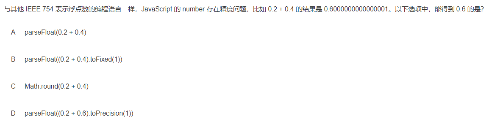
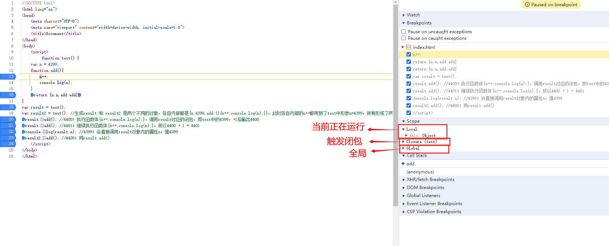

# JavaScript面试题

## 1、exec

> https://developer.mozilla.org/zh-CN/docs/Web/JavaScript/Reference/Global_Objects/RegExp/exec

**`exec()`** 方法在一个指定字符串中执行一个搜索匹配。返回一个结果数组或 null

```typescript
const regex1 = RegExp('foo*', 'g');
const str1 = 'table football, foosball';
let array1;

while ((array1 = regex1.exec(str1)) !== null) {
  console.log(`Found ${array1[0]}. Next starts at ${regex1.lastIndex}.`);
  console.log(array1.length)
  // Expected output: "Found foo. Next starts at 9."
  // Expected output: "Found foo. Next starts at 19."
}

```

## 2、Math.round()

**`Math.round()`** 函数返回一个数字四舍五入后最接近的整数

```typescript
x = Math.round(20.49); //20
x = Math.round(20.5); //21
x = Math.round(-20.5); //-20
x = Math.round(-20.51); //-21
```


## 3、原型函数及原型链案例题

```typescript
var A = {n:4399};
var B = function(){this.n = 9999};
var C = function(){var n = 8888};
B.prototype = A;
C.prototype = A;
var b = new B();
var c = new C();
A.n++;
console.log(b.n);
console.log(c.n);
```

```typescript
//9999 4000
```


**解释如下：**

这段 JavaScript 代码主要涉及对象、构造函数、原型链等概念。下面逐行解释代码的作用：

```javascript
var A = {n:4399};
```

- 创建一个名为 `A` 的对象，其中有一个属性 `n`，其值为 `4399`。

```javascript
var B = function(){this.n = 9999};
```

- 创建一个构造函数 `B`，该构造函数在实例化时会将其属性 `n` 的值设置为 `9999`。

```javascript
var C = function(){var n = 8888};
```

- 创建一个构造函数 `C`，但该构造函数内部没有为实例设置属性 `n`。

```javascript
B.prototype = A;
C.prototype = A;
```

- 将构造函数 `B` 和构造函数 `C` 的原型（prototype）都设置为对象 `A`。这样，它们的原型链上都有对象 `A`，可以继承 `A` 的属性。

```javascript
var b = new B();
```

- 通过构造函数 `B` 创建一个实例 `b`。由于 `B` 的构造函数将属性 `n` 设置为 `9999`，所以 `b.n` 的值为 `9999`。

```javascript
var c = new C();
```

- 通过构造函数 `C` 创建一个实例 `c`。由于 `C` 的构造函数内部没有设置属性 `n`，所以 `c.n` 的值为 `undefined`。

```javascript
A.n++;
```

- 将对象 `A` 的属性 `n` 的值增加 1，现在 `A.n` 的值为 `4400`。

```javascript
console.log(b.n);
```

- 输出实例 `b` 的属性 `n`，即 `9999`。

```javascript
console.log(c.n);
```

- 输出实例 `c` 的属性 `n`，即 `4400`。由于 `C.prototype` 被设置为 `A`，实例 `c` 的原型链上有 `A`，所以它继承了 `A.n` 的变化。


## 4、浮点数相关方法



- parseFloat 解析字符串，并返回一个浮点数
- toFixed 把数字转换为字符串，可指定小数点后位置
- math.round 返回一个最接近的整数
- toPrecision 把数字格式化为指定的长度


## 5、undefined 加法

undefined + 1  结果是NaN


## 6、冒泡行为


## 7、sort方法

```typescript
const arr = [1,69,4,6,8,10]
arr.sort((a,b)=>a-b) //升序排列
console.log(arr)
//[1,4,6,8,10,69] 
arr.sort((a,b)=>b-a) //降序排列
console.log(arr)
//[69,10,8,6,4,1]
```


## 8、包装类及constructor

```typescript
1 in Object(1.0).constructor;
Number[1] = 123;
1 in Object(1.0).constructor;
```

- `Object(1.0).constructor`
  - `Object(1.0)`会将数字`1.0`转换为一个Number对象。
  - `.constructor`属性引用了创建此对象实例的原始构造函数，对于`Number`对象来说，这就是`Number`构造函数本身。
  - `1 in Object(1.0).constructor;`这段代码检查`Number`构造函数是否有名为`1`的属性。`in`操作符用于检查对象是否具有给定的属性。
- `Number[1] = 123;`
  - 这行代码为`Number`构造函数添加了一个名为`1`的属性，并将其值设置为`123`。
- `1 in Object(1.0).constructor;`
  - 经过第二行代码的操作之后，`Number`构造函数现在确实拥有一个名为`1`的属性。因此，当再次执行`1 in Object(1.0).constructor;`时，这将会检查`Number`构造函数是否有名为`1`的属性，考虑到刚刚添加了这个属性，这个表达式的结果将是`true`。

所以最初返回false，后边添加后返回true


## 9、变量提升及函数赋值

```typescript
(function() {
    var x=foo();
    var foo=function foo() {
        return "foobar"
    };
    return x;
})();
```

上述代码中，相当于如下的执行顺序

```typescript
var foo;
var x = foo()
foo = function foo(){}
//在给x赋值foo返回值时候，因为foo还没有被定义，所以 //foo is not a functino
```


## 10、对象属性描述符

```typescript
var obj = {brand:'华为',price:1999};
Object.defineProperty(obj,'id',{value:1})
//给obj添加一个id属性，此时obj = { brand:'华为',price:1999，id:1 }；
//此时id的其他属性都是false，不可被遍历，不可写，不可配置
Object.defineProperty(obj,'price',{configurable:false})
//configurable:false表示price不可配置，也代表不可被delete删除
console.log(Object.keys(obj).length); 
//因为id不可被遍历，故值为['brand','price']，2
for (var k in obj){
     console.log(obj[k]);//因为id不可被遍历，故值为 华为 1999
}
obj.price = 999;
delete obj['price'] //失效，因为price设置了configurable:false
console.log(obj);//obj = { brand:'华为',price:1999，id:1 }；
```

:bulb: 补充

1）属性描述对象：
JavaScript 提供了一个内部数据结构，用来描述对象的属性，控制它的行为，比如该属性是否可写、可遍历等等。
这个内部数据结构称为“属性描述对象”（attributes object）


2）属性描述对象的6个元属性：
value：设置该属性的属性值，默认值为undefined
writable：表示能否修改属性的值，也就是说该属性是可写的还是只读的，默认为true（可写）
enumerable：表示改属性是否可遍历，默认为true（可遍历）
configurable：表示能否通过 delete 删除属性、能否修改属性的特性，或者将属性修改为访问器属性，默认为true（可配置）
get：get是一个函数，表示该属性的取值函数（getter），默认为undefined
set：get是一个函数，表示该属性的存值函数（setter），默认为undefined
configurable 如果设为false，将阻止某些操作改写该属性，比如无法删除该属性，也不得改变该属性的属性描述对象（value属性除外


## 11、ajax 与 Flash 的优缺点 :warning:(过时)

1.Ajax的优势：1.可搜索性 2.开放性 3.费用 4.易用性 5.易于开发。

2.Flash的优势：1.多媒体处理 2.兼容性 3.矢量图形 4.客户端资源调度

3.Ajax的劣势：1.它可能破坏浏览器的后退功能  2.使用动态页面更新使得用户难于将某个特定的状态保存到收藏夹中，不过这些都有相关方法解决。

4.Flash的劣势：1.二进制格式 2.格式私有 3.flash 文件经常会很大，用户第一次使用的时候需要忍耐较长的等待时间
 4.性能问题


## 12、执行顺序及结果

```typescript
if(! "a" in window){
    var a = 1;
}
alert(a);

```

代码执行顺序及结果如下

```typescript
var a;
if(!"a" in window){
    a = 1
}
alert(1)
```

由于变量的提前声明特性，在执行这段代码之后，全局对象window中就已经存在a这个变量了。所以不能进入判断，对a进行赋值所以a的值为undefined


## 13、enum

TS有的概念，JS缺少


## 14、JavaScript继承方式有哪些

构造函数继承：每次继承把父类的所有属性方法全部拷贝一份，对于公用的方法重复拷贝会浪费内存

原型链继承：所有对象公用一份原型属性和方法，对一个类的修改会影响其他类

组合继承：用构造函数继承属性，原型链方式继承方法


## 15、jquery 找到所有元素的同辈元素 :warning: 过时

siblings() 返回被选元素的所有同胞元素


## 16、cookie :warning: 过时

如果不给cookie设置过期时间，`默认在浏览器会话结束时候过期`


## 17、Promise.all

- promise.all(iterable)，参数是一个数组
- 只有这个数组中所有的promise实例都resolve后，才会出发返回promise实例的then
- 只要其中有任意一个promise实例被reject，那最终的promise实例将会出发catch


## 18、Object.prototype & Function.prototype :star: 

```typescript
Function.prototype.a = 'a';
Object.prototype.b = 'b';
function Person(){};
var p = new Person();
console.log('p.a: '+ p.a); // p.a: undefined
console.log('p.b: '+ p.b); // p.b: b 问为什么？
```

解释：

- Person函数才是Function对象的一个实例，所以通过Person.a可以访问到Function原型里面的属性，
- 但是new Person()返回来的是一个对象，它是Object的一个实例,是没有继承Function的，所以无法访问Function原型里面的属性。
- 但是,由于在js里面所有对象都是Object的实例，所以，Person函数可以访问到Object原型里面的属性，Person.b => 'b'


## 19、执行顺序及执行结果

```typescript
console.log('Value is ' + (val != '0') ? 'define' : 'undefine');
//define
```

`括号优先级 高于 加号 和 三目运算`。`加号高于三目运算`。所以前边肯定是true，即define


## 20、angularJS中服务

单例服务


## 21、Array.prototype.concat

**`concat()`** 方法用于合并两个或多个数组。此方法不会更改现有数组，而是返回一个新数组。

```typescript
const array1 = ['a', 'b', 'c'];
const array2 = ['d', 'e', 'f'];
const array3 = array1.concat(array2);

console.log(array3);
// Expected output: Array ["a", "b", "c", "d", "e", "f"]
```

:bulb: concat 不会影响原数组本身，只是连接作用


## 22、Symbol.iteraroel 执行顺讯及执行结果

```typescript
function control(x) {
  if (x == 3) throw new Error("break");
}
function foo(x = 6) {
  return {
    next: () => {
      control(x);
      return {done: !x, value: x && x--};
    }
  }
}
let x = new Object;
x[Symbol.iterator] = foo;
for (let i of x) console.log(i);

```

```
6
5
4
Error: break
```

1. **定义 `control` 函数：**
   - `control` 函数用于控制条件，如果 `x` 的值为 `3`，则抛出一个错误。
2. **定义 `foo` 函数：**
   - `foo` 函数返回一个对象，其中包含一个 `next` 方法。`next` 方法中会调用 `control` 函数，检查 `x` 的值是否为 `3`，如果是则抛出错误。然后，返回一个包含 `done` 和 `value` 属性的对象，`done` 表示迭代是否结束，`value` 表示当前迭代的值。
3. **创建 `x` 对象：**
   - 创建一个新的对象 `x`。
4. **设置 `Symbol.iterator`：**
   - 将 `foo` 函数赋值给 `x` 对象的 `Symbol.iterator` 属性，使其成为可迭代对象。
5. **使用 `for...of` 循环迭代 `x`：**
   - 在 `for...of` 循环中，会调用 `x` 对象的迭代器对象的 `next` 方法，并将返回的结果赋值给 `i`。
   - 如果迭代器返回的结果中的 `done` 为 `false`，则将结果中的 `value` 打印出来。

- 首先，`x` 被迭代，依次输出 `6`、`5`、`4`。
- 当 `x` 的值为 `3` 时，`control` 函数抛出 `Error: break` 错误，导致迭代结束。


## 23、执行顺序及执行结果

```typescript
function father() {
    this.num = 935;
    this.work = ['read', 'write', 'listen'];
}
function son() {}
son.prototype = new father(); 
// son.prototype = {  num:935, work:['read','write','listen'] }
let son1 = new son(); // son1 = { }
let son2 = new son(); // son2 = { }
son1.num = 117; // son1 = { num: 117 }
son1.work.pop(); 
//son1自己没有work，去原型里找到work,并删除work里的最后一项，
//此时son.prototype = {  num:935, work:['read','write'] }
console.log(son2.num);// son2自己没有num，去原型里找，有num:935
console.log(son2.work);
//son1和son2原型是同一个，所以此时原型里的work是['read', 'write']

```

```typescript
function A(x){
  this.x = x;
} //A实例对象有参数情况下x为1
A.prototype.x = 1; //原型对象上x为1

function B(x){
  this.x = x;
} //B实例对象有参数情况下x为1
B.prototype = new A(); //B原型对象上声明了x，但是x值为undefined
var a = new A(2), b = new B(3); //a.x = 2; 此时b实例对象上x为3
delete b.x; //删除b实例对象上x=3，去原型对象上查找x，因为已经声明了，但是没有赋值，所以undefined

```


## 24、typeof Date.now()

'number'

Date.now() 方法返回自1970年1月1日 00:00:00 UTC到当前时间的毫秒数。


## 25、进制及运算符

```typescript
function a(a){
    a^=(1<<4)-1;
    return a;
}

```

1<<4  左移相当于1*2^4=16a^=16-1=15a=a^15=10^15
^ 异或运算：
10的二进制00001010
15的二进制00001111
========>00000101 转成十进制：5
（按位异或运算，同为1或同为0取0，不同取1） 


## 26、javaScript实现跨域方式

- 第一种方式：jsonp请求；jsonp的原理是利用`<script>`标签的跨域特性，可以不受限制地从其他域中加载资源，类似的标签还有``.
- 第二种方式：document.domain；这种方式用在主域名相同子域名不同的跨域访问中
- 第三种方式：window.name；window的name属性有个特征：在一个窗口(window)的生命周期内,窗口载入的所有的页面都是共享一个window.name的，每个页面对window.name都有读写的权限，window.name是持久存在一个窗口载入过的所有页面中的，并不会因新页面的载入而进行重置。
- 第四种方式：window.postMessage；window.postMessages是html5中实现跨域访问的一种新方式，可以使用它来向其它的window对象发送消息，无论这个window对象是属于同源或不同源。
- 第五种方式：CORS；CORS背后的基本思想，就是使用自定义的HTTP头部让浏览器与服务器进行沟通，从而决定请求或响应是应该成功还是应该失败。
- 第六种方式：Web Sockets；web sockets原理：在JS创建了web socket之后，会有一个HTTP请求发送到浏览器以发起连接。取得服务器响应后，建立的连接会使用HTTP升级从HTTP协议交换为web sockt协议。


## 27、javaScript中数字占多少Byte

8Byte

关于Javascript中数字的部分知识总结：

- Javascript中，由于其变量内容不同，变量被分为基本数据类型变量和引用数据类型变量。`基本类型变量用八字节内存，存储基本数据类型(数值、布尔值、null和未定义)的值`，引用类型变量则只保存对对象、数组和函数等引用类型的值的引用(即内存地址)。
- JS中的数字是不分类型的，也就是没有byte/int/float/double等的差异。


## 28、微任务 & 宏任务

```typescript
console.log(1);
let a = setTimeout(() => {console.log(2)}, 0);
console.log(3);
Promise.resolve(4).then(b => {
    console.log(b);
    clearTimeout(a);
});
console.log(5);

```

```
1
3
5
4
```

promise对象的then（）方法属于微任务，而setTimeout（）定时器函数为宏任务。

`在执行顺序处理上，js会先执行所有同步代码，然后执行微任务队列中的所有微任务，最后再继续执行宏任务`。

在本题中，先执行同步代码并输出135，接着执行Promise.resolve（）.then（）方法，输出4，由于在then（）方法内删除了定时器函数，所以不会再输出2，最终输出结果为1354

:bulb: 微任务 与 宏任务：

https://developer.mozilla.org/zh-CN/docs/Web/API/HTML_DOM_API/Microtask_guide


## 29、var 变量的重复声明

```typescript
var msg = 'hello';
for (var i = 0; i<10; i++){
    var msg = 'hello' + i * 2 + i;
}
alert(msg);

```

在for循环内使用var声明的变量msg并不是局部变量，而是全局变量。在for循环中，每循环一次，变量msg的值就被覆盖一次，最终msg的值为表达式‘hello’+9*2+9的返回结果，根据运算符的优先级，先计算9*2，返回结果为18，接着运算hello+18，返回结果为字符串类型的hello18，最后运算hello189，返回结果为字符串类型的hello189，故输出结果为hello189


## 30、标签化语句的break

```typescript
var i = 100;
function foo() {     //bbb 是 try... finally...这个代码块
    bbb: try {        //break语句的标签引用，用于跳出 bbb标签 代码块
        console.log("position1");//打印position1
        return i++;  } //继续执行return右边的代码，此时i++为100，i为101
    finally {                //只要有finally，不管try语句里写啥（return,break之类的失效），都会执行finally语句
        break bbb;     //跳出bbb标签代码块
    }                   //跳出try...finally后，因为finally中没有return，故可执行后续代码
                           //如果finally中有return，则无法执行后续代码了
    console.log("position2");//打印position2
    return i;//返回i,i=101
}
foo();

```


## 31、array.join()

```typescript
var a = parseInt([0,0,1,0,0].join('')+1)
//join()方法将数组转为字符串,并用指定的分隔符进行分割$3.join("") 后变成字符串'00100'
字符串'00100'+1 ,1是number，会将1转变为字符串后拼接
就变为 001001  parseInt后 变成 1001

```


## 32、作用域链 及 this

例1

```typescript
var n = 3399
function test(n) {
    function add(){
        n+=1;
        console.log(n);
    }
    return add
} 
var result = test(4399); 
var result2 = test(4399);//产生了result 和 result2函数，内部涉及两个不同的闭包，只是都还未调用
result(); //4400；此时result() 即调用函数体 {n+=1;console.log(n);}，在执行n+=1时候，会沿着作用域链向上查找，首先访问外部函数 test() 中声明的形参，也就是闭包中的4399。（该过程中result使用了test内的n变量，触发了闭包）
result(); //4401；闭包中的n已经为4400，所以+1,4401
result2(); //4400；result 和 result2 是两个不同的闭包，它们各自拥有独立的 n 变量，故同result()
```


例2

```typescript
 function test() {
    var n = 4399;
    function add(){
        n++;
        console.log(n);
    }
    return {n:n,add:add}
}
var result = test(); 
var result2 = test(); //生成result 和 result2 是两个不同的对象，各自内部都是{n:4399,add:(){n++;console.log(n);}}，此时各自内部的n++都用到了test中形参n=4399，所有形成了两个不同的闭包
result.add(); //4400；执行函数体{n++;console.log(n);}，调用result对应的闭包，即test中的4399，+1后输出4400
result.add(); //4401；继续执行函数体{n++;console.log(n);}，所以4400 + 1 = 4401
console.log(result.n); //4399；会直接调用result对象内的属性n，值4399
result2.add(); //4400；同result.add()

```


例3

```typescript
var n = 3399
function test(n) {
    function add(){
        console.log(this);
        n+=1;
        console.log(this.n);
    }
    return {n:n,add:add}
}
var result = test(4399);
var result2 = test(4399);//生成result 和 result2 是两个不同的对象，各自内部都是{n:4399,add:(){ console.log(this);n+=1;console.log(this.n);}}，同样也生成了两个不同的闭包
result.add(); //{test4399} 4399；this对象指向result对象本身，内部的n+=1只是影响了闭包中的n4400，而this.n对象指向result.n，也就是传进来的4399
result.add(); //{test4399} 4399；this对象指向result对象本身，内部的n+=1只是影响了闭包中的n4401，而this.n对象指向result.n，也就是传进来的4399
console.log(result.n); //4399；
result2.add();//{另一个test4399} 4399；this对象指向result2对象本身，内部的n+=1只是影响了闭包中的n4400，而this.n对象指向result2.n，也就是传进来的4399

```





## 33、Symbol

```typescript
var s1 = Symbol('a');
var s2 = Symbol('a');
var s3 = Symbol.for('b');//找不到key=b的symbol,新创建一个key为b的symbol
var s4 = Symbol.for('b'); //找到s3刚创建的symbol
console.log(typeof s1);...①
//typeof s1 = 'symbol'  symbol为es6新增类型
console.log(s1==s2); ...②
//symbol类型每个都是独一无二的
console.log(s3==s4); ...③
//s3,s4的key都是b，都找到同一个symbol，true

```


## 34、W3C的标准事件模型

事件捕获 -> 事件处理 -> 事件冒泡


## 35、typeof

```typescript
class Phone{
  constructor(brand){
    this.brand = brand;
}
  call(){}
}
function playGame(){console.log("我可以打游戏")};
function photo(){console.log("我可以拍照")};
console.log(typeof Phone);  //function
var p = new Phone('华为');
console.log(p.brand);
```

