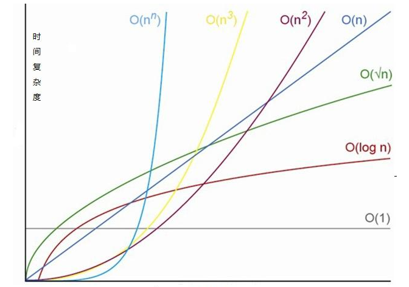
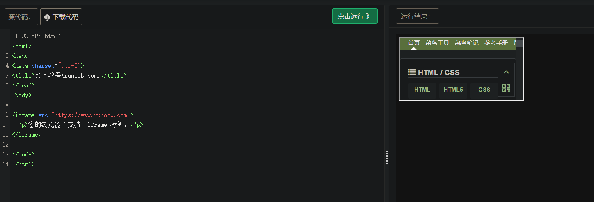

# JavaScript面试题

## 1、时间复杂度 和 空间复杂度

时间复杂度：

描述算法执行所需时间随输入数据规模变化的趋势，用O表示



空间复杂度：

描述算法执行所需存储空间量随输入数据规模变化的趋势，用O表示


## 2、数组常用方法

pop尾部删除，push尾部添加，shift头部删除，unshift头部添加


## 3、编写异步睡眠函数，接收正整数miles并睡眠该值毫秒。

```typescript
/*
* @param {number} miles
* @return {Promise}
*/
async function sleep(miles){
    await new Promise((s) => setTimeout(s, miles)
}
let t = Data.now()  
sleep(100).then(() => {console.log(Data.now() - t)}) //100                      
```


## 4、检查给定值是否为指定类或父类的实例

```typescript
function checkIfInstanceof (obj:any, classFunc:any){
    if(obj === null || obj === undefined || classFunc === null) return false
    while(obj !== null){
        if(obj.constructor === classFunc) return true
        obj = Object.getPrototypeOf(obj)
    }
    return false
}

```

## 5、Map对象

```typescript
//键值对的集合，Map中的键只能出现一次
const contract = new Map()
contract.set('a', 1)
contract.has('a') //true
contract.has('b') //false
contract.get('a') //1
```


## 6、基本数据类型 & 原始值 & 字面量

基本数据类型是JavaScript中定义的类型，原始值是这些类型的具体实例，而字面量是代码中用来表示这些原始值的文本或符号。

```typescript
let a = 10
let b = a  //b是a值的一个副本
```

在这个例子中，`a` 和 `b` 都是数字类型的原始值，他们都包含相同的值，但存储在内存中的不同位置。


#### 7、split 和 join

split:**`split()`** 方法接受一个模式，通过搜索模式将`字符串`分割成一个有序的子串列表，将这些子串放入一个数组，并返回该数组。

```typescript
const str = 'The quick brown fox jumps over the lazy dog.';

const words = str.split(' ');
console.log(words[3]);
// Expected output: "fox"

const chars = str.split('');
console.log(chars[8]);
// Expected output: "k"

const strCopy = str.split();
console.log(strCopy);
// Expected output: Array ["The quick brown fox jumps over the lazy dog."]
```

join:**`join()`** 方法将一个数组（或一个类数组对象）的所有元素连接成一个字符串并返回这个字符串，用逗号或指定的分隔符字符串分隔。如果数组只有一个元素，那么将返回该元素而不使用分隔符。

```typescript
const elements = ['Fire', 'Air', 'Water'];

console.log(elements.join());
// Expected output: "Fire,Air,Water"

console.log(elements.join(''));
// Expected output: "FireAirWater"

console.log(elements.join('-'));
// Expected output: "Fire-Air-Water"
```

#### 8、有时限的缓存

1. 创建timeLimitedCache实例时，构造函数会创建一个新的Map。
2. set方法中，如果key不存在，则值为undefined；如果存在，取消原有定时器，进而防止删除旧键值。此外构造新的定时器，用于删除新键。最后将值和定时器存入Map中，并返回是否找到键值
3. get方法中，三元表达式
4. 直接返回Map大小

```typescript
type mapEntry = {value: number, timeout:NodeJS.timeout}
class timeLimitedCache(){
    cache = new Map<number,mapEntry>()
    set(key:number,value:number,duration:time){
        const valuecache = this.cache.has(key)
        if(this.cache.has(key)){
            clearTimeout(valuecache.timeout)
        }
        const timeout = setTimeout(() => this.cache.delete(key),duration) //设置删除时间
        this.cache.set(key,{value,timeout})
        return Boolean(valuecache)
    }
    get(key:number){
        return this.cache.has(key) ? this.cache.get(key).value : -1
    }
    count(){
        return this.cache.size
    }
}
```

#### 9、记忆函数

一种优化技术，用于存储昂贵函数调用的结果，而不必针对每次输入都重新计算。

:bulb: json.stringify()：用于将javascript对象 或 值转为JSON字符串。


#### 10、常用的语义结构标签

- header
- nav
- section
- article
- footer
- aside

:bulb: 提高可读性、结构性好，易于SEO搜索 


#### 11、常见的空元素标签

- br
- hr
- img
- input
- link
- meta


#### 12、sessionStorage 和 localStorage

sessionStorage：会话级别存储

localStorage：本地持久存储


#### 13、垃圾回收机制

主要依赖于自动内存管理，这意味着开发者不需要手动释放不再使用的内存。垃圾回收器会定期运行，以识别并回收不再被引用的对象所占用的内存。以下是JavaScript垃圾回收机制的关键概念和运行方式：

1. **引用计数（Reference Counting）**：
   - 这是早期垃圾回收机制的一种方式，通过计数每个对象被引用的次数来跟踪。当引用计数降到0时，对象被认为是垃圾，可以被回收。
2. **标记-清除（Mark-and-Sweep）**：
   - 现代JavaScript引擎（如V8，SpiderMonkey）使用标记-清除算法。这个过程分为两个阶段：
     - **标记阶段**：垃圾回收器从根对象（通常是全局对象）开始，遍历所有可达的对象，将它们标记为活跃的。
     - **清除阶段**：垃圾回收器再次遍历堆内存，清除那些未被标记的对象。
3. **垃圾回收触发条件**：
   - 垃圾回收器会在内存使用达到一定阈值时自动触发，或者在特定操作（如页面隐藏或长时间运行的脚本后）后触发。
4. **内存泄漏**：
   - 如果对象之间形成循环引用，即使它们不再被使用，引用计数也不会降到0，导致内存泄漏。标记-清除算法可以解决这个问题，因为它不依赖于引用计数。
5. **优化和改进**：
   - 现代JavaScript引擎不断优化垃圾回收机制，例如使用增量标记、并行标记、分代收集等技术来提高性能。

#### 14、扁平化数组

编写函数，接收多维数组arr 和 深度n，返回该数组扁平化后的结果

```typescript
/**
 * @param {Array} arr
 * @param {number} depth
 * @return {Array}
 */
var flat = function (arr, n) {
    while(n > 0 && arr.some(Array.isArray)){
        arr = [].concat(...arr)
        n--
    }
    return arr
};
```

#### 15、数组规约运算

给定一个整数数组 `nums`、一个 reducer 函数 `fn` 和一个初始值 `init`，返回通过依次对数组的每个元素执行 `fn` 函数得到的最终结果。

通过以下操作实现这个结果：`val = fn(init, nums[0])，val = fn(val, nums[1])，val = fn(val, nums[2])，...` 直到处理数组中的每个元素。然后返回 `val` 的最终值。

如果数组的长度为 0，则函数应返回 `init`。

```typescript
/**
 * @param {number[]} nums
 * @param {Function} fn
 * @param {number} init
 * @return {number}
 */
var reduce = function(nums, fn, init) {
    let initAccu = init
    for(const element of nums){
        initAccu = fn(initAccu, element)
    }
    return initAccu
};
```

#### 16、函数防抖

**函数防抖** 方法是一个函数，它的执行被延迟了 `t` 毫秒，如果在这个时间窗口内再次调用它，它的执行将被取消。

```typescript
/**
 * @param {Function} fn
 * @param {number} t milliseconds
 * @return {Function}
 */
var debounce = function(fn, t) {
    let timeout;
    return function(...args) {
        clearTimeout(timeout);
        timeout = setTimeout(() => {
            fn(...args)
        }, t);
    }
};

let start = Date.now();
function log(...inputs) { 
  console.log([Date.now() - start, inputs ])
}
const dlog = debounce(log, 50);
setTimeout(() => dlog(1), 50);  //被调用
setTimeout(() => dlog(2), 75);  //不会调用
```


#### 17、JavaScript创建对象的设计模式

- Object构造函数式
- 对象字面量式
- 工厂模式
- 安全工厂模式
- 构造函数模式
- 原型模式

https://refactoringguru.cn/design-patterns


#### 18、iframe框架

`<iframe>` 是 HTML 中的一个元素，用于在当前页面内嵌入另一个 HTML 页面。它创建了一个内联框架，可以加载和显示来自不同源的 HTML 文档。`<iframe>` 元素非常有用，因为它允许网页之间进行交互，而无需完全重新加载页面。




#### 19、attribute 和 property

attribute 是DOM元素在文档中作为HTML标签拥有的属性

peoperty DOM元素在JavaScript中作为对象有的属性

两者是同步，但自定义的属性是不同步的


#### 20、Object.prototype.hasOwnProperty

该方法只会查找对象的自身属性（不包括继承的属性）中是否有指定的属性

```typescript
const object1 = {};
object1.property1 = 42;

console.log(object1.hasOwnProperty('property1'));
// Expected output: true

console.log(object1.hasOwnProperty('toString'));
// Expected output: false

console.log(object1.hasOwnProperty('hasOwnProperty'));
// Expected output: false
```


#### 21、伪（类）数组

指那些具有数组类似性质的对象，它们拥有 `length` 属性，并且可以使用数字索引来访问其元素。然而，它们并不是真正的数组实例，即它们不继承自 `Array.prototype`，不具有数组的方法，如 `push`、`pop`、`slice` 等。

```typescript
//例子1
function printArgs() {
  console.log(arguments.length); // 输出参数的数量
  console.log(arguments[0]);    // 输出第一个参数
}
printArgs('Hello', 'World');

//例子2
const elements = document.querySelectorAll('p');
console.log(elements.length); // 输出段落的数量
console.log(elements[0]);     // 输出第一个段落元素

//例子3
const str = 'Hello';
console.log(str.length); // 输出5
console.log(str[0]);    // 输出'H'
```

:bulb: 如果需要在伪数组上使用数组的方法，可以使用 `Array.prototype` 的方法，例如 `Array.slice` 或 `Array.from` 来将伪数组转换为真正的数组：


#### 22、for of

**`for...of`** 语句执行一个循环，该循环处理来自[可迭代对象](https://developer.mozilla.org/zh-CN/docs/Web/JavaScript/Reference/Iteration_protocols#可迭代协议)的值序列。可迭代对象包括内置对象的实例，例如 [`Array`](https://developer.mozilla.org/zh-CN/docs/Web/JavaScript/Reference/Global_Objects/Array)、[`String`](https://developer.mozilla.org/zh-CN/docs/Web/JavaScript/Reference/Global_Objects/String)、[`TypedArray`](https://developer.mozilla.org/zh-CN/docs/Web/JavaScript/Reference/Global_Objects/TypedArray)、[`Map`](https://developer.mozilla.org/zh-CN/docs/Web/JavaScript/Reference/Global_Objects/Map)、[`Set`](https://developer.mozilla.org/zh-CN/docs/Web/JavaScript/Reference/Global_Objects/Set)、[`NodeList`](https://developer.mozilla.org/zh-CN/docs/Web/API/NodeList)（以及其他 DOM 集合），还包括 [`arguments`](https://developer.mozilla.org/zh-CN/docs/Web/JavaScript/Reference/Functions/arguments) 对象、由[生成器函数](https://developer.mozilla.org/zh-CN/docs/Web/JavaScript/Reference/Statements/function*)生成的[生成器](https://developer.mozilla.org/zh-CN/docs/Web/JavaScript/Reference/Global_Objects/Generator)，以及用户定义的可迭代对象。

```typescript
const iterable = new Map([
  ["a", 1],
  ["b", 2],
  ["c", 3],
]);

for (const entry of iterable) {
  console.log(entry);
}
// ['a', 1]
// ['b', 2]
// ['c', 3]

for (const [key, value] of iterable) {
  console.log(value);
}
// 1
// 2
// 3
```

#### 23、javascript将base字符串转为integer

:bulb: “base” 通常指的是“基数”，它是一个数制系统的基础。基数决定了一个数制系统中使用多少个不同的符号来表示数值。最常见的基数是十进制（base-10）和二进制（base-2），但也可以有其他基数，如八进制（base-8）、十六进制（base-16）等。

```typescript
let decimalString = "123";
let decimalNumber = parseInt(decimalString, 10); // 基数为10
console.log(decimalNumber); // 输出：123

let hexString = "7B";
let hexNumber = parseInt(hexString, 16); // 基数为16
console.log(hexNumber); // 输出：123
```

#### 24、navigator.appVersion有什么作用

提供了关于浏览器版本的信息。

- `appName`：浏览器的名称。
- `platform`：操作系统的名称或平台类型。
- `version`：浏览器的版本号。

```
Mozilla/5.0 (Windows NT 10.0; Win64; x64) AppleWebKit/537.36 (KHTML, like Gecko) Chrome/58.0.3029.110 Safari/537.3
```

#### 25、delete操作符

`delete` 操作符用于删除对象的属性或数组的索引。

```typescript
let obj = {
  a: 1,
  b: 2,
  c: 3
};

//如果对象使用了 Object.freeze() 冻结，那么 delete 将无法删除属性，并且会返回 false。
console.log(delete obj.b); // 输出：true，属性b被删除
console.log(obj); // 输出：{ a: 1, c: 3 }

//------------------------

let arr = [1, 2, 3, 4, 5];

console.log(delete arr[2]); // 输出：true，索引2的元素被删除
console.log(arr); // 输出：[1, 2, , 4, 5]，索引2的位置变成了一个空位

// 尝试删除不存在的索引
console.log(delete arr[10]); // 输出：false，没有删除任何元素
```


#### 26、转义字符

指定那些作为文字字符有特殊含义或无法通过常规方式表示的字符。转义字符通常由反斜杠（`\`）开始，后跟一个或多个字符来表示特殊含义。以下是一些常见的JavaScript转义字符及其作用：

1. **换行符**：`\n` 用于在字符串中表示换行。
2. **制表符**：`\t` 用于在字符串中表示水平制表（相当于Tab键）。
3. **回车符**：`\r` 用于在字符串中表示回车。
4. **单引号**：`\'` 用于在字符串中表示单引号，特别是当字符串本身用单引号包围时。
5. **双引号**：`\"` 用于在字符串中表示双引号，特别是当字符串本身用双引号包围时。
6. **反斜杠**：`\\` 用于表示一个实际的反斜杠字符。
7. **Unicode字符**：`\uXXXX` 用于表示Unicode字符，其中`XXXX`是四位十六进制数，表示Unicode字符的编码。
8. **HTML转义字符**：
   - `&`：表示`&`
   - `<`：表示`<`
   - `>`：表示`>`
   - `"`：表示`"`（双引号）
   - `'`：表示`'`（单引号）

```typescript
console.log("a cute \"dog\"")
//a cute "dog"
```


#### 27、基础类型错误

有三种常见类型错误

- Load time errors
- Run time errors
- Logical Errors


#### 28、typeof 和 instanceof

typeof：判断变量

typeof(1) => number

typeof('a') => string

typeof(true) => boolean

typeof(window) 、typeof(document)、typeof(null) => object

typeof(eval) => function


instanceof：用于判断某个对象是否被另一个类构造


#### 29、JavaScript阻塞

JavaScript代码下载、解析和执行完毕才会开始继续并行下载其他资源并渲染内容。`为了防止JavaScript修改DOM树，所以会阻塞其他资源下载。`

:bulb: 建议script脚本放在底部，但这不会影响其他资源的下载。

:bulb: link放在head中


#### 30、冒泡机制

如果本级对象没有定义此事件处理程序，会向该对象的父级传播，直到被处理。最高级要么是document对象，要么是window


#### 31、Prototype概念

:bulb: 通过原型实现继承。

因为javaScript是动态的弱类型语言，javaScript中所有数据都可以自动装箱被认为是对象，每个对象都包含prototype内部属性，该属性就是对象的原型。


#### 32、自执行函数

声明的匿名函数，可立即调用这个匿名函数。可防止变量扩散到全局等。


#### 33、强制类型转换

Boolean()方式 或 parseInt()


#### 34、下面代码输出结果

```typescript
(function(){
    var a = b = 3;
}())
console.log(typeof a == 'undefined') //true
console.log(typeof b == 'undefined') //false

//上述var a = b = 3, 实际为b = 3, var a = b,所以b放到了全局，a是内部
```


#### 35、return

```typescript
//判断如下两个return 值是否相同
function foo1(){
    return {
        bar: 'hello'
    }
}

function foo2(){
    return 
    {
        bar : 'hello'
    }
}

//foo1 => hello, foo2 => undefined,foo2的写法格式不合适
```


#### 36、Math

Math.round:四舍五入方法。它将参数 `x` 四舍五入到最接近的整数。如果 `x` 的小数部分恰好是0.5，`Math.round` 将 `x` 四舍五入到最接近的偶数整数（这是所谓的“银行家舍入法”）。

```typescript
console.log(Math.round(0.5));  // 输出：0
console.log(Math.round(1.5));  // 输出：2
console.log(Math.round(2.5));  // 输出：2
```

Math.ceil:向上取整方法。它将参数 `x` 向上舍入到最接近的整数。如果 `x` 已经是整数，则返回 `x` 本身。

```typescript
console.log(Math.ceil(0.1));  // 输出：1
console.log(Math.ceil(3));    // 输出：3
console.log(Math.ceil(-4.1)); // 输出：-4
```

Math.floor:向下取整方法。它将参数 `x` 向下舍入到最接近的整数。如果 `x` 已经是整数，则返回 `x` 本身。

```typescript
console.log(Math.floor(0.9));  // 输出：0
console.log(Math.floor(-3.1)); // 输出：-4
console.log(Math.floor(4));    // 输出：4
```


#### 37、对象属性名为对象

在JavaScript中，对象的属性名（或键）可以是任何值，但它们通常被转换为字符串。

- 然而，当属性名是一个对象时，它会被转换为该对象的默认字符串表示形式，或者使用 `toString()` 方法的结果。如果对象没有重写 `toString()` 方法

```typescript
var a = {}, b = {key: 'b'}, c = {key: 'c'}
a[b] = 123
a[c] = 456
console.log(a[b])  //456

//这两行代码尝试将对象 `b` 和 `c` 作为 `a` 的属性名。然而，由于 `b` 和 `c` 都是对象，它们将被转换为它们的默认字符串表示形式，即 `[object Object]`。因此，`a` 对象实际上变成了：
var a = {
  '[object Object]': 123,
  '[object Object]': 456 // 注意：这里覆盖了上一个属性值
};
```


#### 38、数组指定元素 二分法查找

数组排序：

```typescript
let numbers = [4, 2, 5, 1, 3];
numbers.sort();
console.log(numbers); // 输出：[1, 2, 3, 4, 5]
```

二分法：

```typescript
function binarySearch(arr, x) {
  let left = 0;
  let right = arr.length - 1;

  while (left <= right) {
    let mid = left + ((right - left) >> 1); // 避免大数相减导致溢出

    if (arr[mid] === x) {
      return mid; // 找到了，返回索引
    } else if (arr[mid] < x) {
      left = mid + 1; // 搜索右半部分
    } else {
      right = mid - 1; // 搜索左半部分
    }
  }

  return -1; // 未找到，返回-1
}

// 使用二分查找法在一个已排序的数组中查找元素5
let sortedArray = [1, 2, 3, 4, 5, 6, 7, 8, 9];
let index = binarySearch(sortedArray, 5);
console.log(index); // 输出：4
```

在有序数组中查找特定元素的搜索算法：

1. 从有序数组中间元素开始搜索，如果是目标元素，直接返回。否则进行下一步。
2. 如果目标元素大于 或 小于 中间元素，则在数组大于 或 小于中间元素的那一半区域搜索，重复上一步骤
3. 如果某一步数组为空，则表示找不到目标元素。


#### 39、splice 和 slice

splice：

- `splice()` 方法用于添加和/或删除数组元素
- 能够修改原数组

:bulb: 注意传递参数的个数，1 或 2个是删除， 大于2是添加

```typescript
//删除
arr.splice(index,1)  //删除数组指定位置索引值，同时删除原先的所占位置。

//添加
const months = ['Jan', 'March', 'April', 'June'];
months.splice(1, 0, 'Feb');
// Inserts at index 1
console.log(months);
// Expected output: Array ["Jan", "Feb", "March", "April", "June"]

months.splice(4, 1, 'May');
// Replaces 1 element at index 4
console.log(months);
// Expected output: Array ["Jan", "Feb", "March", "April", "May"]

```

slice：

- `slice()` 方法用于提取原数组的一部分
  - [].slice.call(arguments)

- 并返回一个新数组，不改变原数组。

```typescript
const animals = ['ant', 'bison', 'camel', 'duck', 'elephant'];

console.log(animals.slice(2));
// Expected output: Array ["camel", "duck", "elephant"]

console.log(animals.slice(2, 4));
// Expected output: Array ["camel", "duck"]

console.log(animals.slice(1, 5));
// Expected output: Array ["bison", "camel", "duck", "elephant"]

console.log(animals.slice(-2));
// Expected output: Array ["duck", "elephant"]

console.log(animals.slice(2, -1));
// Expected output: Array ["camel", "duck"]

console.log(animals.slice());
// Expected output: Array ["ant", "bison", "camel", "duck", "elephant"]

```


#### 40、eval

会将传入的字符串当做 JavaScript 代码进行执行

```typescript
console.log(eval('2 + 2'));
// Expected output: 4

console.log(eval(new String('2 + 2')));
// Expected output: 2 + 2

console.log(eval('2 + 2') === eval('4'));
// Expected output: true

console.log(eval('2 + 2') === eval(new String('2 + 2')));
// Expected output: false
```


#### 41、删除数组指定位置的索引值

```typescript
arr.splice(index,1)  //删除数组指定位置索引值，同时删除原先的所占位置。
```


#### 42、栈与队列

- 队列先进先出——表尾端插入，表头删除
- 栈先进后出——表尾端插入和删除


#### 43、标准盒模型

width + padding + border + margin


#### 44、八股——javaScript继承方式

1. 构造函数式继承
2. 类式继承
3. 组合式继承
4. 寄生式继承
5. 原子继承
6. 多继承
7. 静态继承
8. 特性继承
9. 构造函数拓展式继承
10. 工厂式继承


#### 45、八股--面向对象的特性

- 抽象
- 封装
- 继承
- 多态


#### 46、八股--JSON-XML对比

- 数据体量方面，JSON数据量小。传递速度快
- 数据交互方面，JSON更易于JavaScrip理解
- 数据描述方面，Json的描述性差于XML


#### 47、HTTP 和 HTTPS之间的区别

http通常在tcp上，在http 和 tcp之间添加安全协议层（SSL 或 TSL）即HTTPS

:bulb: http协议默认端口80，https协议默认端口443


#### 48、常见的HTTP状态码

```shell
HTTP状态码是服务器在响应客户端请求时返回的三位数代码，用于表示请求的结果。以下是一些常见的HTTP状态码：

1xx（信息性状态码）:
- `100 Continue`：继续，客户端应继续其请求。
- `101 Switching Protocols`：切换协议，服务器根据客户端的请求切换协议。

2xx（成功状态码）:
- `200 OK`：请求成功。
- `201 Created`：已创建，请求成功并且服务器创建了新的资源。
- `202 Accepted`：已接受，服务器已接受请求，但尚未处理。
- `204 No Content`：无内容，服务器成功处理了请求，但没有返回任何内容。

3xx（重定向状态码）:
- `301 Moved Permanently`：永久移动，请求的资源已被永久移动到新位置。
- `302 Found`：找到，请求的资源临时移动到另一个URI。
- `304 Not Modified`：未修改，自从上次请求后资源未被修改。

4xx（客户端错误状态码）:
- `400 Bad Request`：错误请求，服务器无法理解请求。
- `401 Unauthorized`：未授权，请求需要用户验证。
- `403 Forbidden`：禁止访问，服务器理解请求但拒绝执行。
- `404 Not Found`：未找到，服务器找不到请求的资源。
- `405 Method Not Allowed`：方法不被允许，请求方法不被服务器支持。
- `408 Request Timeout`：请求超时，服务器等待请求超时。

5xx（服务器错误状态码）:
- `500 Internal Server Error`：内部服务器错误，服务器遇到错误，无法完成请求。
- `501 Not Implemented`：未实现，服务器不支持请求的功能。
- `502 Bad Gateway`：错误网关，服务器作为网关或代理，从上游服务器收到无效响应。
- `503 Service Unavailable`：服务不可用，服务器目前无法使用（由于超载或停机维护）。
- `504 Gateway Timeout`：网关超时，服务器作为网关或代理，但是没有及时从上游服务器收到请求。

这些状态码是HTTP协议的一部分，用于在客户端和服务器之间进行通信，确保请求和响应的准确性。

```


#### 49、完整的HTTP事物流程

1. 域名DNS解析
2. 发起TCP的三次握收
3. 建立TCP连接后的HTTP请求
4. 服务端响应HTTP请求，浏览器得到HTML代码
5. 浏览器解析HTML，渲染界面


#### 50、请求报文 和 响应报文 组成

请求报文：

- 请求行，包括请求方法、URI 和 HTTP版本信息
- 请求首部字段
- 请求内容实体

响应报文：

- 状态行，包括HTTP版本、状态码、状态码的解释
- 响应首部字段
- 响应内部实体


#### 51、请求报文 和 响应报文的 首部字段

通用首部字段：

```shell
Date: 创建报文时间
Connection：连接管理
Cache-Control： 缓存的控制
Transfer-Encoding: 报文主体的传输编码方式
```


请求首部字段：

```shell
Host：指定请求的服务器的域名和端口号。
User-Agent：包含发出请求的浏览器或客户端的名称和版本。
Accept：客户端能够处理的媒体类型。
Accept-Charset：客户端能够处理的字符集。
Accept-Encoding：客户端能够处理的压缩编码。
Accept-Language：客户端偏好的语言。
Authorization：认证信息，用于访问受保护的资源。
Content-Length：请求体的长度。
Content-Type：请求体的媒体类型。
Cookie：存储在客户端的cookie信息。
If-Modified-Since：资源的最后修改时间，用于缓存控制。
Referer：引用页面的地址，表示请求是从哪个页面发起的。
```

响应首部字段：

```shell
Cache-Control：指定请求和响应遵循的缓存机制。
Content-Encoding：响应体的编码方式。
Content-Language：响应体使用的语言。
Content-Length：响应体的长度。
Content-Type：响应体的媒体类型。
Date：原始服务器在何时生成响应。
ETag：资源的实体标签，用于判断资源是否被修改。
Expires：资源的过期日期。
Last-Modified：资源的最后修改时间。
Location：用于重定向的URL。
Server：服务器软件的名称和版本。
Set-Cookie：设置客户端的cookie。
WWW-Authenticate：用于HTTP认证的挑战
```


#### 52、TCP 和 UDP区别

TCP：传输控制协议。基于连接的协议，在正式收发数据前，需要建立可靠的连接。

UDP：面向非连接的协议。不需要建立连接，直接把数据包发送过来。


#### 53、网络分层模型

```shell
物理层（Physical Layer）：负责实际的物理连接和电气信号传输，如电缆和交换器。
数据链路层（Data Link Layer）：负责在相邻节点之间传输帧，包括错误检测和纠正。
网络层（Network Layer）：负责数据包从源到目的地的传输和路由选择。
传输层（Transport Layer）：负责提供端到端的数据传输服务，如TCP和UDP。
会话层（Session Layer）：负责建立、管理和终止应用程序之间的会话。
表示层（Presentation Layer）：负责数据的表示、编码和转换，确保一个系统的应用层所发送的信息可以被另一个系统的应用层读取。
应用层（Application Layer）：为应用软件提供网络服务，如HTTP、FTP、SMTP等。
```


#### 54、完整的三次握手 和 四次挥手

- 三次握手过程：
  - **SYN（Synchronization Sequence Number同步序列编号）**：客户端选择一个初始序列号（ISN）并发送一个带有SYN标志位设置为1的TCP段到服务器。这个段不包含任何数据，但它告诉服务器客户端希望连接。
  - **SYN-ACK(Synchronized Acknowledgement同步确认）**：服务器收到客户端的SYN段后，会发送一个带有SYN和ACK标志位都设置为1的TCP段作为响应。服务器也会选择自己的初始序列号，并在段中包含这个序列号以及对客户端初始序列号的确认（ACK）。这个段同样不包含数据。
  - **ACK（确认）**：客户端收到服务器的SYN-ACK段后，会发送一个带有ACK标志位设置为1的TCP段作为最终响应。这个段会确认服务器的初始序列号。至此，三次握手完成，客户端和服务器都确认了对方的初始序列号，并且双方都准备好发送数据。

- 四次挥手过程：

1. **FIN（final结束）**：当客户端决定关闭连接时，它会发送一个带有FIN标志位设置为1的TCP段给服务器，表示客户端已经完成数据发送。
2. **ACK（确认）**：服务器收到FIN段后，会发送一个ACK段作为响应，确认客户端的关闭请求。此时，客户端进入FIN-WAIT-2状态，等待服务器完成数据发送。
3. **FIN（结束）**：服务器在发送完所有剩余数据后，也会发送一个带有FIN标志位设置为1的TCP段给客户端，请求关闭其到客户端方向的连接。
4. **ACK（确认）**：客户端收到服务器的FIN段后，会发送最后一个ACK段作为响应，确认服务器的关闭请求。客户端进入TIME-WAIT状态，等待足够的时间以确保服务器接收到了最终的ACK。之后，客户端关闭连接，服务器也关闭连接。


#### 55、Promise

一个 **`Promise`** 是一个代理，它代表一个在创建 promise 时不一定已知的值。它允许你将处理程序与异步操作的最终成功值或失败原因关联起来。这使得异步方法可以像同步方法一样返回值：异步方法不会立即返回最终值，而是返回一个 *promise*，以便在将来的某个时间点提供该值。

一个 `Promise` 必然处于以下几种状态之一：

- *待定（pending）*：初始状态，既没有被兑现，也没有被拒绝。
- *已兑现（fulfilled）*：意味着操作成功完成。
- *已拒绝（rejected）*：意味着操作失败。

```typescript
axios({
        method:'GET',
        // url: '/data/les-miserables.json'
        // url: 'http://123.249.125.209/testEcharts.json'
        url: '/myNginx/' + file || '/myNginx/'
      }).then((res) => {
        atlasChart = echarts.init(document.getElementById('atlat'), theme)
        atlasChart.hideLoading();
        res.data.nodes.forEach(function (node:GraphNode) {
          node.label = {
            show: node.symbolSize > 30   //大于30 值才会显示
          };
        });
		    // options配置项：查看文档中的配置项https://echarts.apache.org/zh/option.html#title
        atlasChart.setOption({
          backgroundColor: background,
          title: {
            text: '多类型用户各灾害阶段关注要素',
            top: '5px',
            left: '5px'
          },
          tooltip: {
            show: true,
            formatter: function (params:any) {
              let str
              if(params.dataIndex <= 72){
                str = params.data.name + ':' + params.data.value
              } else {
                str = params.data.source + ' > ' + params.data.target + '<br/>';
                str += '关系：' + params.data.relation
              }
              return str
            }
          },
          animationDuration: 1500,
          animationEasingUpdate: 'quinticInOut',
          series: [
            {
              name: '测试案例',
              type: 'graph',
              legendHoverLink: true,
              layout: 'none',
              data: res.data.nodes,
              links: res.data.links,
              categories: res.data.categories,
              roam: true,
              label: {
                position: 'right',
                formatter: '{b}'
              },
              labelLayout: {
                hideOverlap: true
              },
              scaleLimit: {
                min: 0.4,
                max: 2
              },
              lineStyle: {
                color: 'source',
                curveness: 0.3
              },
              emphasis: {
                focus: 'adjacency',
                lineStyle: {
                  width: 10
                }
              }
            }
          ]
        })
        atlasChart.on('click', function (params:any) {
          knowInformation.id = params.dataIndex
          knowInformation.type = params.dataType
          if(knowInformation.type === 'node'){
            knowInformation.name = params.data.name
            knowInformation.focusUser = params.data.focusUser
            knowInformation.focusStage = params.data.focusStage
            knowInformation.area = params.data.area
          }else {
            knowInformation.name = ''
            knowInformation.focusUser = ''
            knowInformation.focusStage = ''
            knowInformation.area = ''
          }
          if(params.dataIndex === 11){
            CesiumInstance.cesiumObj.addTileModel(2703174) 
          }
        });
      }).catch(function (error) {
        console.error('请求失败', error);
      }).finally(() => {
      })
```

```typescript
const myFirstPromise = new Promise((resolve, reject) => {
  // 当异步操作成功时，我们调用 resolve(...)，当其失败时，调用 reject(...)。
  // 在这个例子中，我们使用 setTimeout(...) 来模拟异步代码。
  // 在实际情况中，你可能会使用类似 XHR 或 HTML API 等。
  setTimeout(() => {
    resolve("成功！"); // 耶！一切顺利！
  }, 250);
});

myFirstPromise.then((successMessage) => {
  // successMessage 是我们在上面的 resolve(...) 函数中传入的任何内容。
  // 它不一定是字符串，但如果它只是一个成功的消息，那么它大概率是字符串。
  console.log(`耶！${successMessage}`);
});

```

#### 56、手写Promise

```typescript
class MyPromise {
  constructor(executor) {
    // 初始状态为 pending
    this.state = 'pending';
    this.value = undefined;
    this.handlers = [];

    try {
      executor(this._resolve, this._reject);
    } catch (err) {
        this._reject(err);
    }
  }

  _resolve = (value) => {
    // 如果不是 pending 状态，忽略
    if (this.state !== 'pending') return;

    // 模拟真实的 Promise 行为，这里简化处理
    if (value && typeof value.then === 'function') {
      return value.then(this._resolve, this._reject);
    }

    this.state = 'fulfilled'; // 状态变为 fulfilled
    this.value = value;
    
    this.handlers.forEach((h) => this._handle(h));
  };

  _reject = (error) => {
    if (this.state !== 'pending') return;

    this.state = 'rejected'; // 状态变为 rejected
    this.value = error;

    this.handlers.forEach((h) => this._handle(h));
  };

  _handle(handler) {
    if (this.state === 'pending') {
      this.handlers.push(handler);
    } else {
      if (this.state === 'fulfilled' && typeof handler.onFulfilled === 'function') {
        handler.onFulfilled(this.value);
      }
      if (this.state === 'rejected' && typeof handler.onRejected === 'function') {
        handler.onRejected(this.value);
      }
    }
  }

  then(onFulfilled, onRejected) {
    return new MyPromise((resolve, reject) => {
      this._handle({
        onFulfilled: value => {
          // 提供默认处理函数
          if (!onFulfilled) {
            resolve(value);
          } else {
            try {
              resolve(onFulfilled(value));
            } catch (err) {
              reject(err);
            }
          }
        },
        onRejected: error => {
          if (!onRejected) {
            reject(error);
          } else {
            try {
              resolve(onRejected(error));
            } catch (err) {
              reject(err);
            }
          }
        }
      });
    });
  }

  catch(onRejected) {
    return this.then(null, onRejected);
  }
}

// 使用示例
new MyPromise((resolve, reject) => {
  setTimeout(() => {
    resolve('Hello, Promise!');
  }, 1000);
})
.then((value) => {
  console.log(value); // 输出: Hello, Promise!
})
.catch((error) => {
  console.error(error);
});
```


#### 57、饿汉式 和 懒汉式

饿汉式是指在变量或对象声明时立即进行初始化。这种方式下，变量或对象的值在创建时就已经确定，并且在整个生命周期内通常不会改变。

```typescript
class Singleton {
  private static instance: Singleton;

  private constructor() {}

  public static getInstance(): Singleton {
    if (!Singleton.instance) {
      Singleton.instance = new Singleton();
    }
    return Singleton.instance;
  }
}

// 使用饿汉式初始化
const singleton = Singleton.getInstance();
```

懒汉式是指在变量或对象第一次使用时才进行初始化。这种方式可以延迟初始化的时机，直到真正需要使用该变量或对象时才进行。

```typescript
class Singleton {
  private static instance?: Singleton;

  private constructor() {}

  public static getInstance(): Singleton {
    if (!Singleton.instance) {
      Singleton.instance = new Singleton();
    }
    return Singleton.instance;
  }
}

// 使用懒汉式初始化，直到第一次调用 getInstance 时才创建实例
const singleton = Singleton.getInstance();
```


#### 58、设计模式概念 作用

概念：一套反复使用并经过分类编目的代码设计经验总结。

作用：为有效开发构建的。比如合理地设置接口、提高系统各个层次的独立性、降低耦合度等。

#### 59、MVVM

model（模型）、view（视图）、viewmodel（视图模型）

视图模型负责视图和模型之间的信息转换，通过数据双向绑定使视图和模型之间的数据得以传递。

#### 60、JS类型判断

1. **`typeof` 操作符**：用于返回一个变量或表达式的类型。
   - `typeof 变量` 返回一个字符串，表示变量的类型，如 `"number"`、`"string"`、`"boolean"`、`"undefined"`、`"symbol"`、`"object"`、`"function"`。
2. **`instanceof` 操作符**：用于判断一个对象是否是某个构造函数的实例。
   - `对象 instanceof 构造函数` 返回一个布尔值，表示对象是否是指定构造函数的实例。
3. **`Array.isArray()` 方法**：用于判断一个值是否是一个数组。
   - `Array.isArray(值)` 返回一个布尔值，如果值是数组，则返回 `true`，否则返回 `false`。

#### 61、纯函数概念、函数副作用

纯函数：

**给定相同的输入，总是返回相同的输出**


函数副作用：

1. **修改外部变量**：函数改变了在其作用域之外定义的变量的值。
2. **输入/输出操作**：如读取或写入文件、打印到控制台、发送网络请求等。
3. **改变系统状态**：例如改变用户界面的元素、改变数据库状态等。
4. **产生可观察的变化**：如创建新的全局变量或修改全局对象的属性。

#### 62、封装一个类型鉴定函数

```typescript
function typeCheck(value) {
  let type = typeof value;

  // 基本类型判断
  if (type === 'string' || type === 'number' || type === 'boolean' || type === 'undefined') {
    return type;
  }

  // 对null的判断
  if (value === null) {
    return 'null';
  }

  // 对Symbol的判断
  if (typeof value === 'object' && value.toString() === '[object Symbol]') {
    return 'symbol';
  }

  // 对函数的判断
  if (type === 'function') {
    return 'function';
  }

  // 对数组的判断
  if (Array.isArray(value)) {
    return 'array';
  }

  // 对Date的判断
  if (value instanceof Date) {
    return 'date';
  }

  // 对正则表达式的判断
  if (value instanceof RegExp) {
    return 'regexp';
  }

  // 对对象的判断，包括plain object, Set, Map等
  if (type === 'object') {
    const objectClass = Object.prototype.toString.call(value);
    switch (objectClass) {
      case '[object Object]':
        return 'object';
      case '[object Array]':
        return 'array'; // 已在前面判断过，这里可以省略
      case '[object Set]':
        return 'set';
      case '[object Map]':
        return 'map';
      case '[object Error]':
        return 'error';
      // 可以继续添加其他内置对象的判断
      default:
        return objectClass.slice(8, -1).toLowerCase(); // 去除前后的 [object ] 和小写化
    }
  }

  // 如果以上都不是，返回'unknown'
  return 'unknown';
}

// 使用示例
console.log(typeCheck(123));          // "number"
console.log(typeCheck('hello'));     // "string"
console.log(typeCheck(true));        // "boolean"
console.log(typeCheck(undefined));   // "undefined"
console.log(typeCheck(null));         // "null"
console.log(typeCheck({}));          // "object"
console.log(typeCheck([]));           // "array"
console.log(typeCheck(new Date()));  // "date"
console.log(typeCheck(/abc/));       // "regexp"
console.log(typeCheck(new Set()));   // "set"
console.log(typeCheck(new Map()));   // "map"
console.log(typeCheck(function(){})); // "function"
```

#### 63、router-link & router-view

`<router-link>` 和 `<router-view>` 之间的关系是：

- `<router-link>` 用于定义导航链接，允许用户点击以触发路由的变更。
- `<router-view>` 用于展示当前路由匹配的组件。

```typescript
// router/index.js
import Vue from 'vue';
import Router from 'vue-router';
import Home from '../components/Home.vue';
import About from '../components/About.vue';

Vue.use(Router);

export default new Router({
  routes: [
    {
      path: '/home',
      name: 'home',
      component: Home
    },
    {
      path: '/about',
      name: 'about',
      component: About
    }
  ]
});
```

```vue
<template>
  <div>
    <!-- 定义导航链接 -->
    <router-link to="/home">Home</router-link>
    <router-link to="/about">About</router-link>

    <!-- 渲染路由组件 -->
    <router-view></router-view>
  </div>
</template>
```

#### 64、宏任务 & 微任务

都是异步执行机制，微任务优先级高于宏任务

:bulb: 常见宏任务：

1. **script**: 初始的JavaScript代码执行。
2. **setTimeout** 和 **setInterval**: 设置定时器，当指定的时间到达时触发。
3. **UI事件**: 如 click、resize、scroll 等。
4. **请求动画帧（requestAnimationFrame）**: 浏览器提供的用于动画的定时器，可以在浏览器重绘之前执行。
5. **网络请求（XMLHttpRequest、fetch）**: 发送网络请求并接收响应。
6. **Web Socket**: 与服务器的双向通信。
7. **File I/O**: 文件读写操作。

:bulb:  常见微任务：

1. **Promise 回调**: 使用 `.then()`、`.catch()` 或 `.finally()` 附加的回调函数。
2. **MutationObserver**: 用于监听DOM变化。
3. **queueMicrotask**: 一个标准的API，允许开发者将函数排入微任务队列。

```javascript
console.log('Script start');

setTimeout(function() {
  console.log('setTimeout');
}, 0);

Promise.resolve().then(function() {
  console.log('promise1');
}).then(function() {
  console.log('promise2');
});

console.log('Script end');

//-----------------------------------------------
Script start
Script end
promise1
promise2
setTimeout
```

#### 65、AMD 、CMD、ES6、COMMONJS

1. **CommonJS**：
   - 同步加载模块。
   - 使用 `require` 函数来加载模块，使用 `module.exports` 或 `exports` 对象来导出模块。
   - 适用于服务器端环境，如Node.js。
2. **AMD（Asynchronous Module Definition）**：
   - 异步加载模块。
   - 使用 `define` 和 `require` 函数来定义和加载模块。
   - 主要用于浏览器端，由RequireJS等库实现。
3. **CMD（Common Module Definition）**：
   - 异步加载模块，但更强调依赖就近和延迟执行。
   - 使用 `define` 和 `require` 函数，与AMD类似，但执行时机不同。
   - 主要用于浏览器端，由SeaJS等库实现。
4. **ES6模块**：
   - 静态加载模块，使用 `import` 和 `export` 关键字。
   - 支持同步和异步加载（通过 `import()` 函数）。
   - 原生支持在浏览器和服务器端（如Node.js）使用。

```javascript
//typescript
import { createApp } from 'vue'
import App from './App.vue'
import router from './router'
//配置element-plus
import ElementPlus from 'element-plus'
import 'element-plus/dist/index.css'
import * as ElementPlusIconsVue from '@element-plus/icons-vue'
import 'element-plus/theme-chalk/dark/css-vars.css' //深色主题
import './assets/css/css-vars.css'
//配置阿里云的svg可用图标
import 'virtual:svg-icons-register'
import { createPinia } from 'pinia'
//解决阻止默认事件
// import 'default-passive-events'
import * as turf from "@turf/turf";

const app = createApp(App)

for (const [key, component] of Object.entries(ElementPlusIconsVue)) {
    app.component(key, component)
}

app.use(router)
  .use(ElementPlus)
  .use(createPinia())

app.provide("turf", turf)

app.mount('#app')
```

```typescript
//nodejs
//引用第三方模块和自定义模块，注意模块都是js文件
const express = require('express')
const bodyParser = require('body-parser')
const app = express();
const main = require('./router/main')
app.use(bodyParser.urlencoded({extended:false}))

// 所有express框架得中间件 拦截所有的请求
// 拦截所有请求
app.use('*',function (req, res, next) {
  res.header('Access-Control-Allow-Origin','*')
  res.header('Access-Control-Allow-Headers','X-Requested-With, mytoken')
  res.header('Access-Control-Allow-Headers','X-Requested-With, Authorization')
  res.setHeader('Content-Type', 'application/json; charset=utf-8')
  res.header('Access-Control-Allow-Headers','Content-Type,Content-Length,Authorization,Accept,X-Requested-With')
  res.header('Access-Control-Allow-Methods','PUT,POST,GET,DELETE,OPTIONS')
  res.header('X-Powered-By','3.2.1')
  if(req.method == 'OPTIONS') res.send(200)
  else next()
})

app.use('/api',main)

app.listen(3000,() => {
  console.log('port 3000 sand Management server is running..., 小虎小虎开始加油了')
})
```

#### 66、发布订阅者模式

订阅发布（Publish-Subscribe）模式是一种软件架构模式。在这种模式中，有两种角色：

1. **发布者（Publisher）**：负责发布事件或消息。
2. **订阅者（Subscriber）**：订阅了发布者发布的事件或消息，并在事件发生时做出响应。

```typescript
class EventEmitter {
    constructor() { 
    // 初始化事件和回调函数的存储对象
        this.handles = {}; 
    }
    
    // 订阅事件
    on(eventName, callback) { 
        if (!this.handles[eventName]) { 
            this.handles[eventName] = []; 
        }
        this.handles[eventName].push(callback); 
    }
    
    // 触发事件
    emit(eventName) { 
        if (this.handles[eventName]) { 
        // 获取事件对应的回调函数数组
            const handles = this.handles[eventName]; 
            handles.forEach(callback => { 
                callback(); 
            });
        }
    }
}

// 创建一个事件管理器实例
const emitter = new EventEmitter(); 

// 订阅'onSell'事件，添加两个回调函数
emitter.on('onSell', () => {
    console.log('hello'); 
});
emitter.on('onSell', () => {
    console.log('world'); 
});

emitter.emit('onSell'); // 触发'onSell'事件

//hello world
```


增加取消订阅

```typescript
class EventEmitter {
    constructor() {
        this.handles = {}
    }

    // 订阅事件，将回调函数添加到指定事件的回调数组中
    on(eventName, cb) {
        if (!this.handles[eventName]) {
            this.handles[eventName] = []
        }
        this.handles[eventName].push(cb)
    }

    // 触发指定事件，依次调用对应事件的所有回调函数
    emit(eventName) {
        if (this.handles[eventName]) {
            const handles = this.handles[eventName]
            handles.forEach(cb => {
                cb()
            });
        }
    }

    // 取消订阅指定事件的指定回调函数
    off(eventName, cb) {
        const handles = this.handles[eventName]
        const index = handles && handles.indexOf(cb)
        if (index !== -1) {
            handles.splice(index, 1)
        }
    }
}

const emiter = new EventEmitter()

function wan() {
    console.log('hello');
}

function wu() {
    console.log('world');
}

// 订阅事件
emiter.on('onSell', wan)
emiter.on('onSell', wu)

// 取消订阅指定事件的指定回调函数
emiter.off('onSell', wan)

// 触发指定事件，执行对应的回调函数
emiter.emit('onSell')

//world

```

仅订阅一次

```typescript
class EventEmitter {
    constructor() {
        this.handles = {} // 用于存储事件名和对应的回调函数数组
    }

    // 订阅事件，将回调函数添加到指定事件的回调数组中
    on(eventName, cb) {
        if (!this.handles[eventName]) {
            this.handles[eventName] = [] 
        }
        this.handles[eventName].push(cb) 
    }

    // 触发指定事件，依次调用对应事件的所有回调函数
    emit(eventName) {
        if (this.handles[eventName]) {
            const handles = this.handles[eventName]
            handles.forEach(cb => {
                cb() // 依次调用事件的回调函数
            });
        }
    }

    // once 方法用于仅订阅一次事件，即回调函数只会被执行一次
    once(eventName, cb) {
        // 如果事件已经存在，并且该回调函数已经被订阅过，则直接返回，不再重复订阅
        if (this.handles[eventName] && this.handles[eventName].indexOf(cb) !== -1) {
            return
        }
        // 否则，调用 on 方法订阅事件
        this.on(eventName, cb)
    }

}

const emiter = new EventEmitter()

function wu() {
    console.log('hello world');
}

// 使用 once 方法订阅事件，回调函数只会被执行一次
emiter.once('onSell', wu)
emiter.once('onSell', wu)
emiter.once('onSell', wu)

emiter.emit('onSell') // 触发事件，只会执行一次 wu() 回调函数
```

