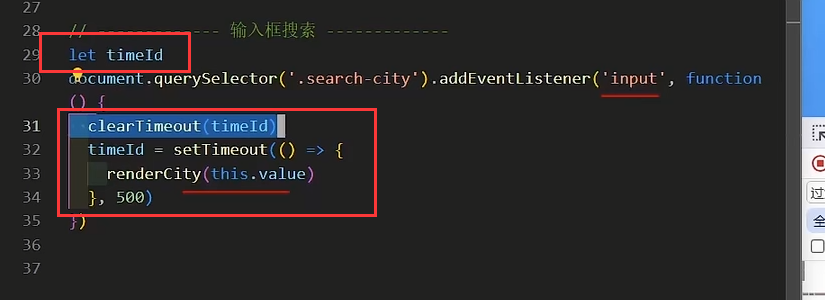
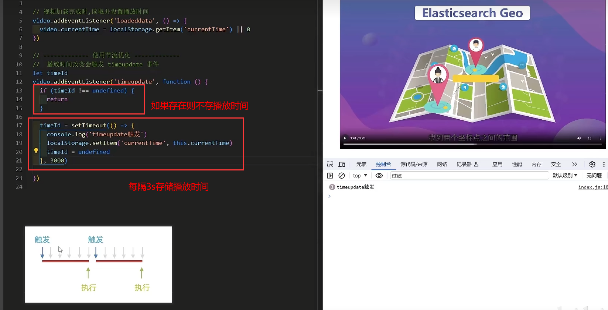
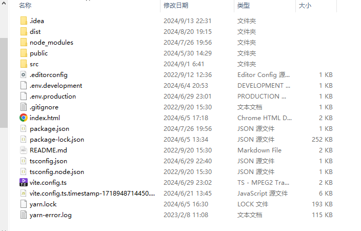

## 面试题JS

#### 1、计算空间复杂度 和 时间复杂度

##### 时间复杂度

时间复杂度通常用来描述算法执行时间随输入规模增长的变化趋势。它关注的是算法操作的总次数。

1. **理解算法操作**：首先，你需要理解算法中每个操作的执行次数。例如，循环、递归调用等。
2. **确定循环次数**：对于循环结构，确定循环体执行的次数。这通常与输入数据的规模（如数组长度）有关。
3. **最坏情况分析**：通常考虑算法的最坏情况，即输入数据导致算法执行次数最多的情况。
4. **计算总操作次数**：将所有操作的次数相加，得到总操作次数。
5. **简化表达式**：将总操作次数的表达式简化，忽略常数项和低阶项，因为它们对算法的增长趋势影响较小。
6. **确定大O表示**：最后，使用大O表示法来描述算法的时间复杂度，例如O(n)、O(n^2)、O(log n)等。

##### 空间复杂度

空间复杂度用来描述算法在执行过程中所需的存储空间。它关注的是算法占用的内存资源。

1. **确定变量和数据结构**：分析算法中使用的所有变量和数据结构。
2. **计算空间占用**：计算每个变量和数据结构占用的空间。对于数组、栈等，考虑它们的最大可能大小。
3. **考虑递归调用**：如果算法使用了递归，考虑递归调用栈的最大深度。
4. **总空间占用**：将所有空间占用相加，得到算法的总空间占用。
5. **简化表达式**：与时间复杂度类似，简化表达式，忽略常数项和低阶项。
6. **确定大O表示**：使用大O表示法来描述算法的空间复杂度，例如O(1)、O(n)、O(n^2)等。


#### 2、map

**`Map`** 对象保存键值对，并且能够记住键的原始插入顺序。任何值（对象或者[原始值](https://developer.mozilla.org/zh-CN/docs/Glossary/Primitive)）都可以作为键或值。

1. **键的类型**：`Map` 可以接受任何类型的键，包括对象和原始值。
2. **强引用**：`Map` 对其键的引用是强引用，这意味着只要键存在于 `Map` 中，它就不会被垃圾回收。
3. **可迭代**：`Map` 是可迭代的，可以使用 `for...of` 循环或其他迭代方法遍历。
4. **提供 `size` 属性**：`Map` 有一个 `size` 属性，可以返回映射中元素的数量。

:bulb: 适应场景：频繁添加 或 删除键值对 或 需要迭代键值对操作

 

#### 3、深拷贝

> 指属性 和 拷贝的源对象属性不共享相同的引用，即改变源时候，确保拷贝对象不会改变。实现深拷贝有多种方式，如下序列化再转回 和 structuredClone

:bulb: 序列化： JSON.stringify()

```typescript
function deepClone(obj) {
    return JSON.parse(JSON.stringify(obj));
}

const original = { a: 1, b: { c: 2 } };
const copied = deepClone(original);
console.log(copied); // { a: 1, b: { c: 2 } }
```

:bulb: structuredClone

```typescript
const original = { a: 1, b: new Map([['c', 2]]), date: new Date() };
const copied = structuredClone(original);
console.log(copied);

```


#### 4、柯里化

> 把接收多个参数的函数  转变成  接收单一参数（最初函数的第一个参数）的函数，并且返回接收余下参数而且返回结果的新函数。

```typescript
function sumMaker(length){
    let nums = []
    function sum(...args){
        nums.push(...args)
        if(nums.length >= length){
            const res = nums.slice(0,length).reduce((p,v) => p + v, 0)
            nums = []
            return res
        } else{
            return sum
        }
    }
    return sum
}

//测试
const sum4 = sumMaker(4)
sum4(1,2)(3)(4)

const sum6 = sumMaker(6)
sum6(1,2)(3)(4,5)(6)
```


#### 5、节流防抖（性能优化）

> ##### 防抖：
>
> 概念：防止JS高频渲染页面时出现的视觉抖动（卡顿）
>
> 适用场景：在触发频率高的事件中，执行耗费性能操作，连续操作后只有最后一次生效
>
> - 常见高频事件：resize、input、scroll、keyup
> - 耗费性能操作：操纵页面、网络请求
>
> 解决方案：连续事件`停止`触发后，`一段时间`内没再次触发，才执行业务代码
>
> 常见库：`lodash -- debounce`



> ##### 节流：
>
> 概念：防止高频触发事件造成的性能浪费
>
> 适用场景：触发频率高的事件中，执行耗费性能操作，连续触发，单位时间内只有一次生效
>
> 常见库：`lodash -- throttle`




#### 6、网页性能指标

##### FCP（First Contentful Paint ）

从网页开始加载到网页内容的任何部分呈现在屏幕上所用的时间。如下FCP在第二帧发生，因为有文本元素渲染到屏幕。`1.8 - 3s属于正常`


##### LCP（Largest Contentful Paint ）

从网页开始加载到屏幕上呈现最大的文本块或图片元素所用的时间。`2.5-4s属于正常`


##### INP（Interaction to Next Paint）

与网页进行的每次 `tap`、`click` 或键盘互动的延迟时间，良好的响应速度意味着网页对互动的响应速度很快。`200-500ms正常`


#### 7、带时限的缓存属性

:bulb: value ?? -1   `逻辑空值合并运算符，如果左侧为null 或 undefined,则返回右边，否则返回左侧`

```typescript
var TimeLimitedCache = function() {
    this.map = new Map()
    this.times = {}
};

/** 
 * @param {number} key
 * @param {number} value
 * @param {number} duration time until expiration in ms
 * @return {boolean} if un-expired key already existed
 */
TimeLimitedCache.prototype.set = function(key, value, duration) {
    let res = this.map.has(key)
    this.map.set(key,value)
    clearTimeout(this.times[key])
    this.times[key] = setTimeout(() => this.map.delete(key), duration)
    return res
};

/** 
 * @param {number} key
 * @return {number} value associated with key
 */
TimeLimitedCache.prototype.get = function(key) {
    return this.map.get(key) ?? -1
};

/** 
 * @return {number} count of non-expired keys
 */
TimeLimitedCache.prototype.count = function() {
  return this.map.size  
};

/**
 * const timeLimitedCache = new TimeLimitedCache()
 * timeLimitedCache.set(1, 42, 1000); // false
 * timeLimitedCache.get(1) // 42
 * timeLimitedCache.count() // 1
 */

```

#### 8、哈希表 及 JS实例

> 哈希表（Hash Table），也称为散列表
>
> 其主要思想是使用一个数组来存储所有的值，并通过一个哈希函数将键转换为数组的索引，从而在常数时间内完成查找、插入和删除操作。

**对象（Object）**： JavaScript的对象可以视为一种哈希表的实现。对象的属性名作为键，属性值作为值，通过属性名可以快速访问对应的属性值。

```typescript
let obj = {
    a: 1,
    b: 2,
    c: 3
};
console.log(obj.a); // 输出：1
```

**Map 对象**： JavaScript的 `Map` 对象是键值对的集合，它保持键的顺序。任何值（对象或者原始值）都可以作为一个键或一个值。

```typescript
let map = new Map();
map.set('key1', 'value1');
map.set('key2', 'value2');
console.log(map.get('key1')); // 输出：value1
```

**Set 对象**： `Set` 对象是值的集合，类似于 `Map`，但是 `Set` 中的值都是唯一的，没有重复。

```typescript
let set = new Set();
set.add('value1');
set.add('value2');
console.log(set.has('value1')); // 输出：true
```

#### 9、数组去重

##### set 构造函数

```typescript
const arrayWithDuplicates = [1, 2, 2, 3, 4, 4, 5];
const uniqueArray = Array.from(new Set(arrayWithDuplicates));
console.log(uniqueArray); // 输出: [1, 2, 3, 4, 5]
```

##### 扩展运算符

```typescript
const arrayWithDuplicates = [1, 2, 2, 3, 4, 4, 5];
const uniqueArray = [...new Set(arrayWithDuplicates)];
console.log(uniqueArray); // 输出: [1, 2, 3, 4, 5]
```

#### 10、前端工程化

现代Web开发构建理念，用于提高开发效率，包括：构建与打包、模块化、自动化测试等。


#### 11、Vite特性

1. **快速的冷启动**：
   - Vite 在开发环境下不会打包代码，而是使用原生 ES 模块导入来服务文件，这使得启动速度非常快。
2. **模块热替换（HMR）**：
   - Vite 支持模块热替换，这意味着在开发过程中，你可以在不刷新整个页面的情况下，实时看到代码更改的效果。


#### 12、项目启动到完整页面展示过程

文件目录结构如下：



- `yarn dev` 启动 Vite 开发服务器。
- Vite 读取 `package.json` 和 `vite.config.ts` 配置文件。
- 加载并解析项目依赖。
- 编译 TypeScript 代码，处理模块。
- 使用 HMR 实现热更新。
- 加载 `index.html` 和静态资源文件。
- 页面模块加载完成后，页面最终渲染。


#### 13、查询不含重复字符的最长子串

> :bulb: 子串不是子序列

- 不在则 `push` 进数组
- 在则删除滑动窗口数组里相同字符及相同字符前的字符，然后将当前字符 `push` 进数组
- 然后将 `max` 更新为当前最长子串的长度

```typescript
/**
 * @param {string} s
 * @return {number}
 */
var lengthOfLongestSubstring = function(s) {
    let arr = [], max = 0
    for(let i = 0; i < s.length; i++){
        let index = arr.indexOf(s[i])
        if(index !== -1){
            arr.splice(0,index + 1)
        }
        arr.push(s.charAt(i))
        max = Math.max(arr.length, max)
    }
    return max
};
```


#### 14、两数之和

```typescript
/**
 * @param {number[]} nums
 * @param {number} target
 * @return {number[]}
 */
var twoSum = function(nums, target) {
    for(let i = 0; i < nums.length; i++){
        for(let j = i + 1; j < nums.length; j++){
            if(nums[i] + nums[j] === target){
                return [i,j]
            }
        }
    }
};
```


#### 15、素数概念

`素数`是指大于 1 的自然数，并且只能被 1 和它本身整除的数。

判断过程如下

1. 小于等于 1 的数不是素数：
   - 根据定义，素数必须大于 1，所以任何小于等于 1 的数都不是素数。这是第一个直接判断的条件。
2. 2 是一个特殊的素数：
   - 2 是唯一的偶数素数，因为它只能被 1 和 2 整除。任何大于 2 的偶数都不是素数。
3. 从 3 开始检查，最多检查到平方根：
   - 对于任意一个大于 2 的整数 `n`，如果它不是素数，那么它一定可以被小于或等于其平方根的某个整数整除。
   - 这意味着，我们只需要检查从 2 到 `sqrt(n)` 之间的数是否能整除 `n`。如果找到一个能整除 `n` 的数，`n` 就不是素数。

```typescript
function isPrime(num) {
    if (num <= 1) return false;
    if (num === 2) return true;
    const sqrt = Math.floor(Math.sqrt(num));
    for (let i = 2; i <= sqrt; i++) {
        if (num % i === 0) {
            return false;
        }
    }
    return true;
}
```

