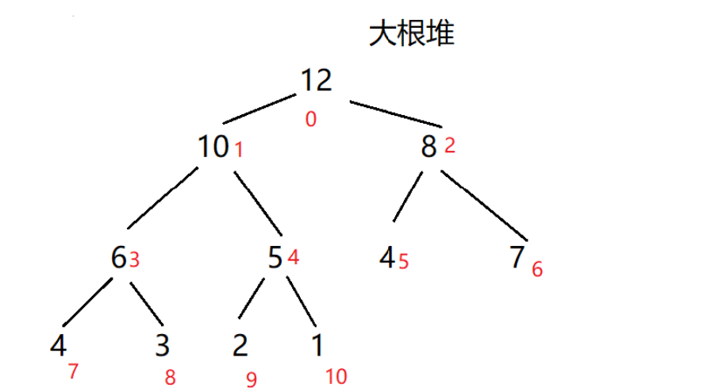
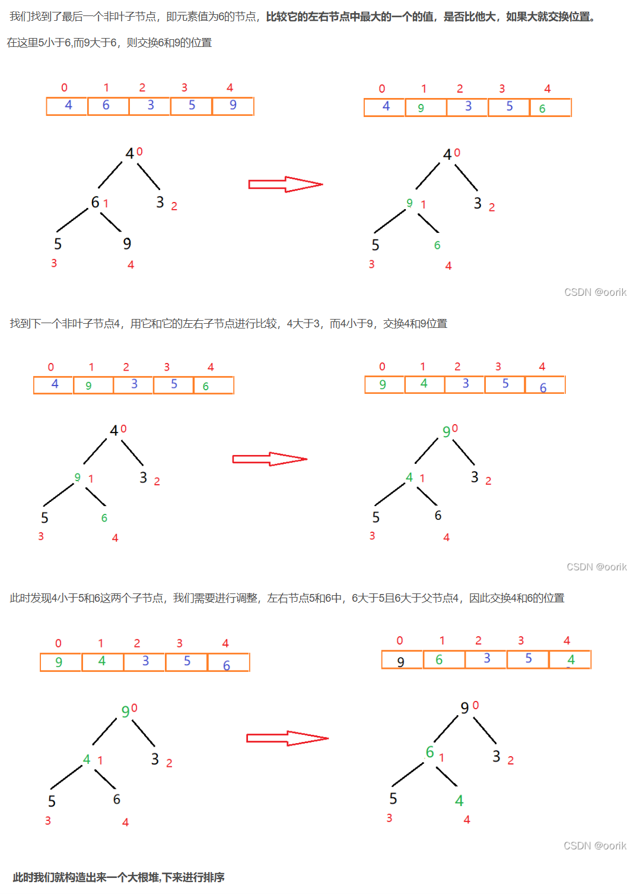

# JavaScript面试题

### 1011

#### 1、TCP通信协议的三次握手四次挥手

`三次握手`

第一次握手：客户端发送 SYN

客户端（Client）向服务器（Server）发送一个 `SYN`（synchronize sequence number，同步序列号）报文，表示请求建立连接。该报文包含了客户端生成的一个初始序列号 `Seq = x`，用于后续数据传输时的序列控制。

客户端进入 **SYN_SENT** 状态，等待服务器响应。


第二次握手：服务器发送 SYN-ACK

服务器收到客户端的 `SYN` 请求后，回复一个 `SYN-ACK` 报文，表示同意建立连接。该报文中包含：

- 服务器生成的一个初始序列号 `Seq = y`，表示服务器的序列控制。
- 对客户端 `SYN` 请求的确认号 `Ack = x+1`，表示服务器收到了客户端的 `SYN` 请求并确认序列号。

服务器进入 **SYN_RCVD** 状态，等待客户端确认。


第三次握手：客户端发送 ACK

客户端收到服务器的 `SYN-ACK` 报文后，向服务器发送一个 `ACK`（Acknowledgment，确认）报文。这个报文中包含：

- 确认服务器的序列号 `Ack = y+1`，表示客户端确认服务器的 `SYN`。
- 客户端进入 **ESTABLISHED** 状态，表示连接建立完成。

服务器收到该 `ACK` 报文后，也进入 **ESTABLISHED** 状态，连接正式建立，双方可以开始数据传输。


`四次挥手`

第一次挥手：客户端发送 FIN

当客户端决定不再发送数据时，它会发送一个 `FIN`（Finish，结束）报文给服务器，表示关闭客户端到服务器的数据传输通道。

客户端进入 **FIN_WAIT_1** 状态，等待服务器的确认。


第二次挥手：服务器发送 ACK

服务器收到客户端的 `FIN` 报文后，发送一个 `ACK` 报文，确认已经收到客户端的 `FIN`，并且表示服务器还可能继续发送数据。

服务器发送的 `ACK` 报文中包含对 `FIN` 的确认号 `Ack = x+1`。

客户端收到该确认后，进入 **FIN_WAIT_2** 状态，等待服务器的 `FIN` 报文。


第三次挥手：服务器发送 FIN

当服务器完成数据传输后，它也会向客户端发送一个 `FIN` 报文，表示关闭服务器到客户端的数据传输通道。

服务器进入 **LAST_ACK** 状态，等待客户端的 `ACK` 确认。


第四次挥手：客户端发送 ACK

客户端收到服务器的 `FIN` 报文后，向服务器发送一个 `ACK` 报文，确认已经收到服务器的 `FIN`。发送 `ACK` 后，客户端进入 **TIME_WAIT** 状态。

在 `TIME_WAIT` 状态下，客户端会等待一段时间（通常为 2 倍的最大报文段寿命，MSL），确保服务器收到了最后的 `ACK`，以防止服务器认为客户端没有收到其 `FIN` 而重传 `FIN` 报文。

服务器收到该 `ACK` 报文后，进入 **CLOSED** 状态，连接完全关闭。

:bulb: OSI参考模型：应用层、表示层、会话层、`传输层`、网络层、数据链路层、物理层


#### 2、原型题目

`__proto__` 将实例对象和对象组成原型链

一切函数对象的`__proto__`都最终指向Function原型对象

一切原型对象都最终指向Object.prototype

`Object.prototype.__proto__`指向null


#### 3、项目工程化

一个完整的开发构建理念，用于提高开发效率，包括构建打包、模块化开发、自动化测试。


项目构建--脚手架快速构建ViteJS


模块化开发，组件页面开发（插槽） 和 功能模块（解耦）开发


自动化测试，mockJS


#### 4、Cesium的主要类

（1）最外层widgets--小控件

（2）scene--天空盒、太阳、月亮、大气圈等

（3）地形terrainProvider 和 影像imageryProvider

（4）展示可视化物质--DataSourceCollection、EntitiesCollection

（5）交互--Camera / Event

（6）Graphics--更适于方便交互、设置材质 和 大小； Geometry--适于更复杂几何体的可视化


#### 5、双指针反转字符串

```typescript
function reverseArray(arr) {
    // 定义左指针和右指针
    let left = 0;
    let right = arr.length - 1;

    while (left < right) {
        let temp = arr[left];
        arr[left] = arr[right];
        arr[right] = temp;

        // 左指针右移，右指针左移
        left++;
        right--;
    }

    return arr;
}

// 示例
let arr = [1, 2, 3, 4];
console.log(reverseArray(arr));
```


#### 6、常见状态码

> HTTP状态码--HTTP Status Code, 表示响应状态的三位数

- 1表示消息
  - 100（客户端继续发送请求，这是临时响应）：这个临时响应是用来通知客户端它的部分请求已经被服务器接收，且仍未被拒绝。客户端应当继续发送请求的剩余部分，或者如果请求已经完成，忽略这个响应。服务器必须在请求完成后向客户端发送一个最终响应
  - 101：服务器根据客户端的请求切换协议，主要用于websocket或http2升级
- 2表示成功
  - 200（成功）：请求已成功，请求所希望的响应头或数据体将随此响应返回
  - 201（已创建）：请求成功并且服务器创建了新的资源
  - 202（已创建）：服务器已经接收请求，但尚未处理
  - 203（非授权信息）：服务器已成功处理请求，但返回的信息可能来自另一来源
  - 204（无内容）：服务器成功处理请求，但没有返回任何内容
  - 205（重置内容）：服务器成功处理请求，但没有返回任何内容
  - 206（部分内容）：服务器成功处理了部分请求
- 3表示重定向
  - 300（多种选择）：针对请求，服务器可执行多种操作。 服务器可根据请求者 (user agent) 选择一项操作，或提供操作列表供请求者选择
  - 301（永久移动）：请求的网页已永久移动到新位置。 服务器返回此响应（对 GET 或 HEAD 请求的响应）时，会自动将请求者转到新位置
  - 302（临时移动）： 服务器目前从不同位置的网页响应请求，但请求者应继续使用原有位置来进行以后的请求
  - 303（查看其他位置）：请求者应当对不同的位置使用单独的 GET 请求来检索响应时，服务器返回此代码
  - 305 （使用代理）： 请求者只能使用代理访问请求的网页。 如果服务器返回此响应，还表示请求者应使用代理
  - 307 （临时重定向）： 服务器目前从不同位置的网页响应请求，但请求者应继续使用原有位置来进行以后的请求
- 4表示请求错误
  - 400（错误请求）： 服务器不理解请求的语法
  - 401（未授权）： 请求要求身份验证。 对于需要登录的网页，服务器可能返回此响应。
  - 403（禁止）： 服务器拒绝请求
  - 404（未找到）： 服务器找不到请求的网页
  - 405（方法禁用）： 禁用请求中指定的方法
  - 406（不接受）： 无法使用请求的内容特性响应请求的网页
  - 407（需要代理授权）： 此状态代码与 401（未授权）类似，但指定请求者应当授权使用代理
  - 408（请求超时）： 服务器等候请求时发生超时
- 5表示服务器错误
  - 500（服务器内部错误）：服务器遇到错误，无法完成请求
  - 501（尚未实施）：服务器不具备完成请求的功能。 例如，服务器无法识别请求方法时可能会返回此代码
  - 502（错误网关）： 服务器作为网关或代理，从上游服务器收到无效响应
  - 503（服务不可用）： 服务器目前无法使用（由于超载或停机维护）
  - 504（网关超时）： 服务器作为网关或代理，但是没有及时从上游服务器收到请求
  - 505（HTTP 版本不受支持）： 服务器不支持请求中所用的 HTTP 协议版本


:bulb: 301 新域名替换旧域名，旧的域名不再使用时，用户访问旧域名时用301就重定向到新的域名

:bulb: 302 临时重定向不会缓存，常用 于未登陆的用户访问用户中心重定向到登录页面。比如Vue中挂载router路由对象时，可在router中设置导航守卫，添加判断条件，如检查LocalStorage是否有tokenID等。


#### 7、NodeJS印象

概念：开源和跨平台的 JavaScript 运行时环境，主要用于后端服务搭建

特点：非阻塞异步IO流

- 相较浏览器端，增加了IO流，可以读取文件
- 执行诸如文件读写、网络请求等 I/O 操作时，能够在后台进行而不会阻塞代码的执行
  - 方便处理高并发情景，`因为不需要为每个请求创建新的线程，而是把请求压入事件队列,循环遍历队列状态，为发生变化的事件执行对应的处理代码，一般是回调函数`。

优势：

前端开发者很多，不必再多学一门语言


#### 8、经历

Node - Express框架、mysql 和 pg。

1、相关工具--navicat / postman

2、跨域处理 -- 后端设置Access-control 为 *，前端设置代理请求

3、前端请求的Vite代理服务器转发。原理类似Nginx的反向代理，接收到请求，转发内部服务器即后端服务器，反馈Nginx代理服务器，再转发客户端。

4、JWT工作机制。用户名秘密的加密处理。


#### 9、NodeJS有哪些全局对象

- process
  - 提供有关当前进程的信息和控制
- console
  - 常用的输出方式
- clearInterval、setInterval
- clearTimeout、setTimeout
  - 定时器
- global
  - 任何全局变量、函数、对象都是该对象的一个属性值


#### 10、Buffer 和 Stream

`Buffer` 是 Node.js 提供的一个类，有固定大小的字节数组

`Stream` 是 Node.js 中处理流式数据的抽象接口

- 可以将 `Buffer` 数据流转换为 `Stream`，也可以从 `Stream` 中读取数据到 `Buffer`
- 在处理大量数据时，使用 `Stream` 可以提高性能，因为它允许逐块处理数据，而不是一次性加载到内存中


#### 11、常见的设计模式

是对常见应用场景解决方案的一种概念化描述。

- 单例模式
- 工厂模式
- 策略模式
- 代理模式
- 中介者模式

工厂模式：定义一个创建对象的接口，但让子类决定实例化哪一个类。

:bulb: 封装性：工厂模式隐藏了对象创建的细节，调用者只需要知道需要什么，而不需要知道如何创建。

:bulb: 扩展性：新增产品类时，不需要修改工厂类的代码，只需要新增具体产品类和相应的具体工厂类即可。


#### 12、发布--订阅者模式

一种软件架构模式，有两种角色

- 发布者 publish 发布事件消息
- 订阅者 subscriber 订阅发布者的事件，做出各自的响应


#### 13、http&https区别

- 端口：

  - **HTTP**：默认使用80端口。

  - **HTTPS**：默认使用443端口。

- 安全性：

  - HTTP：由于没有加密，HTTP连接被认为是不安全的，容易受到中间人攻击和其他安全威胁。

  - HTTPS：更高的安全性，可以保护用户数据免受攻击，是现代网站推荐的协议。

- 性能：

  - HTTP：由于没有加密和解密的过程，通常比HTTPS更快。

  - HTTPS：由于加密和解密的过程，可能会有轻微的性能开销，但随着技术的进步，这种差异正在变得越来越小。

- 搜索引擎优化（SEO）：

  - HTTP：Google和其他主流搜索引擎可能会降低没有使用HTTPS的网站的搜索排名。

  - HTTPS：被认为是SEO的一个积极因素，有助于提高网站的搜索排名。


#### 14、promise控制并发数量

```typescript
//初始化并发函数，promiseArr参数 和 最大并发数
const createSchedule = (requestList, max) => {
  let runningSize = 0;
  let finishSize = 0;
  //返回一个二维数组，长度为request.length，[[mock,0],[mock,1], 省略号]
  const queue = Array.from({ length: requestList.length }, (_, index) => [
    requestList[index],
    index,
  ]);
  const res = new Array(requestList.length);
  return new Promise((resolve, reject) => {
    const handle = () => {
      if (finishSize === requestList.length) {
        resolve(res);
      }
      //初始化运行过程中超过最大并发数的handle不运行，比如10个请求，3个并发，初始后的剩余7个不处理
      if (runningSize >= max || queue.length === 0) return;

      const [task, index] = queue.shift();
      task()
        .then(
          (value) => {
            res[index] = value;
                  console.log('这是第' + (index + 1) + '个，状态为' + value.status + ',值为' + value.value)
          },
          (reason) => {
            res[index] = reason;
                  console.log('这是第' + (index + 1) + '个，状态为' + reason.status + ',值为' + reason.value)
          }
        )
        .finally(() => {
          runningSize--;
          finishSize++;
          //剩余7个逐步在前3个finally后运行
          handle();
        });
      runningSize++;
    };

    for (let i = 0; i < requestList.length; i++) {
      handle();
      //每个handle内部有异步任务，把这些异步任务放到异步队列，后续逐个运行
      console.log('循环了' + i + '次')
    }
  });
};

const start = Date.now();

async function mock() {
  //模拟请求等待时长，这里等待后resolve不做处理，用random()随机判定请求状态并返回给上面task的then  
  await new Promise((resolve) => setTimeout(resolve, 1000));

  if (Math.random() > 0.8) {
    throw {
      status: "error",
      value: Date.now() - start,
    };
  } else {
    return {
      status: "success",
      value: Date.now() - start,
    };
  }
}
const requestList = Array(10).fill(mock)
createSchedule(requestList, 3).then((res) => {
  console.log(res);
});
```


#### 15、常见排序方式

##### 15.1 快排

```typescript
// 快速排序函数
function quickSort(arr, low = 0, high = arr.length - 1) {
    if (low < high) {
        // 找到分区索引
        const pi = partition(arr, low, high);
        // 对分区左边的子数组进行快速排序
        quickSort(arr, low, pi - 1);
        // 对分区右边的子数组进行快速排序
        quickSort(arr, pi + 1, high);
    }
    return arr;
}

// 分区函数
function partition(arr, low, high) {
    // 选择最后一个元素作为基准
    let pivot = arr[high];
    // i初始化为指向低索引的前一个位置
    let i = low - 1;
    // 遍历数组，除了基准元素
    for (let j = low; j < high; j++) {
        // 如果当前元素小于或等于pivot
        if (arr[j] <= pivot) {
            // 增加i，指向下一个元素
            i++;
            // 交换arr[i]和arr[j]
            [arr[i], arr[j]] = [arr[j], arr[i]];
        }
    }
    // 将基准元素放置在正确的位置
    [arr[i + 1], arr[high]] = [arr[high], arr[i + 1]];
    // 返回基准元素的索引
    return i + 1;
}

// 测试快速排序
const testArray = [10, 7, 8, 9, 1, 5];
console.log("Original array:", testArray);
console.log("Sorted array:", quickSort(testArray));
```


##### 15.2 堆排序

> :bulb: 堆是一个近似完全二叉树的结构，并同时满足堆的性质：即子结点的键值或索引总是小于（或者大于）它的父节点
>
> 有大根堆 和 小根堆两种排序方式
>
> 将堆顶元素为最大值的叫做“大根堆”（Max Heap），堆顶为最小值的叫做“小根堆”。



:bulb: 对于一个**完全二叉树**，在填满的情况下（非叶子节点都有两个子节点），每一层的元素个数是上一层的二倍，根节点数量是1，所以最后一层的节点数量，一定是之前所有层节点总数+1，所以，我们能找到最后一层的第一个节点的索引，即节点总数/2（根节点索引为0）;第最后一个非叶子节点的索引就是 arr.len / 2 -1

`创建大根堆的思想如下`



```typescript
function heapSort(arr) {
    const n = arr.length;

    // 构建最大堆
    for (let i = Math.floor(n / 2) - 1; i >= 0; i--) {
        heapify(arr, n, i);
    }

    // 一步步将最大的元素放到末尾，缩小堆的范围
    for (let i = n - 1; i > 0; i--) {
        // 交换堆顶元素（最大）和当前范围的最后一个元素
        [arr[0], arr[i]] = [arr[i], arr[0]];
        // 调整堆以维护最大堆性质
        heapify(arr, i, 0);
    }

    return arr;
}

// 调整堆，维护最大堆性质
function heapify(arr, heapSize, rootIndex) {
    let largest = rootIndex; // 根节点
    const leftChild = 2 * rootIndex + 1; // 左子节点
    const rightChild = 2 * rootIndex + 2; // 右子节点

    // 检查左子节点是否存在且大于根节点
    if (leftChild < heapSize && arr[leftChild] > arr[largest]) {
        largest = leftChild;
    }

    // 检查右子节点是否存在且大于目前最大的节点
    if (rightChild < heapSize && arr[rightChild] > arr[largest]) {
        largest = rightChild;
    }

    // 如果根节点不是最大节点，则交换它们，并继续调整交换后的子树
    if (largest !== rootIndex) {
        [arr[rootIndex], arr[largest]] = [arr[largest], arr[rootIndex]];
        heapify(arr, heapSize, largest); // 递归调整子树
    }
}

// 示例使用
const arr = [12, 11, 13, 5, 6, 7];
console.log("排序前:", arr);
heapSort(arr);
console.log("排序后:", arr);
```


#### 16、常见for循环对比

| 遍历方式      | 适用对象                                    | 获取内容  | 场景                                           |
| ------------- | ------------------------------------------- | --------- | ---------------------------------------------- |
| `for...of`    | 可迭代对象（数组、字符串、`Set`、`Map` 等） | 元素值    | 遍历数组和其他可迭代对象的**值**               |
| `for...in`    | 对象（也能用于数组，但不推荐）              | 属性/索引 | 遍历对象属性，**不推荐用于数组**               |
| `for`（传统） | 数组、类数组对象                            | 数字索引  | 需要**索引控制**的复杂场景（跳过、倒序遍历等） |

```typescript
const myObjct10 = {
    name: 'dfsafds',
    age: 10,
    condition: true,
    selfFunction: function(){
        return 1
    },
    time: new Date()
}
for(let i in myObjct10){
    console.log(i)
    console.log(myObjct10[i])
}
//-----------------
name
VM1310:12 dfsafds
VM1310:11 age
VM1310:12 10
VM1310:11 condition
VM1310:12 true
VM1310:11 selfFunction
VM1310:12 ƒ (){
        return 1
    }
VM1310:11 time
VM1310:12 Sun Oct 27 2024 20:34:10 GMT+0800 (中国标准时间)
```


#### 17、js数据类型

```sh
1. 基本数据类型（Primitive Types）
基本数据类型是不可变的，即它们的值一旦被创建就不能更改。

Number：表示整数和浮点数。例如，42、3.14。
BigInt：用于表示大整数，超过 Number 的安全范围（2^53-1）。通过在数字后添加 n（如 12345678901234567890n）来创建。
String：表示文本数据。例如，"Hello"、'World'。
Boolean：只有两个值，true 和 false。
Undefined：表示一个变量已经声明但未初始化时的值。let x; // x 的值为 undefined。
Null：表示“空”或“不存在”的值，通常用来表示一个空对象的引用。
Symbol：表示唯一标识符，常用于对象属性的唯一键。通过 Symbol() 函数创建。

2. 引用数据类型（Reference Types）
引用数据类型保存的是指向实际对象的引用，操作的是地址而不是数据本身。

Object：是 JavaScript 中最复杂的数据类型，用于存储键值对。可以包含任意类型的数据。
Array：特殊类型的对象，用于按顺序存储数据的集合。
Function：也是对象的一种，可以被调用。
Date：表示特定的时间点。
RegExp：表示正则表达式，用于匹配字符串的模式。

3. 特殊类型
NaN：Number 类型中的一种特殊值，表示“不是一个数字”（Not-a-Number），通常是无效数学操作的结果（例如，0 / 0）。
Infinity 和 -Infinity：Number 类型中的特殊值，表示正无穷和负无穷。
```


#### 18、reduce

```typescript
reduce(callbackFn)
reduce(callbackFn, initialValue)
```

为数组中每个元素执行的函数。其返回值将作为下一次调用 `callbackFn` 时的 `accumulator` 参数。对于最后一次调用，返回值将作为 `reduce()` 的返回值。该函数被调用时将传入以下参数：

- [`accumulator`](https://developer.mozilla.org/zh-CN/docs/Web/JavaScript/Reference/Global_Objects/Array/reduce#accumulator)

  上一次调用 `callbackFn` 的结果。在第一次调用时，如果指定了 `initialValue` 则为指定的值，否则为 `array[0]` 的值。

- [`currentValue`](https://developer.mozilla.org/zh-CN/docs/Web/JavaScript/Reference/Global_Objects/Array/reduce#currentvalue)

  当前元素的值。在第一次调用时，如果指定了 `initialValue`，则为 `array[0]` 的值，否则为 `array[1]`。

- [`currentIndex`](https://developer.mozilla.org/zh-CN/docs/Web/JavaScript/Reference/Global_Objects/Array/reduce#currentindex)

  `currentValue` 在数组中的索引位置。在第一次调用时，如果指定了 `initialValue` 则为 `0`，否则为 `1`。

- [`array`](https://developer.mozilla.org/zh-CN/docs/Web/JavaScript/Reference/Global_Objects/Array/reduce#array)

  调用了 `reduce()` 的数组本身。

[`initialValue`](https://developer.mozilla.org/zh-CN/docs/Web/JavaScript/Reference/Global_Objects/Array/reduce#initialvalue) 可选

第一次调用回调时初始化 `accumulator` 的值。如果指定了 `initialValue`，则 `callbackFn` 从数组中的第一个值作为 `currentValue` 开始执行。如果没有指定 `initialValue`，则 `accumulator` 初始化为数组中的第一个值，并且 `callbackFn` 从数组中的第二个值作为 `currentValue` 开始执行。在这种情况下，如果数组为空（没有第一个值可以作为 `accumulator` 返回），则会抛出错误。


案例1 -- 迭加

```typescript
const array1 = [1, 2, 3, 4];

// 0 + 1 + 2 + 3 + 4
const initialValue = 0;
const sumWithInitial = array1.reduce(
  (accumulator, currentValue) => accumulator + currentValue,
  initialValue,
);

console.log(sumWithInitial); //10
```


案例2 --迭减

```typescript
const array1 = [1, 2, 3, 4];

// 0 + 1 + 2 + 3 + 4
const initialValue = 10;
const sumWithInitial = array1.reduce(
  (accumulator, currentValue) => accumulator - currentValue,
  initialValue,
);

console.log(sumWithInitial);  //0
```


#### 19、instanceof

```typescript
console.log('aaa' instanceof String)
console.log(5 instanceof Number)
```

`console.log(ts instanceof String)`

- `ts` 是一个字符串的**原始值**，它的类型是 `"string"`，而不是 `String` 对象。
- `instanceof` 操作符用于检查一个对象是否是某个构造函数的实例，但在这里，`ts` 是一个原始数据类型，而不是 `String` 对象。
- 因此，`ts instanceof String` 的结果为 **`false`**。

如果我们将 `ts` 设为 `new String('aaa')`，那么它将是一个 `String` 对象，`ts instanceof String` 的结果才会是 `true`。


 `console.log(5 instanceof Number)`

- `5` 是一个数字的**原始值**，其类型是 `"number"`，而不是 `Number` 对象。
- 同样地，`instanceof` 用于检查一个对象是否是某个构造函数的实例，但这里 `5` 只是一个原始数据类型，而不是 `Number` 对象。
- 因此，`5 instanceof Number` 的结果为 **`false`**。

如果我们将 `5` 替换为 `new Number(5)`，结果才会是 `true`，因为 `new Number(5)` 创建了一个 `Number` 对象。


- 对于原始类型（如字符串、数字等），使用 `instanceof` 检查是否为其对象包装类型（如 `String`、`Number`）会返回 `false`。
- 原始值不会通过 `instanceof` 检查为相应的包装对象。
