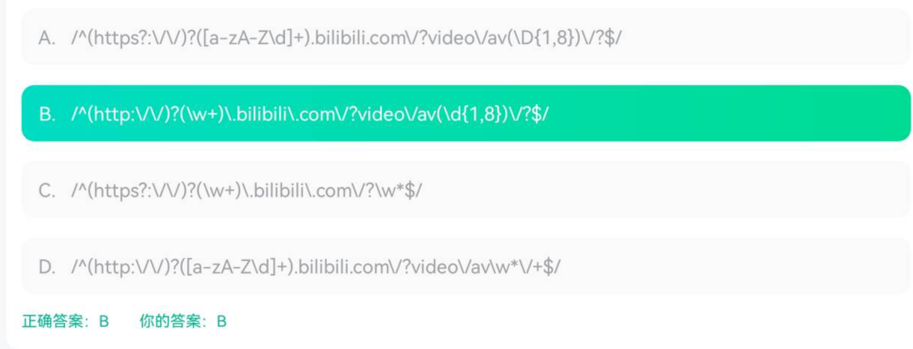
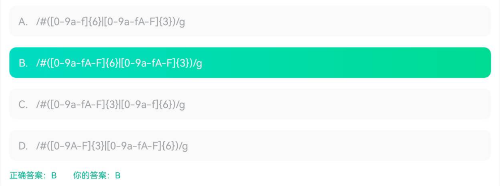
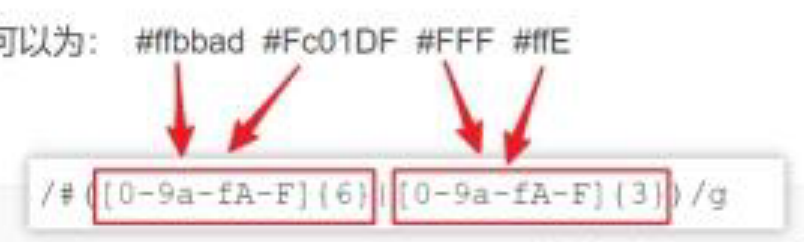

# 正则表达式

## 1、网址匹配

以下哪一项正则能正确的匹配网址: http://www.bilibili.com/video/av21061574 （）




解释

```
首先，^表示匹配输入的开始，$表示匹配输入的结束
每个选项从前向后看，http都能够严格匹配
?表示匹配某元素0次或1次，这里四个选项都没有问题，能够匹配0次或1次字符s
接下来:严格匹配，\/\/严格匹配两个//
接着往下看，[]表示字符集合，它用在正则表达式中表示匹配集合中的任一字符
A D 选项中的 [a-zA-Z\d] 表示匹配一个小写字母 或者 大写字母 或者 数字
B C 选项中的 \w 表示匹配字母数字或下划线（注意这里比A D中能多匹配下划线类型）
+表示匹配某元素1次或多次，到这里四个选项都能够完美匹配字符www
.可以匹配除了换行符\n \r外的任何字符
接下来我们看选项A，bilibili com video av都严格匹配，而 \D 表示匹配一个非数字字符而非数字字符，av后的数字是无法匹配成功的，A错误
B选项，\d匹配数字，{m,n}表示最少匹配m次，最多匹配n次，\/?能匹配末尾的0个或1个/字符，B正确
C选项，*表示匹配某元素0次或多次，但 \w 并不能匹配字符 /，C错误
D选项，前面都对，错在最后的\/+至少要匹配一个/，而原字符串最后并没有/
```


## 2、16进制颜色匹配

要求匹配以下16进制颜色值，正则表达式可以为： #ffbbad #Fc01DF #FFF #ffE






## 3、以下哪些正则表达式满足regexp.test('abc') === true？

```typescript
/^abc$/
//这算是完全匹配了，^a表示以a开头，c$表示以c结尾，中间再夹个b
/[ab]{2}[^defgh]/
//[ab]表示a或b {2}表示长度为2  [^defgh]表示非defgh的字符，所以可匹配的有,aac,bbc,abc,abcd等，注意这里匹配长度为3
```


## 4、match

```typescript
var result = "75team2017".match(/\d+\w*/g);
//["75team2017"]
```

match（）方法检索返回一个字符串匹配正则表达式的结果，匹配成功则返回数组，失败则返回null。

在正则表达式中，\d表示匹配数字0-9，+表示匹配前面字符一次或者多次，\w表示匹配字母、数字或者下划线，表示匹配前面字符0次或者多次，修饰符g表示全局匹配。

由于+和*都是贪婪匹配，所以\d+匹配到75，\w*匹配到team2017，此时字符串已被全部匹配，故返回的result数组中，只有一个数组元素，即字符串75team2017


## 5、replace

```typescript
var str = "Hellllo world";
str = str.replace(/(l)\1/g, '$1');
//Hello world
```

在这段 JavaScript 代码中，正则表达式 `/ (l)\1 /g` 匹配了连续重复的字符 "ll" 并且将其替换为一个单独的 "l"。让我们来解释一下正则表达式的各个部分：

1. `/`: 正则表达式的开始和结束标记，用于标识正则表达式的开始和结束。
2. `(l)`: 这是一个捕获组，它用于捕获字符 "l"。括号内的内容表示要捕获的内容。
3. `\1`: 这是一个反向引用，它引用了之前捕获的内容。在这个正则表达式中，`\1` 表示引用第一个捕获组中匹配的内容，即字符 "l"。
4. `g`: 这是一个修饰符，表示全局匹配模式。它告诉 JavaScript 引擎在整个字符串中查找所有匹配项。

因此，正则表达式 `/ (l)\1 /g` 匹配了连续重复的字符 "ll"，并将其替换为一个单独的 "l"。在这段代码中，`str.replace()` 方法用于将匹配的字符串替换为指定的内容。

