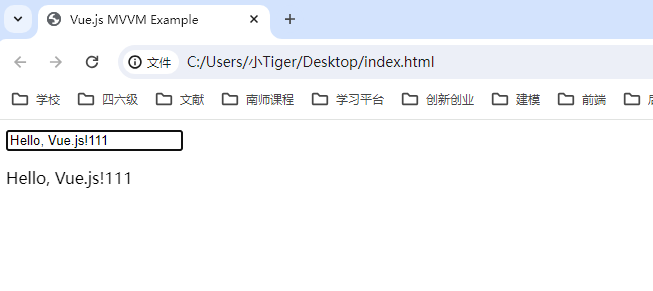

# 面试题--VUE

### 1、Watch & computed

watch 能够执行异步操作，computed 不能；


### 2、MVVM

一种软件架构模式，它将应用程序分为三个主要部分：`Model（模型）、View（视图）和ViewModel（视图模型）`。

1. **Model（模型）**：
   - Model 是应用程序的数据层，负责管理数据的获取、存储和处理。在 Vue.js 中，Model 通常是由 JavaScript 对象构成的。这些对象可以是从服务器获取的数据，也可以是应用程序状态。
2. **View（视图）**：
   - View 是用户界面的表示，负责展示数据给用户，并接收用户的输入。在 Vue.js 中，View 通常是声明性的，使用模板语法将数据绑定到 DOM 元素上。
3. **ViewModel（视图模型）**：
   - ViewModel 是连接 Model 和 View 的桥梁。它负责将 Model 的数据转换成 View 的表示，并监听用户的输入更新 Model 的状态。在 Vue.js 中，ViewModel 由 Vue 实例扮演，它包含了数据、模板和行为的逻辑。

案例如下:

```typescript
<!DOCTYPE html>
<html lang="en">
<head>
  <meta charset="UTF-8">
  <meta name="viewport" content="width=device-width, initial-scale=1.0">
  <title>Vue.js MVVM Example</title>
</head>
<body>

<div id="app">
  <input v-model="message">
  <p>{{ message }}</p>
</div>

<script src="https://cdn.jsdelivr.net/npm/vue@2"></script>
<script>
  new Vue({
    el: '#app',
    data: {
      message: 'Hello, Vue.js!'
    }
  });
</script>

</body>
</html>

```




