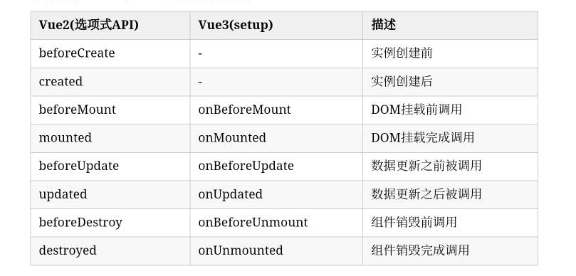
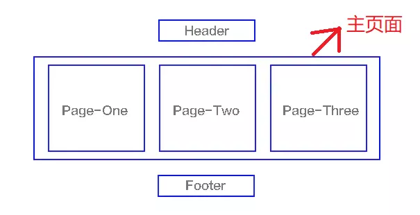
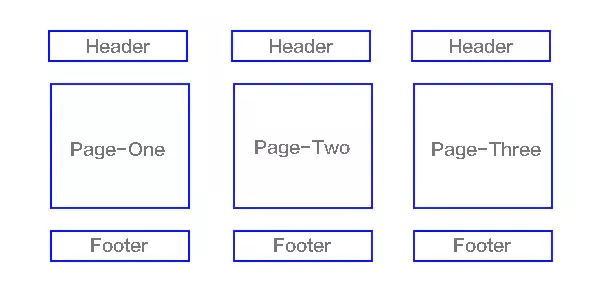

# Vue面试题

## 202410

### 1、Vue2/3生命周期

- **挂载前后**：进行DOM操作、数据请求等。
- **更新前后**：响应数据变化，执行依赖于DOM的操作。
- **卸载前后**：清理资源，如移除事件监听器、取消定时器等。


##### Vue2

| 生命周期      | 描述                       | 作用                                                         |
| :------------ | :------------------------- | ------------------------------------------------------------ |
| beforeCreate  | 组件实例被创建之初         | 执行时组件实例还未创建，通常用于插件开发中执行一些初始化任务 |
| created       | 组件实例已经完全创建       | 组件初始化完毕，各种数据可以使用，常用于异步数据获取         |
| beforeMount   | 组件挂载之前               | 未执行渲染、更新，dom未创建                                  |
| mounted       | 组件挂载到实例上去之后     | 初始化结束，dom已创建，可用于获取访问数据和dom元素           |
| beforeUpdate  | 组件数据发生变化，更新之前 | 更新前，可用于获取更新前各种状态，此时`view`层还未更新       |
| updated       | 组件数据更新之后           | 完成`view`层的更新；若在`updated`中再次修改数据，会再次触发更新方法（`beforeUpdate`、`updated`） |
| beforeDestroy | 组件实例销毁之前           | 销毁前，可用于一些定时器或订阅的取消                         |
| destroyed     | 组件实例销毁之后           | 完全销毁一个实例。可清理它与其它实例的连接，解绑它的全部指令及事件监听器 |

:bulb: created 和 mounted之间的区别

- `created`是在组件实例一旦创建完成的时候立刻调用，这时候页面`dom`节点并未生成；`created`是比`mounted`要更早的
- `mounted`是在页面`dom`节点渲染完毕之后就立刻执行的。

:bulb: created 和 mounted之间的相同点

都能拿到实例对象的属性和方法。 讨论这个问题本质就是触发的时机，放在`mounted`中的请求有可能导致页面闪动（因为此时页面`dom`结构已经生成），但如果在页面加载前完成请求，则不会出现此情况。建议对页面内容的改动放在`created`生命周期当中。


##### Vue3

**在【options API】中，生命周期钩子是被暴露在vue实例上的选项，我们只需要调用使用即可。**

**在【composition API】中，我们需要将生命周期钩子导入项目，然后才能使用。**

```typescript
import {onMounted} from 'vue'
```

- `onBeforeMount` 是在组件挂载之前调用的生命周期钩子。此时，组件的模板已经渲染为HTML，但是还没有添加到页面中
- `onMounted` 是在组件挂载完成后调用的生命周期钩子。此时，可以执行依赖于DOM的操作，例如获取元素的尺寸或启动动画
- `onBeforeUpdate` 是在组件更新之前调用的生命周期钩子。这发生在响应式数据变化后，组件的虚拟DOM重新渲染之前
- `onUpdated` 是在组件更新完成后调用的生命周期钩子。这发生在响应式数据变化后，组件的虚拟DOM重新渲染并已应用到真实DOM之后
- `onBeforeUnmount` 是在组件卸载之前调用的生命周期钩子。这发生在组件被销毁之前，可以用来执行清理操作，如取消网络请求、移除事件监听器等
- `onUnmounted` 是在组件卸载完成后调用的生命周期钩子。此时，组件已经从页面中移除，可以执行一些最终的清理工作。


### 3、Vue2选项式API 和 Vue3组合式API

- 在逻辑组织和逻辑复用方面，组合式更倾向将相关联的数据和方法放在一起，而选项式则更加分散，不易于集中管理（高内聚，低耦合）
  - Composition Api 整体优于 Options Api

- Vue3原生支持TypeScript，提高了类型检查和类型判断能力
- Vue3向下兼容Vue2语法，小组件也可继续使用
- Vue2采用defineProperty（）、Vue3使用Proxy对象代理整个数据对象


### 4、Vue中的虚拟DOM

概念：虚拟DOM是对真实DOM的抽象表达。在javaScript对象中，虚拟DOM表现为一个Object对象，并且最少包含 标签名、属性和子元素对象三个属性。

:bulb: 在Vue的源码中，存在VNode类，该类的构造函数中包含tag、children等属性。不过具体如何通过VNode类创建 和 删除节点未曾深入了解。


### 5、Vue2&Vue3区别

> 1. 编码方式
> 2. 生命周期
> 3. TypeScript
> 4. 响应式原理
> 5. 性能优化
> 6. Diff改进

##### 编码方式

Vue2

- 选项式API，逻辑分散

- data 和 methods；  

Vue3

- 组合式API ，setup内部统一声明逻辑，逻辑内聚
- ref reactive watch computed


##### 生命周期




##### Typescript支持

vue2 源码是javascript编写，需要手动维护类型定义

vue3是typescript编写，原生支持ts


##### 响应式原理

- Vue2 使用Object.defineProperty()监听对象的属性访问和修改。对于数组的监听需要特殊处理，Vue2重写了数组的方法，如push pop等
- Vue3使用ES6中的Proxy代理，Proxy可以拦截并重定义对象上的操作；组合式API对数据的处理更加便捷，因为可以把相关的变量常量方法放在一起，


##### 性能优化

- 数据监听机制优化。Vue2的Object.defineProperty()通过数据劫持方式监听，需要遍历所有属性，存在性能开销；Vue3使用Proxy，直接监听对象，减少遍历时间。

- 减小包体积。

  - vue3引入`Tree shaking` 是一种通过清除多余代码方式来优化项目打包体积的技术

    - 编译阶段利用`ES6 Module`判断哪些模块已经加载
    - 判断那些模块和变量未被使用或者引用，进而删除对应代码

  - ```typescript
    //vue2
    import Vue from 'vue'
    Vue.nextTick(() => {})
    
    //vue3
    import { nextTick, observable } from 'vue'
    nextTick(() => {})
    ```

- 编译优化，如静态节点提升 和 缓存时间处理函数等


##### Diff改进

虚拟DOM到真实DOM的新旧VNode节点比较。

- Vue2 使用双指针的Diff算法
- Vue3 更高效的单端比较Diff算法（深度优先，循环从两边向中间靠拢）


### 6、哈希路由 & 历史路由

> vue中两种常见的路由模式

##### 哈希路由

原理：#后面的内容被视作界面锚点，不会发送到服务器。router使用#(hash)管理路由，实现单页面应用程序。

应用：vue-router监听window.hashchange 切换路由


##### 历史路由

原理：URL中不包含 # 符号，例如：`https://example.com/user/profile`. 借助history对象

应用：vue-router监听popStateEvent检测url变化  切换路由


使用方式

```javascript
import { createRouter, createWebHashHistory } from 'vue-router'

const routes = [
  {
    path: '',
    redirect: '/login'
  },
  {
    path: '/login',
    component: () => import('@/views/login/Login')
  },
  {
    path: '/home',
      // 使用动态导入 (import()) 来懒加载 Login 组件。
    component: () => import('@/views/home/Home'),
    meta: {
      requireAuth: true
    }
  }
]

const router = createRouter({
  history: createWebHashHistory(),
  routes
})

router.beforeEach((to, from, next) => {
  if (to.matched.some(record => record.meta.requireAuth)) {
    if (localStorage.token) {
      next()
    } else {
      next(
        {
          path: '',
          query: { redirect: to.fullPath }
        }
      )
    }
  } else {
    next()
  }
})

export default router
```


### 7、单页面应用 和 多页面应用

#####  单页面应用

一种网站的模型，通过替换页面标签及资源等实现页面更新，而不进行页面的跳转。

`vue、react、angular都是`



案例网站：

http://123.249.125.209/index10.html#/Home/Product

https://liusihu-source.github.io/


##### 多页面应用

一种网站的模型，每个页面都是独立的主页面，需要重新加载html、css和js




两者对比

|                 | 单页面应用（SPA）         | 多页面应用（MPA）                   |
| :-------------- | :------------------------ | ----------------------------------- |
| 组成            | 一个主页面和多个页面片段  | 多个主页面                          |
| 刷新方式        | 局部刷新                  | 整页刷新                            |
| url模式         | 哈希模式                  | 历史模式                            |
| SEO搜索引擎优化 | 难实现，可使用SSR方式改善 | 容易实现                            |
| 数据传递        | 容易                      | 通过url、cookie、localStorage等传递 |
| 页面切换        | 速度快，用户体验良好      | 切换加载资源，速度慢，用户体验差    |
|                 |                           |                                     |

