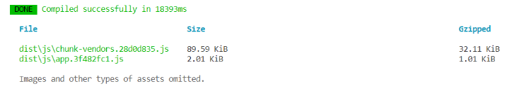
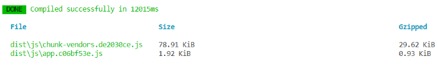
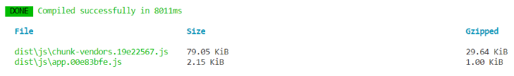

# Vue面试题

## 1、Treeshaking使用

### 概念

Dead code elimination（死代码消除），保持正常运行下，去除无用代码。具体通过`ES6模块化导入导出方式`完成

- 编译阶段利用 `ES6 Module` 判断哪些模块已经加载
- 判断哪些模块 变量未被使用或引用，删除这些对应代码


### 举例

#### Vue2

空项目有如下代码，项目打包大小 如下

```vue
<script>
    export default {
        data: () => ({
            count: 1,
        }),
    };
</script>
```



如果额外增加computed、watch方法

```javascript
export default {
    data: () => ({
        question:"", 
        count: 1,
    }),
    computed: {
        double: function () {
            return this.count * 2;
        },
    },
    watch: {
        question: function (newQuestion, oldQuestion) {
            this.answer = 'xxxx'
        }
};
```

打包大小相同

#### Vue3

空项目有如下代码，项目打包大小 如下

```js
import { reactive, defineComponent } from "vue";
export default defineComponent({
  setup() {
    const state = reactive({
      count: 1,
    });
    return {
      state,
    };
  },
});
```



再引入computed、watch，`体积会变大`

```javascript
import { reactive, defineComponent, computed, watch } from "vue";
export default defineComponent({
  setup() {
    const state = reactive({
      count: 1,
    });
    const double = computed(() => {
      return state.count * 2;
    });

    watch(
      () => state.count,
      (count, preCount) => {
        console.log(count);
        console.log(preCount);
      }
    );
    return {
      state,
      double,
    };
  },
});
```




### 作用

- 更小，减小程序体积
- 更快，减少程序执行时间


