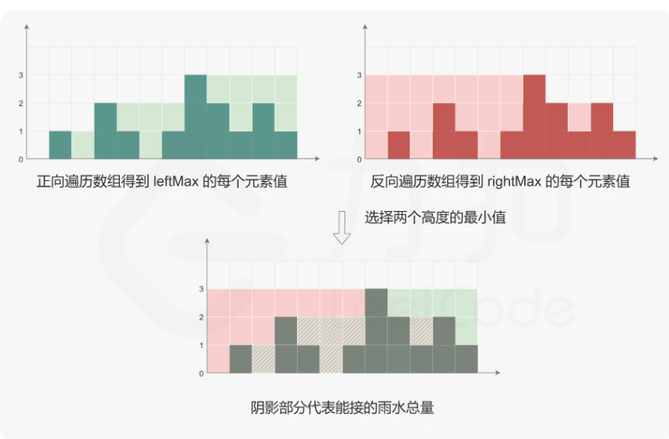
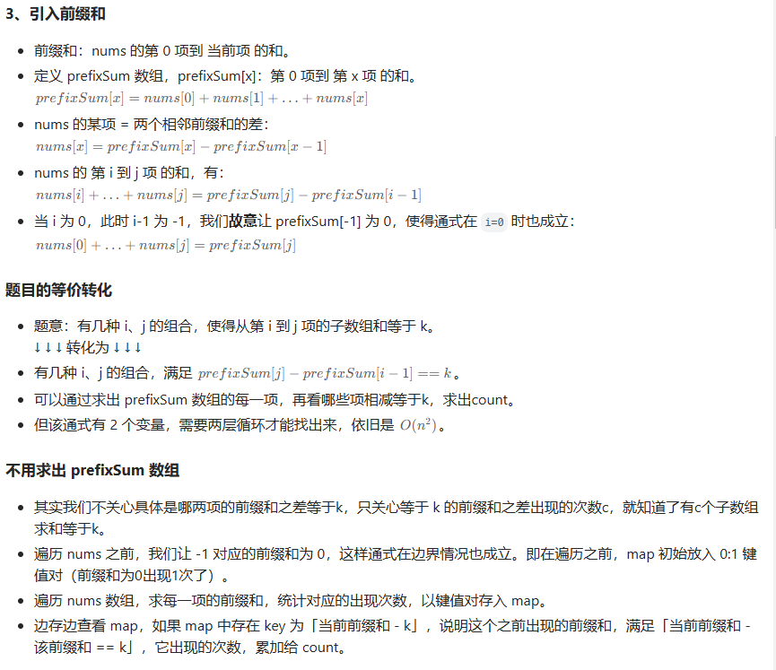

# 力扣面试题

## 1、两数之和

给定一个整数数组 `nums` 和一个整数目标值 `target`，请你在该数组中找出 **和为目标值** *`target`* 的那 **两个** 整数，并返回它们的数组下标。

**示例 1：**

```
输入：nums = [2,7,11,15], target = 9
输出：[0,1]
解释：因为 nums[0] + nums[1] == 9 ，返回 [0, 1] 。
```

```typescript
/**
 * @param {number[]} nums
 * @param {number} target
 * @return {number[]}
 */
var twoSum = function(nums, target) {
    for(let i = 0; i < nums.length; i++){
        for(let j = i + 1; j < nums.length; j++){
            if(nums[i] + nums[j] === target) return [i,j]
        }
    }
};
```

## 2、无重复字符的最长子串

> :bulb: 字符串也可直接string[index] 或者 string.length

给定一个字符串 `s` ，请你找出其中不含有重复字符的 最长 子串的长度。

**示例 1:**

```
输入: s = "pwwkew"
输出: 3
解释: 因为无重复字符的最长子串是 "wke"，所以其长度为 3。
     请注意，你的答案必须是 子串 的长度，"pwke" 是一个子序列，不是子串。
```

```typescript
/**
 * @param {string} s
 * @return {number}
 */
var lengthOfLongestSubstring = function(s) {
    let max = 0, arr = []
    for(let i = 0; i < s.length; i++){
        let number = arr.indexOf(s[i])
        if(number !== -1){
            arr.splice(0, number + 1)
        }
        arr.push(s[i])
        max = Math.max(max, arr.length)
    }
    return max
};
```

## 3、检查是否类的对象实例

请你编写一个函数，检查给定的值是否是给定类或超类的实例。可以传递给函数的数据类型没有限制。例如，值或类可能是 `undefined` 。

**示例 1：**

```
输入：func = () => { class Animal {}; class Dog extends Animal {}; return checkIfInstance(new Dog(), Animal); }
输出：true
解释：
class Animal {};
class Dog extends Animal {};
checkIfInstanceOf(new Dog(), Animal); // true

Dog 是 Animal 的子类。因此，Dog 对象同时是 Dog 和 Animal 的实例。
```

```typescript
/**
 * @param {*} obj
 * @param {*} classFunction
 * @return {boolean}
 */
var checkIfInstanceOf = function(obj, classFunction) {
    if(obj === null || obj === undefined) return false
    while(obj !== null){
        if(obj.constructor === classFunction) return true
        obj = Object.getPrototypeOf(obj)
    }
    return false
};
```

## 4、数组原型对象的最后一个元素

请你编写一段代码实现一个数组方法，使任何数组都可以调用 `array.last()` 方法，这个方法将返回数组最后一个元素。如果数组中没有元素，则返回 `-1` 。

**示例 1 ：**

```
输入：nums = [null, {}, 3]
输出：3
解释：调用 nums.last() 后返回最后一个元素： 3。
```

```typescript
/**
 * @return {null|boolean|number|string|Array|Object}
 */
Array.prototype.last = function() {
    return this.length > 0 ? this[this.length - 1] : -1
};
```

## 5、计数器

给定一个整型参数 `n`，请你编写并返回一个 `counter` 函数。这个 `counter` 函数最初返回 `n`，每次调用它时会返回前一个值加 1 的值 ( `n` , `n + 1` , `n + 2` ，等等)。

**示例 1：**

```
输入：
n = 10 
["call","call","call"]
输出：[10,11,12]
解释：
counter() = 10 // 第一次调用 counter()，返回 n。
counter() = 11 // 返回上次调用的值加 1。
counter() = 12 // 返回上次调用的值加 1。
```

```typescript
/**
 * @param {number} n
 * @return {Function} counter
 */
var createCounter = function(n) {
    
    return function() {
        return n++
    };
};
```

## 6、睡眠函数

请你编写一个异步函数，它接收一个正整数参数 `millis` ，并休眠 `millis` 毫秒。要求此函数可以解析任何值。

**示例 1：**

```
输入：millis = 100
输出：100
解释：
在 100ms 后此异步函数执行完时返回一个 Promise 对象
let t = Date.now();
sleep(100).then(() => {
  console.log(Date.now() - t); // 100
});
```

```typescript
/**
 * @param {number} millis
 * @return {Promise}
 */
async function sleep(millis) {
    return new Promise((resolve, reject) => setTimeout(resolve, millis))
}

```

## 7、有时间限制的缓存

> :warning: 注意写类内部方法添加this，不要忘记！！！
>
> :warning: setTimeout返回值是一个正整数ID，可通过clearTimeout(ID)来取消该定时器
>
> :warning: this.times = {} ; this.times['key'] = setTimeout(() => {},duration)

编写一个类，它允许获取和设置键-值对，并且每个键都有一个 **过期时间** 。

该类有三个公共方法：

`set(key, value, duration)` ：接收参数为整型键 `key` 、整型值 `value` 和以毫秒为单位的持续时间 `duration` 。一旦 `duration` 到期后，这个键就无法访问。如果相同的未过期键已经存在，该方法将返回 `true` ，否则返回 `false` 。如果该键已经存在，则它的值和持续时间都应该被覆盖。

`get(key)` ：如果存在一个未过期的键，它应该返回这个键相关的值。否则返回 `-1` 。

`count()` ：返回未过期键的总数。


```typescript
var TimeLimitedCache = function() {
    this.map = new Map()
    this.times = new Map()
};

/** 
 * @param {number} key
 * @param {number} value
 * @param {number} duration time until expiration in ms
 * @return {boolean} if un-expired key already existed
 */
TimeLimitedCache.prototype.set = function(key, value, duration) {
    let res = this.map.has(key)
    this.map.set(key,value)
    clearTimeout(this.times[key])
    this.times[key] = setTimeout(() => {this.map.delete(key)},duration)
    return res
};

/** 
 * @param {number} key
 * @return {number} value associated with key
 */
TimeLimitedCache.prototype.get = function(key) {
    return this.map.get(key)?? -1
};

/** 
 * @return {number} count of non-expired keys
 */
TimeLimitedCache.prototype.count = function() {
    return this.map.size
};
```


## 8、字母异位词分组

> map.keys()  和 map.values() 返回哈希表的所有键 和 所有值
>
> [...map.keys()] 和 [...map.values()] 可将这些键 和 属性值以数组方式存储

给你一个字符串数组，请你将 **字母异位词** 组合在一起。可以按任意顺序返回结果列表。

**字母异位词** 是由重新排列源单词的所有字母得到的一个新单词。

**示例 1:**

```
输入: strs = ["eat", "tea", "tan", "ate", "nat", "bat"]
输出: [["bat"],["nat","tan"],["ate","eat","tea"]]
```

```typescript
/**
 * @param {string[]} strs
 * @return {string[][]}
 */
var groupAnagrams = function(strs) {
    const map = new Map()
    for(let item in strs){
        let correctItem = item.split('').sort().join()
        if(map.get(correctItem)){
            map.get(correctItem).push(item)
        }else{
            map.set(correctItem, [item])
        }
    }
    return [...map.values()]
}
```


## 9、最长连续序列

给定一个未排序的整数数组 `nums` ，找出数字连续的最长序列（不要求序列元素在原数组中连续）的长度。

请你设计并实现时间复杂度为 `O(n)` 的算法解决此问题。

**示例 1：**

```
输入：nums = [100,4,200,1,3,2]
输出：4
解释：最长数字连续序列是 [1, 2, 3, 4]。它的长度为 4。
```

```typescript
/**
 * @param {number[]} nums
 * @return {number}
 */
var longestConsecutive = function(nums) {
    let resArr = []
    let max = 0
    if(nums.length === 0){
        return 0
    } else{
        //数组去重排序
        let newArr = [...new Set(nums.sort((a,b)=>a-b))]
        for(let i = 0; i < newArr.length; i++){
            if(newArr[i] + 1 == newArr[i + 1]){
                resArr.push(newArr[i])
            }else{
                resArr.push(newArr[i])
                //判断最大值
                max = Math.max(max, resArr.length)
                resArr.splice(0,resArr.length)
            }
        }
    }
    return max
};
```


## 10、数组移动0到最后

给定一个数组 `nums`，编写一个函数将所有 `0` 移动到数组的末尾，同时保持非零元素的相对顺序。

:warning: **请注意** ，必须在不复制数组的情况下原地对数组进行操作。

**示例 1:**

```
输入: nums = [0,1,0,3,12]
输出: [1,3,12,0,0]
```

```typescript
//我的解法，垃圾
var moveZeroes = function(nums) {
    let zeroCount = 0
    for(let i = 0; i < nums.length; i++){
        if(nums[i] !== 0){
            let temp = nums[i]
            nums.splice(i,1)
            nums.unshift(temp)
        } else{
            zeroCount++
        }
    }
    nums.reverse().splice(0,zeroCount)
    for(let i = 0; i < zeroCount; i++){
        nums.push(0)
    }
    return nums
};

//大佬的解法 牛
var moveZeroes = function(nums) {
    let slow = 0
    for (let fast = 0; fast < nums.length; fast++) {
        if (nums[fast] !== 0) {
        nums[slow] = nums[fast]
        slow++
        }
    }                                   
    nums.fill(0, slow)
    return nums
};
```


## 11、盛最多水的容器

给定一个长度为 `n` 的整数数组 `height` 。有 `n` 条垂线，第 `i` 条线的两个端点是 `(i, 0)` 和 `(i, height[i])` 。

找出其中的两条线，使得它们与 `x` 轴共同构成的容器可以容纳最多的水。

返回容器可以储存的最大水量。

**说明：**你不能倾斜容器。

**示例 1：**


```
输入：[1,8,6,2,5,4,8,3,7]
输出：49 
解释：图中垂直线代表输入数组 [1,8,6,2,5,4,8,3,7]。在此情况下，容器能够容纳水（表示为蓝色部分）的最大值为 49。
```

```typescript
//我的解法,垃圾，会超时
/**
 * @param {number[]} height
 * @return {number}
 */
var maxArea = function(height) {
    let maxWater = 0
    let widthWater = 0
    let heightWater = 1
    for(let i = 0; i< height.length; i++){
        for(let j = i + 1; j < height.length; j++){
            widthWater = j - i
            heightWater = Math.min(height[i], height[j])
            maxWater = Math.max(maxWater, widthWater * heightWater) 
        }
    }
    return maxWater
};

//大佬的解法，牛
var maxArea = function (height) {
    let l = 0, r = height.length - 1;
    let res = 0;
    while (l < r) {
        //先让x轴长度最大，即r - l
        let area = Math.min(height[l], height[r]) * (r - l);
        res = Math.max(area, res);
        //从左从右到中间，尝试找到更高值
        if (height[l] <= height[r]) {
            l++;
        } else {
            r--;
        }
    }
    return res;
};
```

## 12、三数之和

给你一个整数数组 `nums` ，判断是否存在三元组 `[nums[i], nums[j], nums[k]]` 满足 `i != j`、`i != k` 且 `j != k` ，同时还满足 `nums[i] + nums[j] + nums[k] == 0` 。请你返回所有和为 `0` 且不重复的三元组。

**注意：**答案中不可以包含重复的三元组。

**示例 1：**

```
输入：nums = [-1,0,1,2,-1,-4]
输出：[[-1,-1,2],[-1,0,1]]
解释：
nums[0] + nums[1] + nums[2] = (-1) + 0 + 1 = 0 。
nums[1] + nums[2] + nums[4] = 0 + 1 + (-1) = 0 。
nums[0] + nums[3] + nums[4] = (-1) + 2 + (-1) = 0 。
不同的三元组是 [-1,0,1] 和 [-1,-1,2] 。
注意，输出的顺序和三元组的顺序并不重要。
```

```typescript
//暴力破解， 垃圾超时
var threeSum = function(nums) {
    let map = new Map()
    for(let i = 0; i < nums.length; i++){
        for(let j = i + 1; j < nums.length; j++){
            for(let k = j + 1; k < nums.length; k++){
                if(nums[i] + nums[j] + nums[k] === 0){
                    let tempArr = [nums[i],nums[j],nums[k]]
                    let tempKey = tempArr.sort((a,b) => a-b).join()
                    if(map.has(tempKey)){
                    } else{
                        map.set(tempKey,tempArr)
                    }
                }
            }
        }
    }
    return [...map.values()]
};

//排序 + 双指针 
var threeSum = function(nums) {
    let ans = []
    const len = nums.length;
    if(nums == null || len < 3) return ans
    nums.sort((a,b) => a-b)
    for(let i = 0; i< len; i++){
        if(nums[i] > 0) break;
        if(i>0 && nums[i] == nums[i -1]) continue
        let L = i + 1
        let R = len - 1
        while(L < R){
            const sum = nums[i] + nums[L] + nums[R]
            if(sum == 0){
                ans.push([nums[i],nums[L],nums[R]])
                while(L < R && nums[L] == nums[L + 1]) L++
                while(L < R && nums[R] == nums[R - 1]) R--
                L++
                R--
            }
            else if(sum < 0){
                L++
            }else{
                R--
            }
        }
    }
    return ans
};
```

## 13、接雨水

给定 `n` 个非负整数表示每个宽度为 `1` 的柱子的高度图，计算按此排列的柱子，下雨之后能接多少雨水。

**示例 1：**


```
输入：height = [0,1,0,2,1,0,1,3,2,1,2,1]
输出：6
解释：上面是由数组 [0,1,0,2,1,0,1,3,2,1,2,1] 表示的高度图，在这种情况下，可以接 6 个单位的雨水（蓝色部分表示雨水）。 
```

```typescript
/**
 * @param {number[]} height
 * @return {number}
 */
var trap = function(height) {
    const n = height.length;
    const preMax = Array(n); // preMax[i] 表示从 height[0] 到 height[i] 的最大值
    preMax[0] = height[0];
    for (let i = 1; i < n; i++) {
        //保证后项肯定比前项高，能形成凹槽
        preMax[i] = Math.max(preMax[i - 1], height[i]);
    }

    const sufMax = Array(n); // sufMax[i] 表示从 height[i] 到 height[n-1] 的最大值
    sufMax[n - 1] = height[n - 1];
    for (let i = n - 2; i >= 0; i--) {
        sufMax[i] = Math.max(sufMax[i + 1], height[i]);
    }

    let ans = 0;
    for (let i = 0; i < n; i++) {
        //找到两侧相比的较小值
        ans += Math.min(preMax[i], sufMax[i]) - height[i]; // 累加每个水桶能接多少水
    }
    return ans;
};
```



从左到右增高 和 从右到左增高，两个共同部分的最小值（要么是本身高度，要么就是可以存水的最高值） - 真实值 就是该位置存储的雨量值

## 14、找到字符串中所有字母异位词

给定两个字符串 `s` 和 `p`，找到 `s` 中所有 `p` 的 异位词的子串，返回这些子串的起始索引。不考虑答案输出的顺序。

**示例 1:**

```
输入: s = "cbaebabacd", p = "abc"
输出: [0,6]
解释:
起始索引等于 0 的子串是 "cba", 它是 "abc" 的异位词。
起始索引等于 6 的子串是 "bac", 它是 "abc" 的异位词。
```

 **示例 2:**

```
输入: s = "abab", p = "ab"
输出: [0,1,2]
解释:
起始索引等于 0 的子串是 "ab", 它是 "ab" 的异位词。
起始索引等于 1 的子串是 "ba", 它是 "ab" 的异位词。
起始索引等于 2 的子串是 "ab", 它是 "ab" 的异位词。
```

```typescript
//自己的解法，low
var findAnagrams = function(s, p) {
    let correctOrder = p.split('').sort().join()
    let res = []
    for(let i = 0; i <= s.length - p.length; i++){
        if(s.slice(i,i + p.length).split('').sort().join() === correctOrder) res.push(i)
    }
    return res
};

//大佬的解法
var findAnagrams = function(s, p) {
    function arrayEqual(a, b){
        for(let i=0;i<a.length;i++)
            if(a[i] !== b[i])
                return false
        return true
    }
    const ans = [];
    const cntP = new Array(26).fill(0); 
    const cntS = new Array(26).fill(0); 
    for (const c of p) {
        cntP[c.charCodeAt() - 'a'.charCodeAt()]++; // 统计 p 的每种字母的出现次数
    }
    for (let right = 0; right < s.length; right++) {
        cntS[s[right].charCodeAt() - 'a'.charCodeAt()]++; 
        const left = right - p.length + 1;
        if (left < 0) { // 窗口长度不足 len(p)
            continue;
        }
        if (arrayEqual(cntS, cntP)) { // s' 和 p 的每种字母的出现次数都相同
            ans.push(left); // s' 左端点下标加入答案
        }
        cntS[s[left].charCodeAt() - 'a'.charCodeAt()]--; // 左端点字母离开窗口
    }
    return ans;
};
```

## 15、和为k的子数组

给你一个整数数组 `nums` 和一个整数 `k` ，请你统计并返回 *该数组中和为 `k` 的子数组的个数* 。

子数组是数组中元素的连续非空序列。

**示例 1：**

```
输入：nums = [1,1,1], k = 2
输出：2
```

**示例 2：**

```
输入：nums = [1,2,3], k = 3
输出：2
```

```typescript
/**
 * @param {number[]} nums
 * @param {number} k
 * @return {number}
 */
var subarraySum = function(nums, k) {
    const map = {0: 1}
    let preFixSum = 0
    let count = 0
    for(let i = 0; i < nums.length; i++){
        preFixSum += nums[i]
        if(map[preFixSum - k]){
            count += map[preFixSum - k]
        }
        if(map[preFixSum]){
            map[preFixSum]++
        } else{
            map[preFixSum] = 1
        }
    }
    return count
};
```



## 16、最大子数组和

```typescript
const maxSubArray = function(nums){
    if(!nums.length) return
    let maxEndHere = nums[0]  //以该位置为结束点的数组最大值，初识默认只有第一项
    let maxSoFar = nums[0]  //以任意为结束点的最大子数组和，初识默认即第一项
    for(let i = 1; i < nums.length; i++){
        //从第二项开始遍历，以第i项为结束点的子数组的最大值可能是 本项、以前一项为结束点的子数组最大值
        maxEndHere = Math.max(nums[i], nums[i] + maxEndHere)
        //从第二项开始遍历，每次与前一项为结束点的子数组最大值作比较
        maxSoFar = Math.max(maxSoFar, maxEndHere)
    }
    return maxSoFar
}
```

## 17、两数相加

给你两个 **非空** 的链表，表示两个非负的整数。它们每位数字都是按照 **逆序** 的方式存储的，并且每个节点只能存储 **一位** 数字。

请你将两个数相加，并以相同形式返回一个表示和的链表。

**示例 1：**


```
输入：l1 = [2,4,3], l2 = [5,6,4]
输出：[7,0,8]
解释：342 + 465 = 807.
```

**示例 2：**

```
输入：l1 = [0], l2 = [0]
输出：[0]
```

```typescript
/**
 * Definition for singly-linked list.
 * function ListNode(val, next) {
 *     this.val = (val===undefined ? 0 : val)
 *     this.next = (next===undefined ? null : next)
 * }
 */
/**
 * @param {ListNode} l1
 * @param {ListNode} l2
 * @return {ListNode}
 */
var addTwoNumbers = function(l1, l2) {
    const dummy = new ListNode(); // 哨兵节点
    let cur = dummy;  //指针
    let carry = 0; // 进位
    while (l1 || l2 || carry) {
        if (l1) {
            carry += l1.val; // 节点值和进位加在一起
            l1 = l1.next; // 下一个节点
        }
        if (l2) {
            carry += l2.val; // 节点值和进位加在一起
            l2 = l2.next; // 下一个节点
        }
        cur = cur.next = new ListNode(carry % 10); // 每个节点保存一个数位
        carry = Math.floor(carry / 10); // 新的进位
    }
    return dummy.next; // 哨兵节点的下一个节点就是头节点
};
```

## 18、相交链表

给你两个单链表的头节点 `headA` 和 `headB` ，请你找出并返回两个单链表相交的起始节点。如果两个链表不存在相交节点，返回 `null` 。   图示两个链表在节点 `c1` 开始相交**：**

[](https://assets.leetcode-cn.com/aliyun-lc-upload/uploads/2018/12/14/160_statement.png)

**示例 1：**

[](https://assets.leetcode.com/uploads/2018/12/13/160_example_1.png)

```
输入：intersectVal = 8, listA = [4,1,8,4,5], listB = [5,6,1,8,4,5], skipA = 2, skipB = 3
输出：Intersected at '8'
解释：相交节点的值为 8 （注意，如果两个链表相交则不能为 0）。
从各自的表头开始算起，链表 A 为 [4,1,8,4,5]，链表 B 为 [5,6,1,8,4,5]。
在 A 中，相交节点前有 2 个节点；在 B 中，相交节点前有 3 个节点。
— 请注意相交节点的值不为 1，因为在链表 A 和链表 B 之中值为 1 的节点 (A 中第二个节点和 B 中第三个节点) 是不同的节点。换句话说，它们在内存中指向两个不同的位置，而链表 A 和链表 B 中值为 8 的节点 (A 中第三个节点，B 中第四个节点) 在内存中指向相同的位置。
```

```typescript
/**
 * Definition for singly-linked list.
 * function ListNode(val) {
 *     this.val = val;
 *     this.next = null;
 * }
 */

/**
 * @param {ListNode} headA
 * @param {ListNode} headB
 * @return {ListNode}
 */
var getIntersectionNode = function(headA, headB) {
    const visited = new Set();
    let temp = headA;
    while (temp !== null) {//将链表A存入set中
        visited.add(temp);
        temp = temp.next;
        console.log(visited)
    }
    temp = headB;
    while (temp !== null) {
        if (visited.has(temp)) {//第一个相同的节点就是重合的节点
            console.log('找到了',temp)
            return temp;
        }
        temp = temp.next;
        console.log(temp)
    }
    return null;
};
```


## 19、合并区间

以数组 `intervals` 表示若干个区间的集合，其中单个区间为 `intervals[i] = [starti, endi]` 。请你合并所有重叠的区间，并返回 *一个不重叠的区间数组，该数组需恰好覆盖输入中的所有区间* 。

**示例 1：**

```
输入：intervals = [[1,3],[2,6],[8,10],[15,18]]
输出：[[1,6],[8,10],[15,18]]
解释：区间 [1,3] 和 [2,6] 重叠, 将它们合并为 [1,6].
```

**示例 2：**

```
输入：intervals = [[1,4],[4,5]]
输出：[[1,5]]
解释：区间 [1,4] 和 [4,5] 可被视为重叠区间。
```

```typescript
/**
 * @param {number[][]} intervals
 * @return {number[][]}
 */
var merge = function(intervals) {
    let res = []
    intervals.sort((a,b) => a[0] - b[0])  //记得先排序
    let pre = intervals[0]
    for(let i = 1; i < intervals.length; i++){
        if(pre[1] >= intervals[i][0]){
            pre[1] = Math.max(pre[1], intervals[i][1])
        } else{
            res.push(pre)
            pre = intervals[i]
        }
    }
    res.push(pre)
    return  res
};
```

## 20、滑动窗口最大值

给你一个整数数组 `nums`，有一个大小为 `k` 的滑动窗口从数组的最左侧移动到数组的最右侧。你只可以看到在滑动窗口内的 `k` 个数字。滑动窗口每次只向右移动一位。

返回 *滑动窗口中的最大值* 。

**示例 1：**

```
输入：nums = [1,3,-1,-3,5,3,6,7], k = 3
输出：[3,3,5,5,6,7]
解释：
滑动窗口的位置                最大值
---------------               -----
[1  3  -1] -3  5  3  6  7       3
 1 [3  -1  -3] 5  3  6  7       3
 1  3 [-1  -3  5] 3  6  7       5
 1  3  -1 [-3  5  3] 6  7       5
 1  3  -1  -3 [5  3  6] 7       6
 1  3  -1  -3  5 [3  6  7]      7
```


```typescript
//解法一  33/51
var maxSlidingWindow = function(nums, k) {
    const res = []
    const slideArr = []
    for(let i = 0; i < nums.length; i++){
        if(i < k){
            slideArr.push(nums[i])
            continue
        } else{
            res.push(Math.max(...slideArr))
            slideArr.shift()
            slideArr.push(nums[i])
        }
    }
    res.push(Math.max(...slideArr))
    return res
}

//解法二  47/51
var maxSlidingWindow = function(nums, k) {
    const res = []
    const slideArr = []
    let tempValue = 0
    for(let i = 0; i < nums.length; i++){
        if(nums.length === 1 || k === 1){
            return [...nums]
        }
        if(i < k){
            slideArr.push(nums[i])
            if(i === k - 1){
                if(tempValue === 0){
                    tempValue = Math.max(...slideArr)
                    res.push(tempValue)
                }
            }
            continue
        }else{
            if(tempValue === slideArr[0]){
                slideArr.shift()
                slideArr.push(nums[i])
                tempValue = Math.max(...slideArr)
                res.push(tempValue)
            }else{
                tempValue = Math.max(tempValue, nums[i])
                res.push(tempValue)
                slideArr.shift()
                slideArr.push(nums[i])
            }
        }
    }
    return res
};

//大佬的解法 :sad。。。
/**
 * @param {number[]} nums
 * @param {number} k
 * @return {number[]}
 */
var maxSlidingWindow = function(nums, k) {
    const ans = [];
    const q = [];
    for (let i = 0; i < nums.length; i++) {
        // 1. 入
        while (q.length && nums[q[q.length - 1]] <= nums[i]) {
            q.pop(); // 维护 q 的单调性，保证第一项总是最大的，递减
        }
        q.push(i); // 入队
        // 2. 出
        if (i - q[0] >= k) { // 队首已经离开窗口了
            q.shift(); // 力扣没有 Deque，不过这样写也挺快的
        }
        // 3. 记录答案
        if (i >= k - 1) {
            // 由于队首到队尾单调递减，所以窗口最大值就是队首
            ans.push(nums[q[0]]);
        }
    }
    return ans;
};
```

## 21、轮转数组

给定一个整数数组 `nums`，将数组中的元素向右轮转 `k` 个位置，其中 `k` 是非负数。

**示例 1:**

```
输入: nums = [1,2,3,4,5,6,7], k = 3
输出: [5,6,7,1,2,3,4]
解释:
向右轮转 1 步: [7,1,2,3,4,5,6]
向右轮转 2 步: [6,7,1,2,3,4,5]
向右轮转 3 步: [5,6,7,1,2,3,4]
```

**示例 2:**

```
输入：nums = [-1,-100,3,99], k = 2
输出：[3,99,-1,-100]
解释: 
向右轮转 1 步: [99,-1,-100,3]
向右轮转 2 步: [3,99,-1,-100]
```

```typescript
/**
 * @param {number[]} nums
 * @param {number} k
 * @return {void} Do not return anything, modify nums in-place instead.
 */
var rotate = function(nums, k) {
    if(nums.length === 0) return nums
    let app = k % nums.length
    let tempArr = nums.splice(-app)
    nums.unshift(...tempArr)
    return nums
};
```

