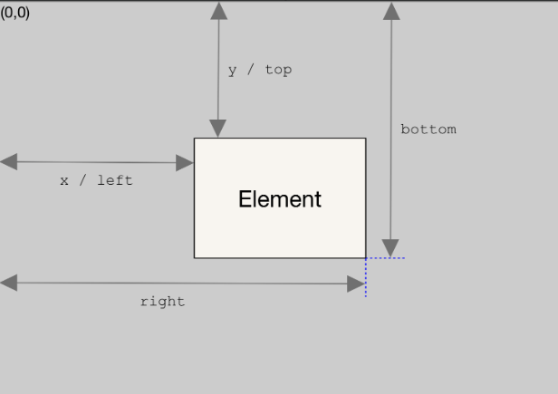

# 面试题手写原生

> https://mp.weixin.qq.com/s/3JlGG9VMo4ySNQwyYx1BxA
>

## 1、Promise

:bulb: Promise A+  https://promisesaplus.com/ ,Promise实现的一种规范，用于统一不同Promise库之间的行为(es6promise、axios)


```typescript
class MyPromise {
            constructor(executor) {
                this.initValue()
                this.initBind()

                try {
                    executor(this.resolve, this.reject)  // 执行传进来的函数
                } catch (e) {
                    this.reject(e)
                }
            }

            initBind() {
                //因为访问类中方法需要使用this才能访问到resolve，之后再预绑定this
                this.resolve = this.resolve.bind(this)
                this.reject = this.reject.bind(this)
            }

            initValue() {
                this.PromiseResult = null
                this.PromiseState = 'pending'
                this.onFulfilledCallbacks = []
                this.onRejectedCallbacks = []
            }

            resolve(value) {
                if (this.PromiseState !== 'pending') return  //如果已经不是pending，内部没必要执行
                this.PromiseState = 'fulfilled'
                this.PromiseResult = value
                while (this.onFulfilledCallbacks.length) {
                    //调用then方法数组内每个then
                    this.onFulfilledCallbacks.shift()(this.PromiseResult)  
                }
            }

            reject(reason) {
                if (this.PromiseState !== 'pending') return
                this.PromiseState = 'rejected'
                this.PromiseResult = reason
                while (this.onRejectedCallbacks.length) {
                    this.onRejectedCallbacks.shift()(this.PromiseResult)
                }
            }

            then(onFulfilled, onRejected) {
                //校验参数，确保是函数，且ful 和 rej确保有函数体
                onFulfilled = typeof onFulfilled === 'function' ? onFulfilled : val => val
                onRejected = typeof onRejected === 'function' ? onRejected : reason => { throw reason }
                var thenPromise = new MyPromise((resolve, reject) => {
                    const resolvePromise = cb => {
                        try {
                            const x = cb(this.PromiseResult)  //判断返回类型-throw 值 promise
                            if (x === thenPromise) {
                                throw new Error('不能返回自身。。。')
                            }
                            if (x instanceof MyPromise) {
                                x.then(resolve, reject)
                            } else {
                                resolve(x)
                            }
                        } catch (err) {
                            reject(err)
                            throw new Error(err)
                        }
                    }
                    if (this.PromiseState === 'fulfilled') {
                        resolvePromise(onFulfilled)
                    } else if (this.PromiseState === 'rejected') {
                        resolvePromise(onRejected)
                    } else if (this.PromiseState === 'pending') {
                        this.onFulfilledCallbacks.push(resolvePromise.bind(this, onFulfilled))
                        this.onRejectedCallbacks.push(resolvePromise.bind(this, onRejected))
                    }
                })
              return thenPromise
                
            }
        }
```

```typescript
          //测试状态值
        const test1 = new MyPromise((resolve, reject) => {
            resolve('成功')
            reject('失败')
        })
        console.log('test1', test1)

        //测试then
        const test = new MyPromise((resolve, reject) => {
            resolve('成功')
        }).then(res => console.log(res), err => console.log(err))

        //测试定时器效果
        const test2 = new MyPromise((resolve, reject) => {
            setTimeout(() => {
                resolve('成功')
            }, 1000) 
        }).then(res => console.log(res), err => console.log(err))

        //测试链式
        const test3 = new MyPromise((resolve, reject) => {
            resolve(100)})
        .then(res => 2 * res, err => 3 * err)
        .then(res => console.log('成功', res), err => console.log('失败', err))

        const test4 = new MyPromise((resolve, reject) => {
            resolve(100)})
        .then(res => new MyPromise((resolve, reject) => reject(2 * res)), err => new MyPromise((resolve, reject) => resolve(3 * res)))
        .then(res => console.log('成功', res), err => console.log('失败', err))
```

## 2、Promise.resolve()

```typescript
Promise.resolve = function(value){
    if(value instanceof Promise){
        return value
    }
    return new Promise((resolve,reject) => resolve(value))
}
```

## 3、Promise.reject()

```typescript
Promise.reject = function(reason){
    return new Promise((resolve,reject) => reject(reason) )
}
```

## 4、Promise.all(promiseArr)

```typescript
Promise.all = function(promiseArr) {
    let index = 0, result = []
    return new Promise((resolve, reject) => {
        promiseArr.forEach((p, i) => {
            Promise.resolve(p).then(val => {
                index++
                result[i] = val
                if (index === promiseArr.length) {
                    resolve(result)
                }
            }, err => {
                reject(err)
            })
        })
    })
}
```

## 5、Promise.race(promiseArr)

```typescript
Promise.race = function(promiseArr){
    return new Promise((resolve,reject) => {
        promiseArr.forEach(p => {
            Promise.resolve(p).then(val => {
                resolve(val)
            }, err=> {
                reject(err)
            })
        })
    })
}
```

## 6、Promise.allSettled(promiseArr)

```typescript
Promise.allSettled = function(promiseArr){
    let result = []
    return new Promise((resolve,reject) => {
        promiseArr.forEach((p,i) => {
            Promise.resolve(p).then(val => {
                result.push({
                    status: 'fulfilled',
                    value: val
                })
                if(result.length === promiseArr.length){
                    resolve(result)
                }
            }, err=> {
                result.push({
                    status: 'rejected',
                    reason: err
                })
                if(result.length === promiseArr.length){
                    resolve(result)
                }
            })
        })
    })
}
```

## 7、Promise.any(promiseArr)

```typescript
Promise.any = function(promiseArr){
    let index = 0
    return new Promise((resolve,reject) => {
        if(promiseArr.length === 0) return
        promiseArr.forEach((p,i) => {
            Promise.resolve(p).then(val => {
                resolve(val)
            }, err => {
                index++
                if(index === promiseArr.length){
                    reject(new AggregateError('All promise were rejected'))
                }
            })
        })
    })
}
```


## 8、扩展数据类型判断typeof

```typescript
function typeOf(obj) {
    //Object.prototype.toString.call(obj) => call返回值this值和调用函数后的结果；返回[object String]
    //使用split(' ') 做空格筛选，获取索引1的结果
    let res = Object.prototype.toString.call(obj).split(' ')[1]
    //获取所有字符串，但不包括最终的]，并全部小写
    res = res.substring(0, res.length - 1).toLowerCase()
    return res
}
typeOf([])        // 'array'
typeOf({})        // 'object'
typeOf(new Date)  // 'date'
```


## 9、继承

原型链继承

```typescript
function Animal() {
    this.colors = ['black', 'white']
}
Animal.prototype.getColor = function() {
    return this.colors
}
function Dog() {}
Dog.prototype =  new Animal()  //这一步会导致Dog的原型链指向Animal的一个实例，地址唯一。后续Dog的所有实例原型都将指向该Animal的实例

let dog1 = new Dog()
dog1.colors.push('brown')
let dog2 = new Dog()
console.log(dog2.colors)  // ['black', 'white', 'brown']
```

:warning: 原型链继承存在的问题：

- 问题1：原型中包含的引用类型属性将被所有实例共享；
- 问题2：子类在实例化的时候不能给父类构造函数传参；


构造函数实现继承

```typescript
function Animal(name) {
    this.name = name
    this.getName = function() {
        return this.name
    }
}
function Dog(name) {
    Animal.call(this, name)
}
Dog.prototype =  new Animal()
```

:warning: 构造函数实现继承解决了原型链继承的 2 个问题，但仍有如下问题：

- 方法必须定义在构造函数中，所以会导致每次创建子类实例都会创建一遍方法。


组合继承

```typescript
function Animal(name) {
    this.name = name
    this.colors = ['black', 'white']
}
Animal.prototype.getName = function() {
    return this.name
}
function Dog(name, age) {
    Animal.call(this, name)  //继承Animal的属性，并保证Dog实例有自己的属性
    this.age = age //自己本身属性
}
Dog.prototype = Object.create(Animal.prototype)  //确保继承getName方法，后续Dog实例不用多次创建该方法
Dog.prototype.constructor = Dog  //构造函数回归Dog本身

let dog1 = new Dog('奶昔', 2)
dog1.colors.push('brown')
let dog2 = new Dog('哈赤', 1)
console.log(dog2) 
// { name: "哈赤", colors: ["black", "white"], age: 1 }
```


class类继承

```typescript
class Animal {
    constructor(name) {
        this.name = name
    } 
    getName() {
        return this.name
    }
}
class Dog extends Animal {
    constructor(name, age) {
        super(name)
        this.age = age
    }
}
```

## 10、数组去重

```typescript
var unique = arr => [...new Set(arr)]
```


## 11、数组扁平化

```typescript
[1, [2, [3]]].flat(2)  // [1, 2, 3]  可将flat()内部值改为Infinity，默认全部展开
```

```typescript
function flatten(arr) {
    while (arr.some(item => Array.isArray(item))) {
        arr = [].concat(...arr);
    }
    return arr;
}
```


## 12、call

:bulb: `let res = Object.prototype.toString.call(obj).split(' ')[1]`

:bulb: Symbol：该数据类型存在唯一目的是用作对象属性的标识符

```typescript
//实例方法调用call，故将call挂载到方法的原型对象上
Function.prototype.call = function (context = window, ...args) {
  //如果调用call的方法不是实例方法，直接返回undefined  
  if (this === Function.prototype) {
    return undefined; 
  }
  //context用于存储调用的对象，可选参数，默认值为window  
  context = context || window;
  //创建唯一键fn
  const fn = Symbol();
  //将唯一键临时绑定到context调用对象，context是调用对象，context[fn]是方法，后边加上参数即可
  context[fn] = this;
  //方法调用存储结果值到result
  const result = context[fn](...args);
  // 删除临时属性，避免污染原对象
  delete context[fn];
  return result;
}

```


## 13、apply

:bulb: `apply` 期望参数数组的每个元素作为函数的独立参数

```typescript
Function.prototype.myApply = function (context = window, args) {
  //如果调用call的方法不是实例方法，直接返回undefined
  if (this === Function.prototype) {
    return undefined;
  }
  //context用于存储调用的对象，可选参数，默认值为window  
  context = context || window;
  //创建唯一键fn
  const fn = Symbol();
  //将唯一键临时绑定到context调用对象 context[fn]固定写法
  context[fn] = this;
  // 调用函数并传入参数，apply 接受的是数组作为参数,
  const result = args ? context[fn](args) : context[fn]();
  // 删除临时属性，避免污染原对象
  delete context[fn];
  return result;
};

```


## 14、bind  

使用案例如下

```typescript
const module = {
  x: 42,
  getX: function () {
    return this.x;
  },
};

const unboundGetX = module.getX;
console.log(unboundGetX()); // The function gets invoked at the global scope
// Expected output: undefined

const boundGetX = unboundGetX.bind(module);
console.log(boundGetX());
// Expected output: 42
```

```typescript
    Function.prototype.myBind = function (context,...args1) {
      if (this === Function.prototype) {
        throw new TypeError('Error')
      }
      const _this = this
      return function F(...args2) {
        // 判断是否用于构造函数
        if (this instanceof F) {
          return new _this(...args1, ...args2)
        }
        return _this.apply(context, args1.concat(args2))
      }
    }

```


## 15、深浅拷贝

浅

```javascript
const newObejct = Object.assign({}, obj)  //assign 将多个源对象的可枚举自身属性复制到 目标对象
const newObject1 = {...obj}
// 数组方式
const originalArray = [1, 2, { a: 3 }];
const copyArray = originalArray.slice();
const copyArray = [].concat(originalArray);
```

深

:bulb: JSON.parse(JSON.stringify)只复制对象第一层属性，如果属性值是引用类型，则复制的是引用地址而非实际对象

```typescript
function deepClone(obj) {
    if (typeof obj !== 'object') return;
    var newObj = obj instanceof Array ? [] : {};
    for (let key in obj) {
        if (obj.hasOwnProperty(key)) {
            newObj[key] = typeof obj[key] === 'object' ? deepClone(obj[key]) : obj[key];
        }
    }
    return newObj;
}
```

## 16、事件总线Bus

```typescript
class EventEmitter {
    constructor() {
        this.cache = {}
    }
    on(name, fn) {
        if (this.cache[name]) {
            this.cache[name].push(fn)
        } else {
            //实例对象添加name键，值为函数数组
            this.cache[name] = [fn]
        }
    }
    off(name, fn) {
        let tasks = this.cache[name]
        if (tasks) {
            const index = tasks.findIndex(f => f === fn || f.callback === fn)
            if (index >= 0) {
                tasks.splice(index, 1)
            }
        }
    }
    emit(name, once = false, ...args) {
        if (this.cache[name]) {
            for (let fn of this.cache[name]) {
                //数组内函数依次执行
                fn(...args)
            }
            if (once) {
                delete this.cache[name]
            }
        }
    }
}

// 测试
let eventBus = new EventEmitter()
let fn1 = function(name, age) {
    console.log(`${name} ${age}`)
}
let fn2 = function(name, age) {
    console.log(`hello, ${name} ${age}`)
}
eventBus.on('aaa', fn1)
eventBus.on('aaa', fn2)
eventBus.emit('aaa', false, '布兰', 12)
// '布兰 12'
// 'hello, 布兰 12'
```

## 17、图片懒加载

getBoundingClientRect() 返回一个`DOMRect`对象，该对象使用 `left`、`top`、`right`、`bottom`、`x`、`y`、`width` 和 `height` 这几个以像素为单位的只读属性描述整个矩形的位置和大小。除了 `width` 和 `height` 以外的属性是相对于视图窗口的左上角来计算的。



## 18、AJAX

:bulb: 内部会用到XMLHttpRequest库、open()、onreadystatechange()、readyState参数值

```typescript
const getJSON = function(url) {
    return new Promise((resolve,reject) => {
        const xhr = XHRHttpRequest ? new XMLHttpRequest() : new ActiveXObject('Mscrosoft.XMLHttp')
        xhr.open('GET',url,false)
        xhr.setRequestHeader('Accept','application/json')
        xhr.onreadystatechange = function(){
            if(xhr.readyState !== 4) return;
            if(xhr.status === 200 || xhr.status === 304){
                resolve(xhr.responseText)
            }else{
                reject(new Error(xhr.responseText))
            }
        }
        xhr.send()
    })
}
```


## 19、数组原型方法

##### 19.1 forEach

```typescript
Array.prototype.forEach2 = function(callback, thisArg){
	if(this === null){
        throw new TypeError('this is null or not defined')
    }
    if(typeof callback !== 'function'){
        throw new TypeError(`${callback} is not a function`)
    }
    const O = Object(this)
    const length = O.length >>> 0
    let k = 0
    while(k < len){
        if(k in O){
            callback.call(thisArg, O[k],k, O)
        }
        k++
    }
}
```

##### 19.2 map

```typescript
Array.prototype.map2 = function(callback,thisArg){
    if(this === null){
        throw new TypeError('this is null or not defined')
    }
    if(typeof callback !== 'function'){
        throw new TypeError(`${callback} is not a function`)
    }
    const O = Object(this)
    const len = O.length >>> 0
    let k = 0, res = []
    while(k < len){
        if(k in O){
            res[k] = callback.call(thisArg, O[k],k,O)
        }
        k++
    }
    return res
}
```

##### 19.3 filter

```typescript
Array.prototype.filter = function(callback, thisArg){
    if(this === null){
    	throw new TypeError('this is null or not defined')
    }
    if(typeof callback !== 'function'){
        throw new TypeError(`${callback} is not a function`)
    }
    const O = Object(this)
    let len = Object.length >>> 0
    let k = 0, res = []
    while(k < len){
        if(k in O){
            if(callback.call(thisArg,O[k], k, O)){
                res.push(O[k])
            }
        }
        k++
    }
    return res
}
```

##### 19.4 some

```typescript
Array.prototype.some = function(callback,thisArg){
    if(this === null){
        throw new TypeError('this is null or not defined')
    }
    if(typeof callback !== 'function'){
        throw new TypeError(`${callback} is not a function`)
    }
    const O = Object(this)
    let len = O.length>>>0, k = 0
    while(k < len){
        if(k in O){
            if(callback.call(thisArg,O[k],k,O)){
                return true
            }
        }
        k++
    }
    return false
}
```


## 20、instanceof

:bulb: 类似力扣题中的原型判断

```typescript
function myInstanceOf(obj,classFunc){
    if(obj === null || obj === undefined) return false
    while(obj !== null){
        if(obj.constructor === classFunc) return true
        obj = Object.getPrototypeOf(obj)
    }
    return false
}
console.log(myInstanceOf(5, Number))//true
```


