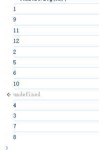

# JS执行顺序

> - `JavaScript` 单线程执行，耗时任务丢入任务队列当（异步任务完成再处理相关逻辑）
>   - [并行执行](https://zh.wikipedia.org/wiki/并行计算)只能通过 [worker 线程](https://developer.mozilla.org/zh-CN/docs/Web/API/Web_Workers_API)实现。
> - 执行顺序：
>   1. 【宏任务 [微任务]】 -> 【宏任务 [微任务]】-> 【宏任务 [微任务]】...当宏任务和当前宏任务产生的微任务全部执行完毕后，才会执行下一个宏任务
>   2.  `new Promise` 的内部函数会**直接执行**
>   3. `async` 包装的函数相当于包一层 `Promise` ，一定返回一个 `Promise`
>   4. 先执行 `await` 右边的东西，执行完后后会暂停在 `await` 这里，并且把后边的**内容丢到 `then` 中**（再结合第 `5` 点）。跳到外边接着执行。外边都执行完之后开始执行微任务队列
>   5. 当 `promise` 变为 `resolve` 或者` reject` 的时候才会将 `then` 中注册的**回调函数加入微任务队列中**

常见宏任务

- setTimeOut、setInterval
- `script` 标签
- AJAX/Websocket网络请求
- window.requestAnimationFrame
- 用户交互操作（点击、滚动、输入等）


常见微任务

- Promise的then、catch和finally
- async/await
- MutationObserver
- Cenerator


### 案例分析1

```javascript
const t1 = new Date()
setTimeout(() => {
    const t3 = new Date()
    console.log('setTimeout block')
    console.log('t3 - t1 =', t3 - t1)
}, 100)


let t2 = new Date()

while (t2 - t1 < 200) {
    t2 = new Date()
}

console.log('end here')
```

1. 同步任务：`const t1 = new Date()`，立即执行
2. 异步任务：`setTimeout`延迟时间设定为 `100ms`。
   1. 但回调函数的实际执行需要等待同步代码和微任务执行完成，并等待主线程空闲。
3. 同步任务：`let t2 = new Date()`，立即执行
4. 同步任务：`while (t2 - t1 < 200)`
   1. 一个阻塞主线程的同步代码块。
   2. 不断检查当前时间 `t2` 和 `t1` 的差值，直到差值达到或超过 `200ms`。
   3. 这段代码会耗时 **200ms** 左右，占用主线程，使得其他任务无法执行，包括 `setTimeout` 的回调函数
5. 同步任务：`console.log('end here')`，立即执行
6. 异步任务：`setTimeout` 的回调执行
   1. 主线程空闲后（即同步任务执行完成后），事件循环调度 `setTimeout` 的回调函数。
   2. 注意：虽然 `setTimeout` 的延迟时间是 `100ms`，但因为主线程被 `while` 阻塞超过了 `100ms`，而在主线程的200ms进行中，定时器的时间照常流逝，如果计时器已经到达指定的延迟时间（100ms），回调会被直接放入任务队列等待执行。

### 案例分析2

```javascript
const r = new Promise(function(resolve, reject){
    console.log("1");
    resolve()
});
r.then(() => console.log("2"));
console.log("3")
```

1. `new Promise` 接受一个函数，返回一个 `Promise` 对象。值得注意的一点是**传给 `Promise` 的那个函数会直接执行**。所以会先输出 `1` 。
2. `Promise` 对象拥有一个 `then` 方法来注册回调函数，当 **`promise reslove 或者 reject` 后会将注册函数加到微任务队列**。
   1. 上边的代码因为是直接 `resolve` 了，所以会将 `() => console.log("2")` 注册到微任务队列中。
3. 宏任务执行（打印3）完毕后开始执行微任务，所以最后输出  `2` 。


### 案例分析3

```javascript
async function method() {
  await method2();
  console.log(1)
}

function method2() {
  const promise = new Promise((resolve) => resolve());
  console.log(3)
  return promise;
}

function main() {
  method()
  console.log(2)
}

main()   // 3 2 1
```

这里需要明确一点，`async` 修饰的函数，相当于给当前函数**包了一层 Promise**。

1. method()，相当于`new Promise((resolve,reject){ resolve(method())}`,先执行 `resolve(method())`，进入` method` 内部
2. 接下来是 `await` 的作用：遇到 `await` 会**先执行 `await` 右边的逻辑**，执行完之后会暂停到这里
   1. 打印3，并当 `method2` 返回了 `Promise` 后就会暂定执行
   2. 跳回 `main` 函数。
3. `main` 函数执行后续打印2，完毕后才会再回到 `method` 方法中，打印1


### 案例分析4--魔鬼题

```javascript
async function method() {
    console.log(1); 
    new Promise((resolve) => resolve()).then(() => console.log(2)); 
    new Promise((resolve) => {
      setTimeout(() => {
        resolve();
        new Promise((resolve) => resolve()).then(() => console.log(3));
      }, 0); 
    }).then(() => console.log(4));
    await method3(); 
    console.log(5); 
    const n = await method2(); 
    console.log(n); 
  }
  
  function method2() {
    const promise = new Promise((resolve) => {
      console.log(6);
      setTimeout(() => {
        console.log(7); 
        resolve(8);
      }, 0); 
    });
    return promise;
  }
  
  function method3() {
    const promise = new Promise((resolve) => {
      console.log(9); 
      resolve();
    });
    return promise;
  }
  
  function main() {
    method();
    new Promise((resolve) => {
      resolve();
    }).then(() => {
      console.log(10); 
    });
    console.log(11); 
  }
  	
  main();
  console.log(12); 
```



