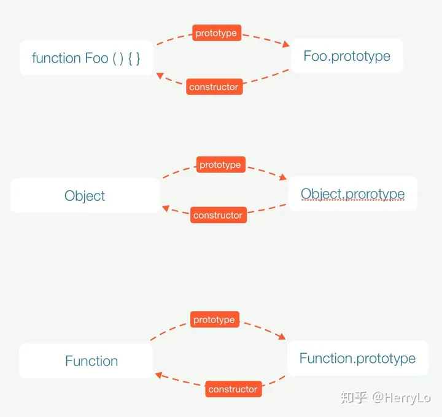
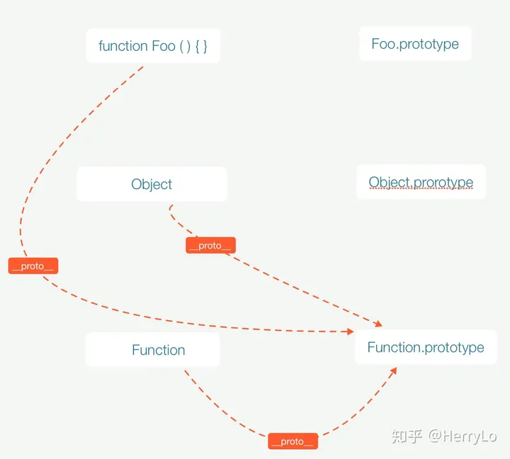
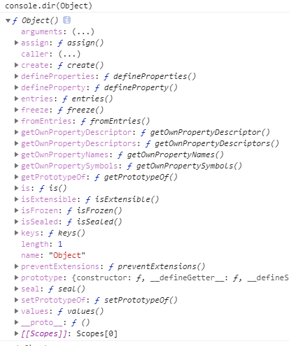
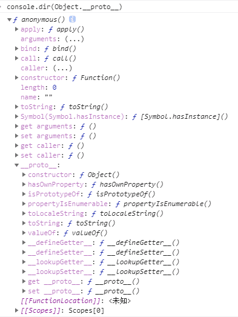
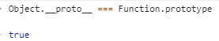
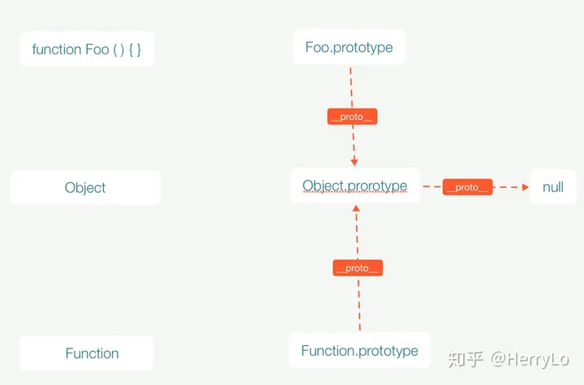
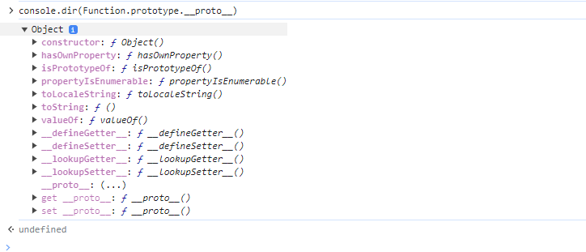
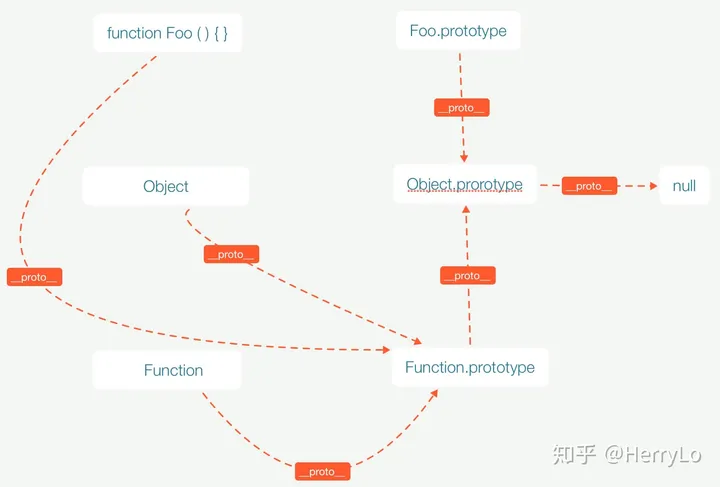
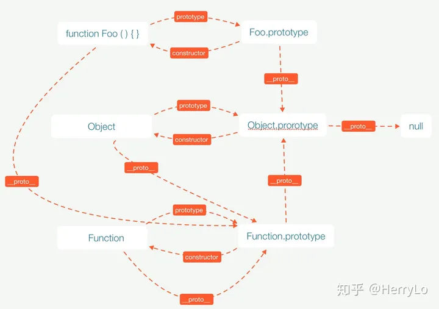

# JavaScript 对象原型 和 函数原型

> - `__proto__` 将对象和原型连接起来组成了原型链。
> - 所有的函数的 `__proto__` 都指向Function原型对象。
> - **js的原型链最终指向的是Object原型对象(Object.prototype)**,  Object.prototype 指向 null

## 一、prototype和constructor

**prototype指向函数的原型对象，这是一个显式原型属性，只有函数才拥有该属性**。**constructor**指向原型对象的构造函数。

## 二、`__proto__`

每个对象都有`_proto_`，它是隐式原型属性，指向了创建该对象的构造函数原型。**由于js中是没有类的概念，而为了实现继承，通过 `_proto_` 将对象和原型联系起来组成原型链**，就可以让对象访问到不属于自己的属性。

Foo、Function和Object都是函数，它们的`_proto_`都指向`Function.prototype`。

## 三、原型对象之间的关系

它们的`_proto_`都指向了`Object.prototype`。js原型链最终指向的是Object原型对象

## 四、`__proto__`原型链图

## 五、总结

- Function 和 Object 是两个函数。
- **`__proto__`** 将对象和原型连接起来组成了原型链。
- 所有的函数的 `__proto__` 都指向Function原型对象。
- **js的原型链最终指向的是Object原型对象(Object.prototype)**,  Object.prototype 指向 null

