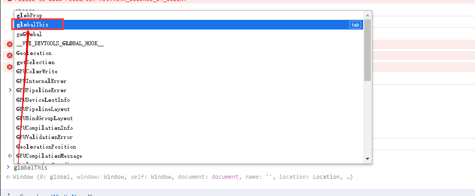

# call&apply&bind

> 个人认为：就是用于把没有关系的对象 和 方法进行组合，以此达到对象.方法()的效果

## 一、call&apply

- [`Function`](https://developer.mozilla.org/zh-CN/docs/Web/JavaScript/Reference/Global_Objects/Function) 实例的 **`call()`** 方法会以给定的 `this` 值和逐个提供的参数调用该函数。

#### **使用案例**

```typescript
function greet() {
  console.log(this.animal, "的睡眠时间一般在", this.sleepDuration, "之间");
}

const obj = {
  animal: "猫",
  sleepDuration: "12 到 16 小时",
};

greet.call(obj); // 猫 的睡眠时间一般在 12 到 16 小时 之间

```

如省略`thisArg` ，默认为 [`globalThis`](https://developer.mozilla.org/zh-CN/docs/Web/JavaScript/Reference/Global_Objects/globalThis)（类似于全局对象）。

```typescript
globalThis.globProp = "Wisen";

function display() {
  console.log(`globProp 的值是 ${this.globProp}`);
}

display.call(); // 输出“globProp 的值是 Wisen”

```




- `call()`几乎与 [`apply()`](https://developer.mozilla.org/zh-CN/docs/Web/JavaScript/Reference/Global_Objects/Function/apply) 相同，只是函数的参数以列表的形式逐个传递给 `call()`，而在 `apply()` 中它们被组合在一个对象中，通常是一个数组——例如，`func.call(this, "eat", "bananas")` 与 `func.apply(this, ["eat", "bananas"])`。

#### 使用案例

```typescript
const numbers = [5, 6, 2, 3, 7];

const max = Math.max.apply(null, numbers);

console.log(max);
// Expected output: 7

const min = Math.min.apply(null, numbers);

console.log(min);
// Expected output: 2
```


## 二、bind

-[`Function`](https://developer.mozilla.org/zh-CN/docs/Web/JavaScript/Reference/Global_Objects/Function) 实例的 **`bind()`** 方法创建一个新函数，当调用该新函数时，它会调用原始函数并将其 `this` 关键字设置为给定的值，同时，还可以传入一系列指定的参数，这些参数会插入到调用新函数时传入的参数的前面。


#### 使用案例

```typescript
const module = {
  x: 42,
  getX: function () {
    return this.x;
  },
};

const unboundGetX = module.getX;
console.log(unboundGetX()); // The function gets invoked at the global scope
// Expected output: undefined

const boundGetX = unboundGetX.bind(module);
console.log(boundGetX());
// Expected output: 42
```

