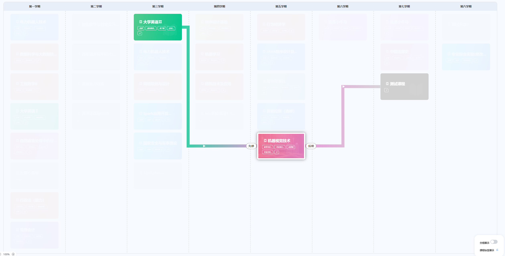

# jsPlumb

## Attribute

```javascript
//可控制连接线 连接点样式（颜色 大小 背景图片）； 连接点位置；
jsPlumb.jsPlumb.importDefaults({
  // 端点样式
  EndpointStyle: {
    fill: 'transparent',  // 透明填充
    outlineStroke: 'transparent',  // 透明边框
    radius: 5  // 端点半径（仅对Dot类型有效）
  },
  Endpoint: ["Dot", { radius: 5 }]        // 圆点
  Endpoint: ["Rectangle", { width: 10, height: 10 }] // 矩形
  Endpoint: ["Image", { src: "endpoint.png" }] // 图片
  
  // 锚点配置
  Anchor: ['Left', 'Right', 'Top', 'Bottom'],  // 允许的锚点位置
  anchor: 'AutoDefault',  // 自动选择最佳锚点
  anchors: [[0.3,1,0,1], "Top"] //连接点位置精确描述, 元素水平 30%、垂直 100%（底边）处
  
  // 容器与行为
  Container: taskListContainer.value,
  ConnectionsDetachable: false,  // 禁止拖动断开连接
  ReattachConnections: true,  // 拖动节点时自动重连
  
  // 连接线样式
  Connector: ['Bezier', { 
    curviness: 100,  // 
      贝塞尔曲线曲率
    stub: 30,  // 起始段长度
    gap: 5  // 与端点的间距
  }],
  
  // 绘制样式
  PaintStyle: {
    stroke: '#2981FF',  // 默认线条颜色
    strokeWidth: 2,  // 线条宽度
    dashstyle: '0',  // 虚线样式（如"5 2"表示5px实线+2px空白）
    outlineStroke: 'transparent',  // 点击热区边框
    outlineWidth: 10  // 点击热区宽度
  },
  
  // 覆盖层（箭头/标签等）
  ConnectionOverlays: [
    ['Diamond', {
      location: 0.99,
      width: 12,
      length: 12,
      foldback: 0.8  // 菱形锐度（0-1）
    }],
    ['Label', {  // 添加文字标签
      label: '连接',
      cssClass: 'connection-label',
      location: 0.5
    }]
  ]
});
```

### demo

```javascript
const tempLine = jsPlumb.jsPlumb.connect({
      source: sourceElement,
      target: targetElement,
      anchors: anchors,
      overlays: [
        ['Arrow', {
          width: 10,
          length: 10,
          location: 0.01
        }],
        ['Label', {
          label: item.label,
          location: 0.95
        }]
      ],
      paintStyle: {
        stroke: '#666',
        strokeWidth: 10,
        gradient: {
          stops: [
            [0, hexToRgba(getLineColor(item.source, COURSES.value, COURSEBGMAP), 0.8)],
            [1, hexToRgba(getLineColor(item.target, COURSES.value, COURSEBGMAP), 0.8)]
          ]
        }
      },
      // connector: ['Bezier', { curviness: 80 }]
      connector: ['Flowchart', {
        gap: 0
      }]
    })
```



